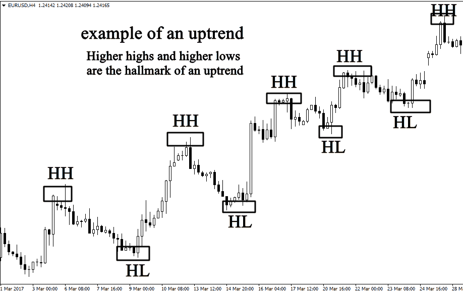
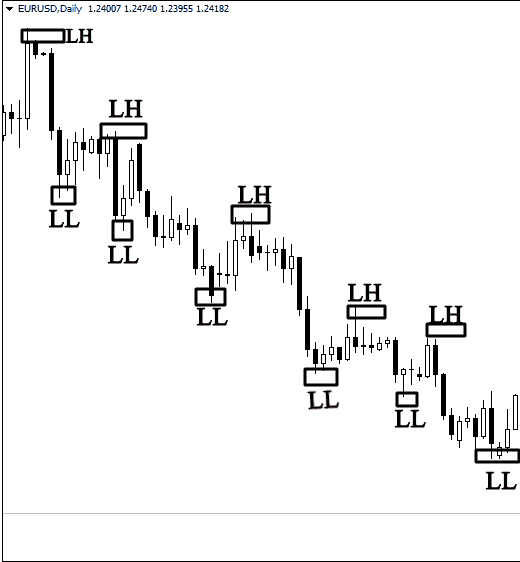
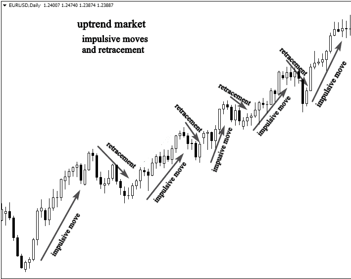
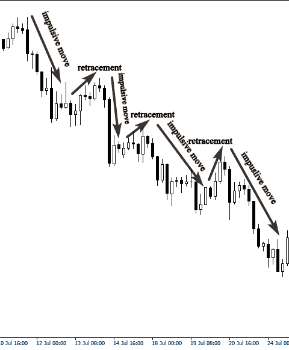

# 市场结构:如何识别和交易趋势市场

> 原文：<https://medium.com/coinmonks/market-structure-how-to-identify-and-trade-trending-market-2d01e4ca7db5?source=collection_archive---------1----------------------->

Image Source: [Freepik.com](https://www.freepik.com/free-vector/financial-literacy-education-e-business-school-cryptocurrency-trading-courses-crypto-trade-academy-learn-how-trade-cryptocurrency-concept_10780097.htm#query=crypto%20market&position=28&from_view=search)

作为交易者，你需要的基本技能之一是识别市场结构的能力，这是在适当的市场条件下实施有效的价格行动技术所必需的。

因为你不会以同样的方式交易所有的市场，你必须首先研究它们如何运作，交易者如何互动。

市场结构是指对市场行为的研究。

当你打开你的图表时，如果你能完善这项技能，你就能回答这些关键问题。

大家现在都在干嘛？谁控制着市场，买方还是卖方？

什么时候该进场或出场，什么时候该离场？

这篇文章将教你如何识别和交易趋势市场。

## **趋势市场**

趋势市场有一个规则的模式，在上升趋势市场中有更高的高点和更高的低点，在下降趋势市场中有更低的高点和更低的低点。

这里有一个例子:

Image Source: Candlestick Trading Bible

从上面的例子可以看出，市场是上升趋势，因为它创造了连续的更高的高点和更高的低点。

观察价格变动会让你对市场趋势有一个明确的概念；你不需要指标来判断市场是看涨还是看跌。

看看另一个处于下跌趋势的市场的例子。

Image Source: Candlestick Trading Bible

第二个例子，市场看跌；如图所示，有许多较低的高点和较低的低点，表明下降趋势。

趋势市场很容易发现；观察市场，而不是试图使你的分析复杂化。

上升趋势市场正在创造一系列更高的高点和更高的低点；另一方面，一个下跌趋势的市场正在制造一系列更低的高点和更低的低点。

使用更长的时间框架，例如 4 小时，每天或每周，来评估市场是否是趋势。

避免在短期内分析市场结构。

## **如何交易趋势市场:**

如果你能识别趋势市场，你就能轻松交易。

如果市场看涨，你会寻找买入机会，因为你必须跟随趋势，如果市场看跌，你会寻找卖出机会。

但是什么时候是进入趋势市场的最佳时机呢？

在趋势市场中，冲动和回撤是至关重要的。

看看下面的例子来理解我的意思。

Image Source: Candlestick Trading Bible

你可以看到市场正在创造更高的高点和更高的低点，这意味着牛市。

如果你目睹了这种类型的市场，你应该考虑购买。

然而，你也可以看到市场在做两种截然不同的运动。

第一种是冲动性的举动，第二种是回撤性的举动。

专业交易者理解趋势市场背后的心理；他们总是在冲动行为开始时买入，在结束时卖出。

在回撤之前，市场在趋势方向上表现冲动，再次冲动。

了解趋势市场的走势会帮助你记住，最佳的买入时机是在冲动行为开始的时候。

在回撤开始时买入上升趋势市场的交易者被套牢了，并困惑于为什么市场在朝着他们预测的方向前进之前就止损了。

看一个看跌趋势的例子。

Image Source: Candlestick Trading Bible

从上面的例子来看，这是一个下降趋势的市场，理想的交易选择是在冲动行为开始时卖出市场。

如果你试图在回撤时卖出，你会被有经验的交易者套牢，失去你的交易。

## **结论:**

既然你知道了冲动和回撤的区别，你就可以确定市场是上涨还是下跌。

知道这一点对你这个价格交易者来说是至关重要的。

然而，你的问题应该是，“你如何发现冲动交易的开始，这样你就可以和熟练的交易者一起进入市场，避免陷入回撤？”

如果你想预测趋势市场中冲动行为的开始，你需要学习如何获得支撑位和阻力位。

我将讨论如何在你的图表上画出支撑位和阻力位，以及它们是什么，在我随后的文章中。

[*在 Twitter 上关注我*](http://twitter.com/cryptobukz) *如果你对此类文章感兴趣，并想了解更多关于如何投资加密货币并以合乎道德的方式进行交易的信息。*

> 加入 Coinmonks [电报频道](https://t.me/coincodecap)和 [Youtube 频道](https://www.youtube.com/c/coinmonks/videos)了解加密交易和投资

# 另外，阅读

*   [3 商业评论](/coinmonks/3commas-review-an-excellent-crypto-trading-bot-2020-1313a58bec92) | [Pionex 评论](https://coincodecap.com/pionex-review-exchange-with-crypto-trading-bot) | [Coinrule 评论](/coinmonks/coinrule-review-2021-a-beginner-friendly-crypto-trading-bot-daf0504848ba)
*   [莱杰 vs Ngrave](/coinmonks/ledger-vs-ngrave-zero-7e40f0c1d694) | [莱杰 nano s vs x](/coinmonks/ledger-nano-s-vs-x-battery-hardware-price-storage-59a6663fe3b0) | [币安评论](/coinmonks/binance-review-ee10d3bf3b6e)
*   [加密交易机器人](/coinmonks/crypto-trading-bot-c2ffce8acb2a) | [Bingbon 评论](https://coincodecap.com/bingbon-review)
*   [Bybit 交易所评论](/coinmonks/bybit-exchange-review-dbd570019b71) | [Bityard 评论](https://coincodecap.com/bityard-reivew) | [Jet-Bot 评论](https://coincodecap.com/jet-bot-review)
*   [3 commas vs crypto hopper](/coinmonks/3commas-vs-pionex-vs-cryptohopper-best-crypto-bot-6a98d2baa203)|[赚取加密利息](/coinmonks/earn-crypto-interest-b10b810fdda3)
*   [SmithBot 评论](https://coincodecap.com/smithbot-review) | [4 款最佳免费开源交易机器人](https://coincodecap.com/free-open-source-trading-bots)
*   [比特币基地僵尸工具](/coinmonks/coinbase-bots-ac6359e897f3) | [AscendEX 审查](/coinmonks/ascendex-review-53e829cf75fa) | [OKEx 交易僵尸工具](/coinmonks/okex-trading-bots-234920f61e60)
*   [如何在印度购买比特币？](/coinmonks/buy-bitcoin-in-india-feb50ddfef94) | [瓦济克斯评论](/coinmonks/wazirx-review-5c811b074f5b)
*   [加密交易机器人](/coinmonks/crypto-trading-bot-c2ffce8acb2a) | [Probit 审查](https://coincodecap.com/probit-review)
*   [隐翅虫替代品](/coinmonks/cryptohopper-alternatives-d67287b16d27) | [HitBTC 审查](/coinmonks/hitbtc-review-c5143c5d53c2)
*   [CBET 评论](https://coincodecap.com/cbet-casino-review) | [库科恩 vs 比特币基地](https://coincodecap.com/kucoin-vs-coinbase)