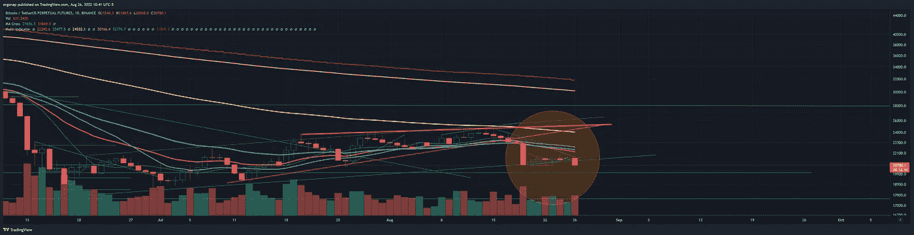
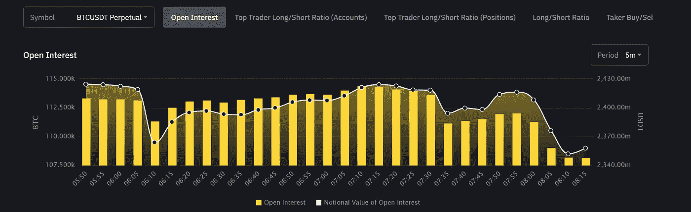
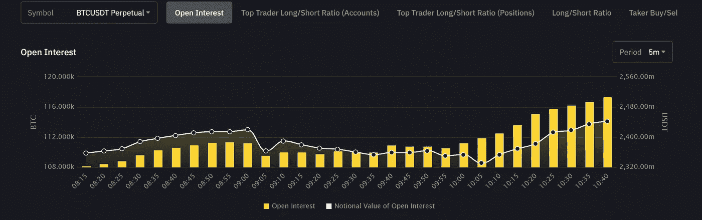

# 正如所料，市场变得悲观

> 原文：<https://medium.com/coinmonks/market-turns-bearish-as-expected-2d82fc8dcb7?source=collection_archive---------26----------------------->

## 加密货币市场/比特币分析 8/26

永远不要忘记是谁要求你成为他们的退出流动性。不是我，是亚瑟·海斯。当心大人物，而不是小人物。告诉你不要买比特币对我有什么好处？没什么，给你。他能得到什么？在一个没有多少流动资金的市场上有数百万的流动资金。所以他告诉你买入，然后你的买入变成了卖出，然后……你被甩了。

Bitcoin broke down because well duh. [https://www.tradingview.com/x/fAFGsBf4/](https://www.tradingview.com/x/fAFGsBf4/)

在杰克逊霍尔会议之前的今天早上，期货完全失去了活力——会议很短。基本上，TLDR 的简短讲话是:“我们将解决通货膨胀”。我们是。拜登(T2)大幅削减了赤字(T3)，不出所料，富人(可笑的是)[试图说贷款豁免不好(T5)。哦，还有那些想要哑巴的人，这样他们就可以充实军队。没错。](https://www.vanityfair.com/news/2022/08/donald-trump-jr-student-loans)

那个白痴大声说出了不好的部分:

 [## 共和党议员担心减少学生债务会阻止贫困儿童参军

### 一名国会共和党成员担心乔·拜登取消数百万美国学生贷款债务的计划可能会…

news.yahoo.com](https://news.yahoo.com/gop-lawmaker-fears-reducing-student-193906673.html) 

如前所述，期货逐渐消失了:

然后开始在市场上做空。

可预见的。我们会走得更远。新低见。这个周末我可能会穿短裤什么的，因为是的。