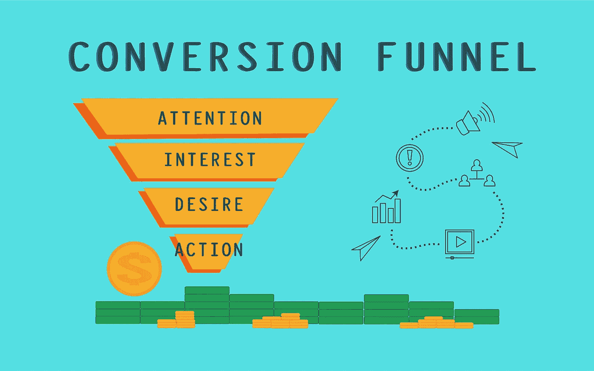
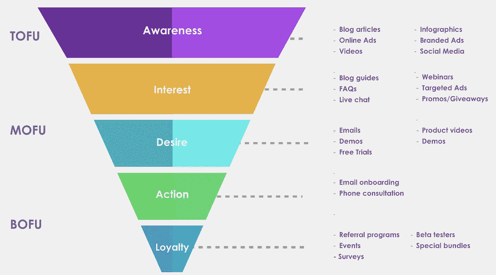

# 营销自动化将节省你的时间，让你赚更多的钱

> 原文：<https://medium.com/coinmonks/marketing-automation-will-save-you-time-make-you-more-money-9d1195270efe?source=collection_archive---------16----------------------->

Image by [John Conde](https://pixabay.com/users/emerson23work-3623409/?utm_source=link-attribution&utm_medium=referral&utm_campaign=image&utm_content=5444126) from [Pixabay](https://pixabay.com/?utm_source=link-attribution&utm_medium=referral&utm_campaign=image&utm_content=5444126)

开展基于服务的业务已经够有挑战性了。因此，避免由于没有适当的客户筛选机制而导致的不必要的压力是很重要的。

你必须了解那些能让你腾出时间、提高工作效率的工具，同时关注那些准备购买的少数客户，以及你正在进行的项目。

# 为什么您应该关注营销自动化？

作为一个企业主，你知道获得潜在客户只是扩大业务的第一步。

你需要能够从坏的线索中筛选出好的线索，否则你会在广告上浪费钱。不幸的是，要区分哪些线索值得追踪，哪些不值得，并不容易。

# 营销自动化将如何帮助你？

做生意时，时间就是金钱。您不能浪费时间在没有资格购买的潜在客户身上。

这就是营销自动化的用武之地。借助营销自动化，您不仅能够开展营销和广告活动，还能确保对潜在客户进行适当筛选，以便您能够专注于与有资格购买的客户开展业务。

其他线索可以留在你的营销漏斗中，以接收时事通讯更新，例如，直到他们准备购买——一些线索会在进入你的漏斗几个月甚至几年后最终从你那里购买。

通过实施营销自动化，你将腾出这么多时间，这比一周回复几百封邮件要好。

[AIDA](https://en.wikipedia.org/wiki/AIDA_(marketing)) Markeing Funnel

# 营销自动化工具

我们推荐三款工具: [Typeform](https://www.typeform.com) 、 [Zoho CRM](https://www.zoho.com/crm/) 、 [Zapier](https://zapier.com) 。

Typeform 是设置吸引客户的入职表单的绝佳工具。如果你愿意，你甚至可以在最后集成支付。

Zoho CRM 允许您在客户完成您的入职表单时自动迁移他们的数据，并根据他们的标签分配特定的跟进电子邮件。

Zapier 允许你设置工作流程，在应用程序之间自动完成任务。例如，每当销售线索完成入职表单时，数据都可以与您的 CRM 同步。

有了前面提到的软件列表，您可以管理成千上万的线索。

我们会推荐更多的应用程序来实现更多的定制营销自动化渠道。如果你想了解他们的情况，[请安排一次与我们的咨询](https://calendly.com/financelygroup)。

# 质量胜于数量

如果你像大多数企业主一样，你会花很多时间回复电子邮件。

您可能每天花 4 个小时回复 50 封传入的电子邮件，并向可能从未读过这些邮件的客户发送报价。

对于任何给定的客户来说，向您的收件箱发送请求垃圾邮件并不罕见，所以如果您没有适当的筛选过程，就很难判断哪些请求是合法的。

如果你真的想发展你的业务，是时候控制你的收件箱了。

实施筛选流程将有助于您识别出真正想与您合作的人，并剔除其他人，以便您可以专注于重要的事情:现有客户、快乐客户的推荐以及您所在地区或行业中其他企业的推荐(如适用)。

如果有人故意忽略您的筛选过程，转而向您的收件箱发送垃圾邮件，那么他们显然还没有准备好接受您的服务或产品(或者可能只是需要更多一点关于什么是垃圾邮件的教育)。

您知道，如果有人在进入您的公司之前已经通过了其他公司设置的所有关卡和过滤器，那么他们已经对您提供的产品表现出兴趣——这正是您想与之做生意的人。

> 交易新手？试试[加密交易机器人](/coinmonks/crypto-trading-bot-c2ffce8acb2a)或者[复制交易](/coinmonks/top-10-crypto-copy-trading-platforms-for-beginners-d0c37c7d698c)

# 您希望避免在哪些类型的客户上浪费时间

我知道，我知道:你是一名自由职业者，你想和尽可能多的人建立联系——这就是你发展业务的方式。

但是，如果你花太多时间与错误类型的潜在客户交谈，在你找到正确的潜在客户之前，你会浪费很多时间(并且可能会感到沮丧)。

## 那么，什么是错误的类型呢？

1.**妄想狂**——该潜在客户怀疑一切都是骗局，不会赔付。出于某种原因，这类潜在客户通常也没有钱花。

2.**不守信用谈判者**——不守信用谈判者愿意或不愿意做出离谱的报价，只有绝望的自由职业者才会接受。

例如:他们可能会要求你免费参与他们的营销活动，然后因为他们以前被骗过而获得报酬。

**不惜一切代价忽视这个家伙**——他们讨厌客户筛选，甚至有时会在 LinkedIn &脸书上与你联系，请求你的 WhatsApp 号码，这样他们就可以用他们无耻的请求向你发送更多的垃圾邮件！

3.**窗口购物者**——该潜在客户无意购买或至少不会立即购买。确保您在入职电子邮件、学期表甚至您的网页上向他们提供他们需要的关于您服务的所有书面信息。

4.梦想家——这是最难招待的潜在客户。他们完全脱离现实，无能，经常是强迫性说谎者。不要带那些有前途的囚犯。让他们遵守你的入职条款，不要参与。通常，他们会直接从你的漏斗中掉出来。

如果你像我一样，你有很多客户。如果你像我一样，你也有很多时间花在客户管理上。

你不需要额外的努力去排除这些客户。你所需要的只是一两个带有清晰说明的电子邮件模板、一份入职表格、一个支付链接和一个无回复收件箱。

您应该收到的唯一通知是付款通知和合同签名通知。

而不是一些客户发来的抱怨你的服务太贵的邮件。

如果你面对的是一个糟糕的潜在客户，记住他们通常不会后悔是个好主意。

**永远不要让他们控制局面，也不要代表他们向第三方做出承诺。在最坏的情况下，他们会鬼你。最多他们会说“对不起”然后弹开。**

# 你的工作是销售，你没有责任教育你的潜在客户如何做生意。

当你试图创业时，有很多事情要记住。

其中最重要的一点是确保你没有在那些不愿意学习商业运作的潜在客户身上浪费时间。这些人已经陷入困境，没有兴趣改变现状。

当然，你仍然可以向他们提供咨询服务或电子书，作为对你业务的补充。

# 营销自动化将为您节省时间和金钱。

如果你像我们一样从事高票价服务行业，你不需要成百上千的客户。你只需要几个高价顾客就能维持生计。

这就是为什么我们在筛选我们的潜在客户时如此积极，并且只与那些已经证明他们能够支付我们并且他们有良好意愿的人合作。

我们的目标是避免在低价值的线索上浪费时间，这样我们就不必雇用更多的员工或回复没完没了的电子邮件。