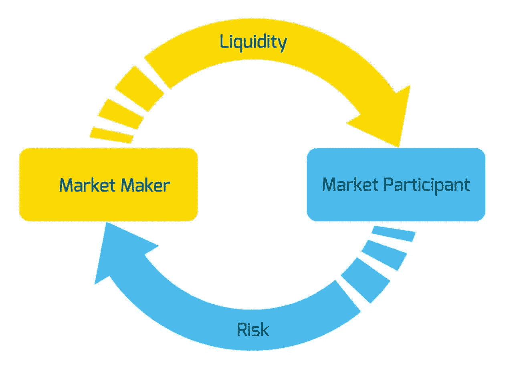

# 做市商和做市商。是什么，是谁？

> 原文：<https://medium.com/coinmonks/marketmaking-and-marketmaker-what-is-it-and-who-is-it-31e436ee37f9?source=collection_archive---------16----------------------->

所有参与金融交易的人都可以分为两类——一类是创造市场气氛的做市商，另一类是资本不多的私人投资者。

做市商(**他们占少数**)总会操纵做市商(**他们占多数**)。