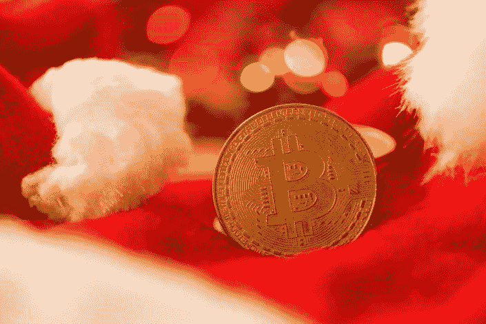
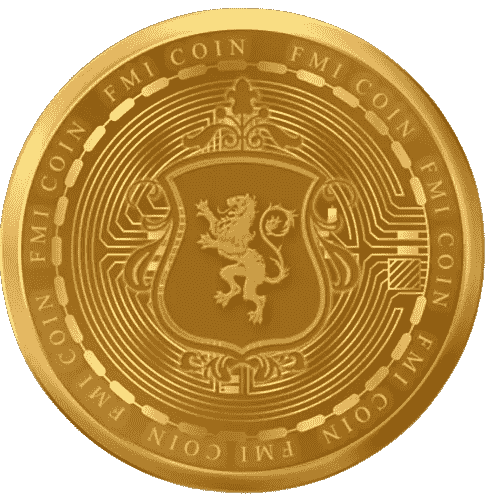

# 市场:比特币，变化不大；多杰科恩瀑布

> 原文：<https://medium.com/coinmonks/markets-bitcoin-ether-little-changed-dogecoin-falls-dcdbb7358907?source=collection_archive---------44----------------------->

周一上午，比特币和以太网在亚洲几乎没有变化，几乎所有其他非稳定的比特币市值排名前 10 位的加密货币也是如此。Dogecoin 是最大的输家，其次是 XRP。

> 交易新手？在[最佳密码交易所](/coinmonks/crypto-exchange-dd2f9d6f3769)上尝试[密码交易机器人](/coinmonks/crypto-trading-bot-c2ffce8acb2a)或[复制交易](/coinmonks/top-10-crypto-copy-trading-platforms-for-beginners-d0c37c7d698c)

# 快速事实

*   根据 CoinMarketCap 的数据，截至上午 8 点的 24 小时内，香港比特币小幅下跌 0.04%，至 16，840 美元，以太网下跌 0.19%，至 1，219 美元。
*   Dogecoin 在过去 24 小时内下跌 2.14%，交易价格为 0.07597 美元，此前埃隆·马斯克(Elon Musk)曾多次取笑 memecoin 与 Twitter 的整合，他宣布将[辞去社交媒体平台首席执行官的职务](https://forkast.news/headlines/bitcoin-ether-fall-dogecoin-musk-twitter/)。
*   XRP 下跌 1.64%，至 0.3464 美元，BNB 微跌 0.6%，至 243.16 美元。
*   美国股市[周五收高](https://www.cnbc.com/2022/12/22/stock-market-futures-open-to-close-news.html)，但由于对衰退的担忧，上周仍录得周跌幅。道琼斯工业平均指数收盘上涨 0.5%，标准普尔 500 指数上涨 0.6%，纳斯达克综合指数上涨 0.2%。
*   周三，在数据显示美国消费者信心指数在 12 月份达到八个月来的最高点后，股市出现了反弹。
*   美国和香港市场周一因圣诞节休市。

来源:forkast

还看了关于新币: [*FMI 币*](http://www.fmicoins.com/)

[FMI](http://www.fmicoins.com/) 是建立在币安智能链上的数字货币。FMI 是为公司 FMI 网络而构建的。更具体地说，它包括自己的产品，如投资不同类型的项目，创造新的项目等。FMI COIN (FMI)是一种加密货币，部署在币安智能链(BSC BEP-20)上

合同:[0x9d 427 e 2 Fe 3a D2 CB 93 f 83118d 472 a 6068 b4a 778d 6](https://bscscan.com/token/0x9d427E2fe3ad2Cb93F83118d472A6068B4a778D6)

你可以在 [Pancakeswap](https://pancakeswap.finance/) 或者 [Bitkeep App](https://bitkeep.com/download) 上购买 FMI 币。
你可以通过这个来了解详细情况👇

[https://FMI coins . medium . com/how-to-create-FMI-wallet-on-bit keep-app-e 44 a2 a 998 e6a](https://fmicoins.medium.com/how-to-create-fmi-wallet-on-bitkeep-app-e44a2a998e6a)

看看我们的[网站](http://www.fmicoins.com/):[https://fmicoins.com/](https://fmicoins.com/)

给我们接通[电报](https://t.me/fmicommunityofficial):[https://t.me/fmicommunityofficial](https://t.me/fmicommunityofficial)

> 加入 Coinmonks [电报频道](https://t.me/coincodecap)和 [Youtube 频道](https://www.youtube.com/c/coinmonks/videos)了解加密交易和投资

# 另外，阅读

*   [OKEx vs KuCoin](https://coincodecap.com/okex-kucoin) | [摄氏替代品](https://coincodecap.com/celsius-alternatives) | [如何购买 VeChain](https://coincodecap.com/buy-vechain)
*   [ProfitFarmers 回顾](https://coincodecap.com/profitfarmers-review) | [如何使用 Cornix Trading Bot](https://coincodecap.com/cornix-trading-bot)
*   [如何匿名购买比特币](https://coincodecap.com/buy-bitcoin-anonymously) | [比特币现金钱包](https://coincodecap.com/bitcoin-cash-wallets)
*   [瓦济里克斯 NFT 评论](https://coincodecap.com/wazirx-nft-review)|[Bitsgap vs Pionex](https://coincodecap.com/bitsgap-vs-pionex)|[丹吉尔评论](https://coincodecap.com/tangem-wallet-review)
*   [如何使用 Solidity 在以太坊上创建 DApp？](https://coincodecap.com/create-a-dapp-on-ethereum-using-solidity)