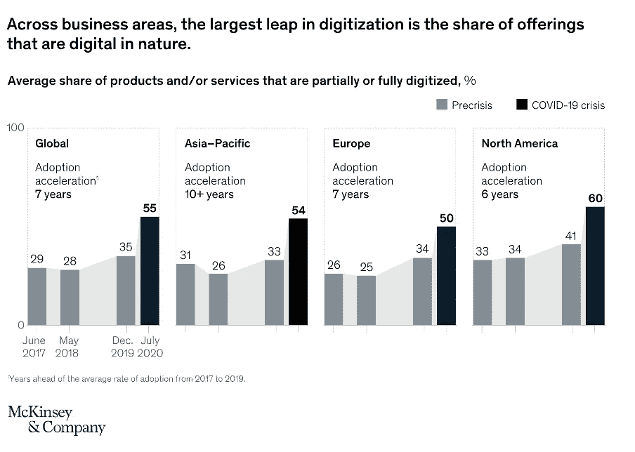
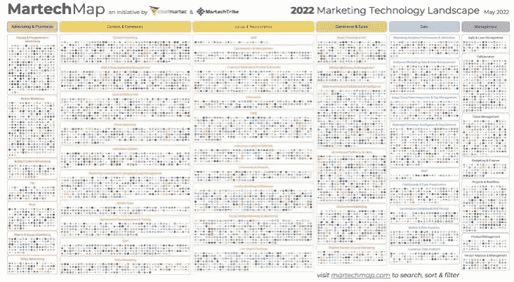
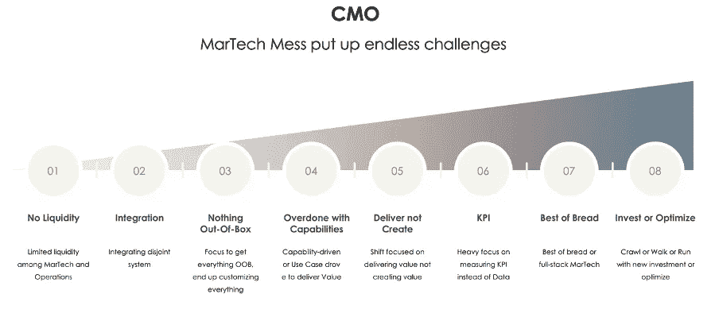

# MarTech Mess:不言而喻的真相

> 原文：<https://medium.com/coinmonks/martech-mess-the-unspoken-truth-981f517402f1?source=collection_archive---------4----------------------->

**MarTech Mess: The Unspoken Truth**

技术是所有工业部门进步的支柱。在过去的二十年中，技术进步占据了主导地位，使人们能够始终保持联系。先进的机器和低碳的智能设备都是所有行业技术能力的结果。这促使组织推动技术采用的前沿，并在他们的生态系统中编织一张技术的蜘蛛网。这显然提高了他们运营任务的效率，但也带来了一系列需要应对的新问题。

数字一直是技术革命的先锋，它允许企业和客户之间更加个性化和一对一的联系。在组织和行业层面，数字的使用都在飞速增长。组织已经采用数字技术来保持竞争力，而首席营销官处于数字技术应用的最前沿。这可以从麦肯锡公司关于全球数字采用的研究中看出。

Image: Mckinsey & Company

数字化的采用给高管们带来了机遇和挑战，这在 CMO 领域尤为突出。在当今的商业技术模式中，首席营销官面临的运营问题比以往任何时候都多，这既令人担忧，也令人担忧。主要原因可能是从技术驱动的生态突然转变为工具驱动的生态。采用最新和最好的工具是比较慢的，并且总是回到 MarTech 法则:技术以指数速度发展，而组织以慢得多的速度发展(以对数方式)。于是，MarTech 乱局就出现了。

是的，今天的首席营销官不是利用 MarTech 生态系统，而是处理 MarTech 的混乱。你有没有听过首席营销官讨论集成、数据通道化、服务器虚拟化、跨云支持、服务器端支持和技术术语？

重点已经从创造价值转变为提供价值，因此对 MarTech 平台进行了大量投资。

Image: 2022 MarTech Landscape

根据 2022 年 MarTech 景观，大约有 9932 个大规模 Martech 平台。在我看来，这些对 CMO 来说，与其说是机遇，不如说是挑战。自 2011 年第一版以来，这个市场已经扩大了 5，233%。

但为什么这是一场混乱，而不是 CMO 的机会呢？让我们一步一步来。

MarTech 和运营部门之间的流动性有限

整合绝望的生态系统

确定开箱即用、配置和定制的优点

能力驱动或用例驱动来交付价值

每次都从零开始

衡量数据或 KPI

创建基于同类最佳或全堆栈的 CMO 组织。

渠道驱动、工具驱动或客户之旅

投资或优化

*Image: CMO: Dealing with MarTech Mess*

【MarTech 和运营部门之间的有限流动性

CMO 团队长期以来一直努力在三个实体之间寻求正确的平衡

MarTech 平台

他们经营的业务

交付运营的机构/供应商

我注意到企业内部的微型筒仓，这导致 MarTech 以平台为中心的团队交付运营。例如，CMO 企业使用 MRM 平台进行营销规划，该平台高度集中于他们选择的 MarTech 平台和他们选择提供的供应商。

**不利因素和挑战**:这阻碍了平台的操作灵活性和有效使用。重点已经从让 CMO 公司使用 MarTech 平台提高效率转移到让 MarTech 平台处理运营。

**集成**

对于 CMO 组织来说，集成既不是一个新的时髦词，也不是一个新的挑战；事实上，他们总是指望 CIO 组织来解决集成难题。那么，为什么我称之为新的混乱呢？

在这些平台整合之前，MarTech 生态系统自 2011 年以来一直在发展，但 CMO 技术生态系统一直被视为一个孤岛，从未与更广泛的组织技术生态系统完全连接。随着过去五年中数据和隐私立法的出台，it 已经不再是一个孤岛，而是更大的数字生态系统的一个组成部分。这是问题开始的时候；一切都是支离破碎的，分散在许多 SaaS 系统上，有许多功能和数据重叠。

**不利因素和挑战:**分散的 MarTech 堆栈不仅需要集成，还需要与更大的业务安全政策保持一致，这迫使企业重组集成和运营模式，以与更广泛的技术环境相联系。雪上加霜的是，MarTech 系统的寿命相对较短，需要在 CMO 舞台上不断集成和迁移。

**生活在开箱的阴影下**

即使在今天，我们仍然相信商品可以“开箱即用”在复杂的环境中，客户需要更实时、更真实、更有意义的体验，因此平台、通信和运营模式必须适应时代的要求。

令人惊讶的是，我们目前正在调查该平台的一系列开箱即用的可能性，同时对运营进行优先排序。这必须改变，重点转移到进一步澄清需求，为人性化的体验提供更多的结束，然后后退到技术选择。

**不利因素和挑战**:我们在用例的质量上做出了相当大的妥协，以便让它开箱交付，我们不再质疑“我们如何能够保持交付时事通讯、事件营销等等。”必须有一个新的水平，在这个水平上，我们超越标准，发掘用例中的精华，以及如何高效、智能地提供给最终消费者，而不限制 OOB 的维度。

由于他们对非传统的热爱，CMO 组织最终投资了更多不必要的 MarTech 平台，造成了 MarTech 的混乱。

**能力过剩**

我们仍然相信能力驱动的世界。我们忘记了，每个顾客都与无数的品牌互动，不仅顾客变得更聪明，而且他们还天真地期待着来自其他企业的意外。

我惊讶地了解到，在当今的环境中，用例是由 MarTech 产品供应商最终确定和构思的，并通过 MarTech 平台功能的镜头进行引导。我坚信，在选择 MarTech 产品之前，必须对用例进行构思、识别和管道化；否则，寻找最好的 MarTech 平台的探索将会继续，并变得更具挑战性。

例如，无论他们是否有用例，CMO 组织都在 CDP 平台后面运行；事实上，大多数客户端运行的是十年前为数据管理平台系统建立的相同用例，只是做了一些改进。当然，CDP 已经推出了一些附加功能，对我来说，这就像 DMP++

为了弥补能力差距，我们增加了新的能力，呃，新的 MarTech 平台。

**不利因素和挑战:**今天的 CMO 企业需要严格的分析和研究。事实上，如果可以选择，我会优先考虑研究而不是 COE。

不要通过能力透镜来观察 MarTech 平台，并试图梳理集成混乱，重点应该放在一个端到端的客户体验上，从营销规划到执行再到衡量。这将有助于 CMO 公司识别整个故事中的脱节，并通过相关用例而不是功能的角度检查整个 MarTech 堆栈。

**创造价值还是传递价值的两难选择**

争取新客户、吸引现有客户和留住流失客户的高度竞争环境推动了 CMO 公司创造价值。客户不断变化的期望和临时行为促使公司将注意力和努力集中在通过预设的产品和功能提供价值上。

这种趋势令人担忧；事实上，如今大多数首席营销官都无法为组织创造新的收入来源，而这正是 CMO 生态系统的首要目标。由于过分强调提供价值，现有的收入流正在枯竭。MarTech 并不致力于建立新的收入来源，而是更适合于提供价值。

为了以最简单的方式向组织交付价值，CMO 组织已经装载了超过所需的 MarTech 平台，导致 MarTech 一团糟

**不利因素和挑战:**由于每个平台都有自己的数据库和处理客户数据的限制，MarTech 平台未能建立统一的 CMO 技术生态系统。这使得 CMO 组织更加重视交付价值和实现短期目标。如前所述，这主要是由于技能的孤岛，需要广泛的学习和研究，以实现创造和交付价值之间的平衡。

**重点是 KPI 也不是数据**

大多数 MarTech 平台都是以 KPI 的形式来关注产量、质量和测量的。但是，客户交互路径非常迅速，重点本应是数据。

**“更好的 KPI 反映在更健康的数据中。”**

总而言之，如果您想要增强 KPI，第一步也是最重要的一步是从正确性、完整性、最新性、一致性、隐私性和安全性方面度量和改进数据质量。

这种转变必须关注数据及其质量，否则对 KPI 的追求将继续下去，而不会意识到我们所衡量的是不完整和不准确的。事实上，CMO 组织将能够最大限度地减少或消除其生态系统中的一些 MarTech 平台，这些平台具有重叠功能，当然还有受限的数据创建功能

**劣势与挑战**:到目前为止，MarTech 平台都是数据耗尽型平台，数据创造能力极其有限。CMO 组织必须仔细编写要求，以保证他们可以构建一个环境，在该环境中，MarTech 平台可以完全了解数据创建，并有助于提高数据质量，这当然会体现在更好的 KPI 中。

**同类最佳或全栈 MarTech 平台**

首席营销官已经认识到 MarTech 混乱的存在，并试图通过实施同类最佳或全栈 MarTech 平台来纠正这一问题。有的在优化 MarTech 平台，有的在整合，有的才刚刚开始征程。

说实话，他们都没有一个固定的公式；这完全依赖于客户环境、工作方法，当然，还有他们试图解决的用例。我们必须检查下面列出的特征。

什么在过去不起作用

为什么它在过去不起作用

主要学到了什么

未来的愿景和目标是什么

CMO 组织必须明白，MarTech 平台不是一根魔术棒，但整个 CMO 生态系统是一片神奇的土地，因此找到共同点非常重要

**不利因素和挑战:**同类最佳平台与全栈 MarTech 平台相比的主要困难在于，它再次推动了能力领先平台的发展。首席营销官将能力置于实际用例之上。

**投资或优化**

首席营销官在任何组织中都有短暂的生命周期，可能会出现在每一份分析师报告中。这促使首席营销官选择投资或优化方法，以使愿景在短期内更加实际可行。

MarTech 是 CMO 准时交付成果的重要组成部分。因此，MarTech 平台是根据短期战略和快速产生结果的目标而选择的。因此，CMO 公司缺乏持续的技术变革。

**不利因素和挑战:**MarTech 的混乱导致 CMOs 专注于优化 MarTech 堆栈。他们正在重新考虑他们的 MarTech 投资，以及 MarTech 平台在 CMO 地区非常短的寿命。这一点从 9000+ MarTech 平台的快速增长中显而易见，这是不快乐的明显表现。

[汤姆·崔纳](https://medium.com/u/7020b3a985f3?source=post_page-----981f517402f1--------------------------------) [埃丝特·瓦加斯](https://medium.com/u/fd8402f39b7?source=post_page-----981f517402f1--------------------------------) [蒂姆·索罗(CMO @阿雷斯)](https://medium.com/u/9a58003da63a?source=post_page-----981f517402f1--------------------------------) [克里斯·穆迪](https://medium.com/u/810fca57c2c3?source=post_page-----981f517402f1--------------------------------) [瑞安·邦尼奇🚀CMO @ G2](https://medium.com/u/51551a4d557f?source=post_page-----981f517402f1--------------------------------) [安娜·安杰里奇](https://medium.com/u/257cf49b6d3c?source=post_page-----981f517402f1--------------------------------) [爱德华·内夫罗蒙](https://medium.com/u/ec57220b425f?source=post_page-----981f517402f1--------------------------------) [乔·马丁](https://medium.com/u/39c3a29710d3?source=post_page-----981f517402f1--------------------------------)我在寻求你的观点和投入。你认同 MarTech 乱七八糟的严酷现实吗？

> 交易新手？试试[加密交易机器人](/coinmonks/crypto-trading-bot-c2ffce8acb2a)或者[复制交易](/coinmonks/top-10-crypto-copy-trading-platforms-for-beginners-d0c37c7d698c)