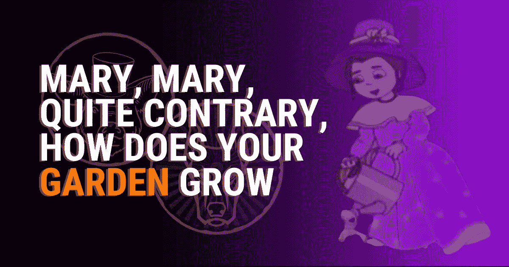
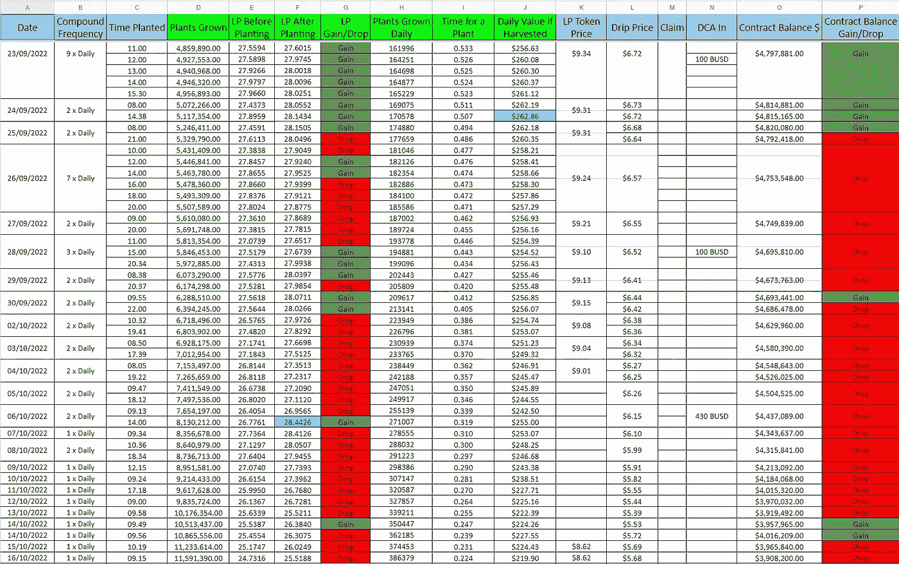

# 玛丽，玛丽，恰恰相反，你的花园长得怎么样

> 原文：<https://medium.com/coinmonks/mary-mary-quite-contrary-how-does-your-garden-grow-f714bd1043d8?source=collection_archive---------4----------------------->

坦率地说，过去几周完全是胡说八道。

但是

这是有原因的。我会解释的。

# 滴滴网络

如果你在 Defi，除非你住在岩石下，否则你会知道今天即将推出的滴滴网络动物农场 V2。尽管如此，我们在这里谈论的是[外汇鲨鱼](https://twitter.com/f0r3x_shark)，我在过去已经看到了相当多的这些发布日没有完全发布。但我希望今天他能成功，动物庄园第二版真的会推出。我屏息等待剩下的 8 个小时左右。

让我们希望我不要在这里食言，而不是今天，我们有延迟！

# 为什么是我的花园

在过去的几周甚至几个月里，我看了许多 Youtubers，试图弄清楚他们对滴滴网络花园的看法，除了几个例外，大多数人都错了。我会为你详细说明的。

不管你对你的花园做了什么，也不管你有什么复杂的种植策略

如果人们卖的植物比买的多，并且滴灌的价格也在下降，你的菜园将会失去每天的 LP 产量

但是你可以通过越来越频繁地复利来减轻它。

看看我过去几周用来收集数据和写这些文章的那个。请记住，我只与这个花园复合。

无论我在这里做什么，随着合约余额下降(人们出售植物)，我的每日 LP 也随之下降。我在 6 号又做了一次 DCA，让我超过了 28LP，但之后它又开始稳步下降。这是设计好的。它就是要这样做。根据合约余额的大小而涨跌。

# 让我们看看种植是否有帮助

这是今天的前植。我有 400496 株植物要种。

现在让我们来看看种植后的情况。

**11993130**株， **25.1347** 的 LP 日产量。如果我把这些数字加到我的表上，它看起来像这样。

正如你在这里看到的，我又从 **25.5188** 降到了 **25.1347** 。下降了 **0.3841** 。不是每次都大幅下降，但始终保持稳定。当然，这与我资产负债表右侧的巨额红色合约余额不谋而合。合同余额从**4885383.00**下降到**3900780**。我只是通过复利来减轻我的损失，这就是在这种时候你应该对你的花园做的事情。不要误会我的意思，在我的 5 个花园里，如果我说(我没有)我每天挣不到 1000 美元，所以我一点也不抱怨。

# 滴滴网络未来

我烦吗？

不，一点也不，我仍然热爱外汇。我预料到这种情况会在我所有的花园里发生，而它确实发生了。我确实注意到合同余额昨晚略有下降，从**3908200**下降到**3900780**，与前几天相比下降幅度要小得多，因此销售工厂方面的情况可能正在放缓。

目前，人们钱包里的代币里锁着大量的钱。当 V2 动物农场启动时，他们将有三个选择

1.  放在他们的钱包里。
2.  卖掉它。
3.  投资动物农场。

我预计他们中的许多人会像其他许多人一样，把点滴搬进动物庄园。这将做两件事

1.  将流动性带入整个滴滴网络生态。
2.  阻止人们出售植物，这样他们就可以投资迪普/BUSD 农场。

谈论那个农场(迪普/BUSD)。每个人都将在发射时跳入其中(我不是)，因此 APY 将像它被设计的那样暴跌。

# 结论

我的结论是不要担心你的花园失去 LP。只是不要因为一直声称而过分恶化。将它们复合并生长。整个生态系统将随着 V2 的推出而增长，尤其是当我们迎来下一轮牛市的时候，尽管这还需要几年时间。

如果我是 F 计划，我会说是 2024 年第三季度。但是我知道什么:)

# 加入动物农场滴水网

如果你想加入滴滴网络，请在这里阅读[我在滴滴上的文章](https://alttokenomics.com/drip-the-defi-protocol-that-just-keeps-on-dripping/)，并使用下面的好友链接加入。

# 我的滴滴好友链接

[**drip . community/水龙头？Buddy = 0x 1511093 a 940 a 12 f 6593 CFB 886 e 7 AC 4 ea 95 ADF 5 ab**](http://drip.community/faucet?buddy=0x1511093a940a12F6593cFb886E7ac4ea95AdF5AB)或者在获得好友框中输入以下内容:**0x 1511093 a 940 a 12 f 6593 CFB 886 e 7 AC 4 ea 95 ADF 5 ab**

# 我的动物农场花园好友链接

如果想加入动物农场滴网络花园，您可以使用我的推荐链接，这是

[https://the animal . farm/referrals/0x 1511093 a 940 a 12 f 6593 CFB 886 e 7 AC 4 ea 95 ADF 5 ab](https://theanimal.farm/referrals/0x1511093a940a12F6593cFb886E7ac4ea95AdF5AB)

> *我不是理财顾问。本文中的任何内容都不应被理解为投资建议。你必须 DYOR(做你自己的研究)无论是作者还是出版物都不承担任何责任或义务的任何投资，利润或损失，你可能会招致作为这一信息的结果。文章可能包含附属链接。谢谢你花时间阅读我的文章，如果你想订阅的话。我的文章和指南旨在帮助你在这个经常令人困惑的世界中导航。*

马克@阿尔特

*原载于 2022 年 10 月 18 日*[*【https://alttokenomics.com】*](https://alttokenomics.com/mary-mary-quite-contrary-how-does-your-garden-grow/)*。*

> 交易新手？尝试[加密交易机器人](/coinmonks/crypto-trading-bot-c2ffce8acb2a)或[复制交易](/coinmonks/top-10-crypto-copy-trading-platforms-for-beginners-d0c37c7d698c)