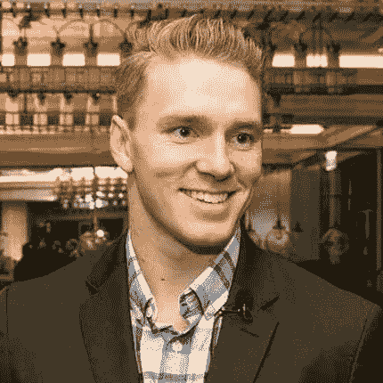
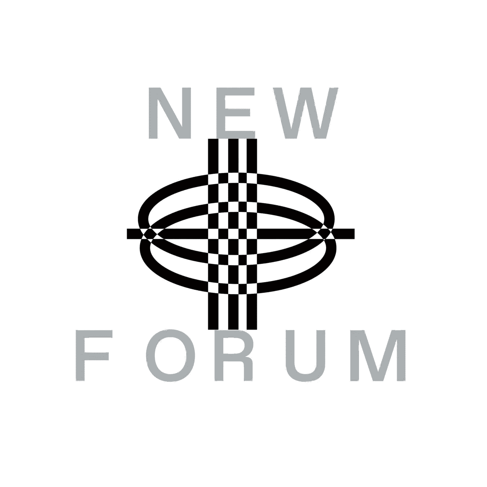

# Variant 投资合伙人 Mason Nystrom 讨论 Web3 投资并定义所有权经济

> 原文：<https://medium.com/coinmonks/mason-nystrom-investment-partner-at-variant-discusses-web3-investment-defines-ownership-economy-fac15b14d5d9?source=collection_archive---------45----------------------->

Mason Nystrom | Investment Partner at Variant

Variant 的投资合伙人梅森·尼斯特伦(Mason Nystrom)在 NEWFORUM 的一期节目中加入了我们。

Variant 是一只投资于 web3 的种子期基金，专注于所有制经济，最近筹集了 4.5 亿美元的新资本，以支持 Web3 的主要创始人。

我们喜欢与梅森就 Web3 投资进行的信息丰富、足智多谋的谈话。我们还更深入地研究了变体和所有权经济模型的精神特质。

# 梅森分享了他的 Variant 之旅是如何开始的，以及它如何迅速成为最大的 Web3 投资公司之一。

他是消费者团队 Variant 的投资合伙人。梅森最初于 2017 年开始在 Crypto 工作，为香港的一家加密货币交易所工作。他帮助许多共识投资组合公司的内容和营销策略。然后，最近，Mason 是 Messari 的研究分析师，专注于撰写研究报告和深入研究各种主题，从 NFT 到 Dao 到 Web3 基础设施。他开始倾向于投资，最终导致了他的变异。

> “加入这个团队是一个简单的决定，因为我认识了团队中的每个人，你知道这是一个世界级的团队，我很高兴能来到这里。”—梅森

# **我们讨论了投资初创公司和创始人时 Variant 的重要和基本因素**

> “Variant 对整个堆栈的投资开放，这意味着从基础设施到 DeFi 再到消费者的一切。我们寻找使命驱动的创始人，他们一直在思考或痴迷于各种事情的主题。我们不为任何特定的背景做索引；相反，我们关注个人……”——梅森

梅森补充说，这归结于创始人对特定市场或特定想法的独特见解。此外，很明显，他们着眼于他们试图应对的市场概念。通常，试图支持那些正在创造定义下一代互联网协议和平台的新东西的创始人。

# **变体大量关注创意经济和所有制经济。我们请梅森用他自己的话来定义和解释所有制经济。**

梅森认为，所有权经济是一个宽泛的命题，即定义下一代互联网的网络将把用户变成所有者。web3 提供的不一定是去中心化，而是所有权，因为所有权是一种强大的效应，可以在给定的网络中调整所有利益相关者之间的经济激励。

> “与任何 Web2 平台相比，用户最终被产品化和商品化，最终成为产品本身。Web3 有一个绝佳的机会来重新调整这些激励措施，并根据利益相关者贡献的价值对他们进行奖励。你已经从以太坊这样的项目中看到了这一点，在这些项目中，无论是否拥有以太网，任何人都可以作为验证者或其他网络参与者参与到实际的社会共识中，我们已经看到这种情况在从 Uniswap 到其他项目的不同项目中激增……”——Mason

在梅森的完整采访中，你可以听到更多关于他对所有制经济的看法。

# Dao 如何在所有制经济中发挥作用？

> “我相信道会影响创作者，成为他们能够利用的重要工具；退一步说，如果你想到一种核心价值主张，加密最初启用，特别是以太坊，这种无许可资本形成的想法，任何人都可以走到一起，为给定的任务或倡议或指令贡献资本、时间和精力，DAOs 不仅是协调资本的一种方式，也是协调这些大型社区的一种方式……”——Mason

Mason 解释说，Dao 可以基于协议、服务或从最初的创建者开始形成，然后逐渐分散到一个社区中。他补充说，Dao 可以通过各种方式影响个人和创意，无论是作为人们参与现有社区的一种方式，还是创建自己的社区。

# Dao 的可扩展性和可持续性如何？哪些领域需要一些进步？

> “现在，我们正处于一个大规模试验的时代，因此，这种试验不仅围绕着“一体行动”应该以何种最有效的方式运作的业务模型，还围绕着“一体行动”中最有效的治理结构以及最有效的领导结构，因此，我认为“一体行动”是一种组织结构的完美范例，一旦它为各自的使用情形找到适当的模型，它就会达到规模……”—Mason

Mason 强调说，并不是所有的 Dao 都必须具有广泛的可扩展性。例如，投资 DAO 可能不需要能够扩展到一百万个不同的用户或利益相关者。虽然一个协议 DAO 可能想要，但他的直觉是，即使这些 DAO 变得越来越大，如果我们最终有一个 DAO 涉及 1000 万或 1 亿利益相关者，仍然会有一个领导元素，其中人们比其他人贡献更多。因此，领导结构将类似于今天的样子，关键的区别是任何人都可以进入这个生态系统或这个社区；这是未经许可的。

Dao 真的可以访问并且没有权限吗？观看完整集，了解更多关于 Mason 对 DAOs 的讨论，并在我们的 YouTube 评论中分享您的想法。

梅森还在采访中分享了他的其他兴趣领域和他所在的其他社区。

梅森的投资组合显示，他投资了 FWB、指纹道(Fingerprints DAO)和 Pleasr DAO 等 Web3 公司——我们请他分享他对 DAO 的看法，以及它们是否会影响价值创造的未来。

我们很想知道 Mason 到目前为止在 Web3 中最喜欢的项目，以及他认为下一个大浪潮将来自哪里。

Mason 以他的观点和建议结束了我们的谈话，这些观点和建议是关于创始人在建立他们的项目时必须考虑的。我们的社区中有许多创新的创始人，他们很欣赏我们才华横溢的客人的建议！

享受🔥

[加入社区](https://twitter.com/newforum_nco)了解[@ masony strom](https://twitter.com/masonnystrom)并发现 web3 社区中的其他远见者！

✨follow·梅森！推特: [@masonnystrom](https://twitter.com/masonnystrom) 网站:[nystrom.substack.com](https://nystrom.substack.com/)

# newforum # web3 #所有权#投资加密#创业#道#社区#创始人

爱 x 新论坛

# **Twitter @newforum_nco**

不和@加入

# 新论坛

[NEWFORUM](https://newforum.notion.site/newforum/Welcome-to-NEWFORUM-48f9661398ec4ec6a1af37fcc96dc926) 由 [Newcoin Foundation](https://newcoin.org/) 提供支持，专注于促进去中心化社交应用的扩展，也被称为 Social 3.0，形成一个生态系统和一个由远见者、创造者和投资者组成的社区。它为思想者提供了一个安全的交流、传播和分享思想的空间，以确保一个新网络的自觉和道德发展，嵌入关怀、自由和创造力的价值观。✨每周新集！在 [Twitter](https://twitter.com/newforum_nco) 、 [Newlife](https://newlife.io/) 、 [Youtube](https://www.youtube.com/channel/UCWvHyau1nIJBffmaaj6FmbQ) 和 [LinkedIn](https://www.linkedin.com/showcase/newforum/) 上关注我们，了解 web3 的更多信息，认识生态系统！加入生态系统[不和](https://discord.gg/DHepA4WTkN)！

> 交易新手？试试[加密交易机器人](/coinmonks/crypto-trading-bot-c2ffce8acb2a)或者[复制交易](/coinmonks/top-10-crypto-copy-trading-platforms-for-beginners-d0c37c7d698c)