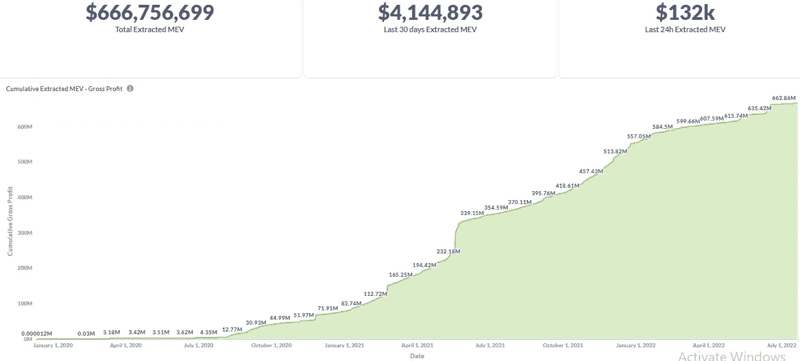
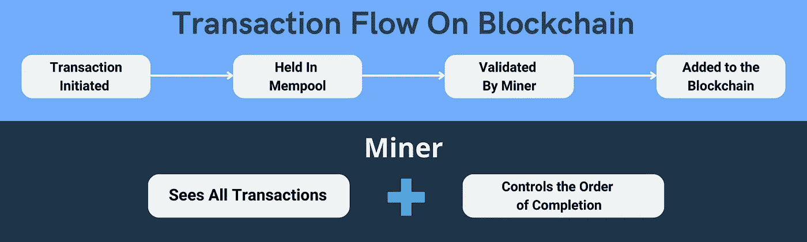

# 最大(Miner)可提取价值(MEV)如何利用你。

> 原文：<https://medium.com/coinmonks/maximal-extractable-value-mev-formerly-miner-extractable-value-mev-exploits-39441c0517ca?source=collection_archive---------8----------------------->

自 2020 年 1 月 1 日以来，以太坊网络的最大提取价值(MEV)高达 6.67 亿美元。来源[http://explore.flashbots.net](http://explore.flashbots.net)

[http://explore.flashbots.net](http://explore.flashbots.net)

## 什么是最大提取值(MEV)

根据 [Chainlink](https://blog.chain.link/what-is-miner-extractable-value-mev/) 的说法，这是当矿工/验证者/机器人决定区块链上处理交易的顺序，并利用这种权力为自己谋利的时候。用我简单的话来说，就是当最具激励性的交易被选择首先处理，而不是按照先来先服务的原则。当贿赂被首先处理时。

MEV 漏洞已经成为坏演员、矿工和验证者的一个非常成熟的收入来源，这是由区块链技术和处理方法本身实现的。为了帮助我们更好地理解这一点，让我们快速看一下区块链及其处理事务的方式。

## 区块链

根据[台账](https://www.ledger.com/academy/how-does-a-blockchain-transaction-work)，

*   区块链是一个分布式账本，由各方(如节点和矿工)保持运行，他们都有**行动的动机(汽油费)**。
*   交易规模、时间、数据块大小和网络使用等因素都会影响交易的进行。

上述定义抓住了 MEV 利用的动机— **激励**。

## 交易处理如何使 MEV 成为可能

与 MEV 相关的区块链交易的执行分为 3 个部分

1.**用户-** 当用户发起事务时，请求被广播到节点

2.在**节点**，发起的事务排队等待挖掘器验证和处理。这个等待区域或房间被称为内存池。

3.**矿工**可以看到所有的交易细节(包括他们的天然气费用),当交易在内存池中等待时，矿工可以选择和挑选他们喜欢的验证和添加到下一个区块。

本质上，矿商可以看到区块链上发生的一切，因此他们自然会选择最具激励性的交易首先进行处理，这就是 MEV 机会所在。

以上总结为

*Blockchain Transaction Flow & Miners Roles — by ValueFirst with Canva from BlockWallet*

但是不仅仅是矿工利用 MEV，验证者和更猖狂的 MEV 搜索者也利用它。

## MEV 搜索者激励矿商进一步重新安排交易完成

MEV 搜索者，顾名思义，就是在公共 mempool 中寻找 MEV 机会的搜索机器人。一旦 MEV 搜索者在公共内存池中发现有利可图的机会，他们就会贿赂矿工，以对他们有利的方式操纵交易秩序。

**流程如下:**

1.MEV 搜索者在公共记忆库中筛选。

2.一旦发现有利可图的机会，他们就会向矿工行贿。

3.矿商创造了有利于 MEV 搜索者的前置交易。

## 3 个已知的 MEV 漏洞

1.  MEV —三明治交易

*   MEV 搜索者会在 mempool 中查看您的交易订单。
*   一旦他们找到一个订单，三明治机器人就会执行两次交易。
*   第一笔交易在你交易前执行买入指令。这会推高价格，让你付出更多。
*   第二笔交易在您交易后执行卖出指令。Bot 会等到你的购买交易被挖掘出来，通过以更高的价格出售代币来获利。
*   你为你的订单设置的滑点越高，你支付的就越多。
*   好消息是你可以避免这种情况。你能猜到是怎么回事吗？

**2。MEV —套利剥削**

*   分散交易所(DEX)套利是最基本的 MEV 机会。因此，它也是最有竞争力的
*   如果两个 DEX 以两种不同的价格提供代币，有人可以在一次交易中以较低价格的 DEX 购买代币，以较高价格的 DEX 出售代币

**3。MEV —贷款协议清算**

*   贷款协议清算提供了另一个众所周知的 MEV 机会。
*   像@MakerDAO 和@ AaveAave 这样的借贷协议允许用户通过存放某种抵押品(例如 ETH)从其他人那里借用不同的资产和令牌。
*   随着抵押品价值的波动，你的借贷能力也在波动。记住，你的抵押品是贷款协议保护自己的唯一方法。因此，如果你的抵押品价值大幅下降，贷款协议可能会有大麻烦。
*   为了保护自己，借贷协议有一个规则。如果你的抵押品价值低于借入资产的一定比例，协议将通过折价出售来清算你的抵押品。把这当成借贷协议的止损。
*   贷款协议为那些购买你的贴现抵押品并为你的债务提供担保的人提供了极大的激励。这就是 MEV 机会的来源。
*   MEV 搜索者通过区块链的数据寻找被清算的借款人。一旦他们被发现，他们将贿赂矿工优先处理他们的清算交易，以获得清算奖励+贴现抵押品。

## 保护你自己进行转换

随着 MEV 变得越来越猖獗，协议、Dapps、钱包等已经添加了一些功能来确保它们能够保护它们的用户。像 [BlockWallet](https://blockwallet.io/) 这样的 Web3 钱包已经增加了几个功能，包括反网络钓鱼和反前台运行机器人，作为钱包中的默认功能来保护用户。

**所以做了切换**

## 关于区块钱包

BlockWallet.io

## BlockWallet 是最私密的非托管加密货币钱包，支持硬件钱包

BlockWallet 为其已经独一无二的产品增加了硬件支持。它是非托管的，使用 zk-Snarks 来保持你在区块链上的私人活动，并有一个巧妙的独特的反钓鱼保护功能，前端运行 Bot 保护，隐私池等。

# 放弃

本文中分享的观点仅是作者的观点。请注意，其中的内容不应被视为财务、法律或税务建议。作者和 BlockWallet 都不是金融、法律或税务顾问。根据您所在辖区的官方政策、限制和要求，做自己的研究并咨询专业人士

**今天成为 BlockWallet 社区的一员**:

[主页](https://blockwallet.io/) | [媒体](https://blockwallet.medium.com/) | [推特](https://twitter.com/getblockwallet) | [电报](https://t.me/blockwallet) | [GitHub](https://github.com/block-wallet) | [电子邮件](http://hello@blockwallet.io/)

> 交易新手？试试[加密交易机器人](/coinmonks/crypto-trading-bot-c2ffce8acb2a)或者[复制交易](/coinmonks/top-10-crypto-copy-trading-platforms-for-beginners-d0c37c7d698c)