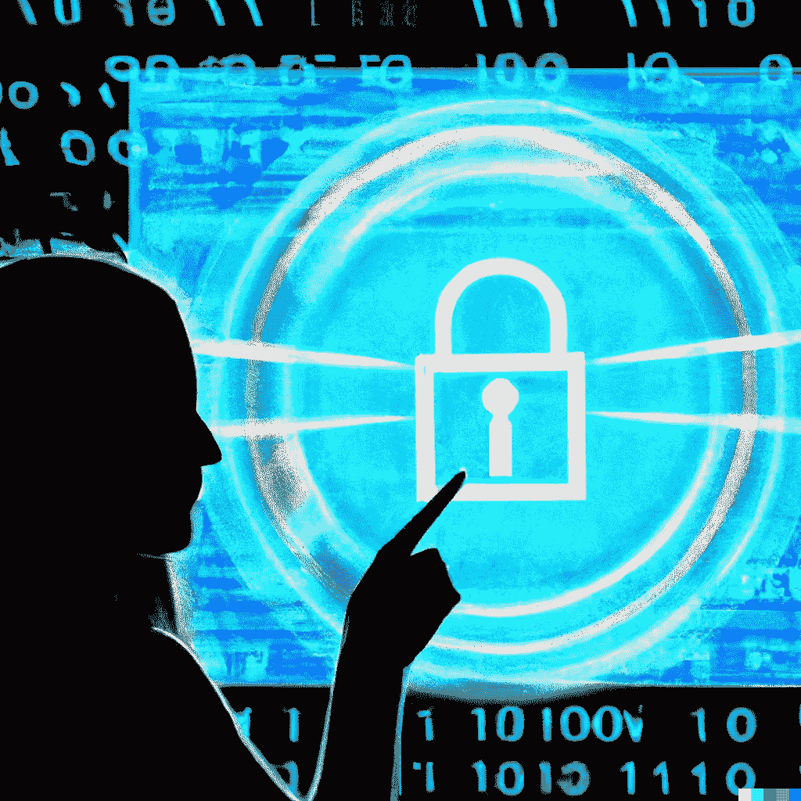

# 最大限度地提高加密世界的安全性和隐私性:需要考虑的 5 大项目

> 原文：<https://medium.com/coinmonks/maximizing-security-and-privacy-in-the-crypto-world-the-top-5-projects-to-consider-ada68af881c8?source=collection_archive---------29----------------------->

Image created with [**DALL·E**](https://labs.openai.com/) **AI**

由于使用了区块链技术和先进的加密技术，加密货币以其安全、私密的方式存储和转移价值而闻名。然而，在隐私和安全方面，并非所有加密货币都是平等的，一些项目比其他项目为用户的个人信息和资产提供了更好的保护。

> 交易新手？在[最佳密码交易所](/coinmonks/crypto-exchange-dd2f9d6f3769)上尝试[密码交易机器人](/coinmonks/crypto-trading-bot-c2ffce8acb2a)或[复制交易](/coinmonks/top-10-crypto-copy-trading-platforms-for-beginners-d0c37c7d698c)

## 以下是涉及隐私和安全的五大最佳加密项目:

1.  Monero(XMR)——Monero 被广泛认为是隐私和安全方面最好的加密货币。它使用先进的加密技术，如环签名和秘密地址，使外人难以跟踪交易并将其与特定用户联系起来。Monero 也非常关注用户隐私，其开发团队致力于确保该项目保持隐私和安全。
2.  z cash(ZEC)——z cash 是另一种高度重视隐私和安全的加密货币。它使用一种名为 zk-SNARKS 的技术，使用户能够在不暴露身份或交易细节的情况下进行交易。Zcash 还拥有强大的安全基础设施，定期进行审计和安全评估，以确保用户资金的安全。
3.  DASH(DASH)——DASH 是一种加密货币，旨在为用户提供高度的隐私和安全性。它使用主节点的分散网络来处理交易，这使得外人很难跟踪或破坏网络。Dash 还内置了一个名为 PrivateSend 的混合服务，允许用户匿名交易，保护他们的隐私。
4.  Verge——Verge 是另一种高度关注隐私和安全的加密货币。它使用各种先进的加密技术，包括多个以匿名为中心的网络和秘密地址，来保护用户的身份和交易。Verge 也有一个专门的开发团队，他们一直在努力提高该项目的隐私和安全性。
5.  PIVX——PIVX 是一种专注于隐私的加密货币，它使用一种名为 Zerocoin 的技术来实现匿名交易。PIVX 还拥有强大的安全基础设施，定期进行审计和安全评估，以确保用户资金的安全。此外，PIVX 社区非常活跃，由开发人员和志愿者组成的专门团队致力于保持项目的私密性和安全性。

总之，有几个优秀的加密项目为用户提供了高水平的隐私和安全性。Monero、Zcash、Dash、Verge 和 PIVX 都是这一领域的有力竞争者，在保护用户个人信息和资产方面，它们都有自己独特的功能和优势。

感谢阅读，并让我知道你的想法！