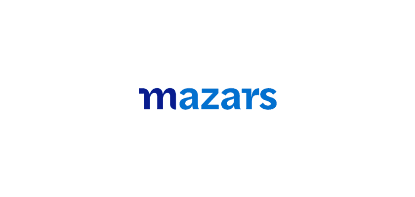
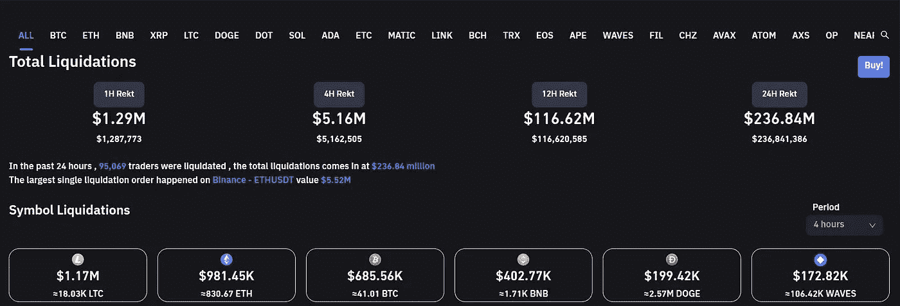

# Mazars 集团把加密客户端扔到了公共汽车下面

> 原文：<https://medium.com/coinmonks/mazars-group-throws-crypto-clients-under-the-bus-f6f797366cbe?source=collection_archive---------24----------------------->

国际审计、税务和咨询公司 Mazars Group 已经暂停了所有加密客户的储量证明工作。因此，这发生在他们最大的客户如 Crypto.com 的币安和 T2 正面临巨大威胁的时候。至于为什么，他们的推理是超越居高临下，至于为什么现在，他们的时机是完美的白痴。因此，在我们进一步深入细节和东西之前，这里是他们停止与加密客户端合作的原因。简而言之，他们“担心”公众可能无法完全理解他们创作的报道。只是哇！作为一名审计员，你的工作不就是写一份公众容易理解的报告吗？投资者是否不够聪明，无法理解马扎集团的报告，却不断被鼓励投资于他们的客户？随后，客户开始从币安这样的集中平台撤出。说到币安，提款仍在继续，目前他们已经有超过 60 亿美元。

与此同时，马扎尔混乱已经扭转了过去一周的谨慎看涨趋势。离开 crypto 的决定在市场上传播了恐惧，并增加了全面的提款。你知道当突然的撤资潮冲击粗略的交易所时会发生什么吗？

## **FUD 马扎集团**

作为报告的一部分，币安上个月聘请了法国审计公司 Mazars group。在外汇储备不足的传言传出后，币安方面试图打消客户对其外汇储备的疑虑。然而，Mazars 现在已经礼貌地离开了加密部门，列举了撰写报告的各种复杂性。

基本上，审计公司会进行准备金证明检查。这些审计将确认交易所的储备与客户的资产相匹配。事实证明，像币安这样的大型交易平台几乎不可能被审计。

“由于担心公众对这些报告的理解方式，Mazars 暂停了与为加密货币行业实体提供‘储备证明报告’相关的活动。”审计员说。

然而，他们在暂停服务前向币安投了一个弧线球。据该公司称，币安超额抵押了他们的资产。这是北海巨妖首席执行官之前指出的。
[https://twitter.com/jespow/status/1601785215646461952](https://twitter.com/jespow/status/1601785215646461952)

## **流出量**

自然，市场对这一消息反应不佳，因为它导致了数亿美元的清算。根据 Coinglass 的数据，24 小时内的清算总额超过 2 . 36 亿美元。在写这篇文章的时候，BTC 的交易价格是 16729 美元。比特币、以太坊币、Dogecoin、BNB 币和莱特币站在清算的顶端，是不幸的硬币。

看起来，crypto.com 和币安即将面临持续的大规模撤资潮。几天前，币安首席执行官赵昌鹏称这次撤资是一次“压力测试”，证明了他们应对压力的能力。此时，我们所能做的就是希望这些平台不会在压力测试下破碎。在这种情况下，隐秘的冬天很可能会变成史诗般的冰河时代。

Source: Coinglass

> 交易新手？试试[密码交易机器人](/coinmonks/crypto-trading-bot-c2ffce8acb2a)或者[复制交易](/coinmonks/top-10-crypto-copy-trading-platforms-for-beginners-d0c37c7d698c)