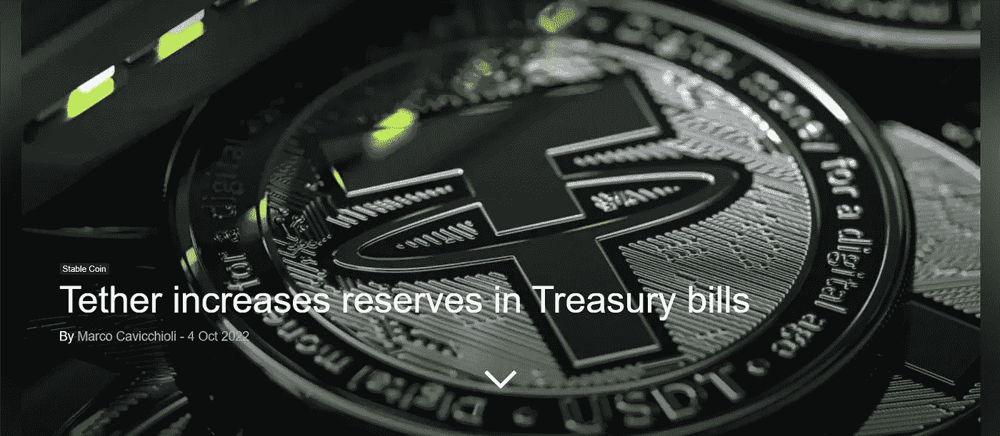

# 马克·唐纳接受加密货币支付！

> 原文：<https://medium.com/coinmonks/mc-donalds-accepts-payments-with-cryptocurrencies-cfda839a600a?source=collection_archive---------21----------------------->

Source: By the Author

他本周的重磅炸弹概括了大众接受的一小步…谁会是先锋？

 [## 麦当劳在瑞士小镇开始接受比特币和系绳

### 自 2022 年 3 月以来，卢加诺镇允许使用比特币作为支付方式。

cointelegraph.com](https://cointelegraph.com/news/mcdonald-s-starts-to-accept-bitcoin-and-tether-in-swiss-town) 

这是大规模收养吗？不会立即发生，但它将引发更多的机会，年轻人会尝试用加密货币进行一些投机，以获得市场提供的汉堡。

 [## BNB 链暂停网络后，1 亿美元的跨链桥利用

### BNB 链已暂停其网络，声明一个跨链桥上的漏洞已经发生。团队是…

cointelegraph.com](https://cointelegraph.com/news/bnb-chain-confirms-bsc-halt-due-to-potential-exploit) 

黑客设法从 BSC 窃取了大约 1 亿美元。由于阻止区块链的可能性，欺诈行为受到了限制。去中心化的区块链需要多少时间？对此你怎么看？

 [## 比特币价格创历史新高——这对 BTC 价格意味着什么？

### 尽管比特币一直处于低位，但比特币网络的总交易量在周二达到了历史新高

cryptonews.com](https://cryptonews.com/news/bitcoin-hashrate-hits-a-new-all-time-high-what-does-this-mean-for-btc-price.htm) 

比特币的 hashrate 达到了一个新的 ATH，使网络更加分散，但降低了矿工的回报。

 [## 俄罗斯向哈萨克斯坦提供加密货币矿工的电力

### 俄罗斯正寻求在两国伙伴关系的一项修正案中支持哈萨克斯坦的能源需求，因为…

cryptonews.com](https://cryptonews.com/news/russia-supplying-kazakhstan-with-electricity-for-cryptocurrency-miners.htm) 

俄罗斯向哈萨克斯坦提供电力以支持加密货币采矿作业。俄罗斯是否像媒体告诉我们的那样如此孤立，如此戏剧性地平衡？

[https://en . crypto nomist . ch/2022/10/04/tether-increases-reserves-treasury-bills/](https://en.cryptonomist.ch/2022/10/04/tether-increases-reserves-treasury-bills/)

系绳增加了短期国库券的风险敞口。考虑到美国经济被认为处于深渊的边缘，这是好消息还是坏消息？

> 交易新手？试试[密码交易机器人](/coinmonks/crypto-trading-bot-c2ffce8acb2a)或[复制交易](/coinmonks/top-10-crypto-copy-trading-platforms-for-beginners-d0c37c7d698c)