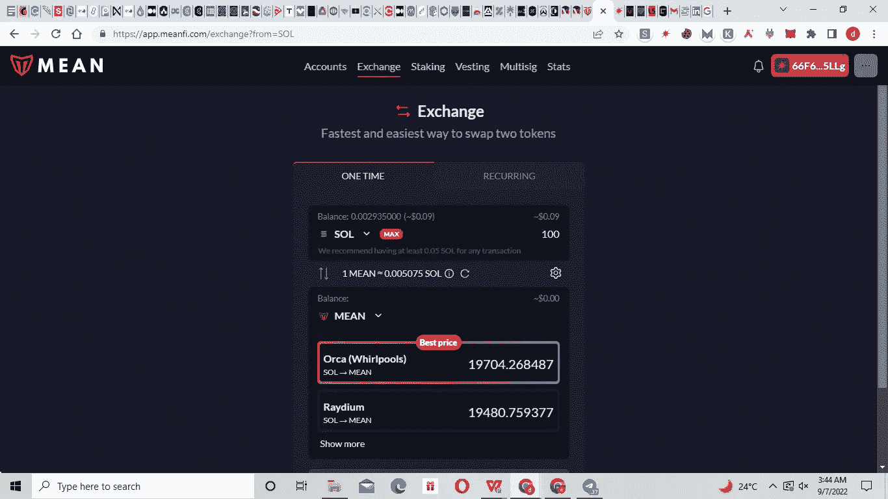

# 理财——作为个人或企业管理资产的最佳理财工具。

> 原文：<https://medium.com/coinmonks/mean-finance-the-best-financial-tool-for-managing-your-assets-as-an-individual-or-a-business-521a9dc0ee31?source=collection_archive---------23----------------------->

什么是 MeanFi？

Mean Finance，又称 [MeanFi](https://app.meanfi.com/) ，是一款银行应用，为日常用户提供去中心化的银行服务..这与传统银行业的规范背道而驰。

MeanFi 是一个支持 web3 的银行系统，这意味着应用程序用户可以完全控制他们的银行活动，包括访问各种独特的服务，使他们能够获得最佳的银行体验。

MeanFi 由 [Mean 协议](https://docs.meanfi.com/products/mean-protocol)提供支持，该协议负责 MeanFi 上许多可用的实用程序。

建立在索拉纳区块链上的 Mean 协议使用了一个我称之为“安全三角”的系统这意味着该协议恰当地将安全性、可持续性和自动化联系在一起，为其用户提供独特的金融解决方案。

MeanFi 没有将 web3 宣传为一种将取代所有现有服务的服务，而是认识到有必要将 web2 用户连接到 web3。为了实现这一点，它有各种各样的产品/服务可以帮助 web2 用户轻松过渡到 web3。这是最终的 web3 去中心化应用！

MeanFi 提供的服务/产品是通过区块链技术实现的。

**为什么选择 MeanFi 作为理财工具？**

尽管在 Solana network 上有 DeFi 平台处于促进去中心化和无许可服务的前沿，MeanFi 已经确定需要一些额外的层来进一步改善 DeFi 提供的特性，其中一些包括*“自我监管”*

在区块链领域，阻碍采用的一个因素是假定用户需要具备的技术知识量。虽然这本身并不是完全错误的，但并不是区块链的所有方面都需要技术经验。DeFi 并不是火箭科学，MeanFi 进一步简化了 DeFi 工具的使用——从完全适合日常 web2 用户的 UX，到无需代码即可执行的应用程序的一些功能，用户可以获得独特的体验。

MeanFi

在明确考虑用户的情况下，MeanFi 是一个分散的交易所，便于在应用程序支持的 SPL 代币之间转移资金，同时也是一个 [dex 聚合器](https://www.bitdegree.org/crypto/learn/crypto-terms/what-is-dex-aggregator)，为用户提供最佳的市场价格来交换代币。这使得用户有资格享受只有通过[套利](https://www.investopedia.com/terms/a/arbitrage.asp)才有可能享受的好处。

到目前为止，已经出现了单点故障的情况——在安全性方面，泄露一个私钥就足以危及加密钱包/帐户。无论是商业还是个人使用，当所有信息都由一方维护时，更容易失去对钱包的保管。除此之外，还有一个“多重”钱包。

作为一个有安全意识的项目，MeanFi 向其用户提供 multisig 钱包服务。钱包需要多个密钥持有者访问单个账户。每个有权使用钱包的钥匙持有者都必须确认钱包中发生的每一笔交易，从而消除了单点故障。为投资者保留大量资金的企业和希望轻松转让其加密资产所有权的个人可以采用 [MeanFi 的超级安全](https://docs.meanfi.com/products/mean-protocol/supersafe-whitepaper)。不同于普通的 dApps 只是简单地追求采用，它还优先考虑用户的安全。

企业和个人可能希望使用 MeanFi 的另一个原因是它支持的薪资自动化。MeanFi 称之为*支付流*，这个想法是为了促进一个系统的持续支付。想想存在的任何类型的重复支付:从支付员工工资到订阅、支付租金和参与 ICOs(初始硬币发行)，MeanFi 应用程序可以处理所有事情。启动交易的条件可以调整，以满足当前使用支付流的需求。这对你来说只是少了一个付款的麻烦，而 TradFi 并不总是保证这一点。

对于希望获得奖励的用户，MeanFi 为持有其 [MEAN token](https://coinmarketcap.com/currencies/meanfi/) 的用户提供了下注机会。用户同样可以在 app 上提供流动资金，并相应获得奖励。

MeanFi 是一个旨在维持索拉纳生态系统和整个区块链空间的项目，而不仅仅是推广其自身的服务。该平台提供了一个令牌授予选项，允许新项目随着时间的推移向其社区授予令牌。

目标是帮助 Solana 生态系统上的项目以一种允许他们维护路线图、避免令牌转储的方式轻松分发令牌，并且不用编写一行代码。

*无道是什么意思？*

作为一个支持全功能 web3 经济的包罗万象的项目，它作为一个 DAO 运行。

[中庸之道](https://docs.meanfi.com/dao/the-dao)允许社区为项目的发展做出贡献。这包括对项目活动进行投票，并决定某些决定是否适合 MeanFi。事实上，MeanFi 开发人员只是构建社区为项目决定的东西，而不是反过来，就像 web2 中的集中式大技术一样。该项目的主要口号是权力下放！

**结论**

MeanFi 是一个可靠的金融工具，由于其提供的服务范围广泛，能够管理个人和企业的金融活动。

有了这个简单易用的 dApp，你就可以掌控自己的财务，并充分体验 DeFi。

[网站](https://meanfi.com/) | [dApp](https://app.meanfi.com/) | [不和](https://discord.gg/xxc7z2M4) | [推特](https://twitter.com/meanfinance?t=9L4Lc1itq7I73HuuxPV8RA&s=09) | [文档](https://docs.meanfi.com/)