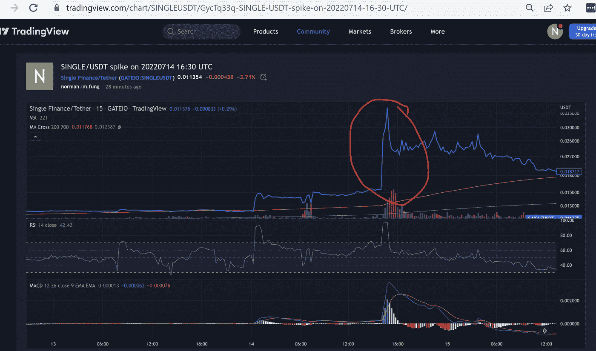
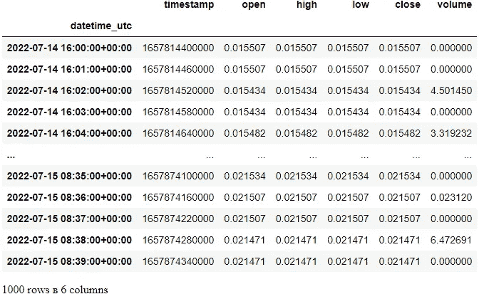
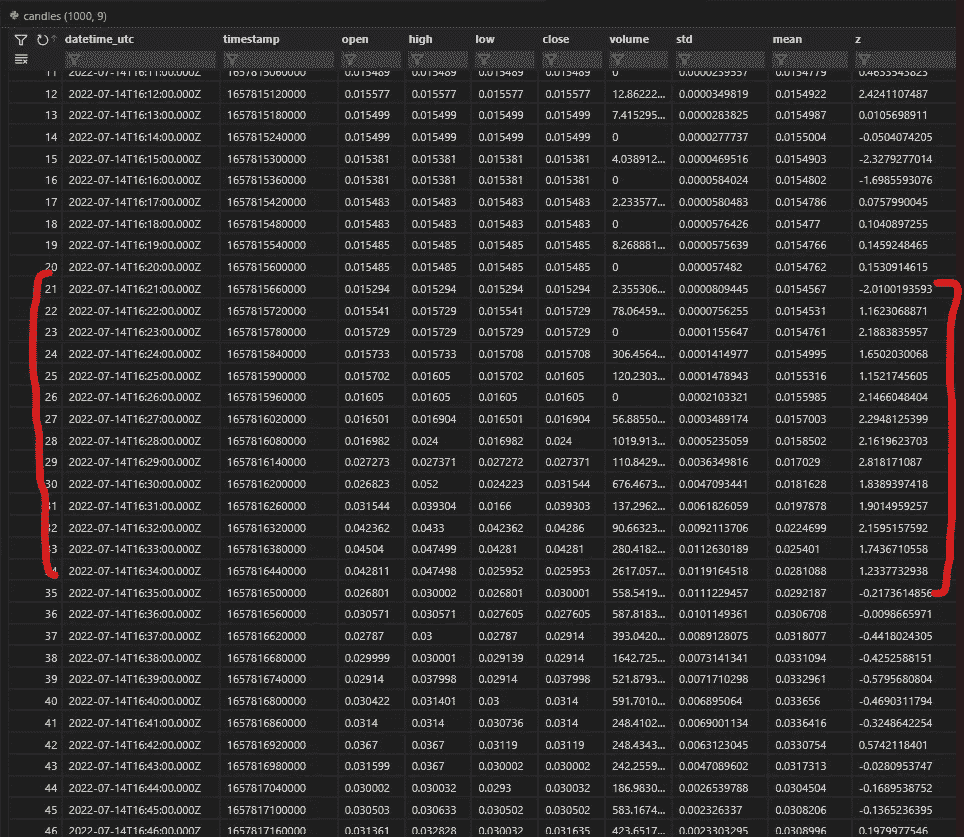

# 从加密交易所取出的蜡烛计算波动性。

> 原文：<https://medium.com/coinmonks/measures-volatility-from-candles-3032a2db8786?source=collection_archive---------2----------------------->

我们将向您展示如何使用 [ccxt](https://github.com/ccxt/ccxt/blob/master/README.md) 从加密交易所获取的蜡烛计算价格波动性(标准差和 [zscore](https://en.wikipedia.org/wiki/Standard_score) )。

例如，让我们以 gateio 上的单曲/USDT 为例。我们希望测量始于 UTC 20220714 16:30(或当地时间 20220715 00:30 午夜过后)的峰值附近的波动性:



[https://www . trading view . com/chart/SINGLE usdt/gyctq 33 q-SINGLE-USDT-spike-on-2022 07 14-16-30-UTC/](https://www.tradingview.com/chart/SINGLEUSDT/GycTq33q-SINGLE-USDT-spike-on-20220714-16-30-UTC/)

下面是 python 代码(Jupyter 笔记本):

```
from datetime import datetime, timedelta
from ccxt.gateio import gateio

exchange = gateio()

symbol : str = 'SINGLE/USDT'
timeframe : str = "1m"
num_candles = 1000
'''
Our interest is spike that started UTC 20220714 16:30 (or local time 20220715 00:30 passed midnight)
https://www.tradingview.com/chart/SINGLEUSDT/GycTq33q-SINGLE-USDT-spike-on-20220714-16-30-UTC/
'''
cutoff = datetime(2022, 7, 15, 0, 0)
cutoff = int(cutoff.timestamp()) * 1000

candles = exchange.fetch_ohlcv(symbol=symbol, timeframe=timeframe, since=cutoff, limit=num_candles)
candles[[1657814400000, 0.015507, 0.015507, 0.015507, 0.015507, 0.0],
 [1657814460000, 0.015507, 0.015507, 0.015507, 0.015507, 0.0],
 [1657814520000, 0.015434, 0.015434, 0.015434, 0.015434, 4.501449572],
 [1657814580000, 0.015434, 0.015434, 0.015434, 0.015434, 0.0],
 [1657814640000, 0.015482, 0.015482, 0.015482, 0.015482, 3.319232426],
 ... many candles ...
 [1657874220000, 0.021507, 0.021507, 0.021507, 0.021507, 0.0],
 [1657874280000, 0.021471, 0.021471, 0.021471, 0.021471, 6.472690602],
 [1657874340000, 0.021471, 0.021471, 0.021471, 0.021471, 0.0]]import pytz
import os
import pandas as pd
divisor : int = 1000 if os.name=='nt' else 1
candles = pd.DataFrame(candles)
candles.rename(columns={0: "timestamp", 1: "open", 2: "high", 3: "low", 4: "close", 5: "volume"}, inplace=True)
candles['datetime_utc'] = candles['timestamp'].apply(lambda ts : datetime.fromtimestamp(int(ts)/divisor).astimezone(pytz.utc))
candles.set_index(['datetime_utc'], inplace=True)
candles
```



```
candles['std'] = candles['open'].rolling(10).std()
candles['mean'] = candles['open'].rolling(10).mean()
candles['z'] = (candles['open'] - candles['mean']) / candles['std']
candles
```

*【STD】*和*【mean】*是根据后十行的值计算的。请注意当价格在协调世界时 20220714 年 16:20 开始变动时，“std”和[“z-score”](https://en.wikipedia.org/wiki/Standard_score)如何跳跃(从< 0.2 到> 1.0)。价格在 16:35 稳定后，z 值回落至< 0.1



为什么我们要测量波动性？大多数交易算法在特定的市场条件下工作:上涨，下跌趋势，区间。例如，[做市商](/hummingbot/a-comprehensive-guide-to-avellaneda-stoikovs-market-making-strategy-102d64bf5df6)(例如 Hummingbot Avellaneda)和 [Grid](https://www.huobi.com/support/en-us/detail/900003573146) 最好在区间市场中操作。

> 交易新手？尝试[加密交易机器人](/coinmonks/crypto-trading-bot-c2ffce8acb2a)或[复制交易](/coinmonks/top-10-crypto-copy-trading-platforms-for-beginners-d0c37c7d698c)