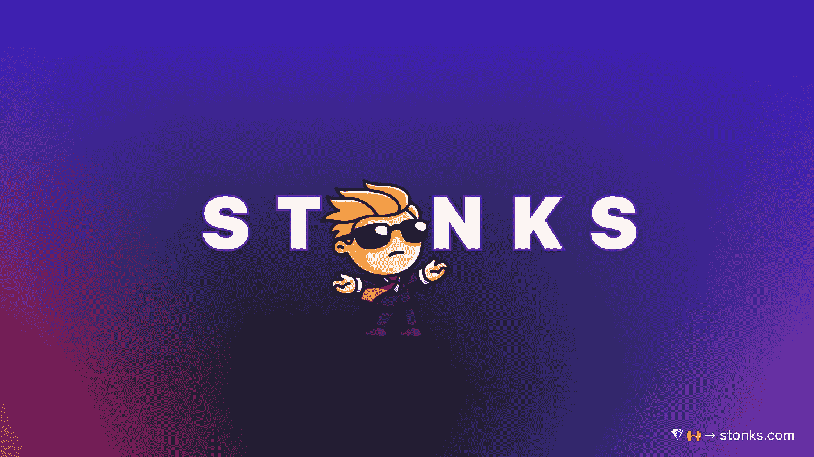
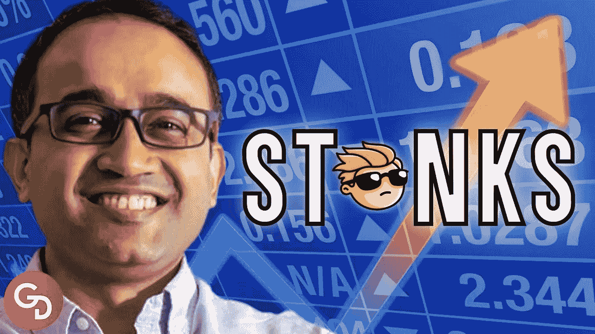
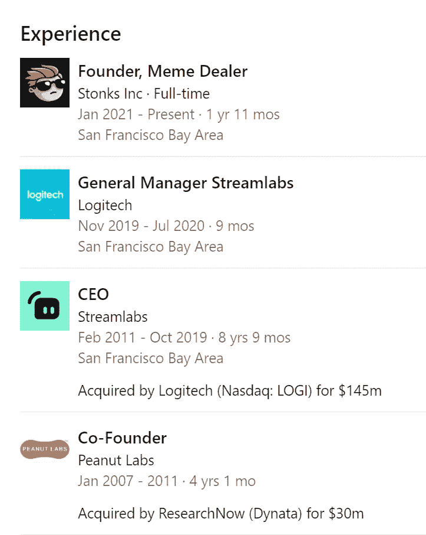
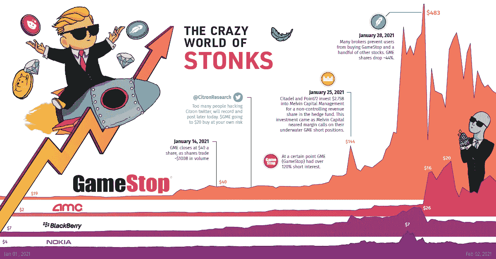

# 与公司见面，让演示日再次充满乐趣

> 原文：<https://medium.com/coinmonks/meet-the-company-making-demo-days-fun-again-badb0e743653?source=collection_archive---------29----------------------->

Stonks raises $15m to build a Live Platform for Startup Demo Days

从来没有想过我会活着看到有人真的赚钱运行演示天。

我已经在创业和创新行业工作了十年，我可以告诉你演示日压力很大。

初创公司的创始人正在吮吸红牛，第一百万次排练他们的演示。

由于投资者日程繁忙，很难找到他们。

举办物理演示日意味着物流和大量的前期规划工作。

人们总是有一个最大的误解，那就是投资者会在演示日当场开一张支票。

没人会这么做。

永远不会。

Ali Moiz previously founded and sold Streamlabs and Peanut Labs, for a combined enterprise value over $180 million.

当然，演示日是一个很好的机会，可以看到所有的初创公司都出现在一个舞台上。

但在 5 分钟紧张的漫无边际、难以阅读的幻灯片和会后派对上匆忙的交谈之间，很难当场做出真正的投资决定。

即使是鲨鱼池上的鲨鱼在同意投资后也不会开支票。

仍有许多来回要仔细理清这笔交易的细微差别。

所以我很惊讶地看到史东克斯真的把演示日当成了一门生意。

The legendary meme. IYKYK.

但是首先，让我们先把名字弄清楚。

“Stonks”是故意拼错的单词“stocks ”,它经常与一个超现实的迷因联系在一起，这个迷因的特点是人物迷因站在一幅代表股票市场的图片前，后面跟着说明“Stonks”。"这张照片开始被用作网上关于做出糟糕财务决策的笑话中的反应图像."

对，所以创始人们决定给公司的名字取一个迷因。

等着看 logo 吧。

还记得华尔街赌注吗？

他们有一个可爱的小家伙，穿着西装，戴着墨镜，留着漂亮的金色卷发。

那基本上就是 Stonks 的 logo。

Stonks 的创始人之一 Ali Moiz 在他的 Linkedin 个人资料中有一个头衔“Meme Dealer”。

去想想。

The Meme dealer of Stonks.

史东克斯是做什么的？

本质上，他们聚集了正在筹集下一轮资金的顶级初创公司，并将其放入一个简单的平台，供投资者阅读。

它是 100%虚拟的，所有工作都在网站上完成并记录在案，对创始人和投资者都是透明的。

由于创始人的背景和在硅谷的关系网，他们成功说服了来自 YC、Techstars 和 Xoogler 的高质量创业公司来投资。

除了在 Stonks 上筹集了 300 万美元(是的，他们在自己的平台上筹集了资金)，他们还筹集了 1500 万美元作为由 a16z 牵头的种子资金。

GameStop went to the moon and gave Stonks a whole new meaning.

他们已经完成了 100 多项活动。

他们的不和和社交媒体有 40k+成员。

他们促成了 1500 多笔交易。

他们有 60 多个高质量的合作伙伴和投资者。

对于一个以迷因为标志的年轻公司来说，这还不错。

那么他们是如何通过运营演示日赚钱的呢？

这是个黄金问题。

或许从创业公司分一杯羹？

或者在不久的将来可能的会员订阅？

你认为斯通克斯的商业模式会长期持续下去吗？

-

你听说过史东克斯吗？

-

#创业#商业#创业#成长#成功#社交媒体#创始人#网络 3 #战略#股票#投资#散户投资者#股票#利润#赚钱

> 交易新手？试试[加密交易机器人](/coinmonks/crypto-trading-bot-c2ffce8acb2a)或者[复制交易](/coinmonks/top-10-crypto-copy-trading-platforms-for-beginners-d0c37c7d698c)