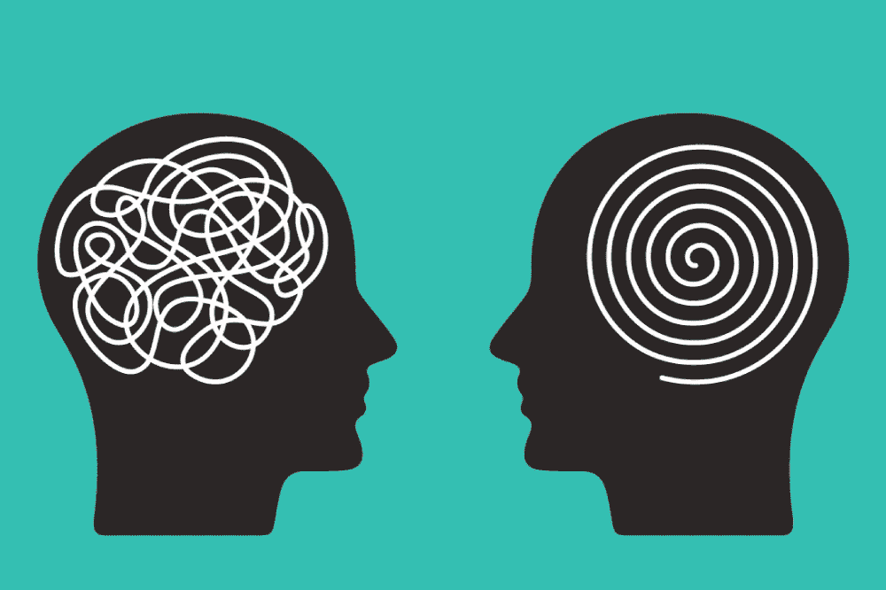

# 来看看解决世界第二大精神健康问题的 NFT 项目

> 原文：<https://medium.com/coinmonks/meet-the-nft-project-tackling-the-worlds-second-largest-mental-health-issue-7f4fbe67f1ee?source=collection_archive---------35----------------------->

慈善家向慈善机构捐赠巨款的例子屡见不鲜；我们也看到过这样的例子，一个匿名的人买了一件昂贵的艺术品，却把它放到了公共领域。

在这个数字艺术品通过 NFTs 普及的时代，慈善事业已经进入了一个新的层面，各组织创作数字艺术品，并将其出售给全球收藏家，目的是利用所得资金资助人道主义和慈善事业。

到目前为止，乌克兰危机一直是 NFTs 如何帮助资助人权事业的亮点。我们说[无聊猿游艇俱乐部](https://decrypt.co/94660/bored-ape-yacht-club-donates-1-million-ethereum-ukraine)如何为乌克兰筹集了 100 万美元；我们也看到了[乌克兰本身](https://www.engadget.com/ukraine-is-selling-nfts-to-support-its-military-194527001.html)和其他[各种独立艺术家](https://www.dailysabah.com/arts/artists-use-nfts-to-support-ukraine-against-russian-invasion/news)如何走上 NFT 的道路，为乌克兰筹集资金，并帮助它应对面临俄罗斯大规模轰炸的日益严峻的人道主义问题。

另一个 NFT 项目正在帮助提高对另一场危机的认识；这个问题已经在世界上存在了很长时间，事实上已经成为全球第二大精神健康问题。认识一下 EyeSeeYou，NFT 帮助解决饮食失调的项目。

# 什么是 EyeSeeYou？

EyeSeeYou 是区块链以太坊上的 NFT 系列。该项目收集了总共 8，888 个生成性 NFT。它完全是为了帮助提高全球对饮食失调症患者的认识而创建的。

作为筹集资金的途径，该项目将数字艺术视为吸引全球观众的可行方式。长期以来，艺术一直是人类表达思想、描绘社会问题和交流价值观的一种手段，而且在很大程度上，这种思想在世界各地的所有文化中都是共享的。数字艺术品销售的收入将分配给与它有共同愿景的组织。

# NFTs 创建实用程序

如果您最初的奋斗是理解 NFT 的本质，那么它们最初的效用就足以让您相信它们的本质——它们表现独特用例和价值的能力。

除了通常的解释，我们已经开始看到区块链技术发展的这一方面如何通过改变生活和给绝望者带来希望来积极影响社会。对于那些相信支持人类事业的人道主义者来说，非物质文化遗产是一个黄金机会，可以通过吸引全球观众和使用实现的资金来推进他们的事业，从而产生深远的影响。

正如我们在乌克兰看到的非精神疾病患者的作用一样，非精神疾病患者也是气候变化事业的倡导者，与世界第二大精神疾病的斗争进一步证明了非精神疾病患者可以为人类的努力做出多么积极的贡献。

> 交易新手？试试[加密交易机器人](/coinmonks/crypto-trading-bot-c2ffce8acb2a)或者[复制交易](/coinmonks/top-10-crypto-copy-trading-platforms-for-beginners-d0c37c7d698c)