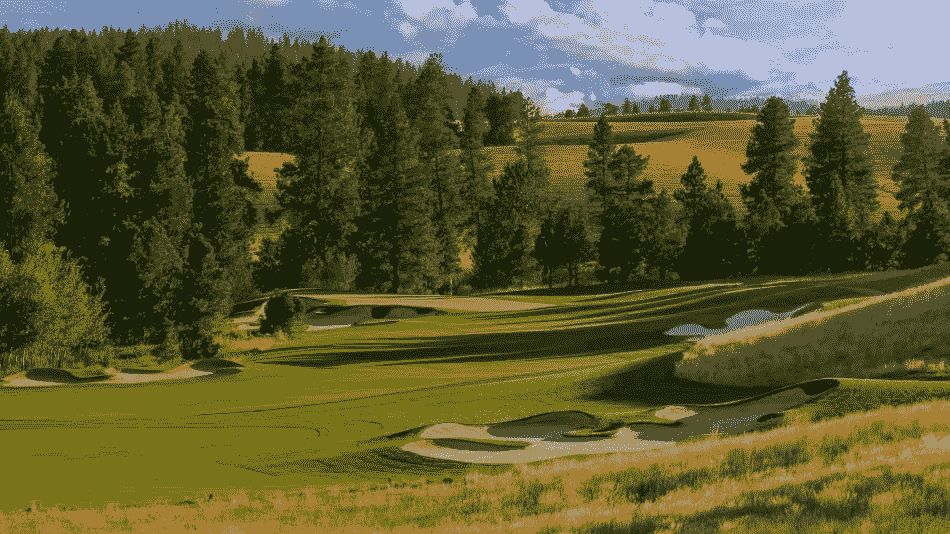

# 认识世界上第一家 NFT 豪华高尔夫和目的地俱乐部

> 原文：<https://medium.com/coinmonks/meet-the-worlds-first-nft-luxury-golf-and-destination-club-8af2579e91aa?source=collection_archive---------40----------------------->

众所周知，奢侈品是特定阶层的人——精英、富人和富裕的社会成员——才有的。虽然这已经是很长一段时间的常态，但非功能性交易正在迅速分散奢侈品。不可替代的代币让任何买得起的人都可以使用。欢迎来到世界上第一家 NFT 豪华高尔夫和目的地俱乐部。

它的名字叫阿斯彭湖，位于美国俄勒冈州的姐妹城。阿斯彭湖是鲁河度假村的一部分，它最近向希望成为其创始家庭一员的成员敞开了大门。这个奢华的目的地以相当于 15，000 美元的 ETH 价格向会员提供终身访问。目前，多达 10，000 个家庭可以购买该度假村的终身使用权。

作为款待的一部分，会员将享受 18 洞高尔夫球场、徒步旅行和自行车道、休息室、活动空间、专卖店和餐厅。随着时间的推移，阿斯彭湖还将开发一个五星级酒店、一个会议中心、一个 12 英亩的湖泊，以及塞满当地食材的顶级餐厅等。

# 更多主流 NFT 采用

尽管困难重重，非正规金融机构的势头仍在继续。我们看到它们在各行各业被广泛采用。NFT 现在已经不仅仅是图像了。今天，它们代表了所有权的可验证的证明和真实性的手段。这使得它们在许多行业都很有吸引力。

我们已经开始看到它们在活动票务、供应链、房地产、艺术、电子商务和饮料等行业的应用。

豪华酒店行业采用 NFT 是朝着正确方向迈出的一步。这是对非功能性翻译所能赋予的内在价值的证明，尤其是它们在链上和现实生活中表现独特事物的能力。本质上，NFTs 将继续看到用例，这将进一步帮助区块链与现实世界的桥梁。

# 结论

我们只是在 NFT 应用的快速阶段的开始。随着行业发现非功能性技术在增强用户体验和优化工业流程方面的内在价值，更多的创新用例必将出现。

> 交易新手？试试[加密交易机器人](/coinmonks/crypto-trading-bot-c2ffce8acb2a)或者[复制交易](/coinmonks/top-10-crypto-copy-trading-platforms-for-beginners-d0c37c7d698c)