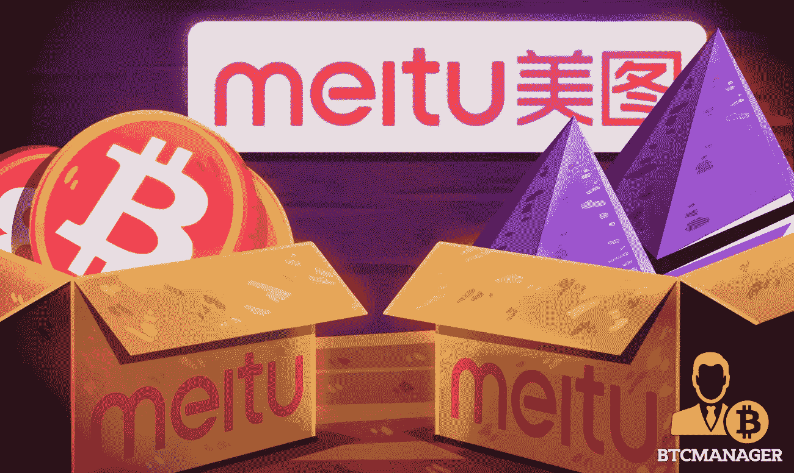

# 美图投机加密货币损失 3 亿美元

> 原文：<https://medium.com/coinmonks/meitu-loses-300-million-speculating-on-cryptocurrencies-56cff7737714?source=collection_archive---------16----------------------->

本文由中国财经新闻网站 CE 翻译。通信网络（Communicating Net 的缩写）

[http://finance . ce . cn/stock/gsgdbd/202207/06/t 20220706 _ 37837792 . shtml](http://finance.ce.cn/stock/gsgdbd/202207/06/t20220706_37837792.shtml)

经济观察网记者任实习记者谭玉清。
一家曾经红极一时的社交媒体公司因投机加密货币亏损 3 亿元人民币，再次出现在公众面前。3 月 7 日，这个滑稽的事件真的发生了。
7 月 3 日晚，港交所上市公司美图(01357.HK)发布财报。截至 6 月 30 日，该公司可能录得 400 亿至 500 亿美元的净亏损，而去年同期亏损 2000 万美元，使他们的亏损从 99.6%增加到 154.1%。预计增加的损失是购买加密货币的结果。

去年，美图大张旗鼓地进入了加密市场，但今年却遭受了巨大损失。他们在微博上被网民批评为“不务正业”。一家区块链公司的高管告诉经济观察报记者，有很多香港和美国的上市公司热衷于投机美图这样的加密货币。“美图在所有这些产品中脱颖而出。”
由于高调炒币，美图亏损约 3 亿人民币。
7 月 4 日，在收到未实现亏损的消息后，美图股票先涨后跌 10%，直至交易日结束。美图上市价格为每股 0.93 HKD，下跌 10.58%；约值 41 亿港币。

美图从 2021 年 3 月 5 日开始购买加密货币，购买了 15000 个以太币和 379 个比特币:每种加密货币的总价值分别为 2210 万美元和 1790 万美元，总计 3120 万美元。
美图董事长蔡文胜宣布，

> "美图继续在区块链进行部署，收购 ETH 和 BTC 以发展长期战略储备."

他说，

> “最终总有人要第一个冒险进入未知领域。这是第一家购买比特币的香港上市公司，也是第一家储备 Etherium 的上市公司。”

查文生也认为比特币有风险。当比特币开始上涨时，他说加密货币是历史上最大的泡沫。但与此同时，他表示，人们只能拥抱泡沫，不参与泡沫的风险更大。
关于美图投资加密货币，美图创始人兼 CEO 吴在接受媒体采访时表示，

> “这是董事会的决定。我不确定这个决定是怎么通过的。”

2021 年，3 月 17 日至 4 月 8 日，美图再次购买加密货币，获得 31000 以太币和 940 比特币，价值分别为 5000 万美元和 4950 万美元。【2021 年 5 月，吴表示，当时没有继续投资加密货币的计划，因为董事会批准的金额仅为 1 亿。

> “购买加密货币更多的是关于市场分配和海外业务运营，而不是为了短期收益。”

之后比特币价格出现波动；最高时达到 69，000 美元。
到 2022 年，加密货币市场将不再一样。最近，比特币价格跌破 2 万美元。今年上半年，Meitus 购买加密货币的未实现损失约为 1850 万至 2710 万美元。折算成人民币，美特斯联亏损 1.24 亿元，合计亏损 3.05 亿元。

**最近的加密货币崩盘**
随着美图 44 00 万美元的加密货币投机亏损，比特币和 Etherium 价格直线下跌。比特币价格在 2021 年 11 月达到 69 000 美元的峰值，最近跌至 19 000 美元，跌幅接近 70%。乙醚在 2021 年 11 月达到创纪录的 4891 美元，自其历史高点以来一直在下跌。自 2022 年 7 月以来，价格在 1100 美元左右，下跌 77%
浙江大学国际商学院数字经济与金融创新研究中心联席主任兼研究员潘鹤林对加密货币市场目前的下滑并不感到惊讶。

> “目前国内的虚拟货币都是非法的，最好完全不要碰。”

他认为，虚拟货币投资市场即将浮出水面。

> “也许 1-2 种顶级虚拟货币不会完全消失，但价格会暴跌，其他虚拟货币很可能接近零。”

潘鹤林告诉记者，全球央行收紧是虚拟货币崩盘的关键因素。市场流动性不充分，资产泡沫的破灭总是从泡沫最大的领域开始。虚拟货币没有价值保障，十年来价格成倍增长，在周期趋紧的情况下率先进入下行周期。在 2011 年的高点，美图的最高浮动利润超过了 15 00 万美元。然而好景不长。由于比特币数次暴跌，美图投资出现亏损。
潘鹤林告诉记者，美图没有积极的表现，所以他们想走捷径，购买炒作的加密货币，犯普通投资者犯的同样的错误。不管投资者是好是坏，公司对个人投资者来说没什么不同。对于美图的亏损，他认为一开始事情还不错，但现在结果不太好。
受加密货币暴跌影响的不仅仅是美图。去年年初，特斯拉购买了价值 15 亿美元的比特币。同样受比特币价格暴跌影响，特斯拉持有的比特币价值可能缩水 4.4 亿美元(约合 30 亿元人民币)，相当于特斯拉去年利润的 9%。领先金融科技公司 Twitter 创始人杰克·多尔西(Jack Dorseys)持有 8027 个比特币，损失超过 4000 万美元。根据彭博社的亿万富翁指数，从去年 11 月 9 日比特币的历史高点到今天的 19000 美元比特币，与加密货币挂钩的 7 位亿万富翁总共损失了超过 1140 亿美元。

**前一分钟还在炒作，下一分钟就消失了**

美图成立于 2008 年 11 月，其最著名的产品是美图秀秀，也推出了早期的美拍视频短片。美图在 2014 年进行了三轮融资，并于 2016 年 12 月 15 日在香港交易所上市，成为自腾讯以来最大的 IPO。

美图秀秀曾经名噪一时，几乎就好像是每个智能手机的必备 app。2015 年，美图线下产品达到 9.8 亿用户，覆盖 6.8 亿移动设备。美图也曾是全球八大最常用非游戏 app 之一。2016 年，美图秀秀处理了主流社交媒体网络上超过一半的照片。在证券交易所上市后，它被选为中国 100 家互联网企业之一。2017 年，美图市值一度达到 127 亿美元。截至 2022 年 7 月 5 日，美图的市值为 53 亿美元。

美图这几年一直在逐渐衰落。2022 年初，美图创始人兼首席执行官吴兴红在接受媒体采访时表示，“美图诞生于图片一代，但图片目前正面临视频的压力。”美图财报显示，在 2017 年，美图的收入在巅峰时期超过了 45 亿美元。后来，当智能手机市场走向低迷时，该公司开始走下坡路。2021 年，年收入为 16 亿元人民币，主要收入来源为在线广告、VIP 订阅和 SaaS 服务。从财务数据来看，美图强大的用户基础已经急剧下降。2016 年 9 月，美图月活跃用户 4.56 亿。截至 2019 年底，月活跃用户降至 2.825 亿。2020 年 12 月，美图的月活跃用户现在是 2.61 亿。仅仅一年后，用户数量继续下滑至 2.31 亿。
近年来，美图公司采取了几项战略举措。抛开美图秀秀，美图手机曾经是美图的重点业务。2013 年，美图进入硬件领域，发布了具有高品位拍照功能的高端手机。2016 年上半年，来自硬件的收入总计占当年收入的 95%。但由于 2018 年手机之间的激烈竞争，美图旗舰手机的相关技术和品牌名称的权利被移交给了小米集团。【2017 年 10 月，美图试图做一个美妆电商店铺平台，但在 2018 年，该平台停止运营，现在将由 Secoo 投资公司运营。此外，美图还试图让小啊红书(中国流行的电子商务和社交媒体平台)成为电子商务平台，美拍是一个先于 Tiktok 的短视频平台。他们甚至在销售洗面奶和“神秘盒子”上碰了碰运气。最近，美图表示，它希望进入 SaaS 的美容行业，并为商业摄影机构服务。
关于 2022 年上半年的损益，美图表示，未实现亏损不会对他们的现金流产生任何重大影响，也不会对他们的经营产生任何重大影响。除此之外，加密货币仍处于早期阶段，其价格容易受到波动的影响。但区块链行业仍在快速发展，加密货币有充足的增长空间。董事会对购买的加密货币的长期前景保持乐观。

美图公司也在尝试今年梅特梅罗夫斯和 NFT 的趋势。今年 6 月，其 NFT 品牌“美图宝石”首次发布了其数字系列“像素记忆”。今年 4 月，美图秀秀推广了“IP 之星元宇宙”，在那里开设了一个 San Rio(Hello Kitty 的公司)主题公园、迪士尼的奇妙世界、天线宝宝的神奇岛屿、机动奥特曼光宇宙和元宇宙的其他部分。

> 交易新手？试试[加密交易机器人](/coinmonks/crypto-trading-bot-c2ffce8acb2a)或者[复制交易](/coinmonks/top-10-crypto-copy-trading-platforms-for-beginners-d0c37c7d698c)

— — — — — — — — — — — — — — — — — — — — — — — — — — — — — — — —

🔴点对点加密货币交易现在是、将来也会是规避日益恶化的资本管制的最重要工具。加入点对点加密交易革命。立即报名— [https://Wild-West。贸易](https://www.youtube.com/redirect?event=video_description&redir_token=QUFFLUhqbEs0WWgybWhXelY1SGZoRC1mN1FYS2tyZGRFd3xBQ3Jtc0tueUt1d01FcS00ZllzQzBBTndkOXktbVZnY2Rha1c1Q0xVWHp6aVJpNjdqMXUyN0FzMmpoaWJWT3NGQm5acE84V1Qtc0lUcGpaYU9ralN0NUVINlBlNGVzb1JCV3c3RElqaVVsQXRrUm9pR0RnTEFYaw&q=https%3A%2F%2Fwild-west.trade%2F&v=snmHTbk-DSU)