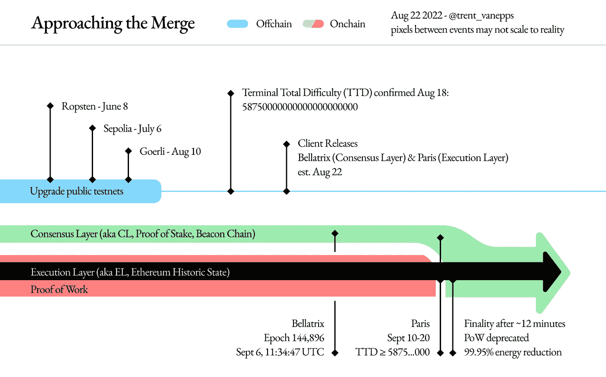

# 合并即将到来

> 原文：<https://medium.com/coinmonks/merge-is-coming-5536d174faec?source=collection_archive---------62----------------------->

9 月 6 日，星期二，瑞士联邦理工学院的股权证明信标链经历了贝拉特里克斯升级。这标志着合并的开始，预计将于下周完成。

# 什么是合并？

以太坊的合并可能是今年加密领域最大、最令人期待的事件，它标志着网络共识算法从工作证明到利益证明的转变。它的主要好处是增加了安全性和可持续性。

它被称为“合并”，因为这种转换需要将以太坊的 PoW Mainnet(称为“执行”层)与 PoS 信标链(“共识”层)合并。

今天的以太坊主网基于 PoW 共识运行，这意味着用户需要利用计算能力来解决密码难题，以便验证交易并在区块链上创建新的区块。

由于这涉及大量的能量消耗，PoS 共识的需求出现了——一种根据他们的 Ether)被下注的总量和时间随机选择验证者的机制，并为他们提供认证交易的奖励。

这导致了 2020 年 12 月信标链(或共识层)的推出，该信标链起到了与以太坊平行运行的利益证明网络的作用，目前允许用户对以太网进行利益证明。它还没有用于处理交易，只是为开发者和运营商准备 PoS 升级的一个中转区。

信标链是以太坊 2.0 架构的基石，因为它将在合并期间取代当前的工作证明系统。

# 格利合并——最后的彩排

当然，已经进行了大量测试，以确保合并将无缝进行，不会出现网络问题或宕机。

合并的预演部署在所谓的测试网(测试环境网络)上。继 Ropsten 和 Sepolia 之后，最后一次测试合并“Goerli”于 8 月 11 日成功进行，从而为以太坊 Mainnet 与其信标链合并铺平了道路。

# ETH 2.0 来了

从技术上讲，合并将通过两个网络的硬分叉分两步执行。

首先，启动一个名为 Bellatrix 的信标链网络升级，为与以太坊的 PoW 执行层融合准备 PoS 共识层。

最后，以太坊 Mainnet Paris upgrade 完成了合并，将执行层从工作证明过渡到利益证明共识。此过程不会中断网络，因为切换不会造成任何停机。

Source: Ethereum Foundation (ethereum.org)

由于贝拉特里克斯升级信标链已经在本周成功进行，这为实际合并扫清了道路。

Mainnet 的巴黎升级将由一个特定的阈值触发，当终端总难度(TTD)——代表所有开采的以太坊块的累积难度——达到 587.5 亿。

这一阈值预计将在 9 月 13 日至 16 日之间达到，现在的预测是它将在 9 月 15 日左右发生。

# 有什么优势？

此次合并将使以太坊的能耗降低约 99.95%，并且不再需要昂贵的硬件来验证交易。

此外，它的安全性也将得到提高，因为 PoS 被认为在网络的潜在攻击方面风险较小，因为它涉及验证者以其 ETH 为赌注来创建新的块。

因此，如果他们参与欺诈企图或未能验证交易，他们可能会在所谓的“砍杀”中失去一些股份，从而使攻击变得不那么有利。

与普遍的误解相反，合并不会降低天然气费用或提高交易速度，这是未来改进的目标。

# 以太坊发展的前进步伐

合并之后，几乎没有其他步骤——激增，边缘，清洗，挥霍——旨在使以太坊的区块链更加可扩展和安全。

随着以太坊上第二层解决方案的实现，包括分片和汇总，这种激增将会到来，从而使用户更容易在网络上操作，并使其更具可扩展性。

Verge 将优化存储和减少节点大小，最大限度地减少网络拥塞，并允许在区块链上处理更多的交易。

清除将减少验证器所需的硬盘空间，消除多余的历史数据。

最后，挥霍代表了一系列杂项较小的升级，将确保网络运行平稳后，前几个阶段。

虽然在以太坊的整个扩展过程完成之前还有很长的路要走，但这次合并标志着该网络能源密集型工作证明篇章的结束，使其在未来更加安全和可持续。由于它是第二大区块链，这一事件无疑是加密货币历史上最重要的时刻之一。

> 交易新手？试试[加密交易机器人](/coinmonks/crypto-trading-bot-c2ffce8acb2a)或者[复制交易](/coinmonks/top-10-crypto-copy-trading-platforms-for-beginners-d0c37c7d698c)