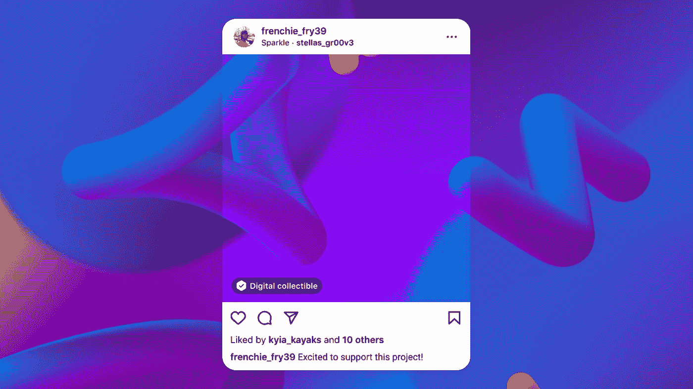
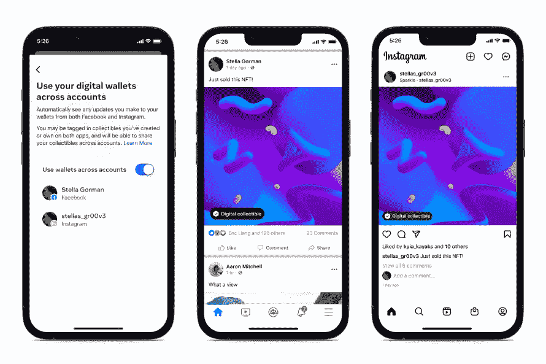

# Meta 开启 NFT 分享功能

> 原文：<https://medium.com/coinmonks/meta-opens-nft-sharing-feature-7a7e9603bd40?source=collection_archive---------43----------------------->

> 作者:PhoenixxDown

本周，META 宣布美国用户现在可以将他们的加密钱包连接到脸书和 Instagram 平台，以使用 NFT/数字收藏品。自 5 月以来，Instagram 上的 NFT 功能一直在测试中。Meta 在此次更新中提供了以下几点:

*   从本周开始，我们将在 Instagram 上与精选的美国创作者和收藏家一起测试数字收藏品，分享他们创作或购买的 NFT
*   该功能包括连接数字钱包，共享数字收藏品，以及自动标记创作者和收藏者
*   在 Instagram 上发布或分享数码收藏品不会产生任何费用

梅塔补充说:“此外，在 Instagram 上提供数字收藏品的 100 个国家中，每个人现在都可以访问该功能。”

Instagram 用户也可以将他们的 NFT 交叉发布到他们的脸书账户。

如果你喜欢那种东西，祝你好运。将你的 IRL 身份与你的德根 NFT 活动联系起来的好处似乎就像是地狱里炮制的一个配方，一个成熟到可以被犯罪分子和 Meta 向其提供数据的任何人的窥探利用的配方。事实上，如果有人可以找到一个坚实的个人理由来使用这个功能，请让我知道，因为我完全失去了。

除此之外，大规模采用！别问推特上那个六边形怎么样了。

> 交易新手？试试[加密交易机器人](/coinmonks/crypto-trading-bot-c2ffce8acb2a)或者[复制交易](/coinmonks/top-10-crypto-copy-trading-platforms-for-beginners-d0c37c7d698c)