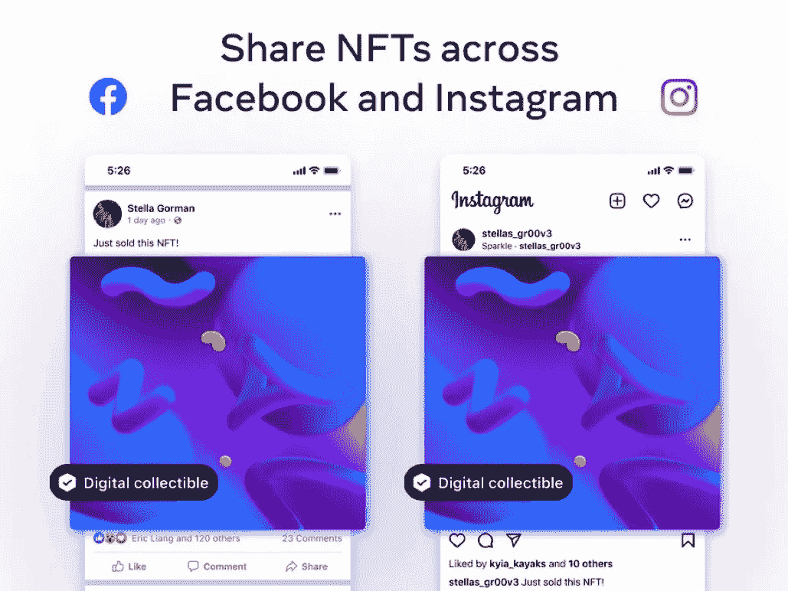

# Meta 向美国所有脸书和 Instagram 用户开放 NFT 共享

> 原文：<https://medium.com/coinmonks/meta-opens-nft-sharing-to-all-facebook-and-instagram-users-in-the-us-1060a0b531b4?source=collection_archive---------14----------------------->

不可替代的代币(NFT)终于在 Instagram 上出现了，此前 Meta 于周四宣布了其期待已久的数字收藏功能在美国数百万用户中的到来

Meta 于 9 月 29 日宣布，美国所有的脸书和 Instagram 用户现在可以连接他们的钱包并分享他们的 NFT。美国的所有用户也可以在脸书和 Instagram 上交叉发布他们拥有的 NFT。正式推出的几个月前，Meta 于 5 月份开始在 Instagram 和 6 月份在脸书的精选用户中测试 NFTs。

该公司还于 8 月份在 100 个国家的 Instagram 上推出了 NFT 支持，并选择了一些用户。今天，Meta 宣布这 100 个国家的所有用户现在都可以在 Instagram 上访问该功能。

“今天我们宣布美国脸书和 Instagram 上的每个人现在都可以连接他们的钱包，分享他们的数字收藏品，”Meta 在帖子中说。“此外，在 Instagram 上提供数字收藏品的 100 个国家，每个人现在都可以访问该功能。”

要发布一个数字收藏品，你需要做的就是将你的数字钱包连接到 Instagram。截至目前，它支持与第三方钱包的连接，包括 Rainbow、MetaMask、Trust Wallet、比特币基地钱包和即将推出的 Dapper Wallet。目前支持的区块链包括以太坊、多边形和流。在 Instagram 上发布或分享数码收藏品是免费的。

> 交易新手？试试[加密交易机器人](/coinmonks/crypto-trading-bot-c2ffce8acb2a)或者[复制交易](/coinmonks/top-10-crypto-copy-trading-platforms-for-beginners-d0c37c7d698c)