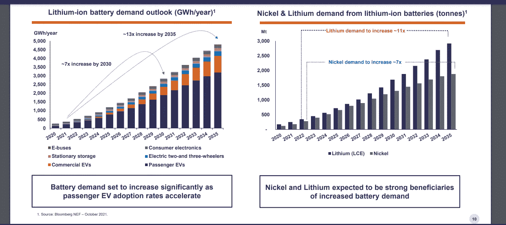
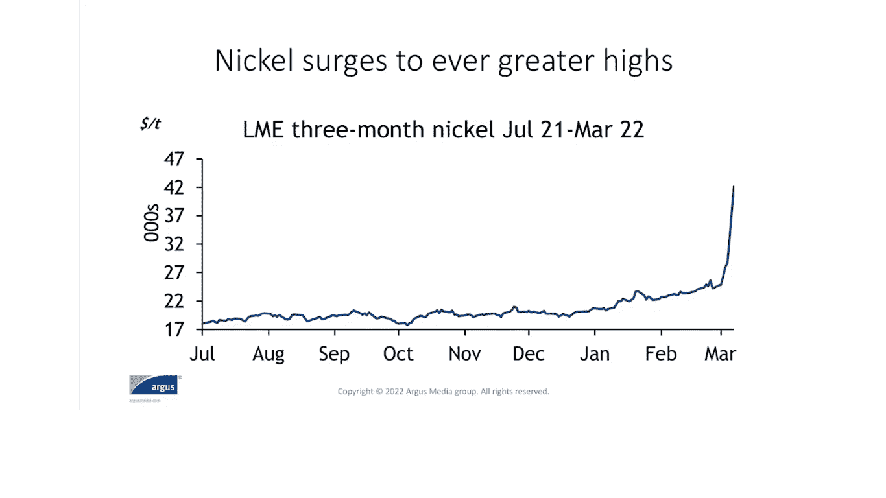
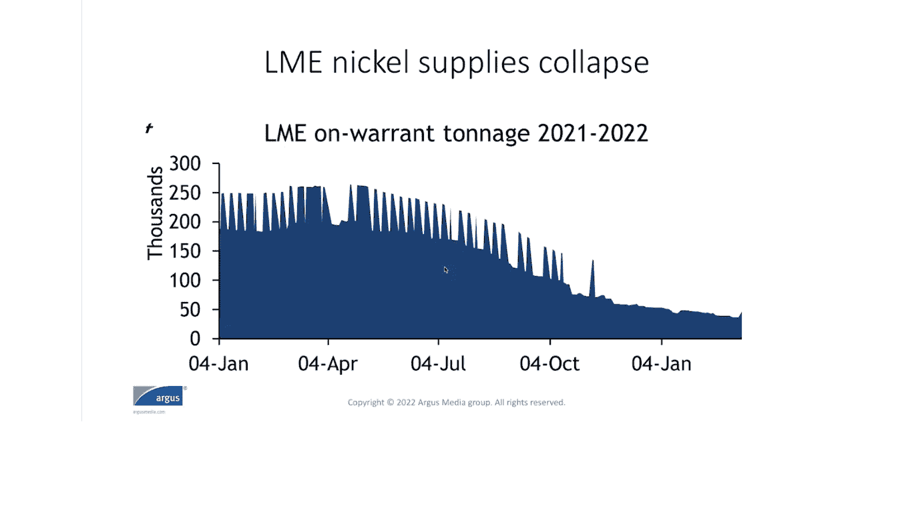

# 金属 2.0:地缘政治的游戏规则改变者

> 原文：<https://medium.com/coinmonks/metals-2-0-the-game-changers-in-geopolitics-da643974401f?source=collection_archive---------15----------------------->

Photo by [Mika Baumeister](https://unsplash.com/@mbaumi?utm_source=medium&utm_medium=referral) on [Unsplash](https://unsplash.com?utm_source=medium&utm_medium=referral)

# 镍和锂—电动汽车(EV)电池

> 特斯拉的案子

在埃隆马斯克(Elon Musk)在 Twitter 上惨败的消息传出后，人们开始忽视特斯拉在全球经济中发生的事情。特斯拉的电动汽车(EV)市场份额归结为技术优势和先发优势。埃隆·马斯克从来不避讳生产电池所需的原材料:镍、铜、钴和锂。自 2019 年 5 月[**以来，他一直在警告世界关键金属的全球短缺。**](https://electrek.co/2019/05/02/tesla-shortage-battery-minerals-nickle-copper-lithium/)

据特斯拉全球电池金属供应经理 [**Sarah Maryssael**](https://twitter.com/smaryssael) 称，特斯拉将采取必要措施确保镍的关键供应，并减少公司电动汽车生产中钴的使用——理由是增加澳大利亚和美国镍供应的“巨大潜力”。

在工业所需的原材料投资不足的背景下，新冠肺炎病毒在全球范围内的爆发无疑加剧了这种短缺，而这一工业又依赖于所谓的电力革命所需的关键金属。然而，早在 2019 年，埃隆·马斯克就已经指出了特斯拉的一个基本事实:“如果我们没有足够的电池，增加产品复杂性就没有多大意义。”

[https://www.youtube.com/watch?v=vpNZhKSfrKE](https://www.youtube.com/watch?v=vpNZhKSfrKE)

业内人士**众所周知，自从推出电动汽车以来，特斯拉一直寻求生产自己的汽车零部件。但镍等原材料的供应必须从特斯拉地理和市场覆盖范围之外的地区采购。这家公司根本没有能力开采自己的原材料。**

**特斯拉从哪里获得这些关键金属？**

**[**2020 年 1 月**](https://www.metaltechnews.com/story/2020/07/29/tech-metals/is-elon-musk-considering-tesla-gigamines/289.html) ，特斯拉开始与总部位于瑞士的嘉能可公司(Glencore plc)谈判，以购买其上海 Gigafactory 的长期钴供应。**

**特斯拉最重要的锂供应商之一是一家中国公司， [**当代安培科技**](https://europe.autonews.com/suppliers/teslas-deal-catl-could-be-key-china)**【CATL】**。这两家公司 [**合作达成了一项协议，CATL 将在 2022 年至 2025 年向特斯拉供应锂离子电池。就原材料采购而言，这可能是电动汽车领域最重要的合作伙伴关系。**](https://techcrunch.com/2021/10/02/china-roundup-tesla-catl-millennial-lithium/)**

**随后，埃隆·马斯克(Elon Musk)对全球金属矿商发表了著名的 [**名言**](https://www.metaltechnews.com/story/2020/07/29/tech-metals/is-elon-musk-considering-tesla-gigamines/289.html) :“任何矿业公司……无论你在世界的哪个地方，请开采更多的镍……如果你以高效和环保的方式开采镍，特斯拉将会给你一份长期的大合同。”**

**2021 年 7 月 21 日 日 [**，必和必拓集团响应号召，与特斯拉签署协议，从其位于西澳大利亚的**](https://www.cnbc.com/2021/07/22/bhp-to-supply-australian-nickel-to-carmaker-tesla.html) **[**Nickel West**](https://www.youtube.com/watch?v=aC69SmyYFSQ) 项目中可持续地生产和供应电池金属。接下来是与美国泰龙金属公司的另一笔交易，以确保一座预计于 2026 年**开始生产的矿山的镍供应。******

****对于特斯拉作为世界上最大的电动汽车生产商的成功来说，关键金属领域的所有这些发展都不为过——随着新公司扩大生产和新伙伴关系的出现，继续采购原材料将是该公司未来的最高优先事项。据报道，汽车制造商****和[**通用**](https://www.detroitnews.com/story/business/autos/general-motors/2022/04/12/gm-electric-vehicle-ev-battery-cobalt-ultium/7283028001/) 已经获得锂和钴蓝的供应，以提高电动汽车的产量。********

****其他新闻围绕着产品发布。日产和 NASA 合作开发了一款打算取代锂离子电池的 [**全固态电池**](https://japantoday.com/category/business/japan's-nissan-plans-'game-changing'-electric-car-batteries) 。令人惊讶的是，通用和本田将联合生产基于 [**新全球平台**](https://www.cnbc.com/2022/04/05/gm-and-honda-to-partner-on-affordable-electric-vehicles.html) 的电动汽车，这将使两家公司在美国市场以更实惠的价格销售。****

****现在我们已经进入了 2022 年时代，电动汽车消费市场预计将成为一个竞争更加激烈的领域。特斯拉的竞争对手之一 Rivian 于 2022 年 3 月 10 日宣布，它将效仿全球最大的电动汽车生产商和销售商，采用磷酸铁锂电池(LFP)。****

****在立法方面，加州监管机构提议到 2035 年禁止销售新的汽油燃料汽车。我认为，如果这一提案被相关法律机构通过，这将是电动汽车和清洁能源产品在美国推广的一大福音。****

****一些分析师称这个时代为“金属淘金热”****世界正朝着可再生能源和清洁能源技术的革命性扩张前进，这种扩张将影响化石燃料行业。这就是为什么金属对世界的净零排放目标如此重要。为了实现这一目标，埃隆·马斯克将需要更多关键金属；而迈克·亨利将不得不证明必和必拓集团正在将其 ESG 领导地位提升到一个新的水平。********

> ********中澳案********

******2022 年 3 月，以中国温州亿万富翁 [**向光大**](https://www.forbes.com/profile/xiang-guangda/) 为首的中国镍贸易巨头——青山控股集团发生了实质性危机，他们狂热地押注伦敦金属交易所(LME)今年镍产量和供应的增长。当镍价超过每吨 10 万美元时，LME 不得不立即停止镍交易。******

****为了应对电动汽车电池生产的短缺，青山控股集团设计了一个策略，保持较低的价格，从而允许更便宜地生产电池成分，特别是来自东南亚地区，如**。但不幸的是，乌克兰的事件导致市场以一种不同寻常的方式行动——一种对青山镍生产投资策略不利的方式。******

******自[**2022 年 3 月 8 日**](https://www.spglobal.com/commodity-insights/en/market-insights/latest-news/metals/031522-chinas-tsingshan-enters-deal-with-bankers-to-resolve-nickel-trade-position) 以来，国际投资者和银行家一直在等待青山的回应。直到[**2022 年 3 月 15 日**](https://www.reuters.com/world/china/chinas-tsingshan-agrees-standstill-agreement-lme-nickel-margins-with-banks-2022-03-14/) ，他们才最终宣布与摩根大通、CCBI 全球市场等银行债权人达成协议，讨论一项“备用担保流动性工具”安排，以解决公司的问题。该协议被大多数消息来源称为 [**停顿协议**](https://www.finweb.com/investing/what-does-a-standstill-agreement-mean-for-your-investment.html) ，预计无计划的镍交易将再次稳定下来。******

****该公司发布了一份声明，称:****

> *****“作为协议不可分割的一部分，该协议规定，随着异常市场状况的消退，青山集团将以公平有序的方式减少现有对冲头寸。”*****

****任何新规定都将由英国的监管机构实施:金融行为监管局(FCA)和英格兰银行。****

****这个关于中国青山控股集团的故事揭示了金属市场对全球金融和投资银行的重要性。****

****鉴于中国有能力在印尼进行廉价生产，并从全球最大的国际银行和金融机构筹集资金，我会把这称为一剂稳定和灾难的良方，由金属的生产和供应来抵消。这一基本事实甚至隐藏在镍行业的故事中:暂停协议的全部目的是稳定定价和交易机制，以防止全球市场的灾难。****

****接下来，这个故事继续于 2021 年 12 月**达成的一项计划实施契约(SID)，当时澳大利亚的 IGO Ltd 寻求收购另一家澳大利亚金属矿商机构 Western Areas Ltd，以扩大其镍和锂投资组合。通过增加西澳大利亚一些最高品位的镍和锂矿，IGO 将能够在很大程度上承担对电动汽车(EV)和清洁能源技术至关重要的金属生产基地。******

************

******This data was inserted into a PPT presentation from IGO Ltd. about the acquisition of Western Areas Ltd. on December 16, 2021\. Find the entire PPT here: [https://www.igo.com.au/site/PDF/a7963a4b-46d2-4504-bcd3-00924ef1f75c/WesternAreasAcquisitionPresentation](https://www.igo.com.au/site/PDF/a7963a4b-46d2-4504-bcd3-00924ef1f75c/WesternAreasAcquisitionPresentation)******

******最初估值为 10.96 亿澳元，IGO 将收购 Western Areas Ltd 在西澳大利亚矿山的 100%权益。IGO 似乎正在进行一项大规模收购，这将使其成为西澳大利亚镍产能的领头羊。直到最近，伦敦金属交易所(LME)的镍交易机制失控，导致中国青山控股集团 对镍价格飙升至每吨 10 万美元进行对冲生产。******

********

****Argus Media provides data analytics and consulting services for a wide-range of global commodities. This graph was shared via presentation of Argus Metals on March 18, 2022.****

****由于 LME 发生的事件，该公司起初预计收购交易只会有**“相对短暂的延迟”。然后在[**2022 年 4 月 5 日**](https://www.reuters.com/business/energy/australian-miner-igo-says-western-areas-terminate-buyout-deal-2022-04-05/) 有报道称，IGO 将完全退出收购西部地区的交易——仅引用一份独立专家报告作为放弃收购的理由。******

********

****Argus Media provides data analytics and consulting services for a wide-range of global commodities. This graph was shared via presentation of Argus Metals on March 18, 2022.****

# ******铁矿石&钢铁——建筑/建筑******

> ****哈萨克斯坦案例****

****[**2022 年 5 月 18 日**](https://eurasianet.org/amid-sanctions-kazakh-firm-stops-supplying-russian-steelworks) 哈萨克斯坦最大的铁矿石出口商和富集商索科洛夫-萨里拜矿业生产协会(SSGPO)决定暂时停止向位于西伯利亚的俄罗斯马格尼托戈尔斯克钢铁厂(MMK)供货。****

****俄罗斯 MMK 的回应是 [**指责**](https://www.vedomosti.ru/business/articles/2022/05/17/922281-posle-otkaza-kazahstana-metalloinvesta) 美国和西方制裁造成的局势。****

****尽管世界钢铁协会预测钢铁需求将在 2022 年出现约 0.4%的低增长，2023 年将增长约 2.2%，但由于地缘政治紧张局势和中国从上海新冠肺炎停工事件中恢复，因此编制了****短期展望。********

******与此同时，能源在欧洲对俄罗斯天然气的依赖上占据了中心位置。俄罗斯天然气工业股份公司 减少了对德 33%的天然气供应，同时也中断了通过北溪管道对意大利埃尼集团的供应。据报道，这是由于波罗的海 Portovaya 压缩机站的一些管道涡轮机的操作问题，由于维护问题，Gazprom 指责西门子能源公司为回应西方的制裁而取消了对管道的服务。******

******[**【几内亚】**](/coinmonks/crude-oil-iron-ore-are-signaling-a-reboot-in-the-global-commodity-supercycle-2e87325a8a05) (接下来会有更多相关内容)的铁矿石开采项目显示，在全球大宗商品超级周期**期间，不管地缘政治如何，随着中国和澳大利亚等国争夺铁矿石和其他金属的供需，对金属的强劲需求将会上升。********

******这就是为什么哈萨克斯坦和俄罗斯之间最近的局势不应该被轻视。只要看看发生在里海管道财团身上的事情，就能理解现在能源和商品的地缘政治本质。******

******由于俄乌战争，能源和大宗商品成为全球经济最大的担忧。德国的 [**煤电厂**](https://www.cnbc.com/2022/06/20/ukraine-war-germany-turns-to-coal-as-russia-throttles-gas-supplies.html?__source=androidappshare) 正在点火，加拿大的矿业公司为其位于美国亚利桑那州的 [**铜业世界综合体**](https://www.mining.com/hudbay-minerals-needs-1-3bn-for-copper-world-project-in-arizona/) 发布了初步经济评估(PEA)，法国总统马克龙正在与罗马尼亚商谈恢复一条从敖德萨到多瑙河的旧铁路运输路线，以增加从乌克兰到国际市场的 [**粮食出口**](https://whbl.com/2022/06/17/frances-macron-sceptical-on-russia-odesa-grain-deal-sees-romania-option/) 。******

****所有这些经济活动都是在美国和欧洲制裁俄罗斯关键液化天然气行业的背景下发生的，例如 Novatek 的 [**北极液化天然气 2 号项目**](https://www.upstreamonline.com/politics/sanctions-hit-russian-manufacturers-struggle-to-advance-countrys-lng-ambitions/2-1-1242028?utm_term=upstream) **。******

****圣彼得堡国际经济论坛被用作俄罗斯向世界展示其政治议程的舞台。****

****用俄国总统弗拉基米尔·普京的话说:****

> ****该论坛的周年纪念是在整个国际社会面临困难的时候举行的。西方国家多年来在经济政策上的错误和不合理的制裁导致了全球通货膨胀的浪潮，正常供应链的中断，以及贫困和粮食短缺的急剧增加。然而，随着这些挑战的出现，新的前景正在出现。这就是为什么论坛的口号——新世界中的新机遇——看起来如此贴切。****

****“新世界中的新机遇”听起来像是经典的修正主义，但它也表明了俄罗斯对全球大宗商品超级周期的重要性——或者至少自认为如此。例如，中国国家主席兼董事长 [**Xi 近平**](https://www.reuters.com/world/europe/putin-dismisses-stupid-western-sanctions-blitzkrieg-2022-06-17/) 在圣彼得堡论坛上站在俄国一边，宣称由美国领导的******的“单极世界时代”已经结束。**********

******虽然可以理解的是，大多数人会关注俄罗斯对乌克兰发动的非人道战争，但随着世界各地国际难民和国内流离失所者(IDPs)的激增，全球大宗商品超级周期正在推动俄罗斯等国家的经济实力。******

******这使得俄罗斯能够改变中亚后苏联地区的整个局势。哈萨克斯坦非常担心。面对日益逼近的俄罗斯边境威胁，俄罗斯不得不利用圣彼得堡论坛向世界表明其领土完整。******

******这在很多方面都是对世界的绝望恳求——美国？—促进哈萨克斯坦的主权事业，因为美国和欧洲对俄罗斯石油和天然气行业的制裁会给这个国家带来很大损失。******

> ******几内亚案例******

******几内亚东南部 Simadou 矿的铁矿石生产始于 [**2015**](https://www.mining-technology.com/projects/simandou-iron-ore-project-guinea/) 。该项目由力拓集团、中国铝业公司、几内亚政府和国际金融公司共同开发。******

****西芒杜项目要求增加对几内亚基础设施发展的投资，因为该项目在偏远的山区生产。新的横贯几内亚铁路计划将西芒杜与几内亚沿海地区连接起来。此后，中标的西芒杜(WCS)财团成立，负责修建铁路和港口。WCS 聘请中铁十八局集团有限公司负责这项工作。****

****极度濒危黑猩猩 的生态问题引发了人们对铁路和港口建设项目的担忧，但几内亚政府似乎一直对与力拓和中铝的协议条款不满意。****

> ****这个故事的一个重大发展是 2021 年 9 月 5 日几内亚发生的军事政变。在这里阅读:[https://www.bbc.com/news/world-africa-58461971](https://www.bbc.com/news/world-africa-58461971)****

****新的协议条款于 2022 年 3 月 28 日****签订，几内亚政府将在项目完成后完全控制铁路和港口。后来宣布，如果铁矿项目不能在 2024 年 [**到 2025 年**](https://www.reuters.com/business/simandou-iron-ore-mine-developers-risk-penalties-if-timeline-missed-guinea-says-2022-03-29/) 完成，几内亚政府保留取消采矿许可证的权利。********

****戴维·托马斯为《非洲商业》撰稿，声称西芒杜铁矿项目延期的主要原因之一是力拓集团和几内亚政府之间缺乏关于跨几内亚铁路的协议。托马斯表示，该项目的主要目的是开采铁矿石，然后出售给中国，以减少中国对澳大利亚大量铁矿石出口的依赖。****

****因此，西芒杜铁矿项目具有重大的地缘政治影响——不仅对整个非洲地区，而且对中国和澳大利亚之间日益紧张的关系也是如此。****

****另一个问题是由非洲报道的 Diawo Barry 提出的，力拓在开发铁矿石项目时遇到了投资者的担心。无法获得建设铁路和港口的资金将影响该公司完成项目的时间表。****

****埃克森美孚和力拓是世界上最大的两家公司。圭亚那和几内亚的例子揭示了每个公司是如何处理环境、社会和公司治理问题的。****

****[**大圭亚那计划**](http://greaterguyanainitiative.gy/media) 由埃克森美孚公司、赫斯公司和中国海洋石油总公司设立，旨在为有助于圭亚那经济和人民可持续发展的项目提供资金，包括支持该国现代农业和健康发展工作的区域计划。****

****埃克森美孚公司的海上发现也将为 3，500 名圭亚那人提供就业机会，同时直接与当地的供应商在项目上合作。****

****另一方面，力拓在海外采矿项目上似乎不能为当地政府和人民做任何正确的事情——巴布亚新几内亚、蒙古和几内亚(西非)都是导致力拓遭受重大损失的案例。甚至可以说，所有这些案件都破坏了力拓的形象，并使其成为全球矿业活动中 ESG 企业责任的最重要部分。****

# ******总结思路******

****中国和俄罗斯的例子确实证明了大宗商品对地缘政治的重要性。 [**中俄关系的一个方面**](/coinmonks/russias-and-china-s-nickel-strategy-a-national-champion-to-stabilize-sanctions-82b48c141296) 取决于美国和欧盟的制裁会对全球金属行业造成多大的损害。****

****自 2020 年新冠肺炎疫情爆发以来，世界各地对化肥和粮食生产的关键投入实施了大量出口禁令。这种情况对不发达和未开发世界的经济产生了巨大的连锁反应，在中东、撒哈拉以南非洲和南亚的许多国家，内乱已成为政府稳定的紧张根源。****

****乌克兰的农业生产对世界粮食供应产生了影响，特别是由于小麦的种植和生产。对中国的制裁只会加剧当前的全球粮食危机，这场危机给世界各地的经济生产带来了巨大压力，包括发展中经济体，在发展中经济体，化肥价格的历史高位导致作物价格上涨，从而导致批发和更广泛的市场层面的消费价格上涨。****

****想象一下，如果一些国家将同样的策略应用于中国的金属生产和供应，会是怎样的情形？这对全球经济将是灾难性的，因为电动汽车、可再生能源装置和更多建筑项目的大规模推出需要大量的铜和镍等金属。****

****当世界正在努力应对 [**全球粮食危机**](https://www.reuters.com/markets/commodities/fertiliser-maker-yara-says-world-faces-extreme-food-supply-shock-2022-05-26/) 之际，世界需要巴西生产更多的粮食，因为巴西和乌克兰已经是世界上最大的粮食生产国之一。****

****这些趋势是更大的地缘政治趋势的一部分，这些趋势是由全球新冠肺炎疫情发起的。全球疫情已经导致几个国家分崩离析，社会政治不稳定已经积累了几十年，并导致全球经济受到不确定性的冲击，将世界上最大的公司置于一些最脆弱的地区。****

****我认为，关于环境、社会和治理以及全球矿业项目的这些问题，以及土著群体和政府如何应对全球大宗商品超级周期，都是由一种新的范式转变定义的。所有这些趋势，包括我在这里提到的参考资料和故事，应该让我们对新冠肺炎疫情之后的地缘政治和全球经济有一个更广泛的理解。****

****在全球疫情之后，我们能否克服我们对能源和商品的先入为主的观念将是世界人口面临的一个关键问题。我们需要更加严肃地对待气候变化，但也要考虑世界上最有价值的商品在未来的需求和保障。****

********

****Photo by [Anthony Fomin](https://unsplash.com/@aginsbrook?utm_source=medium&utm_medium=referral) on [Unsplash](https://unsplash.com?utm_source=medium&utm_medium=referral)****

> ****交易新手？尝试[加密交易机器人](/coinmonks/crypto-trading-bot-c2ffce8acb2a)或[复制交易](/coinmonks/top-10-crypto-copy-trading-platforms-for-beginners-d0c37c7d698c)****