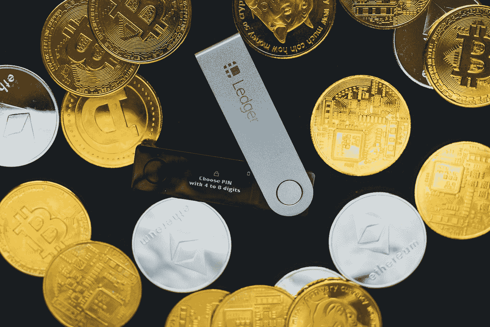
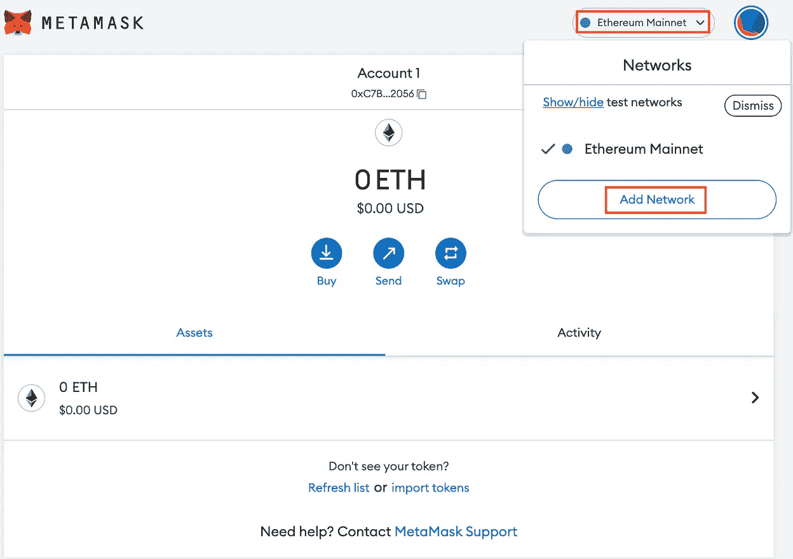
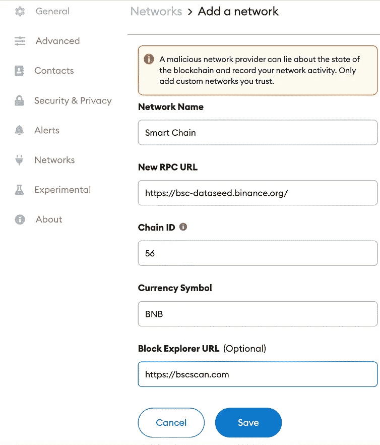
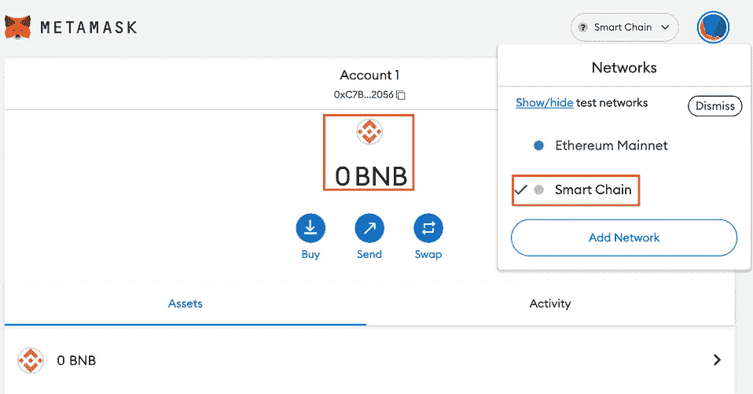
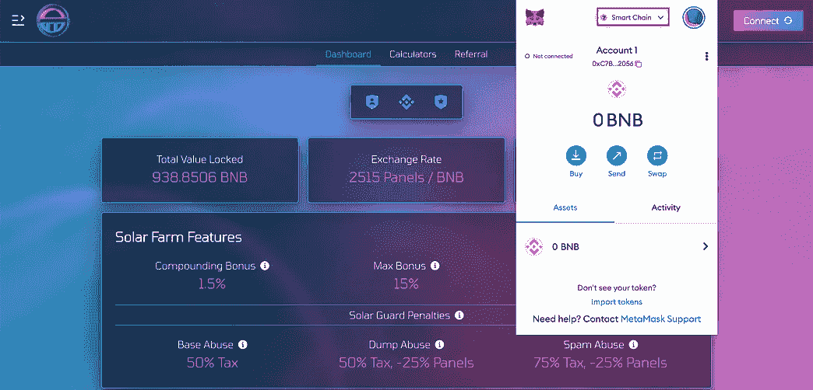

# 设置元掩码-添加网络

> 原文：<https://medium.com/coinmonks/metamask-101-adding-binance-smart-chain-bsc-900f8744ba0?source=collection_archive---------11----------------------->

## 第 2 部分—如何在 MetaMask 上添加类似币安智能链(BSC)的网络。

Photo by [regularguy.eth](https://unsplash.com/es/@moneyphotos?utm_source=medium&utm_medium=referral) on [Unsplash](https://unsplash.com?utm_source=medium&utm_medium=referral)

恭喜你。您已经通过了设置元掩码的第[部分 1](/@Crypto_Auto/setting-up-metamask-2765a59b56c1) 。在本文中，我将向您展示如何添加任何网络，例如广泛用于 dApps 的**币安智能链(BSC)** ！

第 2/3 部分

## 步骤 1:元蒙版

要在 MetaMask 上添加网络，我们首先需要下载并安装 MetaMask！如果您还没有开始阅读设置元掩码的第 1 部分！

 [## 设置元掩码

### 第 1 部分—下载和设置

medium.com](/@Crypto_Auto/setting-up-metamask-2765a59b56c1) 

## **第二步:下载一个 VPN**

浏览时激活您的 VPN。我用[**express VPN**](https://www.xvuslink.com/?a_fid=CryptoAuto)**是因为它的**军用级加密**。是普华永道审核的**，也是**超快的**。但是您可以使用任何其他提供商！我不会选择免费的，因为我们的数据可能会受到威胁。这个世界上没有免费的东西。****

******提示:*** *试用一个月既然有* ***30 天退款保证*** *。如果不喜欢，* ***退款*** *选择其他提供商！***

**如果你确定自己不会受到影响，你可以跳过这一步。**

## **步骤 3:将币安智能链(BSC)添加到元掩码中**

**点击 MetaMask 顶部的下拉菜单，您将看到“**添加网络**”选项。点击它会将我们引导到配置页面。输入与我在下面显示的完全相同的信息。**

********

****网络名称**:智能链
**新 RPC URL**:[https://bsc-dataseed.binance.org/](https://bsc-dataseed.binance.org/)
**链 ID** : 56
**货币符号**:BNB
**Block Explorer URL**:[https://bscscan.com](https://bscscan.com/)**

**复制粘贴就行了！**

**点击“**保存**，你会看到你现在有了币安智能链！现在，每当你进入一个 ***dApp*** 比如 [**SolarFarmV2**](https://app.solarfarm.finance/?ref=0x01214f2487dDd5f1532D82C2E7497B395e69c388) 的时候，一定要确保你在它指定的网络上。否则，您将无法**连接**您的钱包。**

********

**这不是结局！是的，我们可以添加网络和它的真棒。但是如果我们看不到我们的代币，那有什么用呢？**

**在第 3 部分中，我将教我们如何在指定的网络上添加令牌！**

**阅读第 3 部分—(如何添加令牌)到元掩码:**

**即将发布。**

***如果你觉得这篇文章有帮助，*👉 ***跟着*******拍手👏*******共用*** 👐*和你的朋友一起吧！*****

****请随时打电报给我(@The_Crypto_Auto)。****