# 元掩码和 CIC 链设置

> 原文：<https://medium.com/coinmonks/metamask-cic-chain-setup-5aebd0daaab2?source=collection_archive---------6----------------------->

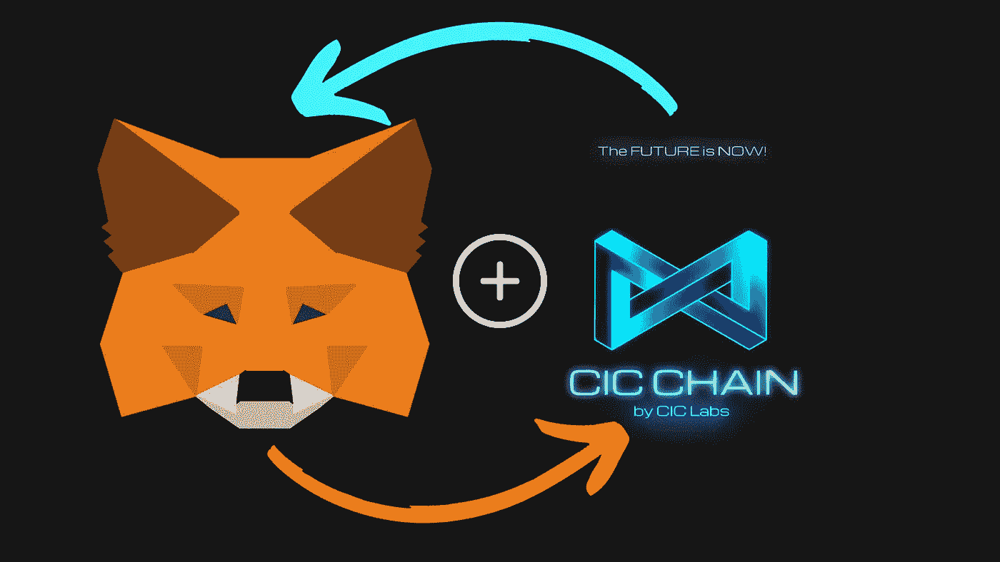

CIC(发音为 Kick)链是新推出的混合第 1 层区块链，完全兼容 EVM。钱包支持仍然是最受欢迎的加密钱包，但在此期间，你可以使用官方的 CIC 钱包(目前仅适用于 android)或 MetaMask 钱包。metaMask 的一个独特功能是它对硬件 wallets Trezor、Ledger、Lattice、Keystone 和 AirGap Vault on extension 的独特支持，以及对 Keystone 的移动支持。MetaMask 也有一个浏览器扩展和 IOS 和 Android 的移动应用程序，并允许您浏览分散的 web 或访问分散的应用程序。在本教程中，我将向您展示如何将 CIC 区块链添加到 MetaMask wallet。

*   所使用的钱包仅用于演示，不得用于除演示目的以外的任何用途*
*   所有说明都是相似的，出于本教程的目的，我们将安装 MetaMask browser 作为 web 浏览器扩展。苹果和安卓设备上的说明是类似的。

## 第一步

从 Android Market Place、iTunes App Store 或他们的网站([此处为](https://metamask.io/download/))下载并安装 MetaMask Wallet。

*   为 IOS 设备安装元掩码(参见上面的链接)
*   为 Android 设备安装[元掩码](https://play.google.com/store/apps/details?id=io.metamask)
*   [为网络浏览器](https://chrome.google.com/webstore/detail/metamask/nkbihfbeogaeaoehlefnkodbefgpgknn) (Chrome 浏览器)安装 MetaMask

## 步骤 2 —将元掩码安装为 Web 浏览器扩展

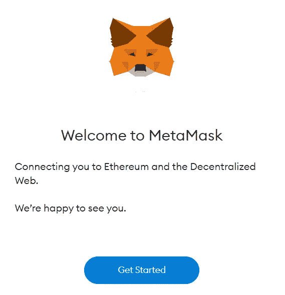

成功安装 MetaMask 作为 web 浏览器扩展后，您将看到一个提示，显示上图中描述的内容。选择“开始”开始。

## 第三步

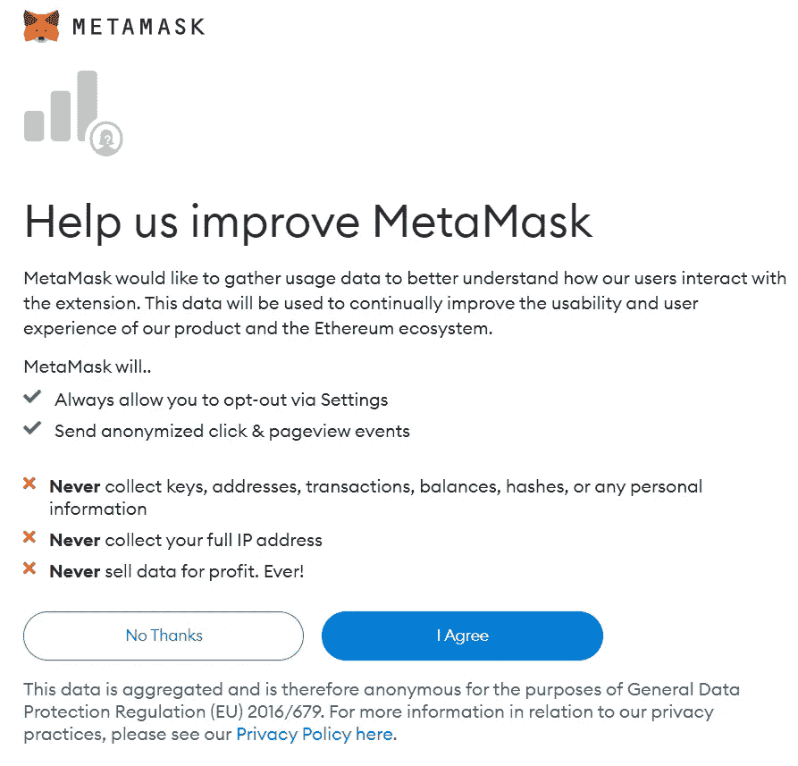

如上图所示，提示使用使用数据来帮助元掩码。这是完全可选的，是你的选择。选择后，我们可以前进到第 4 步。

## 第四步

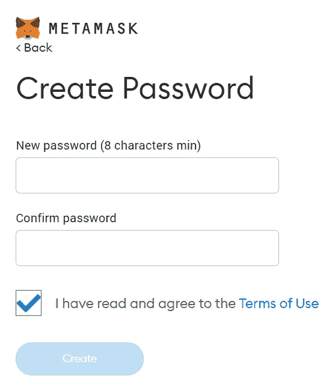

现在，我们需要创建一个长度至少为 8 个字符的唯一密码。你可以使用数字、字母和特殊字体。在“新密码”字段中成功输入密码后，在“确认密码”下的字段中重新输入密码。阅读 MetaMask 使用条款免责声明后，选中复选框，然后在完成后选择创建。

## 第五步

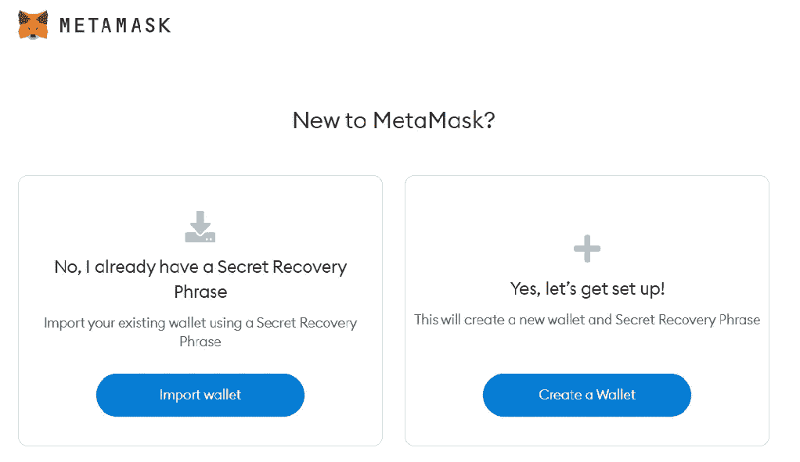

将元掩码设置为新钱包的任何人都将单击创建钱包。任何从信任钱包或任何其他钱包导入钱包的人，您将选择导入钱包。您将需要您的种子短语来导入您的钱包。在本教程中，我们将创建一个新的钱包。除了导入一个钱包和创建一个新钱包之外，步骤不会有太大的不同。一旦你选择了创建一个钱包，下一个提示将会有一个关于你的钱包的安全和你的种子短语或者更确切地说是秘密恢复短语的视频。请在继续下一步之前观看。下一页将是这样的…..

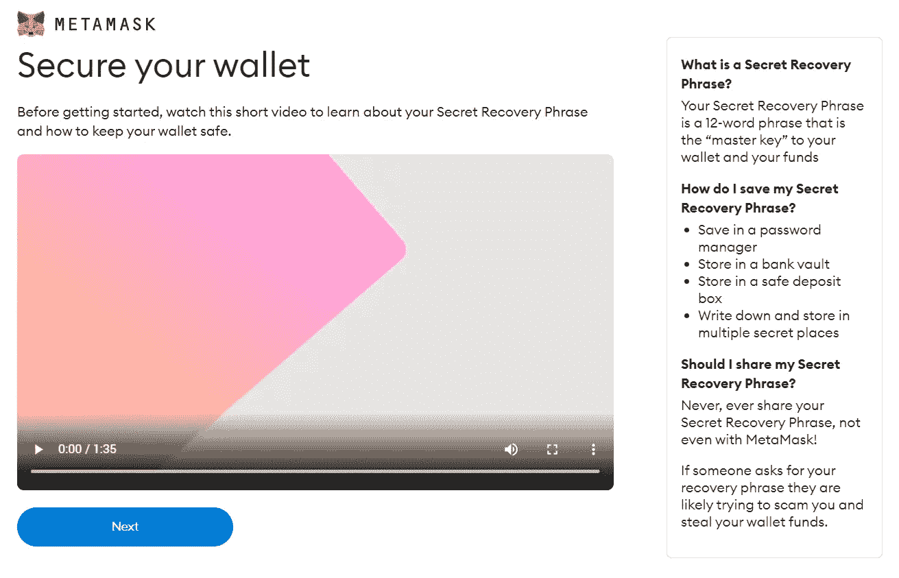

## 第六步

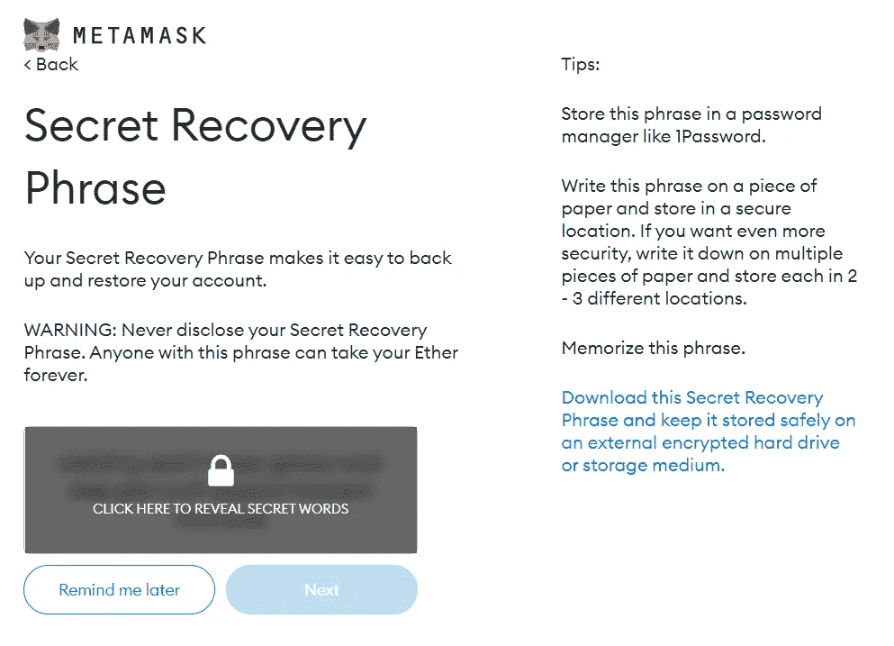

在此屏幕上，您将看到您的秘密恢复短语。灰色部分是你需要写下并存放在安全地方的 12 个单词。使用鼠标选择该区域，以显示您的秘密恢复短语。你将需要这 12 个单词，按照它们出现的顺序排列。一旦你写下它们，你可以点击下一步按钮。

## 第七步

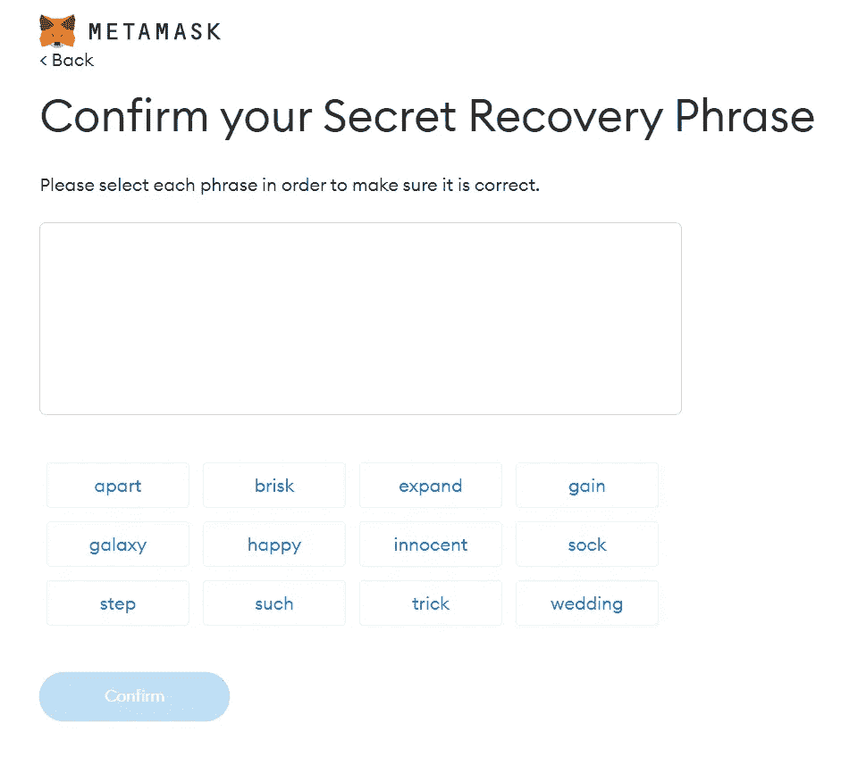

现在你需要按照你看到的顺序输入你写下的单词。这一步是至关重要的，以确保您有正确的秘密恢复短语写下来，并备份。正确输入单词后，点击确认。

## 第八步

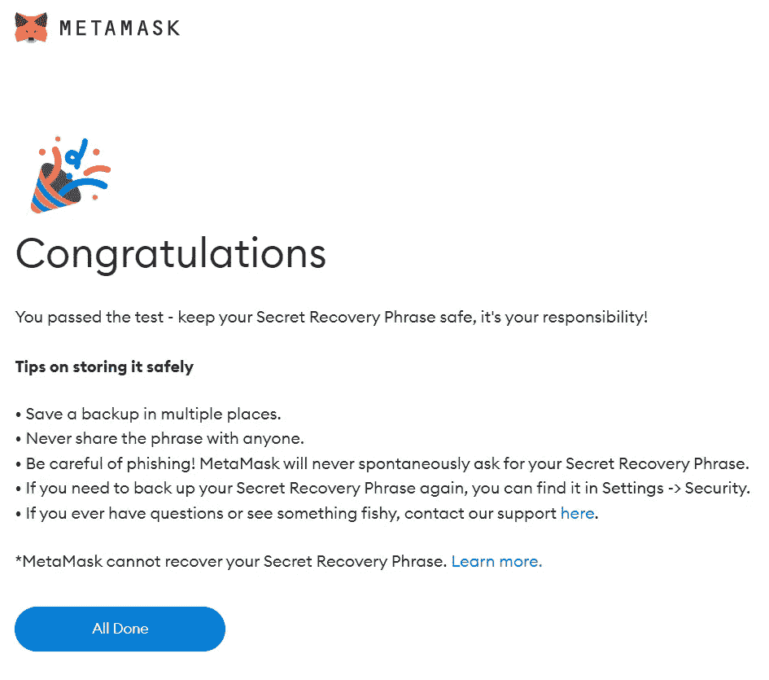

如果您正确输入您的秘密恢复短语，您将会看到如上所述的祝贺消息。接下来，单击“全部完成”,您的新元掩码钱包将显示出来，如下所示…..

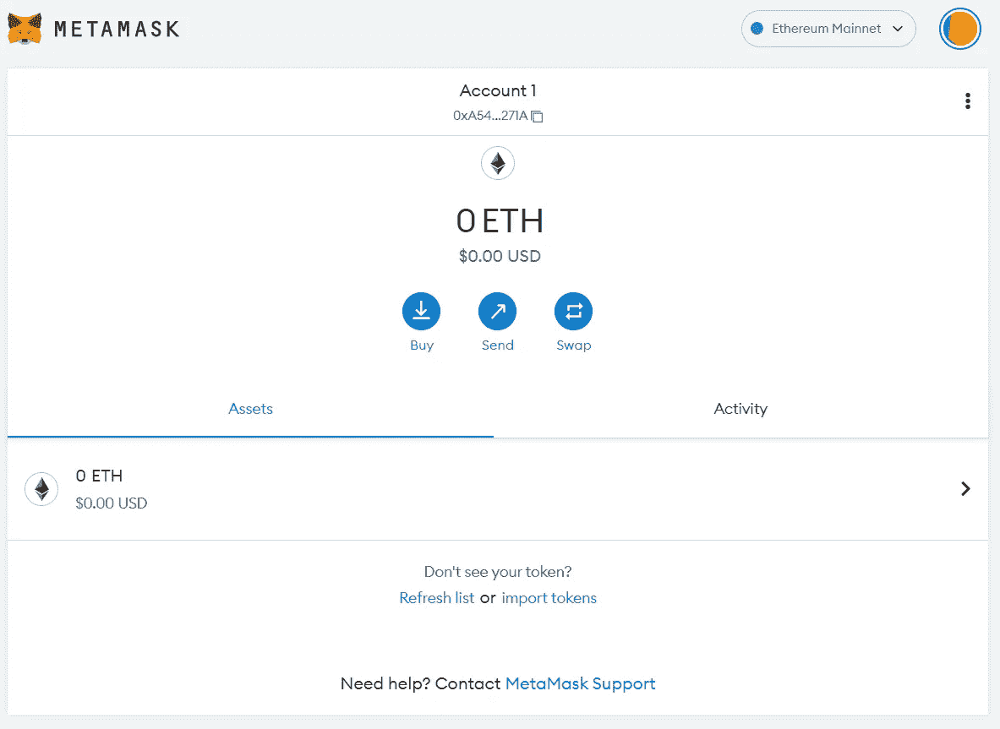

## 第九步

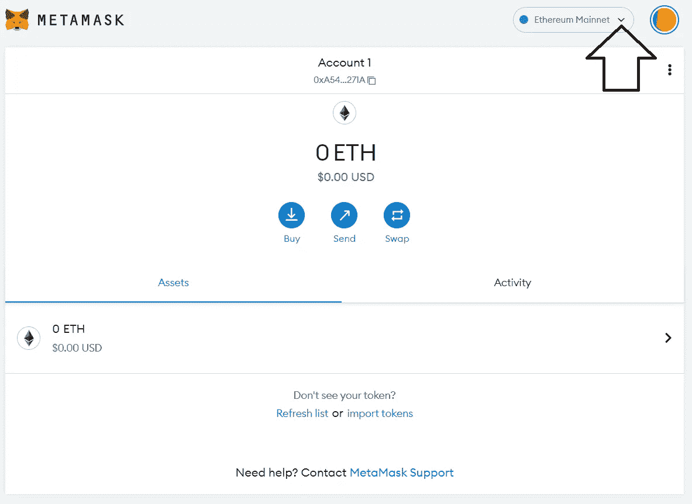

选择以太坊主网旁边的向下箭头。

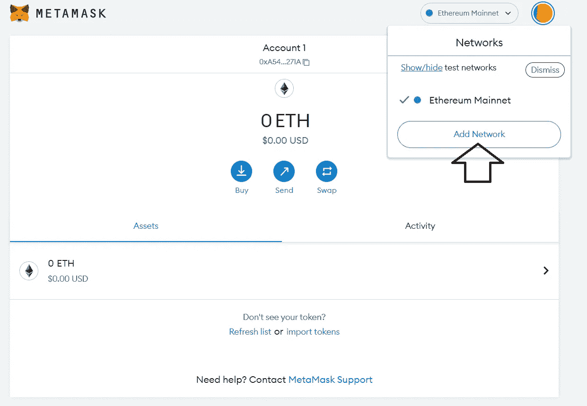

然后选择添加网络。

## 第十步

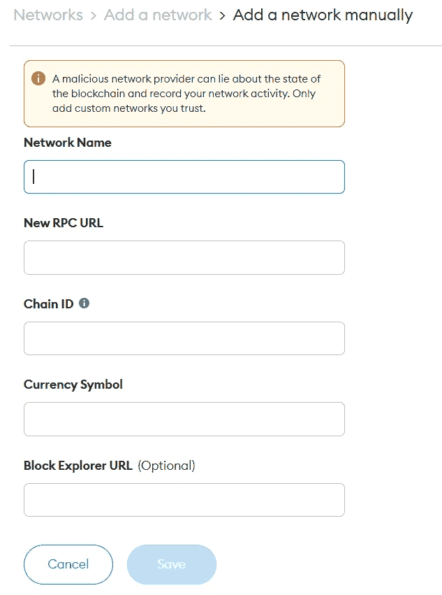

我们将在这里输入 MetaMask 访问 CIC 区块链所需的数据。至关重要的是，所有数据都进入正确的字段，并且准确无误。您将输入的数据是…..

网络名称
CIC 链

RPC 网址
https://xapi.cicscan.com/ T2

连锁 ID
1353

符号
CIC

阻止浏览器网址
[https://cicscan.com](https://cicscan.com)

一旦输入正确，它将看起来像这样…..

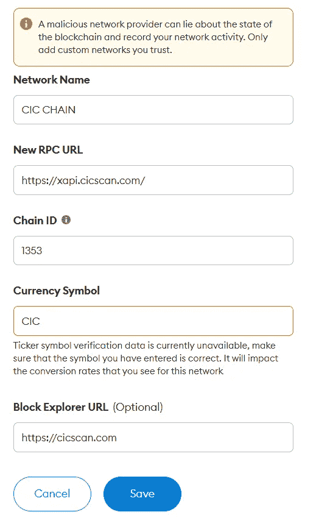

如果一切看起来都很准确，那么选择 save。下一个屏幕将是这样的…..

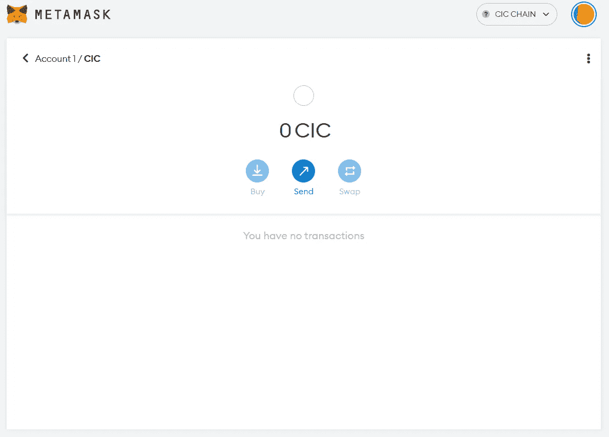

恭喜您完成所有操作，并正式使用 MetaMask Wallet 设置您的 CIC Wallet。

> 交易新手？尝试[加密交易机器人](/coinmonks/crypto-trading-bot-c2ffce8acb2a)或[复制交易](/coinmonks/top-10-crypto-copy-trading-platforms-for-beginners-d0c37c7d698c)