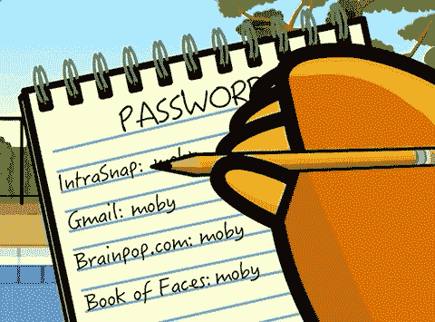

# 我如何在几秒钟内提取我的元掩码种子短语。

> 原文：<https://medium.com/coinmonks/metamask-hack-f4b13029de64?source=collection_archive---------0----------------------->

# 以及您应该采取哪些步骤来阻止攻击者使用该方法来利用您。

Photo credits Shonin / MidJourney

加密领域的“老话”是“不是你的钥匙，也不是你的钱包”，在 FTX 窃取用户资金的灾难性后果之后:可以理解的是，许多集中交易的用户开始担心，并将资金转移到自己的钱包里。

明智之举。

…但这让我开始思考。

我已经将资金从我的 CEX 钱包(一个我不知道私钥的钱包)转移到我的 Metamask 钱包，现在我的资金有多安全？考虑到在技术上不可能用消费或商业硬件破解一个独特用户的私钥或种子短语，我发现答案在某些情况下并不十分安全。

Credits Shonin / midjourney

## 关于我的一点点…

我是 Shonin，我开发了一个叫 NinjAi 的电报机器人。
它使用人工智能来阻止 Telegram 社区中的突袭、虚假 shill 帐户和垃圾邮件，甚至在它们发生之前——同时利用其功能使群组成为更好的闲逛场所。

我从很小的时候就开始接触电脑，但是当我在很多个月前下载了我的第一份回溯 5 的时候，我真的爱上了它们。
学习如何侵入我的无线网络和恶作剧我的朋友让我着迷。对我来说，在温暖的 Linux 终端上看到滚动的文本墙是最酷的事情。

(我保证，我会带着所有这些东西去某个地方)
我能够写出你即将看到被执行的 120 行 Python 代码——并把它变成可能毁掉某人生活的东西。
几周前，SBF 偷了我所有的积蓄，毁了我，所以我知道这有多令人心碎。
我更愿意把我的发现告诉你们，这样黑客就更难破坏你们的生活了。

## 但是首先:

如果你精通技术，使用密码管理器，不要使用自动填充(尤其是对你的密码管理器)，为你的 Metamask 钱包设置一个完全唯一的密码——你已经受到保护，这篇文章不适合你。继续杀戮吧，女王。
也就是说，如果你是一名 Metamask 用户，攻击者仍然可以获取你的哈希，并在本地用 GPU 攻击它。

And that includes upper/lowercase, numbers and symbols. Source — tomshardware.com

## 你使用自动填充吗？

你知道:每个浏览器都有这个超级方便的功能？这个可以保存你所有的电子邮件地址，密码，信用卡信息，你经常使用的网站等等？我曾经是这样，直到有一天我发现提取这些信息并将其发送给攻击者是如此的容易。

Relax, don’t do it.

还记得我说过的那 120 行代码吗？

我可以将这些用户名、密码和它们来自的网站发送到我的 c2 服务器，然后以纯文本的形式发送给我自己，其中包含 30 行代码——以及我曾经使用过该功能的几乎所有网站。
当我看到所有这些网站的证书都以明文形式列在我眼前时，我感到非常震惊。

还记得我说过这种攻击只在特定条件下有效吗？

这是其中之一…所以**规则第一条**如果你想保证你的密码安全，就要用方便换取安全，永远不要使用自动填充…就像…永远不要。在你继续阅读这篇文章之前，先把你电脑里的那些垃圾清除掉。

**规则二**永远不要使用你之前通过自动填充保存的密码作为你的元掩码密码。这是一个巨大的禁忌
虽然对你来说使用相同的密码可能非常方便:但总有一天**会回来咬你的屁股。
下面我来解释原因。**

## 但是首先…

这是正在进行的攻击-

(don’t bother using this seed by the way. I don’t have any money in there)

我不会公开分享这段代码，因为一些脚本小子可能会利用它来攻击无辜的用户。
就像我睡过的第一个女孩——你只得到小费……和报酬。
我已经在这里解释了攻击的方法，我很不擅长写代码，所以很容易复制……但是令人惊讶的是，获取这种高度敏感的信息实际上是 Metamask 的*特性*。

我在这里的目的是告诉你如何保护自己，这样就没有人可以用这种方法攻击你。

That’s me under there, m’lady. Credits Shonin / MidJourney

## 元掩码的“问题”…

类似于获取浏览器的自动填充凭证的问题…敏感信息总是位于每个人的相同位置，否则，唯一的计算机。这使得在我的电脑上抓取就像在你的电脑上一样容易，无论是 Windows、Mac 还是 Linux。

对于攻击的第二阶段:我拿起我的元掩码散列。这个文件包含了我的加密钱包的主要内容。
为了从这个加密的、看似随机的数字和字母串中提取种子短语:需要用…你猜对了-
你为元掩码钱包设置的密码来解密。
启动电脑时登录钱包时使用的密码。

元掩码允许你相对容易地找到这种完全良性的、合法的和*公认的*方便的措施(但只有在你是白痴的情况下才方便),比如说，如果你的浏览器损坏了，你不能再在你的电脑上打开 Chrome 浏览器。
如果你没有保存你的种子短语或私钥(这应该是规则 1，但我猜它会是**规则 3** ) 那么这个文件，藏在你的 chrome/firefox/brave extension 配置文件中，可能是拯救你的培根的关键，让你找回你宝贵的屎币。你可能还拿着去年你最喜欢的影响者扔掉的那些垃圾硬币。你可以在这里阅读更多关于这个绝对愚蠢的功能。通过公开这个选项，它降低了那些费心安全地保存他们的密钥和种子的人的安全性。

我个人认为这个选择是一个巨大的错误。
保证你的种子短语安全，跟踪你的私人密钥并应用**最基本的加密安全基础**应该被强制灌输给人们，并完全停止他们编写这个特性的需要。

如果你做了上面的事情，你的浏览器被破坏了？你会做任何正常人都会做的事。
重新安装你的浏览器，重新下载 Metamask 扩展，并导入你被*字面意思是 crypto 中的每个人*告知要用生命保护的私钥或种子短语。

我还没有发现像 Brave wallet 这样的其他基于浏览器的钱包有这个问题，但问题是 Metamask 似乎是 web3 DeFi 的黄金标准，因此它是一个高价值的目标，因为它很受欢迎。
当您访问 web3 网站并尝试连接您的钱包时，大多数其他选项(如 brave wallet)都不受支持。

## 回到攻击…

(我还应该说明的是，部分代码去掉了多余的内容:比如用户名、它们所代表的网站，并且只将自动填充的密码保存在受害者计算机上随机目录中的一个漂亮的格式化列表中，用于以后专门攻击元掩码)
所以现在我已经获得了凭据和散列——是时候运行攻击的第三阶段了。最后阶段。

通过从 Github 导入一个具有 metamask 解密功能的第三方 BTC 钱包解密器，我简单地对从扩展目录中搜索到的 json 运行了被盗自动填充凭证的密码列表。

## 这是我看到的…

If you ever see money in this account — someones probably going to try and dust attack you because I didn’t put any crypto in there.

我的种子短语。就在我的控制台日志上——准备好上传到我的 c2 服务器。

# 那么…您能做些什么来避免这种类型的攻击呢？

# 第一件事…

## 不要相信人。

我建议永远警惕其他人。这些攻击不是偶然发生的:它们的发生是因为一些恶意实体希望它们发生，他们挑选出你作为他们的目标。
不要点击不可靠的链接，不要下载粗略的 PDF，不要下载。exe，。dmg 或者。未签名的 apk 文件。不要被假冒的社区管理员欺骗，他们会让你去那些不可靠的网站(如果有管理员来检查他们的合法性，一定要检查他们的群组)

不要让咖啡店里的辣妹/帅哥用你的笔记本电脑给他们的手机充电，不管她们看起来有多绝望。

如今，你可以给笔记本电脑配备一个[外观无害的手机充电器](https://hak5.org/collections/omg-row2/products/omg-cable?variant=39808315818097)和一个一行 Powershell 脚本，它执行复杂命令的速度比你看咖啡和搅拌牛奶或糖的速度还快。
相信我，我有一根电缆，速度很快。

The USB end of this cable acts as a keyboard to remotely inject keystrokes on whatever you plug it into — be it a phone, Windows machine, Mac or Linux box, contains a WiFi card that creates a hotspot with a 2km range and a full browser interface, scriptable websocket, space for 8 payloads, a keylogger, geofencing capabilities and self-destruct capabilities

[https://www.youtube.com/watch?v=Y1xzkHOWFkA](https://www.youtube.com/watch?v=Y1xzkHOWFkA)

如果你非常想和异性聊天，下载 Tinder，独自去或者随身携带一些壁式充电器。你甚至可以[从 hak5](https://hak5.org/products/malicious-cable-detector-by-o-mg) 买一个 O.MG 电缆探测器，以防这种罕见的情况发生在你身上；)

这种攻击将被归类为多阶段攻击的一部分:攻击的第一部分是攻击者获得您计算机上具有管理员权限的反向 shell。这可以通过许多方法完成，通常由我上面列出的社会工程攻击来实现，所以请记住，这是那些人最初获得访问权限的方式。

# 第二件事…

## **不要使用自动填充。永远不会。**

用便利换取安全，尤其是如果你把存款放在那台机器上。令人吃惊的是，获取你的每一个密码和电子邮件地址是如此容易，因为它们都保存在你的本地存储器中。它们也非常容易解密。我说的是几毫秒之内从乱码、混乱的文本变成干净、清晰的纯文本。

# 第三件事…

## 独一无二。

看在上帝的份上…把你该死的密码弄混。不要以为你有一个由 30 个大写/小写字符、数字和符号组成的安全密码就意味着你是安全的。如果你在每个网站都使用这个密码，你只需要出错一次。
正如爱尔兰共和军对撒切尔夫人说的一句名言:

## “我们只需要幸运一次。你需要时时刻刻保持幸运”

一旦你使用它的网站被入侵，或者你是网络钓鱼攻击的受害者…恭喜你，你的用户信息在一些暗网市场上或在攻击者的手中，对你的社交网站、电子邮件、银行或电话提供商进行攻击。如果每个网络应用都有一个单独的安全密码对你来说不方便，你会喜欢第四件事。

# 第四件事…

## 使用密码管理器。

它们便宜、有效、安全、方便，正是您需要保护的东西。
我从[看守人](https://www.keepersecurity.com/en_GB/)那里捡的。它每年花费我大约 30 美元，它绝对是我的救星。
我不仅总是忘记登录某些网站，而且永远不得不使用“忘记密码”功能——我还忘记了我曾经使用过哪些网站，或者为某些项目创建了一个账户。
通过使用 [Keeper](https://www.keepersecurity.com/en_GB/) ，我发现将所有这些信息放在一个整理好的列表中，并为我的每个项目或需求(银行、社交网站、我控制的网站等)建立文件夹，这绝对改变了我的工作效率，更不用说我的安全了。

## 但是把你所有的密码放在一个地方是不安全的

不不不是的。
2fa、自毁模式、仅离线访问选项、自动注销和安全密钥功能在这个想法链上被称为扯淡。如果一个攻击者设法在你身上安装了一个键盘记录器:到那时游戏已经结束了。这是为了在那种情况发生之前保护你。即使你不幸成为键盘记录器的受害者，你仍有希望。

# 第五件事…

## 混合起来。

即使你正在使用你新奇的密码管理器，有人设法破解了你的机器并获得了访问权…只是让他们更难而已。
没有什么可以阻止你添加其他独特的东西，这些东西只存储在你大脑的开头、结尾、三个字符或它创建的随机生成的密码的任何地方。
比如说我的密码管理器生成了这个密码；

> ig)祖？j4gJf1pk96Z+M)

huh huh… sextillion

很安全，对吧？
极难破解…
但如果有人神奇地获得了你的密码管理器的访问权限，那就没用了。没有什么能阻止他们复制这个密码并用它来对付你。我们如何解决这个问题？就像我们一直做的那样…让他们为此付出汗水。
如果我知道这个密码是给 Google 用的，我还能留着
ig)Zu？j4gJf1pk96Z+M)密码管理器中的部分密码，但只是在我的脑海中保留额外的内容，并在我将它粘贴到比如说 Google 时添加那些独特的字符，就像这样:

I’ve added “Goo” to the beginning and “Gle” to the end

> ig)祖？j4gJf1pk96Z+M)

相对

> Gooig)Zu？j4gJf1pk96Z+M)Gle

当然，实际上不要使用这种精确的方法——根据你自己的个人喜好混合使用。即使你的电脑上安装了键盘记录器，但如果你用鼠标点击缺口，它是否足够成熟到知道你在密码串的什么地方写了额外的东西，这是值得怀疑的。然而，键盘记录器能够看到你按了多少次箭头键。
(我不推荐显示密码功能，因为他们也会截图)

# 总结:

我希望这篇文章能让你明白我找到的获取宝贵的 seed 短语的方法之一。
如果你喜欢它，请不要犹豫给我一个关注，或者如果你是像我一样的隐姓埋名者——你应该在 NinjAi 加入我们。我们计划通过添加超级先进的人工智能，更多的功能和主要关注保护 DeFi 社区来逐步淘汰旧的咸海狗玫瑰。

我期待在我们的社区见到你。

来自 Shonin @ https://ninj.ai 的爱

> 交易新手？尝试[加密交易机器人](/coinmonks/crypto-trading-bot-c2ffce8acb2a)或[复制交易](/coinmonks/top-10-crypto-copy-trading-platforms-for-beginners-d0c37c7d698c)