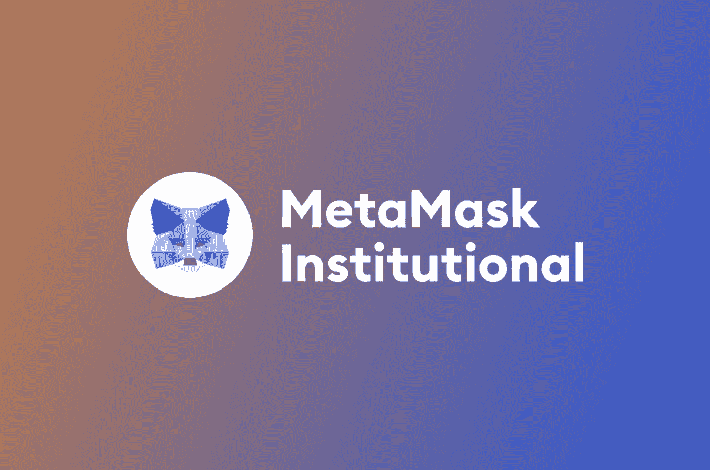

# MetaMask institutional —金融机构的强大工具

> 原文：<https://medium.com/coinmonks/metamask-institutional-a-powerful-tool-for-financial-organizations-36f7e766b708?source=collection_archive---------34----------------------->

全球最大的区块链软件技术公司之一 ConsenSys 正在构建以太坊区块链基础设施，支持开发人员、公司和个人构建应用程序、创建新的更快的金融结构以及访问分散的 web。他们负责六个项目，鼓励开发者访问以太坊并在其上构建。