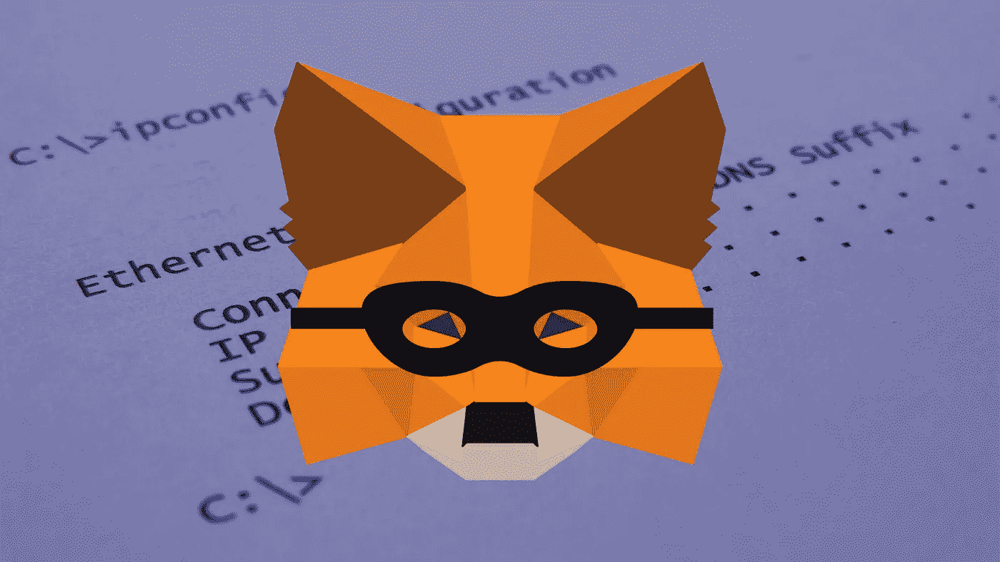

# MetaMask 存储用户 IP 和钱包地址。这样做是为了避免被跟踪。

> 原文：<https://medium.com/coinmonks/metamask-stores-user-ips-and-wallet-addresses-do-this-to-avoid-getting-tracked-231d5265a0a5?source=collection_archive---------0----------------------->

11 月 23 日公布的一份修改后的隐私协议称，MetaMask 将在链上交易中收集用户的 IP 和以太坊钱包地址。这意味着什么，你可以做些什么来避免被跟踪。

MetaMask 是目前市场上最受欢迎的自保管钱包之一，月活跃用户超过 2100 万…