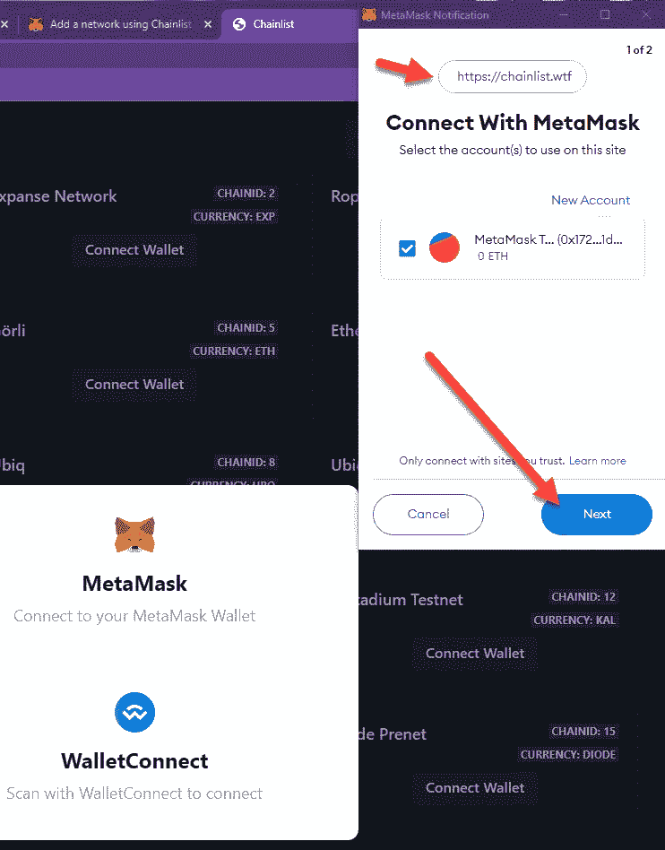
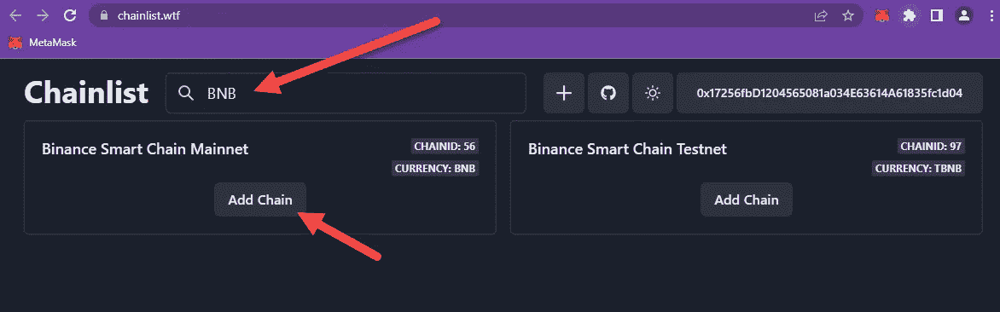

# 元蒙版的正确方法:一步一步的指南

> 原文：<https://medium.com/coinmonks/metamask-the-right-way-a-step-by-step-guide-76716bb608fc?source=collection_archive---------9----------------------->

进入加密定义空间的新用户经常遇到的障碍是元掩码钱包。有很多困惑和半生不熟的指南围绕着这个钱包的选择，所以我觉得有必要做一个全面的指导，如何安装，设置和使用它，这样你就可以得到最好的 Defi 和真正的加密。

毫无疑问，MetaMask 是最受欢迎的网络浏览器扩展之一，它可以用来存储以太坊和许多其他的 [ERC20 令牌](https://www.investopedia.com/news/what-erc20-and-what-does-it-mean-ethereum/)。该扩展可以免费下载，您可以在各种浏览器上使用它。它也非常安全，虽然我稍后会谈到这一点。

我更喜欢使用 Chrome 版本，但这只是因为 Chrome 是我的首选浏览器。

## 在您选择的浏览器中安装元掩码

我将在 Chrome 网络浏览器中演示 MetaMask 的安装和使用，但如果 Chrome 不是您的选择，您可以从这里获得 3 个主要浏览器的 meta mask:

铬:[元蒙版](https://chrome.google.com/webstore/detail/metamask/nkbihfbeogaeaoehlefnkodbefgpgknn)

火狐: [MetaMask](https://addons.mozilla.org/en-US/firefox/addon/ether-metamask/)

边缘:[元蒙版](https://microsoftedge.microsoft.com/addons/detail/metamask/ejbalbakoplchlghecdalmeeeajnimhm)

如果当你阅读本指南时，上面的链接不起作用，只需在谷歌中搜索 Metamask。出于我的目的，我点击了上面的链接，这是你接下来会看到的。

接下来，你应该点击添加到 Chrome(或任何你正在使用的浏览器)并选择**“添加扩展”。**

Chrome 会做一些检查，然后你就会进入这个页面。

点击上面的**“开始”**，接下来您将看到此页面。

此消息是可选的，由您决定。我点击**“不，谢谢”**，然后你会看到这条消息。

出于我们的目的，我希望你选择**“创建钱包”**。如果您已经有一个钱包，并且您有种子密钥(秘密恢复短语)，您可以选择“导入钱包”并恢复您的钱包。

> **永远不要把你的密钥或恢复短语给任何人**

我想在这里补充一点，如果你泄露了你的密钥短语，骗子或黑客会选择这一步将你的钱包恢复到他们的机器上，从而窃取你所有的加密令牌。关于这一点，我在这里提及它是谨慎的。

> **永远不要把你的密钥或恢复短语给任何人**

这就像给他们你银行账户的钥匙。但是我稍后会更详细地介绍这一点。

点击**“创建”**后，您将会看到下一个屏幕。

在这里选择一个安全的密码，但也是一个你能记住的密码。一旦您输入了密码并选择了 T&Cs MetaMask，就会向您显示此视频。值得你去看。

一旦你点击 MetaMask 上方的**“下一步”**按钮，你就会看到这个屏幕。

这是一个非常重要的屏幕。我要你点击这条信息。

> **点击这里揭示您的秘密恢复密钥**

然后将它和您选择的密码一起写下来。不要将您的密码或密钥保存在您的计算机上。暂时先把它们写下来。

这是我的。

我把我的弄模糊了，提醒你不要把这个短语给任何人看，永远不要！

> **永远不要把你的密钥或恢复短语给任何人**

总之回到文章。一旦您透露并**写下**您的秘密短语，请点击**“下一步”**。然后 MetaMask 会向您显示这个屏幕，以确保您确实记下了它。

按照指示，将单词按正确的顺序输入到提供的框中。

输入单词后，点击**“确认”**按钮。接下来你应该看看这个。

点击**“全部完成”**将跳转到此页面。

安装得很好。你可以在这个 web 浏览器窗口中使用 MetaMask，但是你也可以把它作为一个小部件来使用，我将在下面向你展示。

## 固定元掩码扩展

如果你在 Chrome 浏览器的右上方看，你会看到这个小图标。

我想让你点击它，接下来你会看到这个。

按下我用箭头标出的小大头针图标，把它变成蓝色，MetaMask 就会出现在你的 Chrome 扩展工具栏中，就像这样。

现在，您可以使用扩展小部件访问 MetaMask，我将在下一步添加资金和其他 ERC20 令牌主链时介绍这一点。

## 重命名元掩码帐户

在我们继续添加 ERC20 链到你的元掩码账户之前，我想告诉你如何重命名它。单击小部件图标打开 MetaMask，您会看到我的帐户名为 Account1。

选择右边的三个垂直圆点汉堡菜单。

然后点击**“账户详情”**，你会看到这个。

在这个屏幕上，你可以看到你的钱包地址的二维码，也可以看到为你写的钱包地址，在我的情况下是。

> **0x 17256 FBD 1204565081 a 034 e 63614 a 61835 fc1d 04**

不过，我希望您单击钢笔图标，这样我们就可以将帐户重命名为更容易记住的名称。

将其重命名为您想要的名称，然后单击勾号图标保存更改。一旦完成，你可以点击 **X** ，你将回到小工具的主进入窗口。

## 将 ERC20 链添加到元掩码

MetaMask 从添加以太坊开始，但在这一节，我想介绍添加其他主链。现在你可以手动完成，但是最简单的方法是使用 [Chanlist.wtf](https://chainlist.wtf/)

前往链表，选择连接钱包，就像这样。

这个窗口将会弹出。

在此选择元掩码。您的 MetaMask 小部件将会打开，并显示它想要连接到链表站点。你应该在这里按下一步。

元掩码现在想要连接。有一个小消息警告你只能连接到你信任的站点(稍后会详细介绍)，但为了我们的目的，请按连接按钮。

就是这样，我和这个钱包地址有联系。

您不需要将所有这些网络添加到元掩码中。可以考虑使用的主要方法如下

*   BNB 连锁/理学学士
*   多边形
*   雪崩
*   仲裁
*   乐观
*   手掌
*   幽灵
*   和谐。

出于本指南的目的，我将使用链表添加以下内容。

*   BNB 连锁/理学学士
*   多边形
*   雪崩
*   幽灵

回到链表，你可以向下滚动，寻找这些，或者你可以使用顶部的搜索栏。让我们试试 BNB。

现在你只需选择**“添加链”**，你的 MetaMask 小工具将弹出如下消息供你同意和批准。

选择此消息上的批准，您将在下面看到此消息。

你看到这个的原因是你现在在钱包里的以太坊链上。只需选择**“切换网络”。**

正如您所看到的为我们列出了交换网络的链表，同时将 BNB BSC 网络添加到 MetaMask 中。

现在，您可以返回链表，将其他网络添加到元掩码中，直到您添加完所有要使用的网络。我的现在看起来像这样。

您不**也不**需要将多个网络添加到元掩码中。根据您感兴趣的令牌或项目，只添加您想要使用的令牌或项目。

您可以手动将这些链添加到 MetaMask 中，MetaMask 本身有一个[强大的向导](https://metamask.zendesk.com/hc/en-us/articles/360043227612-How-to-add-a-custom-network-RPC#h_01G63GGJ83DGDRCS2ZWXM37CV5)，您可以在这里找到向您展示如何操作。

**向元掩码添加令牌**

现在我们已经安装了 MetaMask，并且添加了一些主链，是时候开始添加令牌了。有多种方法可以做到这一点，但我使用的一种方法是转到 [CoinMarketCap](https://coinmarketcap.com/) 并搜索令牌并从那里添加它。

正如你所看到的，我搜索了滴漏，这是我最喜欢的项目之一。

现在需要注意的是。

许多令牌都有相似的名称。当你对一个令牌或项目感兴趣时，查看项目页面，看看图标看起来像什么是明智的。然后，当您搜索硬币(令牌)时，您可以确保您实际上将正确的硬币添加到元掩码中。

如果我们看看滴页，我们可以得到一个图标等的想法。

如果你对[滴滴项目](https://drip.community/faucet)感兴趣，可以随意使用我的主钱包地址作为你的好友地址。要加入滴滴，你必须有一个好友。我自己发展了这个账户，现在我可以向所有使用我的好友链接加入的人空投物资。

当你加入的时候在这里使用这个链接。**(请勿使用我为撰写本指南而创建的钱包地址)！**

**这是我的滴滴项目好友链接:**

滴滴.社区/水龙头？buddy =**0x 1511093 a 940 a 12 f 6593 CFB 886 e 7 AC 4 ea 95 ADF 5 ab**

稍后我会写几篇关于 Drip 本身的文章。

不管怎样，现在我们知道了 drip 的样子，让我们回到 Coin Market Cap，从搜索结果中选择项目。

我已经用箭头给你标出了你要找的东西。要添加滴液到你的元蒙版，你可以复制这个链接，或者你可以点击元蒙版头图标，这就是我要做的。

您可能会收到此消息，在这种情况下，请转到元掩码，将网络更改为右链，在这种情况下是币安。

现在再次点击头部图标，你会看到这个。

只需在这里选择 add token，我们就可以看到已经添加了 Drip。

您可以使用任何想要添加的令牌来完成此操作。只要记住在 MetaMask 中的令牌链中，否则你将总是被要求切换网络(链)。

如果您知道合同地址，您可以手动添加令牌，MetaMask 将在本指南[中再次向您展示如何添加令牌。](https://metamask.zendesk.com/hc/en-us/articles/360015489031-How-to-add-unlisted-tokens-custom-tokens-in-MetaMask)

## 安全性和不被黑客攻击

我现在想谈谈你的钱包安全和人们丢失密码的典型方式。

**下载骗局版元蒙版**

这种情况有点罕见，但确实发生了。请始终确保您下载的是正确版本的 MetaMask，并且您不在某些骗子的网站上。MetaMask 的官方网站是

[https://metamask.io](https://metamask.io/)

或者你可以从一个网络浏览器商店安装它，这就是我在本指南中所做的。

## 暴露你的种子短语

到目前为止，这是人们被黑客攻击并丢失钱包和里面所有密码的最常见方式。甚至我多年来一直被我反复告诫不要这样做的伴侣在一个晚上也这样做了。它发生了。

一些提示:

不要把你的种子短语(秘密关键词)存储在你的手机或电脑上。

您可以将其存储在:

1.  写在纸上的保险箱
2.  在安全区域或地下室的 u 盘上，就像 Sandisk 提供的一样(不要忘记密码)
3.  在一个安全的密码管理器中，比如安全笔记中的 Roboform。是的，这是在你的笔记本电脑上，但它是高度安全的一个体面的密码。
4.  写在两张纸上，这样钥匙就可以分开，然后藏在不同的地方(写在纸上的钥匙当然有火灾风险)
5.  使用钢钥匙或类似产品，并隐藏类似[密码钢](https://cryptosteel.com/)或类似产品。

## **黑客获取你种子密钥的各种方法**

不和。我喜欢它，但这是一个猎场，你是猎物。所有项目都有一个不和谐的服务器。当你加入它的时候，你会收到大量私人的 DM 信息，其中一些非常好。他们会向您提供各种信息，听起来非常官方，在某些时候，他们会要求您验证您的 seed 短语。

**没有合法的技术支持或项目所有者会欺骗你！**说真的，不要**回复任何假装支持**任何**给定项目的人。**

> **永远不要把你的种子短语给任何人**

这是一个简单的规则，但即使是我的队友陷入了不和谐的 DM 骗局，叶失去了他所有的资金在 30 分钟内。他加入了 Tavern 项目，并立即得到了一些 DM 的欢迎，并通过了一些“安全”检查。然后，他得到了一个免费空投的“蜂蜜酒”令牌，我们需要的只是你的钱包地址和种子密钥，以发送蜂蜜酒给你。

当他疯狂地打电话给我时，我叹了口气。你无能为力。你不能给任何人打电话。没人能帮你找回密码。他的密码被骗子卖掉并花掉了。

> **永远不要把你的种子短语给任何人**

哦，你的 MetaMask 钱包密码救不了你。那只是在你的笔记本电脑上锁定你的账户。如果我有你的种子短语，我可以在我的笔记本电脑上用我自己的机器密码重新创建你的钱包。

你可以像这样被不和谐的电报欺骗。但是他们都会在某个时候要求你验证你的种子短语。

> **永远不要把你的种子短语给任何人**

## 恶意软件和键盘记录器

当您进入加密空间时，您必须始终确保您的台式机或笔记本电脑免受恶意软件和特洛伊木马的攻击。这是明智的，你的加密笔记本电脑只使用加密，但如果你负担不起这样做，然后尽你所能不去狡猾的网站。肯定没有色情网站！

如果一个骗子设法在你的笔记本电脑或台式机上安装键盘记录软件，他们可以记录你所有的击键。特洛伊木马可能允许骗子访问存储您的密钥的文件，即使您使用了密码，您也可以从下面的指南中看到，它最好是一个安全的密码，而不仅仅是 mark123。

## 诈骗和假冒 MetaMask 交易

这个要复杂得多。一个诈骗网站或项目会让你的钱包连接到他们的网站。是的，所有合法的项目也是这样做的。作为该过程的一部分，你有一个标志信息，该信息允许网站花费无限量的代币。诈骗网站会利用这一点把你的钱包抽到他们自己的钱包里，合法项目不会。

骗子会创建域名与主项目相似的网站。我爱上了其中一个 vPAD 项目的启动。我发了 1 个 BNB 到一个很好看的山寨网站。不完全是一个黑客，但对我来说是一个教训。

你可以浏览这些网站，如果你不确定的话，可以撤销你钱包里的任何许可。

[https://etherscan.io/tokenapprovalchecker](https://etherscan.io/tokenapprovalchecker)

https://snowtrace.io/tokenapprovalchecker[？](https://snowtrace.io/tokenapprovalchecker)

https://bscscan.com/tokenapprovalchecker[？](https://bscscan.com/tokenapprovalchecker)

[https://polygonscan.com/tokenapprovalchecker](https://polygonscan.com/tokenapprovalchecker)？

只需输入您的钱包地址，您就可以撤销该链上的所有连接。

**不要加入虚假项目网站**

## 灰尘袭击

这个很聪明。骗子创造了一个狗屎硬币，然后发送到随机钱包的负荷。我的各种钱包里都有数百万枚这种硬币。这些令牌将与恶意智能合同相关联，当然，如果您试图出售它们或与它们进行交互，您的钱包将会受损。

只有当你把钱包输入区块链探险者网站时，你才能看到这些代币。作为一个经验法则，如果你看到一个新硬币出现在你的钱包里，不要把它添加到你的元蒙版里。先做一些研究吧。诈骗币总是列在某个地方。

我希望您喜欢这篇文章，并对 MetaMask 的使用有所了解。对我来说，只有最后一件事要说:

> **永远不要把你的种子短语给任何人**

> 感谢您花时间阅读我的文章
> 
> 如果你愿意，你可以订阅。我的文章和指南旨在帮助你在这个经常令人困惑的世界中导航。
> 
> 马克@阿尔特

> 交易新手？试试[加密交易机器人](/coinmonks/crypto-trading-bot-c2ffce8acb2a)或者[复制交易](/coinmonks/top-10-crypto-copy-trading-platforms-for-beginners-d0c37c7d698c)