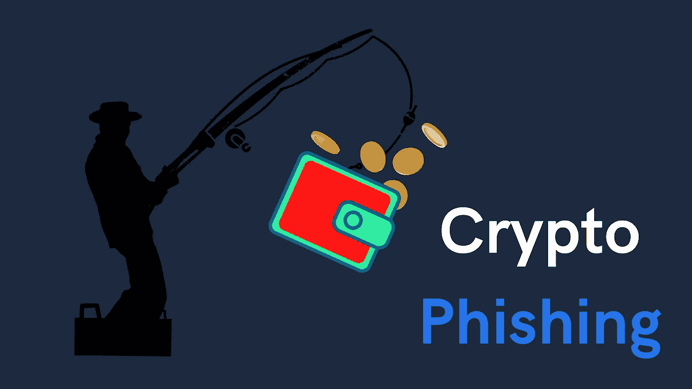
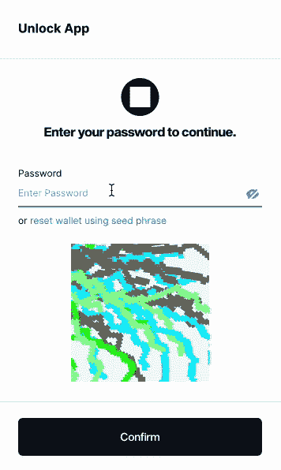

# 元掩码与块钱包:加密网络钓鱼防护选择块钱包的另一个原因

> 原文：<https://medium.com/coinmonks/metamask-vs-blockwallet-crypto-phishing-protection-another-reason-to-choose-blockwallet-555310f8528b?source=collection_archive---------13----------------------->

Crypto Phishing — by ValueFirst with canva

由于加密骗局、黑客和网络钓鱼攻击，已经损失了数十亿美元，而且随着攻击变得越来越复杂，还会损失更多，没有人能够幸免，普通人和专家都会成为受害者。选择合适的钱包可以保护您免受网络钓鱼攻击。

## 什么是网络钓鱼

根据[Phishing.org](https://www.phishing.org/what-is-phishing)的说法，网络钓鱼是一种网络犯罪，其中有人伪装成合法机构，通过电子邮件、电话或短信联系一个或多个目标，引诱个人提供敏感数据，如个人身份信息、银行信息、信用卡详细信息和密码。

> 您只需保持佩戴状态并记住您独特的作品外观，就可以免受网络钓鱼攻击。

这些信息随后被用于访问重要账户，可能导致身份盗窃和财务损失。对于那些意识到网络钓鱼攻击的人来说，这很容易发现，但更复杂的个性化细节攻击可能会让任何人措手不及。

## 一些加密钱包网络钓鱼攻击是如何发生的

钱包的一个众所周知的骗局是，用户被诱骗登录一个假钱包，这是真钱包的一面镜子。如果你不小心点击了一个链接，把你带到了一个假冒的钱包网站，那么就没有进一步的保护了，你只要简单地登录，钱包就会立刻被劫持，你就会失去一切。

# BlockWallet 如何比 Metamask 更能保护您

Phishing Protect — by [BlockWallet](http://blockwallet.io)

BlockWallet 允许您为您的钱包生成一个独特的艺术，显示在所有需要使用密码的敏感区域。这个特性使得骗子很难进行钓鱼诈骗，因为他们不知道你的生成艺术的设计。

如果你曾经与你的 BlockWallet 互动，但它没有显示你的反钓鱼艺术，这很可能意味着你是一个钓鱼企图的受害者；您应该避免使用钱包，而是联系 BlockWallet。没有其他加密货币钱包能像这样保护你免受网络钓鱼。

这一功能已完全集成到钱包中，因此您只需戴上它并记住您独特的艺术品外观，就可以免受网络钓鱼攻击。每次需要输入密码时，请务必检查您的作品。

# 关于区块钱包

[BlockWallet](http://blockwallet.io)

BlockWallet 是最私密的非托管加密货币钱包，支持硬件钱包

BlockWallet 为其已经独一无二的产品增加了硬件支持。它是非托管的，使用 zk-Snarks 来保持你在区块链上的私人活动，并有一个巧妙的独特的反钓鱼保护功能，前端运行 Bot 保护，隐私池等。

# 放弃

本文分享的观点仅代表作者个人。请注意，其中的内容不应被视为财务、法律或税务建议。作者和 BlockWallet 都不是金融、法律或税务顾问。根据您所在辖区的官方政策、限制和要求，做自己的研究并咨询专业人士

**立即加入 BlockWallet 社区**:

[主页](https://blockwallet.io/) | [媒体](https://blockwallet.medium.com/) | [推特](https://twitter.com/getblockwallet) | [电报](https://t.me/blockwallet) | [GitHub](https://github.com/block-wallet) | [电子邮件](http://hello@blockwallet.io/)

> 加入 Coinmonks [电报频道](https://t.me/coincodecap)和 [Youtube 频道](https://www.youtube.com/c/coinmonks/videos)了解加密交易和投资

# 另外，阅读

*   [3 商业评论](/coinmonks/3commas-review-an-excellent-crypto-trading-bot-2020-1313a58bec92) | [Pionex 评论](https://coincodecap.com/pionex-review-exchange-with-crypto-trading-bot) | [Coinrule 评论](/coinmonks/coinrule-review-2021-a-beginner-friendly-crypto-trading-bot-daf0504848ba)
*   [莱杰 vs n rave](/coinmonks/ledger-vs-ngrave-zero-7e40f0c1d694)|[莱杰 nano s vs x](/coinmonks/ledger-nano-s-vs-x-battery-hardware-price-storage-59a6663fe3b0) | [币安评论](/coinmonks/binance-review-ee10d3bf3b6e)
*   [加密交易机器人](/coinmonks/crypto-trading-bot-c2ffce8acb2a) | [Bingbon 评论](https://coincodecap.com/bingbon-review)
*   [Bybit Exchange 审查](/coinmonks/bybit-exchange-review-dbd570019b71) | [Bityard 审查](https://coincodecap.com/bityard-reivew) | [Jet-Bot 审查](https://coincodecap.com/jet-bot-review)
*   [3 commas vs Cryptohopper](/coinmonks/3commas-vs-pionex-vs-cryptohopper-best-crypto-bot-6a98d2baa203)|[赚取加密利息](/coinmonks/earn-crypto-interest-b10b810fdda3)
*   [SmithBot 评论](https://coincodecap.com/smithbot-review) | [4 款最佳免费开源交易机器人](https://coincodecap.com/free-open-source-trading-bots)
*   [比特币基地僵尸程序](/coinmonks/coinbase-bots-ac6359e897f3) | [AscendEX 审查](/coinmonks/ascendex-review-53e829cf75fa) | [OKEx 交易僵尸程序](/coinmonks/okex-trading-bots-234920f61e60)
*   [如何在印度购买比特币？](/coinmonks/buy-bitcoin-in-india-feb50ddfef94) | [瓦济克斯审查](/coinmonks/wazirx-review-5c811b074f5b)
*   [加密交易机器人](/coinmonks/crypto-trading-bot-c2ffce8acb2a) | [普罗比特评论](https://coincodecap.com/probit-review)
*   [隐翅虫替代品](/coinmonks/cryptohopper-alternatives-d67287b16d27) | [HitBTC 审查](/coinmonks/hitbtc-review-c5143c5d53c2)
*   [CBET 评论](https://coincodecap.com/cbet-casino-review) | [库科恩 vs 比特币基地](https://coincodecap.com/kucoin-vs-coinbase)