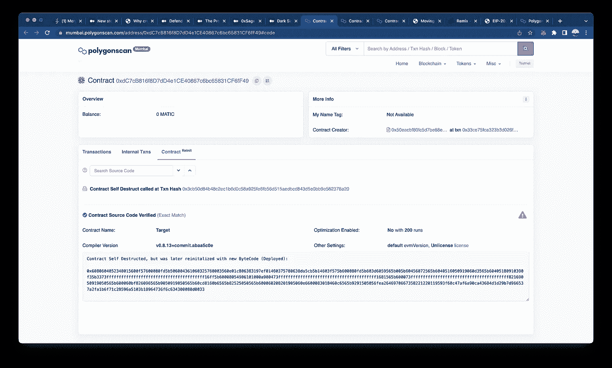

# 变形合同

> 原文：<https://medium.com/coinmonks/metamorphic-contracts-5e6a022914e5?source=collection_archive---------5----------------------->

## 为初学者打破变质合同。

上一篇:[https://medium . com/coin monks/dark-side-of-create 2-opcode-6b 6838 a42d 71](/coinmonks/dark-side-of-create2-opcode-6b6838a42d71)

上一篇文章 TL；DR:我们已经部署并销毁了 2 个契约，并使用 create 和 create2 操作码将它们部署在同一个地址。

在继续之前，我想回答一个与前一篇文章相关的常见问题。

之前的文章想说什么(非以太坊开发者)？

如果以这种方式编写，智能契约是完全可变。

好了，我们继续。首先，让我们从向目标地址部署全新的代码开始

遵循前一篇文章中的步骤，直到第 4 步，现在重新部署 CreatorContract，而不是部署目标契约的代码，而是部署它仍将部署在同一地址的任何代码。

这是它的代码。

```
// SPDX-License-Identifier: UNLICENSEDpragma solidity ^0.8.12;contract Target {address public owner;constructor() {owner = msg.sender;}function approve (address _spender,uint _value) public  returns (string memory) {return "Thug Life BGM playing...";}function destroy() public {selfdestruct(payable(msg.sender));}}
```

事务哈希:

目标契约自毁-[0 x3cb 50d 84 b 48 C2 EC 1 b 6d 0 c 58 a 925 Fe 6 FB 56d 515 aed BCD 843 D5 E0 bb 9 e 562378 a 20](https://mumbai.polygonscan.com/tx/0x3cb50d84b48c2ec1b6d0c58a925fe6fb56d515aedbcd843d5e0bb9e562378a20)

目标合同部署-[0xb 311 CD 648 CDB 08313 e 90 Abe EFA 27 b 54 f 68128543 f5b 484 EB 515d 84 ff 974 a 5388](https://mumbai.polygonscan.com/tx/0xb311cd648cdb08313e90abeefa27b54f68128543f5b484eb515d84ff974a5388)



观察结果:

1.  只有当它使用 create 或 create2 操作码创建新合同时，合同 nonces 才会增加。
2.  在较新的合同中，合同用随机数 1 初始化，而旧的合同用随机数 0 初始化。(更详细的上下文阅读→ [EIP-161](https://github.com/ethereum/EIPs/blob/master/EIPS/eip-161.md) )
3.  任何具有自毁功能的合约或通过委托调用与其他合约交互的合约都是不安全的。
4.  当 Create2 构造函数参数改变时地址改变。

5.为什么不能用这个代替代理？→答案是存储在契约中的先前状态被破坏，这不是我们所需要的。

变形合同:

*   我们在上面看到的是如何使用 **create** 操作码在同一地址中重新部署不同代码的契约。
*   现在让我们看看如何使用 **create2** 操作码在同一地址中重新部署具有不同代码的契约。
*   变形契约的要点→想法是部署一个智能契约，在部署时，用不同的字节码替换它自己的字节码。因此，通过 CREATE2 运行的字节码总是相同的，并且在部署期间回调工厂并替换自身。

```
//SPDX-License-Identifier: MITpragma solidity 0.8.1;contract Factory {
    mapping (address => address) _implementations;event Deployed(address _addr);function deploy(uint salt, bytes calldata bytecode) public {bytes memory implInitCode = bytecode;// assign the initialization code for the metamorphic contract.
        bytes memory metamorphicCode  = (
          hex"5860208158601c335a63aaf10f428752fa158151803b80938091923cf3"
        );// determine the address of the metamorphic contract.
        address metamorphicContractAddress = _getMetamorphicContractAddress(salt, metamorphicCode);// declare a variable for the address of the implementation contract.
        address implementationContract;// load implementation init code and length, then deploy via CREATE.
        /* solhint-disable no-inline-assembly */
        assembly {
          let encoded_data := add(0x20, implInitCode) // load initialization code.
          let encoded_size := mload(implInitCode)     // load init code's length.
          implementationContract := create(       // call CREATE with 3 arguments.
            0,                                    // do not forward any endowment.
            encoded_data,                         // pass in initialization code.
            encoded_size                          // pass in init code's length.
          )
        } /* solhint-enable no-inline-assembly *///first we deploy the code we want to deploy on a separate address
        // store the implementation to be retrieved by the metamorphic contract.
        _implementations[metamorphicContractAddress] = implementationContract;address addr;
        assembly {
            let encoded_data := add(0x20, metamorphicCode) // load initialization code.
            let encoded_size := mload(metamorphicCode)     // load init code's length.
            addr := create2(0, encoded_data, encoded_size, salt)
        }require(
          addr == metamorphicContractAddress,
          "Failed to deploy the new metamorphic contract."
        );
        emit Deployed(addr);
    }/**
    * [@dev](http://twitter.com/dev) Internal view function for calculating a metamorphic contract address
    * given a particular salt.
    */
    function _getMetamorphicContractAddress(
        uint256 salt,
        bytes memory metamorphicCode
        ) internal view returns (address) {// determine the address of the metamorphic contract.
        return address(
          uint160(                      // downcast to match the address type.
            uint256(                    // convert to uint to truncate upper digits.
              keccak256(                // compute the CREATE2 hash using 4 inputs.
                abi.encodePacked(       // pack all inputs to the hash together.
                  hex"ff",              // start with 0xff to distinguish from RLP.
                  address(this),        // this contract will be the caller.
                  salt,                 // pass in the supplied salt value.
                  keccak256(
                      abi.encodePacked(
                        metamorphicCode
                      )
                    )     // the init code hash.
                )
              )
            )
          )
        );
    }//those two functions are getting called by the metamorphic Contract
    function getImplementation() external view returns (address implementation) {
        return _implementations[msg.sender];
    }}contract Test1 {
    uint public myUint;function setUint(uint _myUint) public {
        myUint = _myUint;
    }function killme() public {
        selfdestruct(payable(msg.sender));
    }
}contract Test2 {
    uint public myUint;function setUint(uint _myUint) public {
        myUint = 2*_myUint;
    }function killme() public {
        selfdestruct(payable(msg.sender));
    }}
```

1.  部署工厂
2.  使用 salt=1 的 Test1 字节码来部署 Test1。
3.  告诉 Remix that 在变形契约的地址上运行
4.  将“myUint”设置为您想要的任何值，它都会工作
5.  杀死测试 1
6.  使用相同的 salt=1 部署 Test2 字节码
7.  它将部署一个不同的字节码到相同的地址！！！
8.  现在 setUint 使输入量增加了一倍。

观察结果:

1.  有两种类型的合同字节码(即

*   **创作代码**
*   **运行时间码**

2.创建代码→

*   包含协定的创建字节码的内存字节数组。
*   这可以在内联汇编中用来构建定制的创建例程，尤其是通过使用`create2`操作码。
*   该属性不能在契约本身或任何派生的契约中被访问。
*   它导致字节码包含在调用站点的字节码中，因此像这样的循环引用是不可能的。

3. **RuntimeCode →**

*   包含协定的运行时字节码的内存字节数组。
*   这是通常由`C`的构造器部署的代码。
*   如果`C`有一个使用内联汇编的构造函数，这可能与实际部署的字节码不同。
*   还要注意，库在部署时会修改它们的运行时字节码，以防止常规调用。
*   与`.creationCode`相同的限制也适用于该属性。

由于上述原因，我目前无法在 polyscan 上验证 create2 变形合同。在下一篇文章中，我会分解

“5860208158601 c 335 a 63 AAF 10 f 428752 fa 158151803 b 80938091923 cf 3”这段字节码在 evm playground 为了更好的上下文。

> 交易新手？尝试[加密交易机器人](/coinmonks/crypto-trading-bot-c2ffce8acb2a)或[复制交易](/coinmonks/top-10-crypto-copy-trading-platforms-for-beginners-d0c37c7d698c)

为了深入了解，请前往 https://github.com/0age/metamorphic

变形合同工作的详细分类在这个回购中，我将发布下一篇打破这个回购的文章。(PS →是好评回购)

阅读更多关于此主题的好文章:

1.  [https://medium . com/@ Jason . carver/defend-against-wild-magic-in-the-next-ether eum-upgrade-b 008247839 D2](/@jason.carver/defend-against-wild-magic-in-the-next-ethereum-upgrade-b008247839d2)。
2.  [https://medium . com/zeppelin-blog/the-promise-and-the-margin-of-derivative-contracts-9e b8 b 8413 C5 e](/zeppelin-blog/the-promise-and-the-peril-of-metamorphic-contracts-9eb8b8413c5e)。