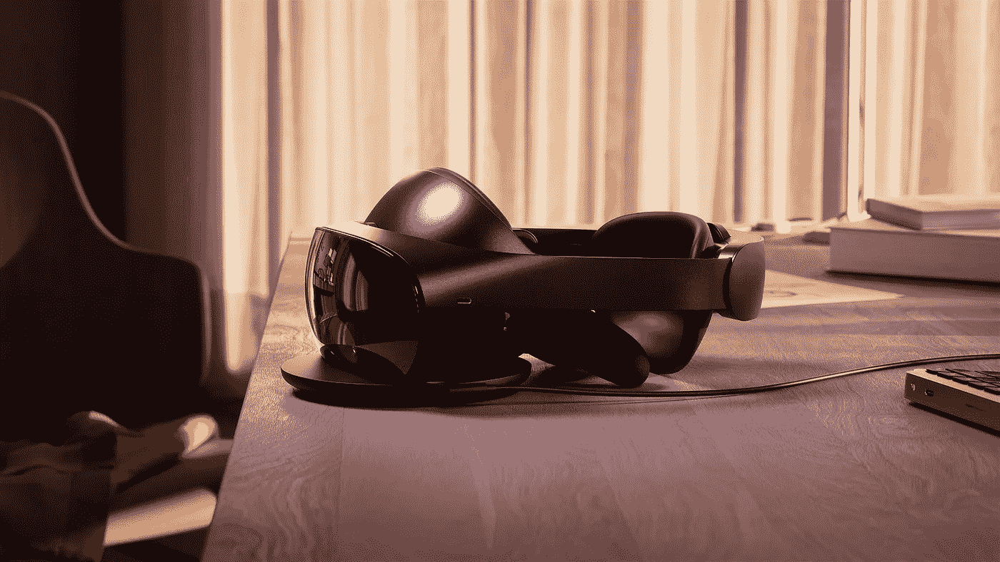

# Meta 价值 1500 美元的最新 VR 耳机

> 原文：<https://medium.com/coinmonks/metas-1-500-newest-vr-headset-8b6f0f320344?source=collection_archive---------37----------------------->

# Meta Quest Pro 以工作专业人士为目标，包含一些混合现实技术，并将于 10 月 25 日开始发货。

# Meta Quest Pro 包含新技术，如与高通开发的高级移动骁龙计算机芯片，可以帮助设备生成更高级的图形。

这款新耳机包含一些混合现实功能，可以将虚拟世界的元素与现实世界融合在一起。

这不是一款大多数消费者都能买得起的耳机，虚拟现实也不足以迫使他们在耳机上花那么多钱。Meta Quest Pro 是 Meta 试图证明它能够建造下一代虚拟现实计算机，并且实时社交互动在 VR 中是可能的。

这也是一个重大的战略转变，表明该公司正在向商业客户推广其最好的虚拟现实技术，希望他们渴望在工作中使用虚拟现实和混合现实应用。

> Meta Quest Pro 是我们新的高端设备系列中的第一款产品，它具有创新的功能，如用于强大混合现实体验的高分辨率传感器，用于清晰视觉的清晰液晶显示器，全新而时尚的设计，以及眼睛跟踪和自然的面部表情，以帮助您的虚拟角色在 VR 中更自然地反映您。作者:Oculus.com

Source Oculus.com

> META QUEST PRO 的几个特点是:下一代光学系统，全彩色混合现实，时尚的设计，自跟踪控制器，化身更自然的面部表情，Meta Quest Pro 配件

> 交易新手？试试[密码交易机器人](/coinmonks/crypto-trading-bot-c2ffce8acb2a)或者[复制交易](/coinmonks/top-10-crypto-copy-trading-platforms-for-beginners-d0c37c7d698c)