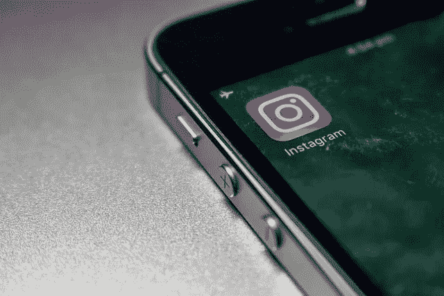

# Meta 仅仅通过广告收入致富的运气已经结束了！！

> 原文：<https://medium.com/coinmonks/metas-luck-in-getting-rich-solely-through-advertisement-revenues-has-ended-ca9b0b3b372a?source=collection_archive---------25----------------------->

# 减肥的人类心理学——对他们有好处，但对他们的股票投资没有好处！！

总的来说，当人们减肥时会很开心，而在过去，当女人减肥变得更瘦时，她们会觉得自己对这个世界更有吸引力…嗯…但是现在我想知道这其中的逻辑…

你看，人类现在不高兴，如果他们的股票失去重量，他们不觉得它有吸引力，否则为什么投资者最近逃离元股票，即使它失去了很多重量？

嗯……所以，基本面让事情变得有吸引力，不管你是人类(不管你的体重)还是超级股票。

哦…我看到你们中的许多人不明白 Meta 是如何减肥的，我会解释…如果你们中的任何人是有体重的，不要担心，重要的是你们内心是健康和善良的人…

# 重量级股票 Meta 的市值损失了很多

一年前，Meta stock 的市值超过 1 万亿美元，随着该股最近在 11 月 4 日跌至 88 美元的最低点，其市值损失了很大一部分。Meta 的市值跌至 2700 亿美元。Meta 的价格在 2021 年 9 月达到顶峰，价格区间为 384 美元。

[Source](https://ycharts.com/companies/META/market_cap). Drastic weight loss for Meta stock as with it’s drastic decline in Market Cap

我认为 Meta 的市值大幅下降，更不用说它的头发降价了。

然而，显然在金融界，对投资者来说，这意味着别的东西，它意味着在 Meta 股票下跌前没有卖出的投资者的损失……(红色，红色的损失，这让我想起了红色的红酒歌)

## 自从较早前触及最新的最低价以来，Meta 的最新价格走势图

我在[的一篇文章](/coinmonks/evaluating-the-crash-of-the-famed-web2-social-media-giants-meta-stock-a4a9dd3cfbc)中不恰当地解释了 Meta 的暴跌价格行为，你可以在这里阅读-

[评估著名的 Web2 社交媒体巨头 Meta](/coinmonks/evaluating-the-crash-of-the-famed-web2-social-media-giants-meta-stock-a4a9dd3cfbc) 的崩溃

在那篇文章中，我提到 Meta 的股票达到了 2017 年的价格水平，当时没有卖出超过 95 美元价格水平的投资者处于红色。

[Meta’s price chart](https://www.tradingview.com/x/BP2kE3h0/)

不管怎样，Meta 股票从 11 月初就有买家，所以股价从 88 美元的低点上涨到现在的 112 美元，阻力在 123 美元。这使得 Meta 的市值从 2.7 亿美元增加到 3 亿美元

我不能评论 Meta 的股票是否已经触底，因为啊，好吧…如果价格未能在 123 美元的阻力范围内起飞，Meta 下跌的主要支撑价格范围是 81 美元…

谁知道呢，也许 Meta 的降价和市值缩水确实吸引了带来下跌的投资者？…但我不会去那里。

让我们更实际地分析导致元股票贬值的根本原因。

准备好了…

# 一个简短的历史镜头，突出了 Web2 时代的社交媒体巨头

[Image Source](https://www.cnet.com/news/politics/mark-zuckerberg-on-facebooks-2018-weve-changed-we-promise/)

当然，我们都知道 Meta 是脸书，在 Web2 时代，这个社交媒体平台成为技术领域的主要市场领导者之一。

繁荣的 Web2 时代始于 2005 年，但后来脸书的马克·扎克伯格明白时代正在消逝，所以在他的领导下，脸书正试图涉足 Web3。我稍后将回到这一点。

当然，脸书的主要收入来源仍然是销售广告，这种商业模式在很长一段时间里对脸书非常有效。

FB 获得的优势是庞大的用户群，这对脸书来说很容易，因为它从事向用户出售定向广告，用户数据被出售给企业。在我之前的文章中，我已经解释过这最终会让 FB 变成一个反派实体，所以我将跳过这一部分。

# 脸书通过收购最受欢迎的社交媒体平台来扩张自己

最终，另一个社交媒体平台 Instagram 也获得了大量用户。因此，FB 收购 Instagram 是为了消除竞争，当然也是为了获得更多的用户，FB 可以向他们出售广告。

是的，即时通讯应用 Watsapp 也获得了大量用户，所以 FB 也获得了大量用户。

因此，马克忙于建立一个帝国，收购大型社交媒体平台，然后更名为 Meta。

# MZ 试图进入 web3 世界，在平台中融入元宇宙元素

或许，这个想法很简单，Meta 打算成为这个领域的社交媒体领导者，通过将这个领域变成元宇宙领域，将 Web2 体验转化为 Web3 体验。在这里，人们可以想象人们将成为化身，并与将成为化身的其他人互动，在虚拟现实中彼此互动。

(嗯……复杂，不喜欢 Web3 视频游戏的人怎么办，太多的虚拟现实不会改变我们的生活现实)

马克·扎克伯格或者让我们称他为 MZ 需要做的就是……推出一个他的大量用户可以使用并赚钱的产品，他实际上仍然可以这样做，因为 Meta 仍然是最大的社交媒体平台，拥有大量的用户，无论 MZ 打算推出什么产品，这些用户都是他的潜在客户。

MZ 打算让 Meta 领导他的元宇宙计划，为此他投资了 1000 亿美元，但这种努力是否有回报值得怀疑。

# 时代的变迁给 Meta 带来了挫折

## Meta 长期以来赚取巨额广告收入的势头正在减弱

Meta 早期的广告收入是在牛市期间，当时利率很低

嗯……现在是时候讨论 Meta 所面临的挫折了，它损失了大量的价值和收入，请为这一部分做好准备。

我们都知道，Meta 的前身品牌脸书在不同的环境中茁壮成长。哦，是的，美联储维持低利率，所以公司和企业很容易获得资金，他们可以廉价借贷和投资。这种情况持续了很长时间，企业有足够的资金在脸书上为他们的产品/服务做广告，这是最大的数字社交媒体空间，拥有庞大的用户群。

因此，脸书在很长一段时间内通过广告收入盈利是没有问题的

由于衰退环境下的货币紧缩，Meta 面临着一段低迷时期

现在，情况发生了变化，这是衰退市场周期中的熊市，企业没有获得大量收入和利润。此外，美联储推出了货币紧缩措施，因此实际上企业没有钱花在广告上，因为他们正在控制支出。

所以，Meta 赚的也少，因为在它平台上做广告的公司少了。这是 Meta 的收入在最近一个季度下降的原因之一。全球经济放缓导致 Meta 广告收入下降。

## 随着 Tiktok 的出现，脸书在社交媒体市场的主导地位开始受到挑战

[Source](https://www.gobankingrates.com/money/business/how-much-is-tiktok-worth/)

尽管 Meta 努力消除竞争，但一个主要竞争对手 Tiktok 的到来吸引了年轻观众进入其平台。

Tiktok 的原产地是中国(哦，对了，另一个中国制造的产品)。帮助 Tiktok 崛起的是中国对脸书的禁令，自 2009 年以来，中国的“防火长城”有效地将脸书阻挡在该地区。

因此，一家中国实体，[字节跳动](https://scroll.in/article/1036762/why-the-collapse-in-metas-share-price-is-good-for-the-future-of-social-media)能够在 2016 年与抖音一起占领中国社交媒体市场。最终，斗印以 Tiktok 的名义进军全球。

Tiktok 现在有 3000 亿美元的市值，所以它很大。

脸书不能通过收购来消灭 Tiktok 的竞争，因为它是一家受中国政府严格控制的公司。

事实证明，脸书无法抓住中国这个世界上人口最多的国家的用户群，对它来说确实是一个巨大的挫折！！

# 全球政府法规阻止 Meta 消除竞争

早些时候，FB 很容易在社交媒体领域占据主导地位，但政府的监管现在给 Meta 留有余地，可以在数字社交媒体平台上做广告。

例如，英国政府成功地让 Meta [出售了 gif 图书馆公司 Giphy](https://scroll.in/article/1036762/why-the-collapse-in-metas-share-price-is-good-for-the-future-of-social-media) ，并声明在线广告领域需要竞争。

脸书早些时候制定了消除此类做法的法案，这些法案实际上消除了竞争。

除了[全球政府法规](https://scroll.in/article/1036762/why-the-collapse-in-metas-share-price-is-good-for-the-future-of-social-media)使得 Meta 很难在数字社交媒体广告领域没有竞争对手，Meta 可能无法利用其他技术设备自由赚取广告收入。

举例来说，现在苹果已经开始向 Meta 收费，收取 Meta 通过 iphone 用户获得的广告收入。

# 其他社交媒体平台出现的有利条件&夺走 Meta 的市场主导地位

可以说，另一个社交媒体平台出现的时机已经成熟，可以挖走 Meta 的用户群。我们已经知道，由于 FB 侵犯了用户的数据隐私，它在许多用户中树立了负面形象。

现在，随着全球西方政府监管数字空间以鼓励更多竞争，这是更多社交媒体平台在该领域涌现和蓬勃发展的有利环境。

这显然会有更多的社交媒体平台出现，它们将与 Meta 竞争广告收入，因为现在会有更多的平台可以让企业做广告。

因为这鼓励了创新，所以对用户和社交媒体生态系统都有好处，即使这会威胁到 Meta 的市场领导地位。

# 结论

所以，看起来 Meta 可以持续获得广告收入的时代正在消失。随着其他新时代社交媒体平台的出现，Meta 可能会在未来几年失去其市场领导者的地位，为了维持其收入，Meta 需要推出另一种产品来赚取收入。

它在元宇宙的赌注似乎没有得到回报，因此需要重新考虑 Meta 可以推出哪些其他产品来赚取收入。

> 交易新手？试试[加密交易机器人](/coinmonks/crypto-trading-bot-c2ffce8acb2a)或者[复制交易](/coinmonks/top-10-crypto-copy-trading-platforms-for-beginners-d0c37c7d698c)