# 元金库。贸易评论-分散永续交易

> 原文：<https://medium.com/coinmonks/metavault-trade-review-decentralized-perpetual-trading-30b5018bcf1e?source=collection_archive---------3----------------------->

我们都听说过一个常见的密码谚语，即**不是你的钥匙，不是你的密码**。用户在最近的 [FTX 剧](https://coincodecap.com/sam-bankman-fried-apologizes-for-the-collapse-of-ftx)中吃了不少苦头。

还有，最近 Crypto.com**10 月 21 日不小心** [把用户存款](https://coincodecap.com/crypto-com-accidentally-transfers-320k-eth-to-gate-io-likely-to-be-insolvent) 32 万 ETH 转到 Gate.io。但是，Crypto.com 一再声明，与硬件钱包提供商 Ledger 合作，100%的用户拥有的密码都离线保存在冷存储中。因此，人们开始对集中交易失去信任。

所以，我们都知道 Web3 的未来在于 [DEXes](https://coincodecap.com/what-are-decentralized-exchanges) 和 [DeFi](https://coincodecap.com/the-ultimate-guide-to-defi-decentralized-finance) 。南森团队[最近的一份报告显示](https://twitter.com/nansen_ai/status/1565308599378710528)尽管熊市，GMX 令牌 [**GMX.io**](https://coincodecap.com/gmx-review) 即分散式永续交易所表现良好。

在本文中，我们将了解像 [Metavault 这样的永久协议。贸易](https://app.metavault.trade/#/?ref=FREE)，即 GMX.io 的一个友好分支可以在 CEXes 和熊市的戏剧性事件中为加密社区提供保证。

[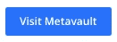](https://coincodecap.com/go/metavault)

> 使用代码免费获得交易费的特别折扣。

**目录**

*   摘要
*   介绍
*   特征
*   贸易
*   奖励
*   令牌组学
*   路标
*   安全性
*   结论
*   常见问题(FAQ)

# 元金库。交易:汇总

1.  cMetavault 是由 [Metavault DAO](https://metavault.org/) 背后的团队打造的。
2.  Metavault 是 [GMX.io](https://coincodecap.com/gmx-review) 的友叉。
3.  Metavault 有[集成的](/@metavault.trade/metavault-trade-dd19f8d2a1ec) [链链价格馈送](https://chain.link/data-feeds)和[链链保持器](https://chain.link/keepers)来帮助安全和自动化的永久交易。
4.  Metavault 拥有[集成的](/@metavault.trade/metavault-trade-integrates-socket-infrastructure-for-a-seamless-bridging-journey-tutorial-fb1ce714e38b)插座基础设施，可实现无缝桥接。
5.  MVX 是 Metavault 的治理和实用令牌。
6.  MVX 的最大供应量是 1000 万。
7.  MVLP 是流动性提供者的象征。
8.  MVLP 持有者以 MATIC 和 esMVX 代币的形式获得奖励。
9.  [元金库。交易](https://metavault.trade/)已经由 tech rate[审计](https://github.com/metavaultorg/trade-contracts/blob/main/Metavault.Trade_Full_Smart_Contract_Security_Audit.pdf)。

# 元金库。贸易:简介

元金库。Trade 是掉期和永久交易的指数，Polygon 的杠杆高达 30 倍。它旨在成为交易者的首选解决方案，这些交易者希望在不共享数据的情况下随时控制自己的资金。交易者可以通过两种方式使用它:

*   有掉期和限价单的现货交易。
*   永续期货交易，对空头和多头头寸的杠杆高达 30 倍。

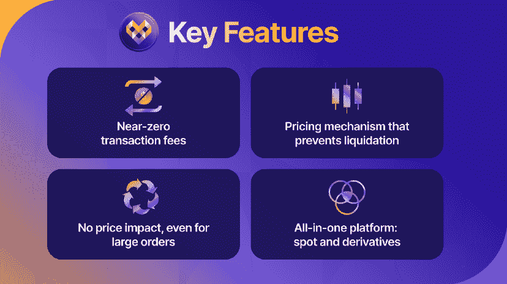

元金库。交易是由 Metavault DAO 背后的团队建立的，meta vault DAO 是一个总部位于区块链、由社区管理的投资平台和分散的风险资本基金。它允许任何人参与最新和最有利可图的 DeFi 项目和战略，并部署一个内部开发团队进行项目孵化。

元金库。贸易代码是 [GMX.io](https://coincodecap.com/gmx-review) 的友好分支。在仔细研究了 [GMX 的记号组学](https://coincodecap.com/gmx-review#GMXio_Token_Distribution)之后，Metavault DAO 团队选择为 [Metavault 从头开始重新设计。交易](https://metavault.trade/)。主要区别是:

*   [元金库。贸易](https://metavault.trade/)分配更大比例的代币来奖励农业，因此，奖励计划要大得多。
*   MVX 令牌推出时没有私人或种子轮。

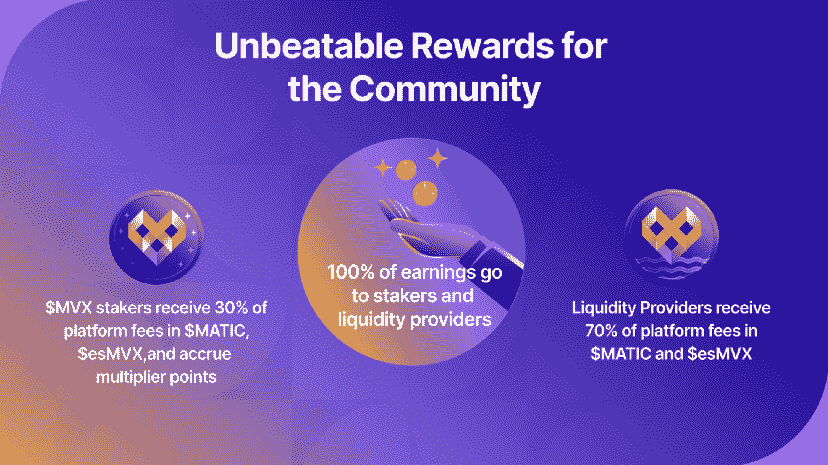

# 元金库。贸易:特征

在本节中，我们将了解 Metavault.Trade 的一些高级功能。

*   **建立在多边形上:**交易快捷便宜。
    Chainlink 还提供了大量多边形上的价格提要。
*   **多资产池**:它允许平台在其支持的所有资产之间共享流动性。比方说，资金池由五项资产组成，即、ETH、MATIC、和 DAI，这五项资产的美元价值比例相等，即各占 20%。交易者可以以平台上显示的准确价格立即购买 50%的 USDC BTC 供应量，而不会对价格产生任何影响。订购后，BTC 为 10%，USDC 为 30%，其余保持不变。平台上 BTC 的价格在互换前后是一样的，尽管一半的供应量已经被买光了。为了实现资金池的再平衡，流动性提供者受到激励去存放需求资产，而不愿意存放过剩资产。

> 使用代码免费获得交易费的特别折扣。

*   元金库。Trade x Chainlink: Metavault 有[集成的](/@metavault.trade/metavault-trade-dd19f8d2a1ec) [Chainlink 价格馈送](https://chain.link/data-feeds)和 [Chainlink Keepers](https://chain.link/keepers) 来帮助安全和自动化的永久交易。

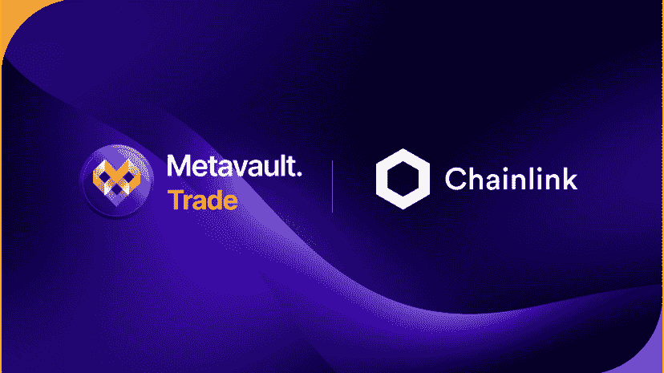

*   元金库。Trade x MM Finance: Metavault 近日宣布与 MM Finance 合作。因此，Metavault 的重新平衡机器人现在可以使用 Madmex 和 MMF 池。MM Finance 将把 MVX 再平衡机器人产生的一小部分费用返还给 Metavault。MM 财务团队将使用产生的费用添加回 MLP 池，增加 MLP 加班的价值。此外，这些协议费用的 65%将用于回购 MMF，以支持其本地令牌的价格。另一方面，Metavault 将把获得的返利用于投资，以增加其 [PoL](https://twitter.com/MetavaultTRADE/status/1581732267122364416) ，即协议拥有的流动性，这随后推动了飞轮效应理念，并增加了单机容量。

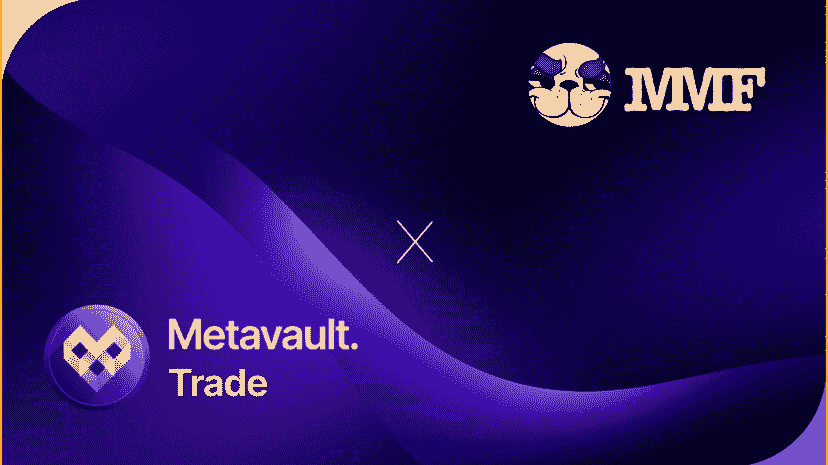

*   元金库。trade x[Socket](https://socket.tech/):meta vault 具有[集成的](/@metavault.trade/metavault-trade-integrates-socket-infrastructure-for-a-seamless-bridging-journey-tutorial-fb1ce714e38b) Socket 基础设施，用于无缝桥接。Socket 是一种互操作性协议，用于跨链进行安全&高效的数据和资产传输。它不是一个桥梁或跨链应用程序，而是一个基础架构，允许开发人员构建具有互操作性的应用程序，作为应用程序基础架构的核心部分。

# 元金库。贸易:贸易

元金库。Trade 提供了一个没有 KYC 或 2FA 的平台，因此用户可以轻松地开始交易，无需麻烦或注册。用户需要一个加密钱包才能在 Metavault 上开始交易。

*   ***第一步:*** 前往 [MetaVault 官网](https://metavault.trade/)。点击右上角的启动应用程序按钮。用户将被重定向到[交易](https://app.metavault.trade/#/trade)仪表板。

*   ***第二步:*** 点击右上角连接钱包。

*   ***第三步:*** 我们会看到四个钱包选项，分别是**元掩码、钱包连接、比特币基地钱包、出埃及钱包**。此外，正如我们所知，元金库是建立在多边形。我们必须将我们的默认元掩码网络从以太坊主网改为多边形主网。

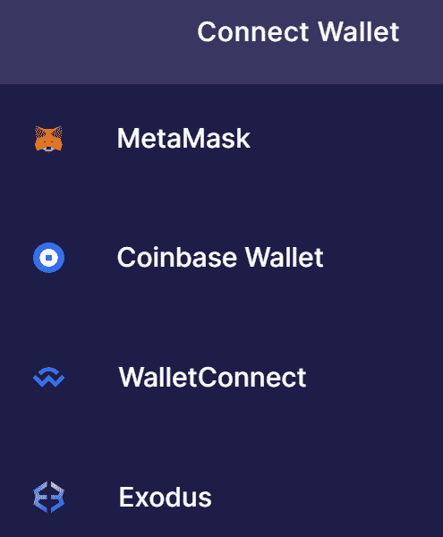

*   ***第四步:*** 现在，一切都完成了。用户现在就可以开始交易了！

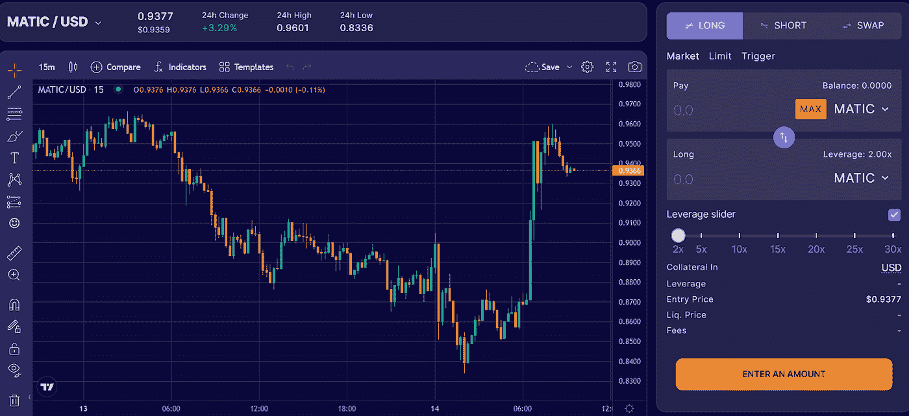

# 元金库。贸易:象征经济学

MVX 是元金库。行业治理与效用表征。MVX 的最大供应量是 1000 万。超过这一最大供应量的铸造由 28 天的时间锁控制，只有在需要增加供应量时才会考虑。下面是令牌分发的快速概述:

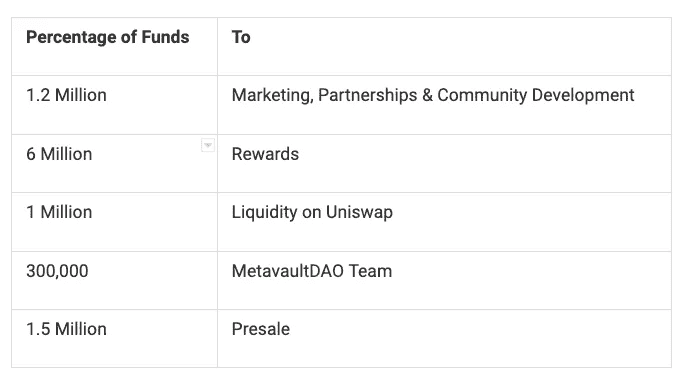

MVLP 是超级金库。交易的流动性提供者令牌。它由平台上用于互换和杠杆交易的资产指数组成。用户可以通过将任何指数资产添加到流动性池来铸造 MVLP，而每当用户从流动性池中移除任何指数资产时，MVLP 就会被烧毁。MVLP 持有者以 MATIC 和 esMVX 代币的形式获得奖励。

> 使用代码免费获得交易费的特别折扣。

# 元金库。交易:奖励

MVX 持有者被强烈地激励去下注他们的代币，结果他们得到了三种不同类型的奖励。

1.  平台费用分成:MVX 赌注者以 MATIC 的形式获得整个平台所收费用的 30%。

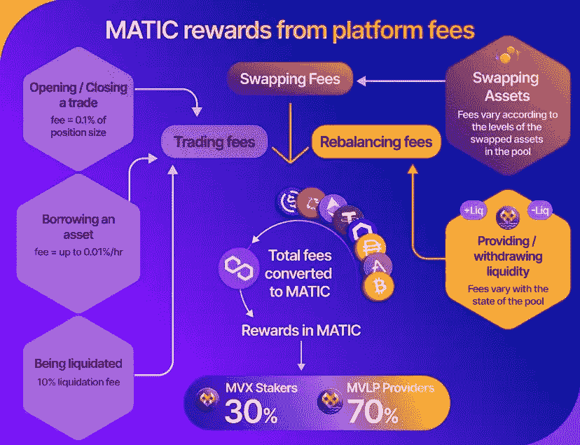

2.esMVX: MVX 赌注者将获得一个新的代币，即托管 MVX。它是不可转让的，并且只有两种使用方式:
(i) esMVX 可以被授权转换并作为 MVX 分发。esMVX 可以被下注，并且将获得与下注 MVX 相同的奖励。

3.乘数点(MPs): MVX 赌注者以点数的形式获得奖励。MP 的奖励是 100% APR。每个 MP 都可以下注来赚取与 MVX 代币相同数量的 MATIC。

以下是奖励结构的简要总结:

1.  MVX 赢得了 MATIC，esMVX 和 MPs。
2.  赌注 esMVX 赢得 MATIC、esMVX 和 MPs。
3.  议员被判死刑时可获得奖金
4.  MVLP 赢得了钱包中的 MATIC 和 esMVX。

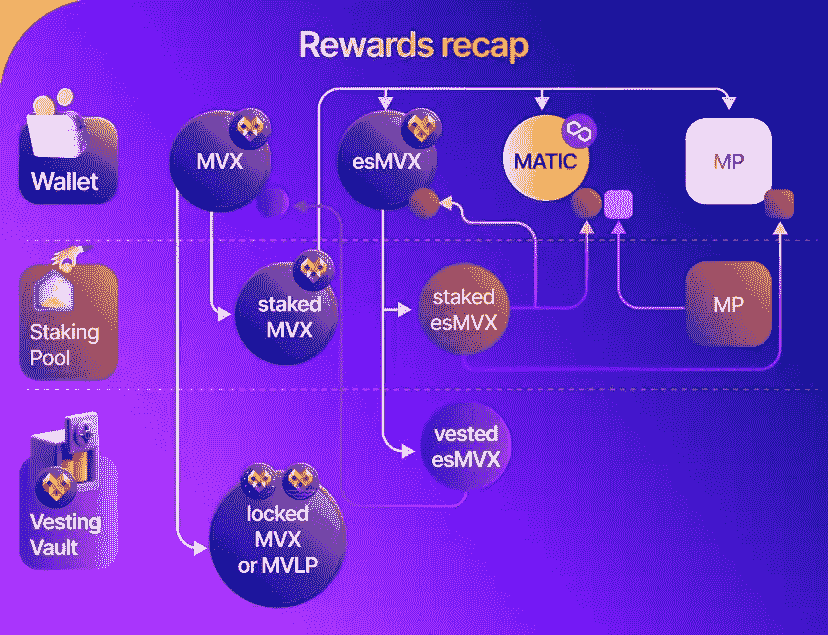

# 元金库。贸易:路线图

这里是对[元库的一个快速概述。交易](https://metavault.trade/)的路线图:

*   **2022 年第四季度:**

1.  永久功能的扩展(合成和外汇)。
2.  期权交易实现进入 Metavault.Trade
3.  一个新的 dApp 来改善和支持重大发展。
4.  合资开发区块链基础设施项目。
5.  跨链杠杆交易的合资发展。

*   **Q1 2023:**

1.  元金库。贸易多链生态系统扩张。

# 元金库。贸易:安全

元金库。交易已经过 Techrate 的审计。智能合约没有活跃的 bug 赏金。发现漏洞或漏洞的用户将获得大量补偿。白帽黑客可以联系 admin@metavault.trade 了解更多信息。

另外我们知道， [Metavault。Trade](https://metavault.trade/) 的源代码是 [GMX.io](https://coincodecap.com/gmx-review) 的一个分支，其合同已经由 ABDK Consulting[审计](https://coincodecap.com/gmx-review#GMXio_Security)。

> 使用代码免费获得交易费的特别折扣。

# 元金库。贸易:结论

如果说上周 Metavault 上交易员的报酬分布。交易，那么$MVX 的回报是 84.58%，而$MVLP 的回报是 173.65%。尽管经历了整个 FTX 事件、中央交易所的崩溃和熊市，交易仍在盈利。元金库。交易团队完全[投入到项目中，包括新的交易所上市、平台升级、ama、新推荐竞争的启动等。还有更多。此处使用的所有图片和信息的版权归 Metavault.Trade 所有。](/@metavault.trade/month-in-review-at-metavault-trade-october-6ac7bee64d59)

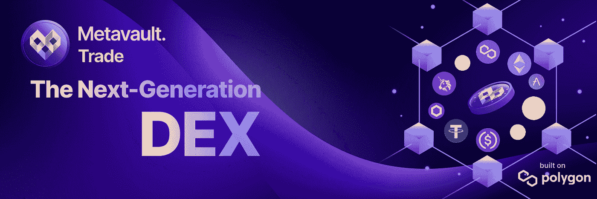