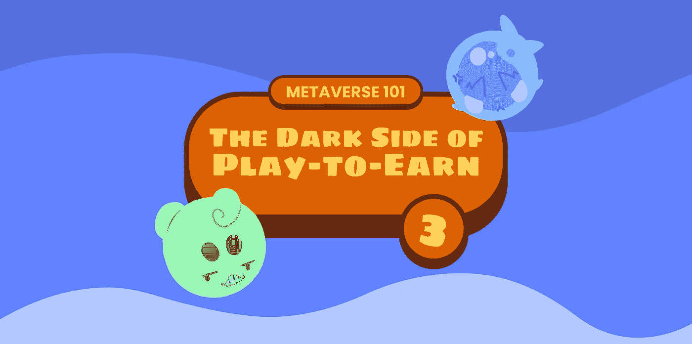

# 游戏赚钱的黑暗面|元宇宙 101

> 原文：<https://medium.com/coinmonks/metaverse-101-the-dark-side-of-play-to-earn-892ed0bf9add?source=collection_archive---------9----------------------->

视频游戏的发展和区块链技术的引入([在这里](/coinmonks/metaverse101-what-is-the-blockchain-f263193dbec?source=your_stories_page)你可以找到我们深化了这个话题的文章)已经在视频游戏中产生了一种新的模式:通过“**游戏来赚取**(简称 P2E)。这种模式在过去已经带来了具体的盈利机会，尽管与其实施和使用相关的风险和问题很少得到解决。

# **那么什么是玩赚？**

“玩赚”是许多加密游戏使用的系统，它允许用户**赚取数字资产**，如加密货币或 NFT。

P2E 基于区块链的去中心化技术(不同于代表封闭系统的传统视频游戏)，而**提供了在视频游戏领域**之外出售这些资产的可能性，从而提供了一个真正的赚钱机会。

即使在传统的视频游戏中，尤其是在 MMO 中，也有可能获得“游戏内”奖励，但不同的是，基于“封闭系统”，不可能转售它们，因此在游戏中花费的时间没有收益。

然而，通常玩游戏赚钱并不能提供特别刺激的游戏体验，**而且更出名的是它们的经济方面，而不是创新的游戏玩法**或其他众所周知使游戏吸引人的方面(例如，传说？).

从 2020 年开始，随着新冠肺炎的进入，许多人被“玩赚”系统的赚钱可能性所吸引，并开始在网络上的不同平台上投入时间玩游戏，如 *CryptoKitties* 、 *Axie Infinity* 或 *Gods Unchained* 。

# 你挣多少钱？

对于没有经验的人来说，游戏赚钱模式可能看起来像一只“下金蛋的鹅”:一种通过游戏赚钱的新方式。事实上，在 2021 年，在 Axie Infinity 上，你每周可以筹集大约 32 美元。最强大、最昂贵的团队每月收入甚至可以超过 1000 美元。

不幸的是，即使在某些情况下可以从这个系统中获得经济收入，但要产生可接受的利润，就必须勤奋地比赛，并达到与专业电子竞技运动员相等的技能。

# **玩赚不可持续**

P2E 创新公司已经成为大型投资者的目标，这些投资者的核心业务并不是真正的视频游戏。甚至一些利用游戏赚钱的平台看起来更像是“经济”而不是娱乐系统。

此外，“乐趣”的概念被诱人的经济承诺所掩盖，将游戏变成了真正的“工作”。

这个概念显然没有在**社区**中找到积极的反馈，这些社区也在视频游戏中寻求愉快的休闲体验，他们可能很快就会厌倦这种将他们的行为转化为“机械重复”并且没有灵魂的游戏。最合乎逻辑的结果是电子游戏的大量流失。

关于游戏赚钱的不可持续性的要点恰恰在于此:为了正常运转， **P2E 需要不断增加的新玩家，他们向系统注入流动性**，并在游戏中保持 NFT 的高价值；这种系统工作的确定性在短期内是可以计算的，但从长期来看却变得不可预测。

出于这些原因，许多人将“玩赚”比作金字塔结构，在这种结构中，由于成千上万玩家的努力，只有第一批投资者能够获利，这些玩家来得太晚，梦想着通过玩游戏赚钱。

然而，更正确的说法是，Play to Earn 是一个仍然缺乏一些满足所有类型游戏玩家需求的必要技巧的游戏系统。

> 交易新手？尝试[加密交易机器人](/coinmonks/crypto-trading-bot-c2ffce8acb2a)或[复制交易](/coinmonks/top-10-crypto-copy-trading-platforms-for-beginners-d0c37c7d698c)

# **玩赚模式的替代方案**

如果不首先解决可持续性问题，赚取游戏模式可能没有未来。

由于这个原因，越来越多的项目正在寻找替代方案。例如，我们提到的*为挣钱而建造*或*为挣钱而移动*似乎在基于为挣钱而玩耍标准的模型中插入了额外的机制，有效地增加了挣钱的可能性，但可能没有解决可持续性的结构性问题。

此外，一个可持续的 P2E 模式还需要**致力于与玩家的关系以及玩家之间的关系，**提供动机而不仅仅是收入，以确保该平台继续被对**游戏体验感兴趣的新玩家占据。**

为了满足游戏玩家群体的需求，我们为《上古世界》设计了一个全新的**模式**，即*游戏建造*，它从游戏中获得灵感，但又呈现出实质性的不同。如果你想了解更多，请关注 GushiLand 在 Medium 上的简介，不要错过下一个故事。

# **结论**

我们希望这篇文章已经成功地强调了还没有人告诉你的玩耍的一些方面。你认为玩赚是过时的模式吗？你是否已经发现了更有趣的替代品？

如果你喜欢这篇文章，请加入我们的 Discord 社区，一起讨论和学习更多关于这个主题的知识。

# 关于古士兰

古士兰是元宇宙最疯狂的游乐园，在阿尔格兰德上有一种新的区块链游戏体验。从玩到建的生态系统中的策略、动作和乐趣对于休闲游戏玩家和专业玩家来说都是可行且有利可图的。在我们的[第一个故事](/@gushiland/gushiland-the-first-play-to-build-gaming-ecosystem-on-algorand-6ce0f6ee14b2)中发现更多。

我们才刚刚开始。加入我们的部落，第一个听到令人兴奋的消息和发展。

你可以在 [Discord](https://discord.gg/68Tu6k7MHr) 、 [Twitter](https://twitter.com/gushi_land) 和 [Instagram](https://www.instagram.com/gushi.land/) 上找到我们。

> 加入 Coinmonks [电报频道](https://t.me/coincodecap)和 [Youtube 频道](https://www.youtube.com/c/coinmonks/videos)了解加密交易和投资

# 另外，阅读

*   [AscendEx 保证金交易](https://coincodecap.com/ascendex-margin-trading) | [Bitfinex 赌注](https://coincodecap.com/bitfinex-staking) | [bitFlyer 审核](https://coincodecap.com/bitflyer-review)
*   [Bitget 评论](https://coincodecap.com/bitget-review) | [双子星 vs BlockFi](https://coincodecap.com/gemini-vs-blockfi) cmd| [OKEx 期货交易](https://coincodecap.com/okex-futures-trading)
*   [AscendEx Staking](https://coincodecap.com/ascendex-staking)|[Bot Ocean Review](https://coincodecap.com/bot-ocean-review)|[最佳比特币钱包](https://coincodecap.com/bitcoin-wallets-india)
*   [霍比评论](https://coincodecap.com/huobi-review) | [OKEx 保证金交易](https://coincodecap.com/okex-margin-trading) | [期货交易](https://coincodecap.com/futures-trading)
*   [网格交易机器人](https://coincodecap.com/grid-trading) | [Cryptohopper 审查](/coinmonks/cryptohopper-review-a388ff5bae88) | [Bexplus 审查](https://coincodecap.com/bexplus-review)