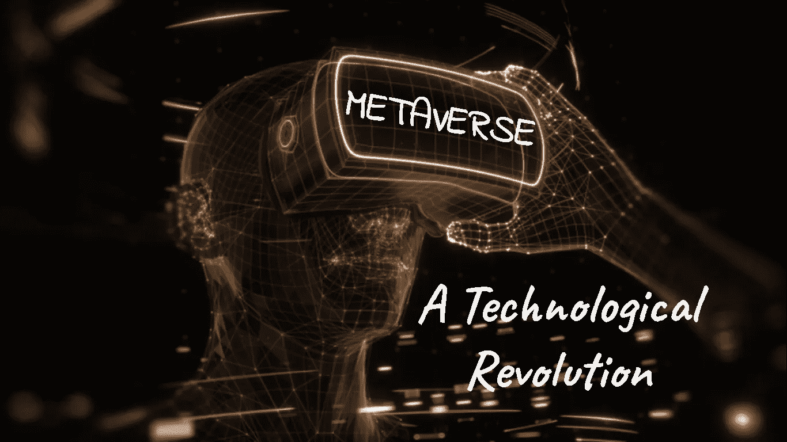
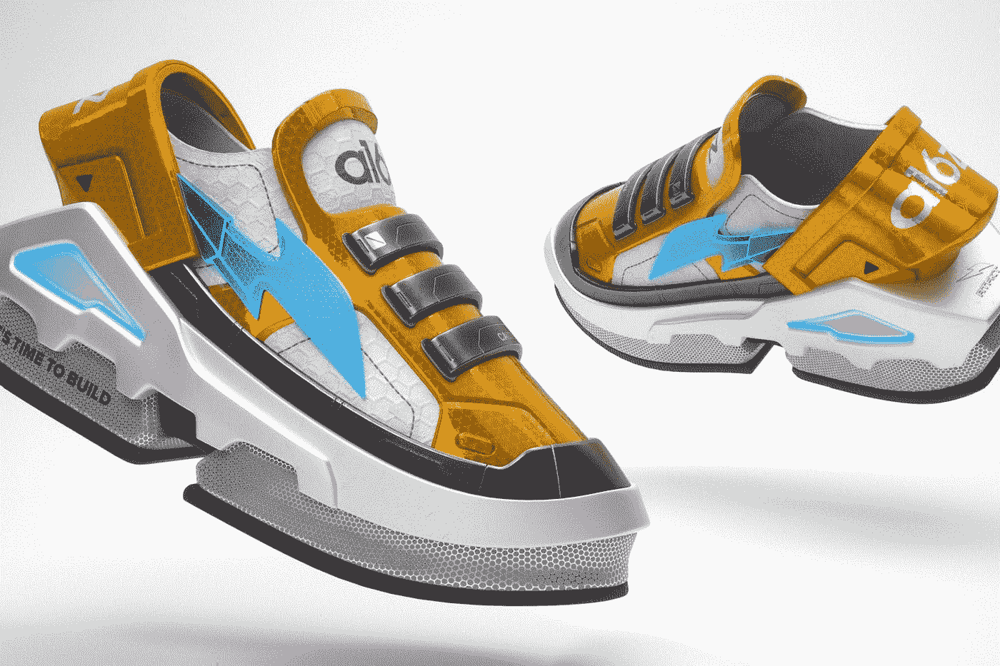
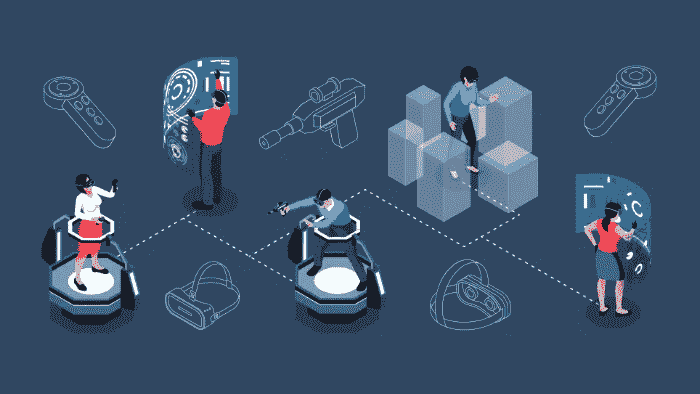
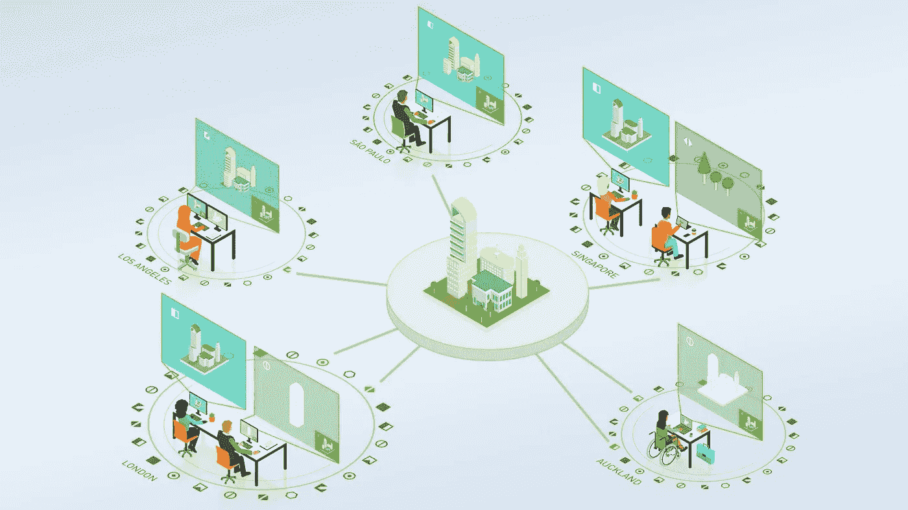
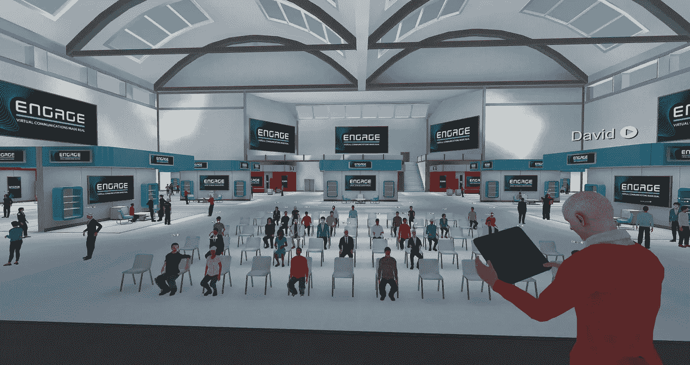
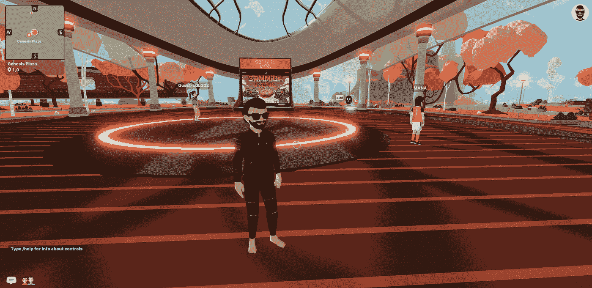

# 元宇宙:一场技术革命

> 原文：<https://medium.com/coinmonks/metaverse-a-technological-revolution-73f36e1e6dde?source=collection_archive---------13----------------------->

## 元宇宙系列

## 描述元宇宙&它如何影响商业？

## 什么是元宇宙？

术语**元宇宙**，有这么多的定义。专家可能会有不同的定义，因为它是一个全新的和发展中的技术。

> **元宇宙使我们能够将计算嵌入到现实世界中，并将现实世界嵌入到计算中**。——微软首席执行官塞特亚·纳德拉
> 
> **我相信元宇宙是互联网的下一个篇章。**——马克·扎克伯格，首席执行官@Meta
> 
> 我们定义元宇宙的方式是，它是我们的虚拟存在。元宇宙将比这更进一步，像我们的虚拟双胞胎一样，在虚拟世界中做各种各样的活动。——首席执行官内哈·辛格

结合上述定义，我们可以说元宇宙

*   **是互联网级数。**
*   **不仅仅是浏览，而是参与并体验持久的共享体验。**
*   它的范围从我们的现实世界到一个完全虚拟的世界。

> 谁是元宇宙的主人？——元宇宙不属于任何一个人或实体。它由几个实体创建。

## 互联网如何改革？

## **。20 世纪 90 年代|数据互联网**

在 20 世纪 90 年代，互联网的主要功能是组织海量数据，并让世界各地的用户都能访问这些数据。

## 。21 世纪|物联网

21 世纪初，人们开始在网上互动。我们继续使用许多已经深入每个人生活的社交媒体平台。

## 。2010 年代|物联网

我们的物理产品在 2010 年代开发了智能，使我们的系统能够通过互联网连接到其他设备。由于传感器、计算能力、软件和其他技术，设备能够相互通信和交换数据。

## 。21 世纪 20 年代|地点互联网|所有权互联网

21 世纪 20 年代初，人们开始将虚拟物体与现实世界融合，催生了地点互联网。

后来，用户开始拥有被称为代币或 NFT 的数字物品。这些令牌可以被跟踪和审计。此外，它还具有所有权和历史等特征。在这里，我们还观察到一种透明度。

> 随着 IOT、人工智能、数字货币、游戏、数字身份、数字双胞胎和扩展现实等新技术能力的融合，元宇宙诞生了。

## 元宇宙对企业有什么影响？

## 1.客户体验

客户服务代表的数字双胞胎可以帮助用户组装、修理或更换产品。除了让客户支持代表的工作变得更简单之外，这还能培养长期的客户和品牌信任。

Credits: [CX Universe](https://cxm.co.uk/wp-content/uploads/2021/07/shutterstock_2008362914-1-2048x1187.jpg)

## 2.支付

加密钱包或使用像币安这样的交易所可以在元宇宙购物。通过这种方式，法定货币可以变成加密货币，使用户能够在线进行交易。除了加密货币，还有其他被称为 NFT 的可互换令牌，用于表示独特物品的所有权。像加密货币一样，非转存货币可以在元宇宙转移和用作支付。

Credits: [smallbusiness](https://s17026.pcdn.co/wp-content/uploads/sites/9/2018/03/Cryptocurrency.jpeg)

## 3.员工体验

虚拟现实体验可以被许多组织用来招募新员工。与传统的入职方法相比，虚拟现实是一种促进人际互动的更好的工具。为了向新员工传授工作场所和企业文化，虚拟现实集成使用了参观、角色扮演、游戏和实际模拟。人力资源部门可以使用虚拟现实来评估申请人和新员工的某些属性。

Credits: [LinkedIn](https://www.linkedin.com/learning/hr-leadership-in-the-metaverse/remote-work-and-employee-experience?u=2007516)

## 4.设计和管理产品

创新水平本质上是无界的。创作者超越设计极限的可能性比以往任何时候都大。多亏了元宇宙，设计前所未有的物品的能力正在彻底改变这个行业。在设计师中，像服装和配饰这样的限量版产品越来越流行。这些随 NFTs 一起提供，作为虚拟所有权认证。元宇宙让事情变得更加可持续，因为它消除了对新生产技术或材料的需求，而这些技术或材料在改变设计或生产新品种时最终会导致更大的浪费。耐克与虚拟鞋商 RTFKT 合作，正在为元宇宙生产 NFT 运动鞋。

RTFKT NFT sneakers (Credits: RTFKT)

## 5.供应链

虚拟供应链(VSC)通过其数字版本复制物理供应链的每一个元素。通过 3D 呈现商品的制造、运输和销售方式，元宇宙提高了供应链的透明度。这使我们能够深入了解交付延迟、交付周期、运输时间，甚至当前的运费。通过提高对流程、设施、库存和产能的洞察力，它可以帮助企业消除供应限制。

零售商和供应商可以虚拟地在元宇宙的房间里开会，讨论预期的销售估计、估计的生产计划以及可能影响制造产量的潜在供应商限制。在供应链网络中，他们可以定位库存，如果运输因拥堵而延误，他们可以模拟可行的替代方案，以保持将货物送到正确的商家。

Credits: [Wireservice](https://www.wireservice.ca/ways-metaverse-will-benefit-supply-chain-networks-in-future/)

## 6.企业管理

企业元宇宙是一个虚拟区域，组织可以在这里与世界各地的员工举行会议，在协作的氛围中回顾工作，甚至进行工作面试。

雇主还可以使用企业元宇宙进行员工培训和沉浸式学习。现代公司正在虚拟环境中培训新员工。

企业使用元宇宙构建数字双胞胎，以协助工程和开发活动。他们可以对生产过程进行详细的数字模拟，并找出可能影响产品质量或交付的瓶颈。

企业还可以使用元宇宙来确保更好的问题管理和场景准备。这在元宇宙通过人工智能、数字双胞胎和 3D 设计的融合成为可能。

Credits: [Nvidia](https://blogs.nvidia.com/wp-content/uploads/2021/08/metaverse9.jpg)

## 7.通信

大型团体可以举行虚拟互动聚会、客户会议或产品发布活动。用户可以通过虚拟化身直接参与到这个 3D 空间中，模拟在同一地点实际存在的体验。

通过企业和客户之间的互动，元宇宙在现实世界和许多虚拟现实之间创造了一种真正的所有权感。NFTs 允许以实物和数字形式销售商品，允许买家在元宇宙和现实中展示他们的购买。这些 NFT 还确保了实际项目的合法性。耐克在游戏平台中创建了一个“Nikeland environment ”,用户可以穿着虚拟的耐克服装玩游戏。

Credits: [VRscout](https://vrscout.com/news/engage-oasis-linkedin-of-the-metaverse/)

## 8.投资

元宇宙加密货币是投资元宇宙的一种不同方式。元宇宙加密，以其最简单的形式，指的是在元宇宙建立的倡议的本地令牌。通常，这些令牌被用于各种目的，包括交易、赌注甚至治理。

Metaverse Cryptos (Credits: [Hayek Gold](https://hayekgold.co/how-will-cryptocurrencies-like-bitcoin-impact-the-world-economy/))

玩元宇宙游戏是投资元宇宙最有效的方式。由于像分散土地和沙盒这样的倡议，游戏产业正在迅速扩张。玩家可以建立自己的虚拟角色，并在游戏的详细 3D 场景中与其他玩家互动。元宇宙奥运会使用的“玩赚”(P2E)方法包括加密。因此，玩家可以因为他们在游戏中的行为而获得奖励。

Decentraland (Credits: [PlayToEarn](https://playtoearn.net/blockchaingame/decentraland))

NFT 是一种在元宇宙颇受欢迎的投资方式。提供游戏内资产“真实”所有权的能力是吸引元宇宙的 NFTs 的关键方面之一。如果游戏中的物品被组织成非功能性物品，交易就会很容易。此外，它使用户能够在他们自己的现实中购买 NFT 结构的虚拟土地。分散土地提供了这一功能，因为它的 3D 环境有大约 90，000 块土地，每块土地的大小为 16 米乘 16 米。土地被设计成 NFT，可以用以太坊或法力(分散地的原生令牌)购买。

Bored Ape Yacht Club NFTs (Credits: [Bored Ape Yacht Club](https://www.nftculture.com/nft-news/bored-ape-yacht-club-the-latest-nft-collectable-craze/))

> 元宇宙是存在的，它的未来还是未知的。
> 
> 交易新手？试试[加密交易机器人](/coinmonks/crypto-trading-bot-c2ffce8acb2a)或者[复制交易](/coinmonks/top-10-crypto-copy-trading-platforms-for-beginners-d0c37c7d698c)