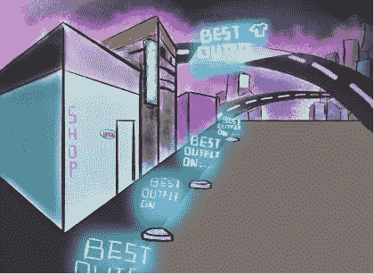

# 元宇宙:虚拟经济能保持免费吗？

> 原文：<https://medium.com/coinmonks/metaverse-can-the-virtual-economy-remain-free-70f662edaf4?source=collection_archive---------24----------------------->

经济作为价值和资源交换的一系列操作，是任何复杂系统的重要组成部分。元宇宙，作为一个创造另类虚拟现实的复杂系统，也有自己的经济。

在这篇文章中我研究了虚拟世界的经济模式，我试图理解它的优点和缺点。虚拟经济的基本原则是去中心化。实际上，这一原则体现在虚拟经济的以下特征中:

*   使用加密货币作为主要结算手段；
*   每个元宇宙或虚拟空间都有自己的货币或货币流通秩序；
*   所有虚拟世界缺乏统一的规则。

# 虚拟密码体系

乍一看，这像是一个无政府主义者的梦想实现了。比特币的创造者(或创造者群体)中本聪宣布，创造一种加密货币的目标只是为了摆脱中央政府和银行系统的强大指令。从这个意义上说，加密货币及其虚拟经济是一个完全自由的空间。

在元宇宙发展的现阶段，虚拟经济似乎是一种理想的建构:

*   加密货币的自由无限制使用，已经有几千种类型；
*   使用加密货币时交易的可靠性、简单性和廉价性；
*   用户之间通过 OpenSea、Rarible 等不可替代的 token (NFT)交易平台进行自由交易；
*   元宇宙和其他数字资产的广泛投资机会(甚至保守的摩根大通也开始投资元宇宙)；
*   企业和个体企业家将他们的营销和广告带入新的虚拟世界的机会。

中国科学院自动化研究所的员工王飞跃和更进一步大胆地假设，在元企业和元城市中，虚拟人和虚拟组织将独立于真实的企业和城市而工作，他们不需要遵循现有的经济模型和理论。这些虚拟的人和组织的行为和运作模式可以产生新的经济模式和理论。所谓的元经济系统，可以认为是一个虚拟的经济系统，与现实经济系统相对应。研究人员认为，一种新的虚拟供需哲学将被创造出来，即供应在很大程度上在现实市场中实际创造了自己的需求，而需求在很大程度上在虚拟市场中人为创造了自己的供应。

# 虚拟经济的下一步是什么？

这是乐观主义者和狂热分子对虚拟经济的看法。我不否认，现在，当元经文刚刚从它们的“大爆炸”中出现，虚拟经济正在大幅增长时，它可能看起来是永远的。但是，随着元宇宙系统的自然复杂性，虚拟经济的交织，摆在“数字居民”和创造者面前的将是全新而具体的问题。从 2022 年中期开始，我认为这些问题是:

1.  加密货币的无限复制。由于“挖掘”过程的设置方式，加密货币的特征是货币供应的稳定和相对缓慢的增长。与我们今天生活的世界不同，中央银行可以通过货币工具监管货币供应，其他金融机构可以通过创造广义货币供应来影响货币供应，新生的加密货币根本没有这样的机制。因此，数量货币理论意味着，如果货币流通速度长期相对稳定，人们可以合理地担心通缩压力，因为货币供应无法容纳繁荣的元宇宙中日益增长的交易数量。要打破这一魔咒，需要某种银行体系，允许通过部分准备金银行创造货币，而不是扩大货币基础。这与虚拟经济的关键原则——去中心化相违背。
2.  垄断的危险由于市场份额集中在几家领先的技术公司手中，元宇宙工业可能成为寡头垄断市场。尽管这在法律上没有我们的平行世界被一个巨大的垄断者所主宰那么极端，活跃的寡头仍然可以行使巨大的权力，尤其是在元宇宙发展的第三阶段(即超现实主义)。例如，像 Alphabet 这样的技术巨头仅在现实生活中的广告就赚了 1470 亿美元，而在元宇宙中的利润潜力可能更大。
3.  一些元宇宙开发者希望在数字世界重现的现实世界经济的另一个方面是赤字。尽管从技术上来说，一切数字化的东西都可以使用多行代码来复制或再现，但保留这一选项将很快导致恶性通货膨胀和虚拟商品贬值。如果赤字能够持续下去，元宇宙可能会通过交易独特且受欢迎的虚拟资产，成为财富投资的新领域。
4.  虚拟物品交易。一个潜在的问题是在不同的虚拟世界中进行交易。特别是，在世界 A 中创建的对象可能与世界 B 不兼容，尤其是当两个世界运行不同的软件时。同样，由于虚拟对象的交易与互操作性交织在一起，对通用结构的需求变得更加明显。随着数字原生阶段虚拟对象交易的增加以及过着数字游牧生活方式的人数的增加，虚拟商业市场也必须有能力保护虚拟对象的所有权。虽然 NFT 不能被来自超宇宙社区的其他用户分配，但伪造总是可能的。元宇宙的开发商必须解决财产问题，以维护市场秩序。到目前为止，一些研究试图通过检查艺术品的具体特征来解决使用神经网络伪造艺术品的问题

# 结论

我确信新虚拟经济的潜在问题清单可以继续下去:来自大量不同加密货币的恶性通货膨胀，加密货币市场投机行为的增长，这可能会吓到普通用户，国家监管和消费者保护等等。人类在历史上积累了许多经济领域的问题，这些问题很容易转移到虚拟经济中。

对我来说，现在的主要结论是——比特币的创造者和其他人认为的虚拟无政府主义版本在元宇宙的规模和发展中是不可行的。无论如何，有必要在元宇宙的自由虚拟市场和“地球”经济规律的现实之间寻找一个折衷点。

经济学不是关于数字和理论，它是关于人们的行为，他们每天生活中所做选择的原因和动机。认为虚拟世界的出现可以从根本上改变人类行为并创造一种新的、不同的元经济学理论是天真的。

***

如果你喜欢我的文章，那么你可以阅读更多关于元经文的发展:

1.一篇关于元宇宙中的[化身以及他们在虚拟世界中表现人类个性的角色的文章。](/@k.shcharbinin/avatar-in-the-metaverse-how-well-do-we-know-him-39e7c890a4f2)

2.常规内容和 VR 内容有区别吗？普通用户能和专业设计师一起创作内容吗？我试图在[元宇宙](/@k.shcharbinin/content-in-the-metaverse-creative-culture-or-marketing-a8f62bd4a3fb)中回答这些问题。

谢谢大家！

*最初发表于*[*【https://www.linkedin.com】*](https://www.linkedin.com/pulse/metaverse-can-virtual-economy-remain-free-kiryl-shcharbinin)*。*

> 交易新手？尝试[加密交易机器人](/coinmonks/crypto-trading-bot-c2ffce8acb2a)或[复制交易](/coinmonks/top-10-crypto-copy-trading-platforms-for-beginners-d0c37c7d698c)