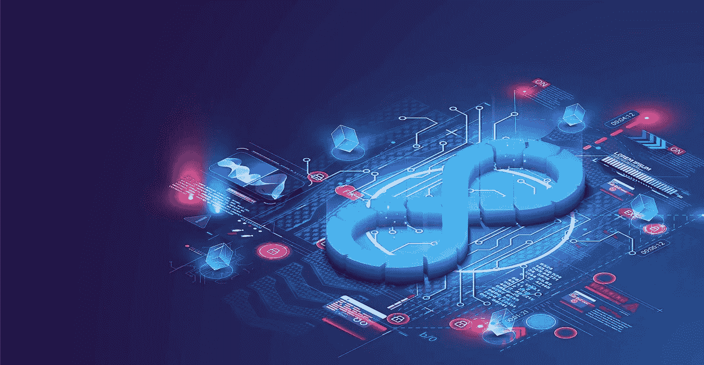

# 元宇宙狂潮。超越 FOMO，站在自动化的顶端。

> 原文：<https://medium.com/coinmonks/metaverse-frenzy-devops-beyond-fomo-and-on-top-of-automation-f532a8a1f272?source=collection_archive---------5----------------------->

## 对互联网下一阶段的兴奋难以抑制，但强大的 DevOps 将设法将其容器化。

清醒的梦，诱人的幻觉，霓虹灯幻想。我们的大脑能够产生的创造力水平是魅力、希望和惊喜的源泉。元宇宙也许是想象力和技术统治的罪魁祸首。这是一种精神和物质的升级，一种新的连接、互动和功能的形式，可能超越网络，以物理和数字的方式投资我们。虽然元宇宙在达到我们所设想的统一的现场体验网络之前还有很长的路要走，但它的许多组成部分正在汇集起来，并且已经有令人印象深刻的资本在发挥作用。Meta(前脸书)已经投资了超过 100 亿美元，虽然它可能是大型科技的先行者，但它肯定不是唯一的一家。

事实上，160 多家公司正在建设元宇宙(来源: [XR Today](https://www.xrtoday.com/virtual-reality/who-is-building-the-metaverse-a-group-of-160-companies-and-you/) )，并致力于基础设施、人机界面、空间计算、数字化和内容等方面。著名的公司包括:《堡垒之夜》的创造者 Epic Games，该公司宣布于 2022 年 4 月从索尼集团公司和 KIRKBI 获得 10 亿美元的融资，以寻求该领域的增长机会；以 Pokémon GO 等游戏而闻名的增强现实平台 Niantic，于 2021 年 11 月以 90 亿美元的估值从 Coatue 筹集了 3 亿美元，以建立一个与一些科幻小说描述的“反乌托邦噩梦”模式相反的元宇宙版本；微软在 2022 年 1 月以 678 亿美元收购了动视暴雪，以加速沉浸式游戏业务。

**闪烁的灯光**

全球企业集团将元宇宙视为一种强大的工具，以新颖、有趣和有意义的方式吸引客户并与之互动，当然还能增加收入。到 2024 年，估计显示这个新生的空间将价值近 8000 亿美元(来源:[彭博](https://www.bloomberg.com/professional/blog/metaverse-may-be-800-billion-market-next-tech-platform/))。随着比赛的进行，无数大大小小的项目涌现出来，它们涉及艺术、娱乐、时尚、生活方式、消费品等等。没有成为头条新闻的是运营商计划如何从软件开发和部署的角度来解决这个问题。这种梦幻般的技术需要一个强大的工具支持系统，以维持其沉浸式应用的质量。DevOps 可以做到这一点，甚至更多。但是 DevOps 又是什么呢？

它是一种持续的、以生产力为导向的方法，用于软件开发团队、云工程师和其他参与产品交付的 It 专业人员之间的流程自动化和集成。它是产品生命周期中速度和凝聚力的推动者，深深植根于团队和团队成员之间的协作、沟通和文化理解。元宇宙的可能范围和技术层在这个婴儿阶段仍然不清楚，像任何新的条目一样，许多方面，如数据安全和隐私，互操作性，ar 和 VR 开发，以及整体安全，都需要定义。然而，广阔的未来状态愿景意味着对扩展的云超可扩展性、供应链安全性、集成扫描、持续测试和不可阻挡的交付的潜在需求。

**优势**

经常被忽视的是元宇宙典型特征背后的连通性想法和改变现实设备(AR、VR、MR 等)的不稳定性之间的对比。)实际上把我们带到了元宇宙。目前，这些设备具有非常短的电力耐久性，并且需要通过物理 5G 网络连接。元宇宙的无线版本需要一些时间来开发，这就是为什么许多人在使用场所方面提到它的用例。它们将涉及家庭生活、工作安排和休闲方面——想想剧院里的娱乐、音乐会上的音乐享受、体育场里的体育观看、商场里的漫步等等。

实际上，DevOps 已经准备好帮助部署的几乎每个方面。该列表包括:快速市场发布——大量新生成的数据和相关信息；通过更明智地使用资源和计算原理来提高性能；精简程序和消除冗余；快速解决 bug 和其他缺陷；更高的软件质量交付标准，更少的错误开始；此外，调整云的使用，关注成本，支持按需环境和能够动态扩展的工具，视情况而定。

许多领导人认为 DevOps 是通往浩瀚元宇宙的秘密通道，无论哪个企业玩家首先掌握它，都将比其他人拥有相当大的优势。DevOps automation 专注于持续构建-测试-发布周期的集成开发管道。在开发人员和工程师之间无缝协作、适应新技术和前沿技术、采用不断发展的工具、持续交付和开放反馈循环(包括用户对界面和设计的观点)的吉星照耀下，这种敏捷衍生的方法对元宇宙大有裨益。

**DevSecOps 安全第一**

元宇宙的安全是一个大话题。它涵盖了用户的个人方面，如身体和情感界限，并深入到他们的身份层次。在基础编程的更深层次上，元宇宙将如何保持安全？在当前的 DevOps 环境中，尽管安全性是一个预期的主题，但在预防性环境中并没有真正的 it 集成。在 DevOps 中，在 CI/CD 管道中实施漏洞扫描被认为是一个谨慎的举措，并被鼓励作为最佳实践，但它不是一个隐含的要求或工作方式。在元宇宙，由于这涉及到软件开发，这种转变将成为保护、维护和捍卫用户的大型敏感数据集的必要手段。提高开发安全性的门槛可以加速自动化工具的采用，并更加强调安全性实践。在这种情况下，DevSecOps 自然会帮助提升行业标准，以满足新提高的标准。最后，灌输安全测试和扫描将为软件发布创建一个安全网，并允许元宇宙连续和安全地运行。

**开发功率**

商业远见者是金子，因为他们的思想激励着世界；但是开发者是钻石，因为他们能把这些想法变成现实。我们日常享受的几乎所有数字创新都是无数开发人员和信息技术专业人员团队的工作成果。元宇宙也会陷入同样的困境——只是一个更大、更深、更广的困境。它将需要大量的 It 资源来构建、支持和交付代码，这转化为不断增长的 DevOps 需求。毫无疑问，软件开发生命周期将会经历剧烈的节奏变化。可以预见，许多新的工具将被创造、学习和使用，以使这种环境繁荣发展。

如果在几乎每个行业都过渡到公共云期间，开发运维团队都感受到了快节奏日常工作的压力，想象一下当公司开始迁移到元宇宙时会是什么感觉。好消息是这种现象并不是一个外来的概念。事实上，诸如可观察性、工具和持续交付等领域的技能提升对 DevOps 团队来说是合适的。为了满足新的要求，他们已经这样做了，并将继续这样做。新的挑战将包括加速交付需求，优化数字系统，因为它涉及到整体最终用户(人/化身)的体验，加强与设计师和 UI/UX 团队的合作，学习和采用新的以元宇宙为中心的工具，在不同平台和服务之间进行集成，以及处理更多的 API。

元宇宙的野心在许多不同类型的玩家心中跳动，他们有着相似的目标和一个共同的软件方法论:DevOps。这种通过发布工作的方法是不可能的；这是必然的，这种新形式的互联网的规模将迫使其全面采用。Big tech 着眼于第一批 10 亿用户，因为它将把领先的实体放在首位。当谈到这个崭露头角的市场中的一种统治形式时，DevOps 可能没有引起每个人的注意，但它实际上是关键。开发和发布完美的软件产品将对成功产生巨大的影响。

**未来风味**

元宇宙就要来了，不管我们信不信，甚至不管我们喜不喜欢。它将主要由漂亮、复杂的软件组成，并期待新的工具来帮助超音速快速、安全和持续的部署。这一切的乐趣将在于弄清楚人类和机器的潜力如何才能恰当地满足这些期望。不容低估的是，元宇宙的 DevOps 可能会成为人工智能训练的部署模型的第一个案例研究，以帮助我们人类适当地分配时间和资源。征服进化了的互联网的新(虚拟)土地将不会仅仅是人类的游戏。但那是在不太遥远的未来的另一个时间的故事。现在，让我们在物理现实中享受我们夏天的人类可持续发展的步伐。感谢科技朋友们的到来。现在请放心离开屏幕，去过你的生活吧。也许有一天这将不再可能。我很快就会把*科技给你*。

> 交易新手？试试[密码交易机器人](/coinmonks/crypto-trading-bot-c2ffce8acb2a)或[复制交易](/coinmonks/top-10-crypto-copy-trading-platforms-for-beginners-d0c37c7d698c)