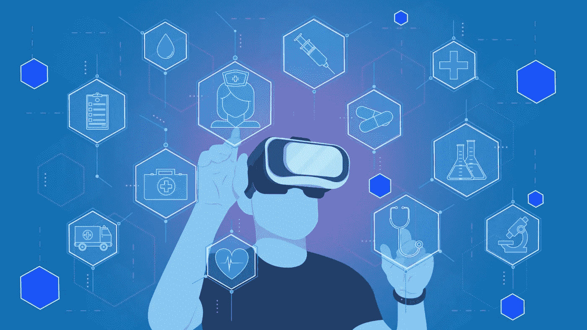

# 元宇宙在医疗保健领域获得牵引力:好处是什么？

> 原文：<https://medium.com/coinmonks/metaverse-gaining-traction-in-healthcare-what-are-the-benefits-3397565e2b41?source=collection_archive---------14----------------------->

元宇宙是转变医疗保健行业的有效工具，越来越多的医疗公司将很快开始加入这一行列。它将帮助医疗部门为患者提供技术先进的虚拟医疗解决方案。

科技在蓬勃发展！最近阅读新技术趋势的任何人都一定目睹了太空中正在出现的演变。那时候，我们接触到了信息高速公路或互联网。没有人真正意识到它的潜力。今天，互联网已经变得如此巨大，以至于整个世界都开始围绕这项技术生活。

日益增长的受欢迎程度加速了对互联网发展的需求。因此，让我们见证网络的成长。目前有三个版本的网络共存，完全无法预测这种演变会走多远。

那三个版本是什么？我们用的第一代互联网是静态的，单向的。后来出现了第二代，它不仅允许我们获取信息，还允许我们提供信息。然后，我们现在使用的第三代。它允许用户在没有第三方参与的情况下控制数据，从而使网络更加面向用户。

这一代人在科技领域开创了一个全新的维度，诞生了元宇宙这个术语。但这是什么呢？为什么医疗保健和其他大型行业的[元宇宙势头越来越猛？让我们在这个博客里讨论一切。](https://www.leewayhertz.com/metaverse/healthcare-solutions/)

# 什么是元宇宙？

元宇宙是一个 3D 虚拟世界的集成网络，为企业和个人提供了无限的可能性。这个想法对许多人来说可能看起来很新，但它是在尼尔·斯蒂芬森 1992 年的科幻小说《冰雪奇缘》中首次描述的。从那时起，新的创新形成了这一概念的基石，引发了世界范围内的猜测。

元宇宙承诺的另一个世界与现实世界平行，但有着不可思议的机遇。我们将真正能够虚拟地行走、见面、社交和做任何事情。此外，数字经济也将存在，允许我们购买、出售和交易元宇宙资产。

但是怎么做呢？这可能是你脑海中不断闪现的问题。好吧，不是你，而是你的数字化身会这么做。这些数字化身将代表虚拟世界中的人类，并执行不同的活动。

在区块链技术的支持下，元宇宙结合了加密货币、NFTs、数字身份、去中心化治理和其他应用，带来了令人难以置信的体验。因此，用最简单的话来说，它是一个比任何视频游戏都更具互动性、共享性、沉浸性、分布性、安全性和民主性的虚拟空间。

# 元宇宙在各垂直行业中的优势

注意到元宇宙的科技巨头们想要探索它的好处。通过获得元宇宙应用程序的[好处，一切都在数字化。在本节中，我们将重点介绍元宇宙的一些潜在使用案例，供您探索。](https://www.leewayhertz.com/metaverse-use-cases-and-benefits/)

## **医疗保健行业的元宇宙**

元宇宙通过提供多种虚拟医疗保健解决方案，在医疗保健行业转型中发挥着关键作用。管理和保护极具价值的健康信息是总部位于区块链的元宇宙在医疗保健领域最突出的使用案例。

## 教育中的元宇宙

随着元宇宙对教育和学习的影响，该行业的潜力似乎很有希望。这种转变将学习体验带到了一个全新的水平。来自医学领域的学生将拥有更深入和高质量的知识资源。

## 游戏中的元宇宙

游戏行业已经广泛采用元宇宙技术，为游戏玩家提供更加逼真和身临其境的游戏体验。它们共同为游戏玩家提供了赚钱和社交的机会。

# 元宇宙将如何在医疗保健行业显现

元宇宙涉及融合三大技术趋势:人工智能、增强现实和虚拟现实。这种技术融合为提供治疗和降低医疗成本开辟了新的渠道。医疗保健行业的元宇宙还有其他一些好处。这些是:

# 虚拟医疗保健解决方案

元宇宙对卫生部门的影响预示着医疗流程的革命。数字化身功能允许医生积累患者的数据，以预测并发症、治疗方法、预防措施和恢复时间。

随着便携式医疗设备与互联网同步，数据积累可能会在我们的家中发生。最重要的是，它还使分享病人的病历变得容易，节省了医生和病人的时间。

# 元宇宙将如何在医疗保健行业显现

元宇宙涉及融合三大技术趋势:人工智能、增强现实和虚拟现实。这种技术融合为提供治疗和降低医疗成本开辟了新的渠道。医疗保健行业的元宇宙还有其他一些好处。这些是:

## 虚拟医疗保健解决方案

元宇宙对卫生部门的影响预示着医疗流程的革命。数字化身功能允许医生积累患者的数据，以预测并发症、治疗方法、预防措施和恢复时间。

随着便携式医疗设备与互联网同步，数据积累可能会在我们的家中发生。最重要的是，它还使分享病人的病历变得容易，节省了医生和病人的时间。

## 医学教育培训

引入元宇宙将解决医疗保健行业教育部门面临的许多困境。传统的训练方法，尤其是外科手术，既昂贵又复杂。在医疗保健培训中使用元宇宙，学生可以在模拟环境中练习手术。这些培训课程将使受训者能够独立工作。进一步提高他们的绩效、技术技能和决策技能。

## 虚拟咨询

远程会诊虽然常见，但有太多的局限性，只能方便于需要目测检查的疾病。虽然正在向虚拟医疗解决方案转变，但依赖传统咨询并不好。取而代之的是，患者现在可以在被限制在自己家里的情况下访问元宇宙的全球医生网络。

# 最后的想法

元宇宙是转变医疗保健行业的有效工具，越来越多的医疗公司将很快开始加入这一行列。它将帮助医疗部门为患者提供技术先进的虚拟医疗解决方案。

除了越来越关注改善患者护理，[元宇宙开发公司](https://www.leewayhertz.com/metaverse-development-company/)还利用元宇宙解决方案推动行业发展。随着更多的进步被提出，在医疗保健中见证更多的发现将是有趣的。

> 交易新手？试试[密码交易机器人](/coinmonks/crypto-trading-bot-c2ffce8acb2a)或者[复制交易](/coinmonks/top-10-crypto-copy-trading-platforms-for-beginners-d0c37c7d698c)