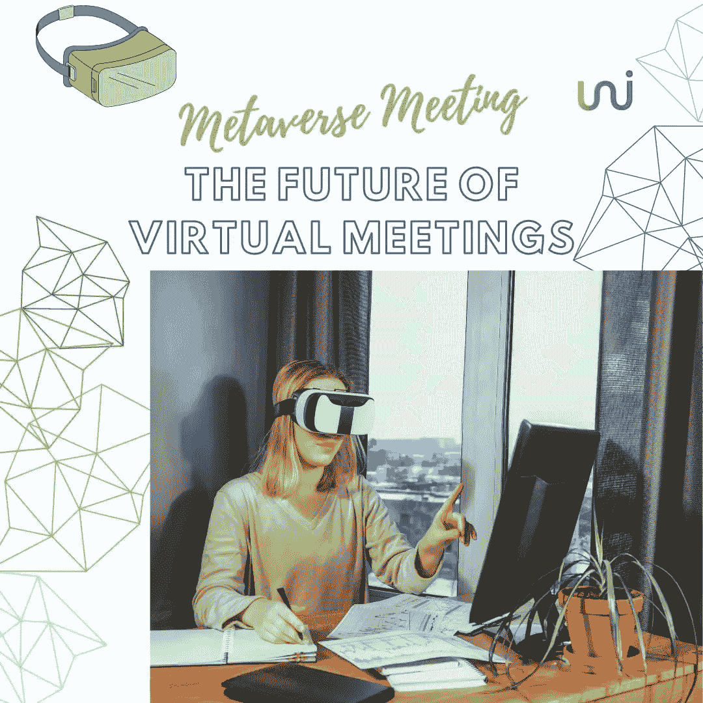
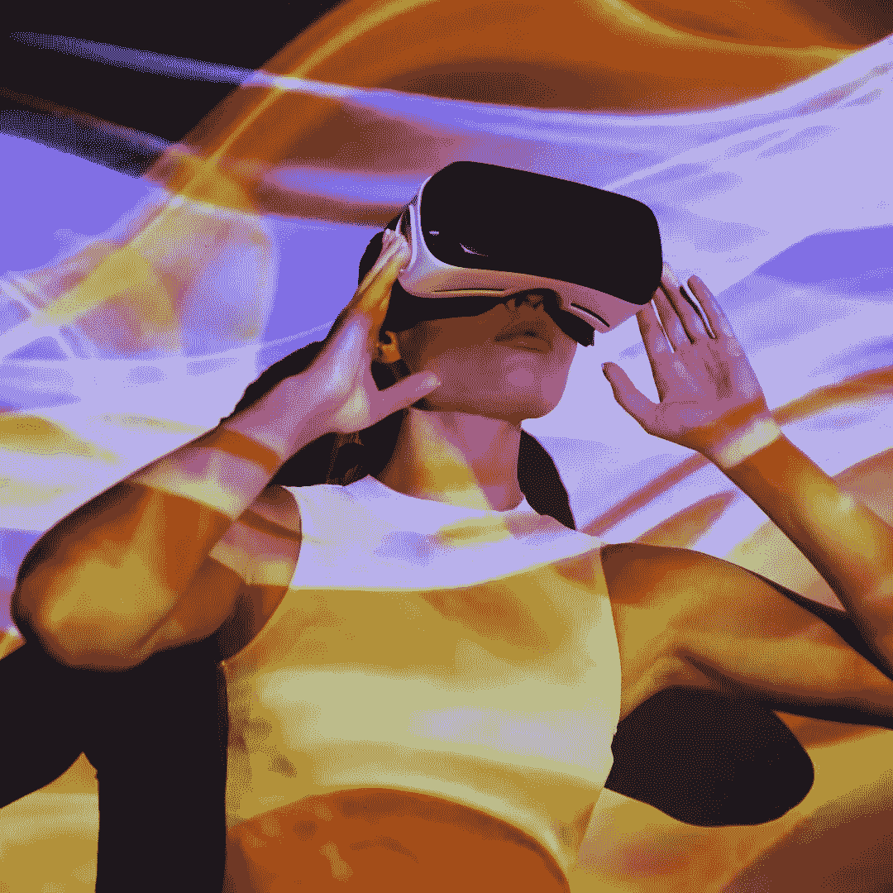
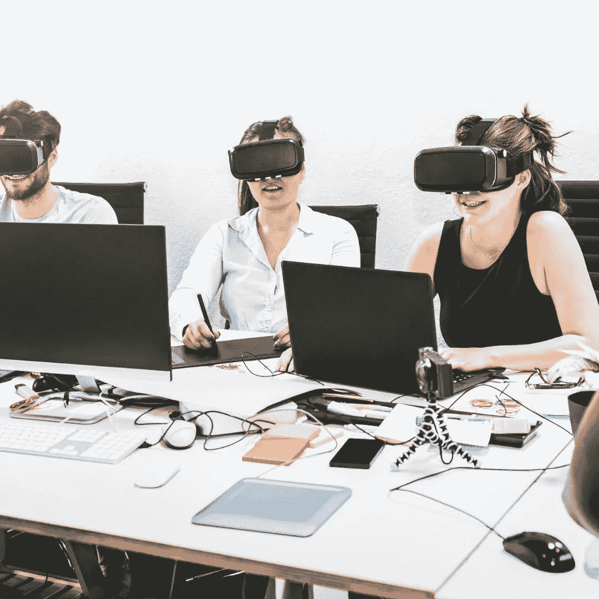

# 元宇宙会议:虚拟会议的未来

> 原文：<https://medium.com/coinmonks/metaverse-meetings-the-future-of-virtual-meetings-uniblok-d62ba60098c?source=collection_archive---------38----------------------->

Metaverse Meetings: The Future of Virtual Meetings

# 什么是元宇宙|为什么创造它

元宇宙旨在吸引用户，并给他们一种错觉，即他们实际上是在已经创建的虚拟现实中。该技术通过允许用户与他们周围的对象更紧密地互动，帮助将协作选项提升到一个新的水平。

What Is Metaverse | Why It Is Created

它不是普通的二维屏幕，而是提供了一个 3D 环境，用户可以在其中与周围发生的事情进行更密切的互动。这项技术不仅对创建增强现实有效，而且还能改变虚拟会议的未来。

# 你为什么需要元宇宙

随着远程工作变得越来越普遍，使用 Zoom、Meet 和 Teams 等平台的虚拟会议已经成为常态。每个参加过这种会议的人都亲身经历过它的许多局限性。这包括轮流，不能看到对方，以及其他一些干扰。

Why You Need Metaverse

虚拟现实环境提供了利用完全交互式虚拟工作站建立沉浸式会议体验的机会。这种体验甚至更加有效，因为你可以看到肢体语言，听到太空音频，所以你可以一个一个说话，而不是轮流说话。

用你的手交流是我们如何与他人互动的一个不可或缺的部分，然后根据姿势倾斜来改变你的注意力是另一个重要的技巧。

# 尤尼布洛克的元宇宙会议

首先我应该向你解释什么是 Uniblok。

Uniblok 是一个分散的区块链市场，为人才(自由职业者)和客户牵线搭桥。这个市场对目前市场上的产品是有效的，下面是原因。

我们提供虚拟的商业环境，让人们觉得他们就在身边。这使得他们可以像在现实世界中一样进行商务会议。元宇宙让你几乎可以和任何人联系，不管他们在现实世界中位于何处。

Metaverse Meeting At Uniblok

我们在元宇宙提供高度协作的工作环境，就像在办公室一样。元宇宙用户甚至可以从各种可定制的会议室和环境中进行选择。

# Uniblok 的元宇宙会议进程

Metaverse Meeting process at Uniblok

**预建的办公环境**

首先，您应该从预先构建的虚拟办公室环境中选择元宇宙内的一个办公室。

**选择一个最能代表你的头像**

从可用选项中选择您的头像以开始会议。

**迎上去**

选择好会议环境和头像后，您就可以准备在元宇宙召开会议了。

## 在上查看 [Uniblok](https://uniblok.io/)

[Instagram](https://www.instagram.com/uniblok_techpvtltd/) | [脸书](https://www.facebook.com/Uniblok-Tech-Pvt-Ltd-115934447782742/)|[Linkedin](https://www.linkedin.com/company/uniblok-tech-pvt-ltd)|[Twitter](https://twitter.com/UniblokPVTLTD)|[Pinterest](https://in.pinterest.com/UniblokTechPvtLtd/)

> 交易新手？尝试[加密交易机器人](/coinmonks/crypto-trading-bot-c2ffce8acb2a)或[复制交易](/coinmonks/top-10-crypto-copy-trading-platforms-for-beginners-d0c37c7d698c)