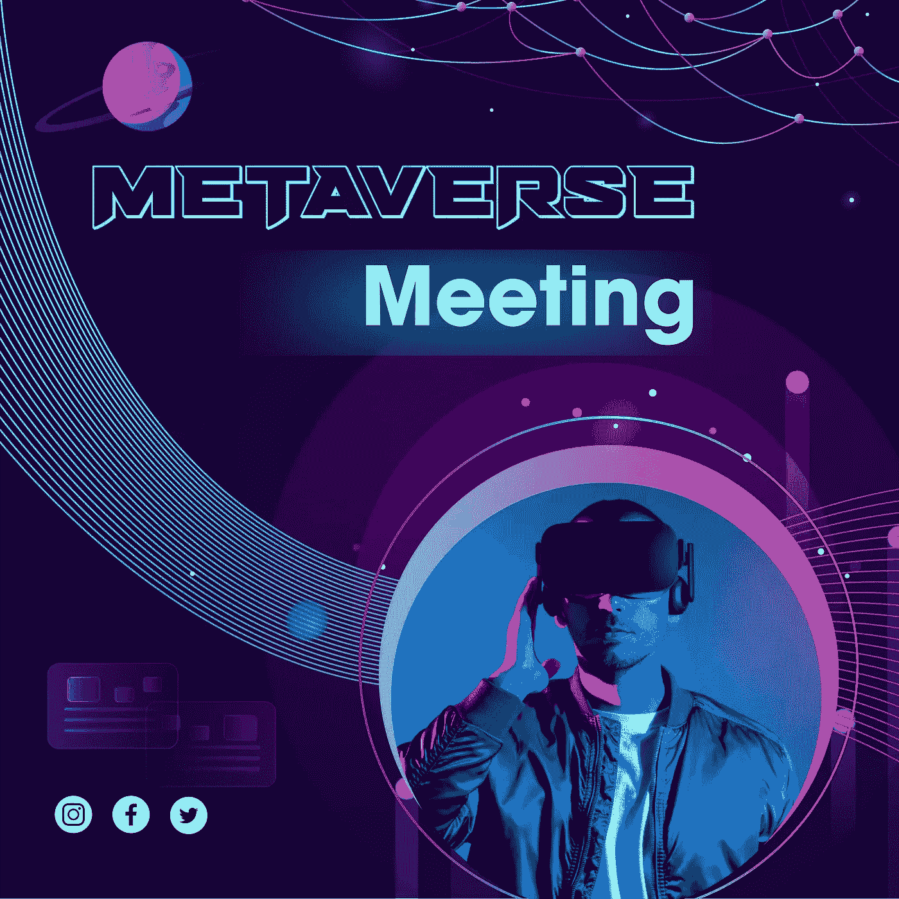

# 元宇宙会议:它是什么？Uniblok 打算如何使用它

> 原文：<https://medium.com/coinmonks/metaverse-meetings-what-is-it-and-how-will-uniblok-intends-to-use-it-d65e04960f34?source=collection_archive---------44----------------------->

metaverse meeting at uniblok

元宇宙指的是虚拟现实和混合现实世界的混合，可以通过浏览器或耳机访问。这使得人们能够远距离地相互交流和体验实时互动。

当考虑元宇宙时，有必要记住它不是一个单一的位置。这是新数字空间的顶峰，人们称之为下一代互联网。使用元宇宙，用户将能够体验物理和数字世界的融合，这种体验不仅仅是简单地观看数字内容。元宇宙没有尽头，它是无限的、持久的、完全可互操作的。

# 为什么元宇宙对专业人士很重要

由于越来越多的组织采用远程工作实践，虚拟会议已经成为企业的重要组成部分。虽然有各种各样的平台可用于虚拟会议，但这些平台只能用于进行音频或视听会议。参加会议的专业人员意识到这些平台有几个缺点，包括视频质量差、音频质量差以及许多其他可以被认为是缺点的方面。

专家估计 70-90%的交流是非语言的，比如肢体语言。这样做的目的是帮助你理解他人的感受，以便相应地调整你的沟通。它还可以通过显示你参与了与他人的对话来帮助你建立关系。

肢体语言经常在交流中被无意识地使用。如果一个人在会议上打哈欠，或者在老板讨论每月销售目标时用手指敲桌子，他们可能会被认为不感兴趣和有压力。你可以通过改善你的姿势给人留下你感兴趣和专注的印象。

当你在一个在线平台上与客户/人才进行在线会面时，你无法准确判断他们是否在关注你。

有一种旨在虚拟会议中解决所有这些问题的解决方案，它被称为“元宇宙会议”。使用元宇宙会议，您可以建立一个交互式的虚拟商务会议环境，在这个环境中，与会者能够看到彼此的肢体语言，感觉就像他们一起坐在一个公司的环境中。

# 尤尼布洛克的元宇宙

我们在 Uniblok 观察到，客户和人才从遥远的地方一起工作，他们只有通过视频通话或音频通话的沟通媒介。客户和人才之间存在巨大的沟通鸿沟，因为他们无法以自己喜欢的方式进行沟通。为了最大限度地减少客户和人才之间的沟通差距，我们引入了元宇宙会议的概念。

Uniblok 将使用元宇宙作为视频通话的补充。在元宇宙，人们可以通过 oculus 眼镜看到彼此，并且可以看到通话中其他人做出的任何手势。虽然这可能无法解决整个问题，但当你注意到对方积极参与会议时，这将有助于你建立信任。

我们使用元宇宙的另一个原因是为了确保我们为用户提供高质量和真实的会议体验。

# 如何主持元宇宙会议

你可以作为客户或人才加入 Uniblok。为了在元宇宙举行商务会议，你必须遵循以下步骤。

**选择业务环境:**第一步是选择最适合您的业务需求或您认为理想的预先构建的业务环境。

**选择头像:**为了在元宇宙与他人交流，你需要选择一个头像。

**开始会议:**现在，您可以通过聊天机器人向其他参与者发送链接，开始您的元宇宙会议。

# 最后的想法

这篇文章的目的是向你解释为什么最好在元宇宙举行商务会议，而不是通过其他沟通渠道。在元宇宙会议期间，专业人员可以根据自己的需要在更真实的业务环境中工作，并尽可能有效地解决远程通信中的冲突。

> 交易新手？尝试[加密交易机器人](/coinmonks/crypto-trading-bot-c2ffce8acb2a)或[复制交易](/coinmonks/top-10-crypto-copy-trading-platforms-for-beginners-d0c37c7d698c)