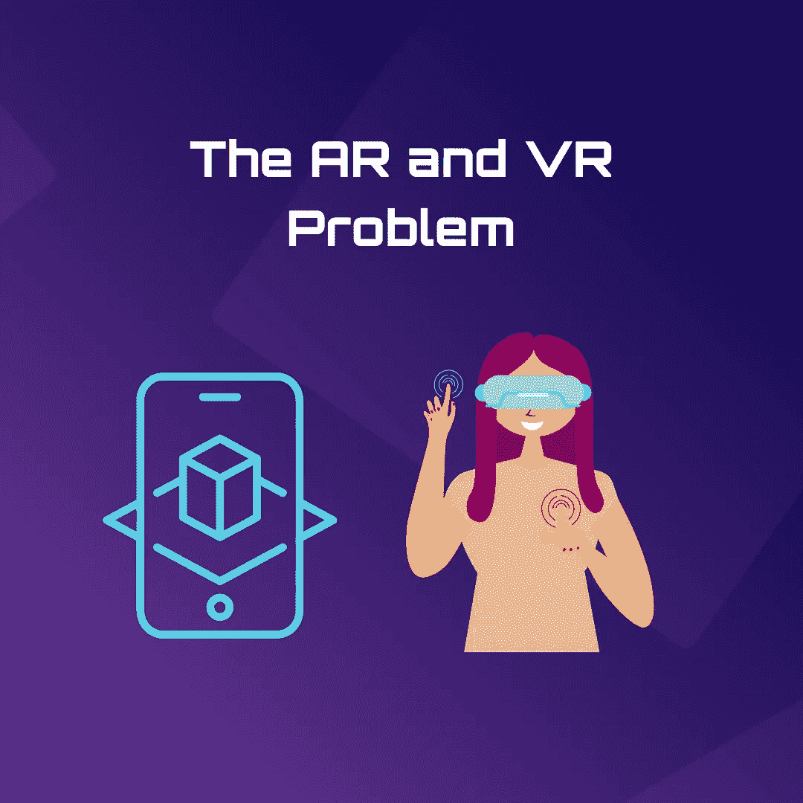
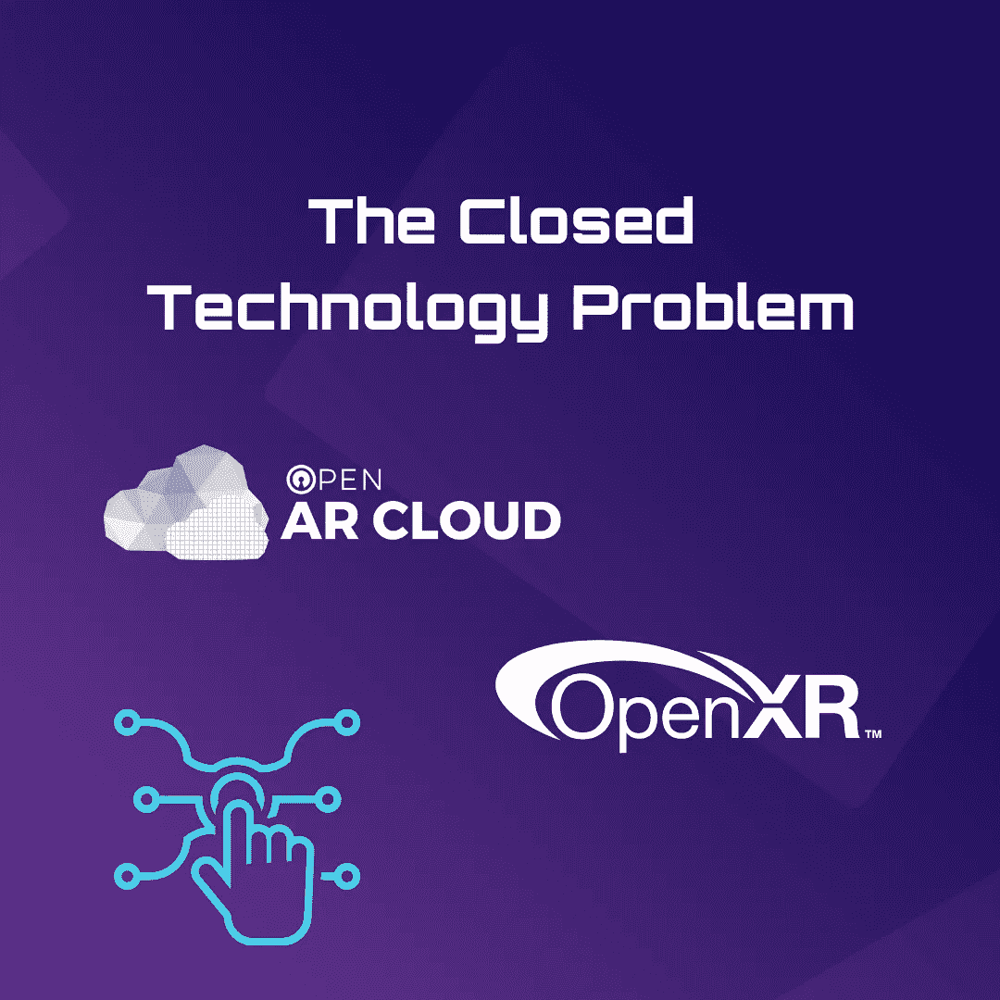

# 元宇宙——前路漫漫

> 原文：<https://medium.com/coinmonks/metaverse-the-long-road-ahead-f552a7790f26?source=collection_archive---------39----------------------->

阿瑟·柯南·道尔说“健康的怀疑主义是所有精确观察的基础。”如果创造夏洛克·福尔摩斯的人对观察有这样的看法，我们最好留心。是的，元宇宙是一个非常乐观的地方。是的，它可以解开我们所知的网络枷锁，帮助数百万人上网。元宇宙确实是一线希望。但是，请记住，健康的怀疑态度是至关重要的！

我们早就认识到，互操作性是一个关键的障碍，元宇宙要想生存下去，更不用说蓬勃发展，就必须跨越这个障碍。但是，我们看到这个问题的解决方案了吗？此外，我们是否完全了解解决这个问题将会有多困难？Meta 的首席执行官马克·扎克伯格多次谈到统一的 T2 元宇宙，一个沉浸式网络世界的无缝网络。这些平台真的会不管平台归哪个公司所有而协同工作吗？或者，我们是否正在走向一个生态系统，那里将会有许多支离破碎的世界？如果每个这样的世界都有自己的宇宙经验碎片，那么统一的元宇宙可能是一个遥远的梦想。

# **互操作性问题**

首先，让我们承认不同的公司对元宇宙有不同的理解。这是一个非同小可的问题，因为我们仍在为元宇宙奠定基础。如果在现阶段对元宇宙将采取什么样的形式没有共识，我们很可能要同时处理许多问题。除此之外，不管它们将采取何种形式，这些平台都将拥有很大的权力，并为平台所有者提供寻租机会。现在，这些平台甚至没有建立统一战线的动机！让我们检查一下当前的场景；如果你想出售一款 iPhone 应用，你当然可以，但你必须向苹果支付一部分收入。如果这种模式在元宇宙复制，实际上有一个平台的动机，使他们的平台不同于其他平台，并随后在他们周围竖起一堵墙。再见了，统一的元宇宙。即使像消息服务这样看似简单的东西也是不可互操作的。WhatsApp 和 iMessage 是分开的，两者不会相遇。如果互操作性在这个领域是一个如此大的挑战，我们是否应该对 Web3.0 的情况有所不同抱有希望呢？

# **AR&VR 问题**

互操作性不仅仅是平台的问题，也是元宇宙将要使用的工具的问题。将充斥元宇宙的身临其境的数字世界也将需要使用各种各样的虚拟现实技术和增强现实技术。例如，要让[玩沉浸式游戏](https://www.cnet.com/news/how-the-game-industry-is-charging-into-the-metaverse/)，把自己变成酷酷的头像，或者去[虚拟购物](https://www.cnet.com/tech/computing/features/shopping-in-the-metaverse-could-be-more-fun-than-you-think/)，你需要合适的耳机。

人们普遍认为，元宇宙将带来丰富的经验和活动。它将不仅限于游戏和娱乐，还将包括工作会议和虚拟教育等内容。现在，每一种体验可能需要不同的工具。因此，AR & VR 工具的问题。当用户访问元宇宙的不同部分时，期望他们能够访问他们需要在不同排列中使用的各种各样的工具是可行的吗？元宇宙真的有可能打开一扇通往身临其境和令人兴奋的体验的大门。但是，考虑到获得一套合适的工具是多么复杂，有多少人会真正体验过元宇宙呢？

# **封闭技术问题**

拥有一个共享的、共同的基础设施可能对元宇宙大有裨益。在这个领域也有一些萌芽。恰当的例子；[开放增强现实云](https://www.openarcloud.org/)，是一个非营利性的云协会，可以帮助建立增强现实耳机的数字数据库。同样， [OpenXR](https://www.khronos.org/openxr/) 是另一个接口，程序员可以在这里为各种 AR 和 VR 头戴设备编写软件。有更多这样的计划，但是有足够的公共基础设施吗？

答案是否定的。如果元宇宙要成为一个可行的提议，结成联盟帮助构建一个共同的基础设施是至关重要的。

最终，努力是为了元宇宙的成功。它的成功在于有大量的机会，可以打开一系列经验的大门。然而，除非我们解决某些基础问题，否则成功肯定是难以捉摸的。当我们继续寻找解决方案时，也许明智的做法是记住阿瑟·柯南·道尔说过的话。健康的怀疑态度不仅有益，而且必不可少。

> 交易新手？试试[加密交易机器人](/coinmonks/crypto-trading-bot-c2ffce8acb2a)或者[复制交易](/coinmonks/top-10-crypto-copy-trading-platforms-for-beginners-d0c37c7d698c)