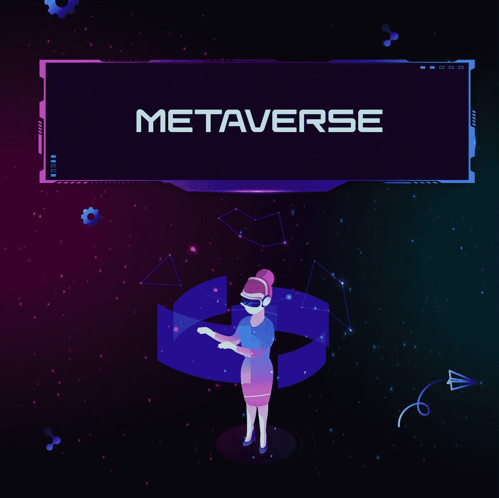
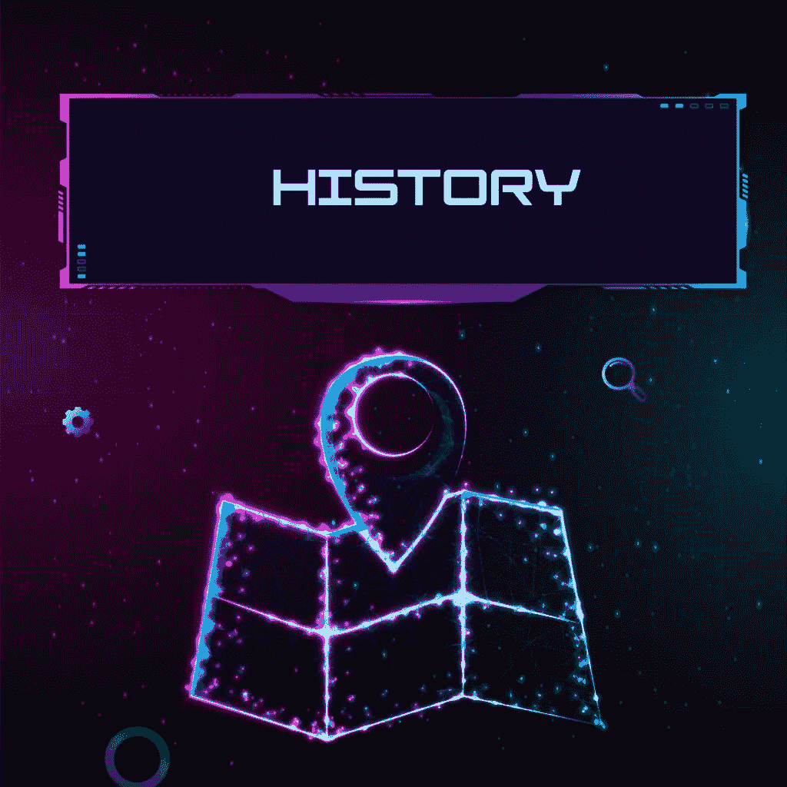
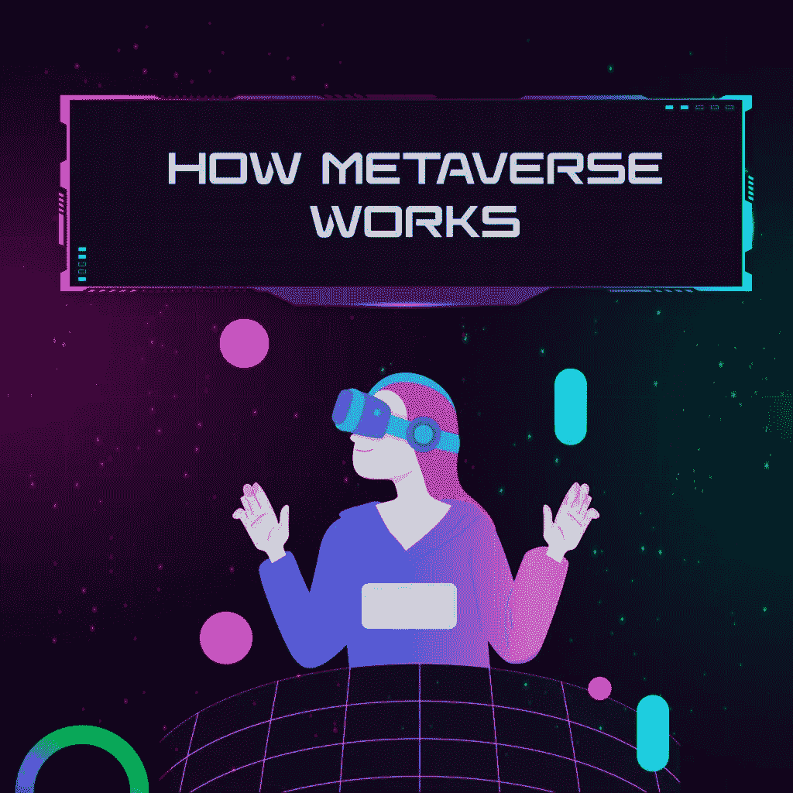
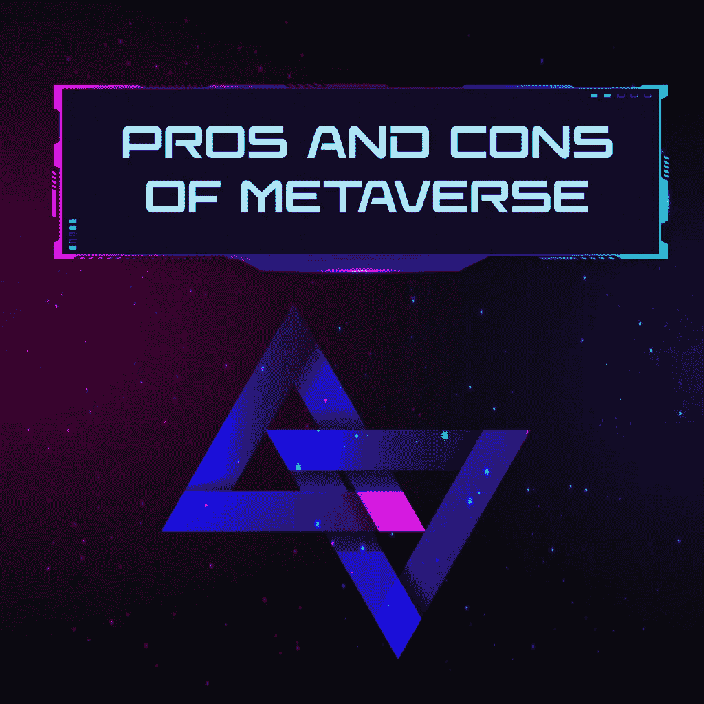
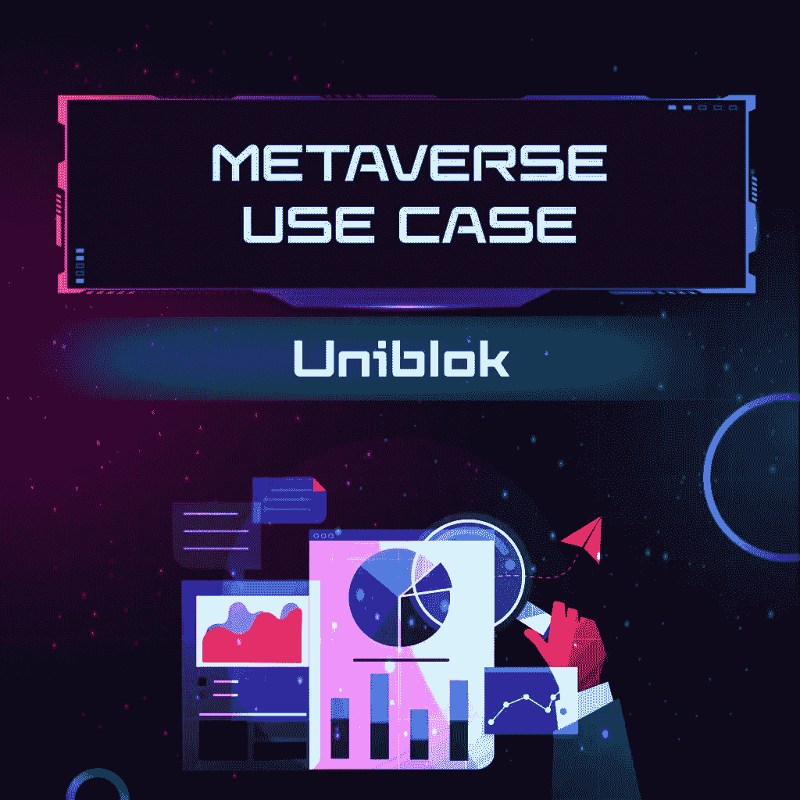

# 元宇宙将是科技领域的下一个大事件

> 原文：<https://medium.com/coinmonks/metaverse-will-be-the-next-big-thing-in-technology-6ad323766ce5?source=collection_archive---------38----------------------->

Metaverse will be the next big thing in technology

元宇宙是一项新兴技术，它将改变我们未来的生活和互动方式。该视频探讨了元宇宙背后的概念及其对社会的潜在影响。

## 什么是元宇宙？

元宇宙是一个新型的在线世界，人们可以在这里见面、交流和相互合作。它类似于第二人生，只不过它比第二人生更具沉浸感，因为它允许用户在空间中移动，也可以从不同的角度看到自己。

## 元宇宙在印地语中的意思

मेटावर्स एक नए प्रकार की ऑनलाइन दुनिया है जहां लोग एक-दूसरे से मिल सकते हैं, संवाद कर सकते हैं और सहयोग कर सकते हैं। यह सेकेंड लाइफ के समान है, सिवाय सेकेंड लाइफ की तुलना में यह अधिक इमर्सिव है क्योंकि यह उपयोगकर्ताओं को अंतरिक्ष के माध्यम से स्थानांतरित करने के साथ-साथ विभिन्न कोणों से खुद को देखने की अनुमति देता है।

# 元宇宙历史

history of metaverse

1838 年，查尔斯·惠斯通爵士引入了“双目视觉”的概念，即将两幅图像——每只眼睛一幅——组合成一幅 3D 图像。

由于这一概念，立体镜被开发出来，这是一种利用深度错觉来创造图像的技术。现代 VR 头戴设备中使用了相同的概念。

我们的下一步发生在 1935 年，斯坦利·温鲍姆出版了《皮格马利翁的眼镜》。这是一部科幻小说，主角通过一副提供视觉、声音、味觉、嗅觉和触觉的护目镜探索一个虚构的世界。1956 年，Morton Heilig 开发了第一台虚拟现实机器 Sensorama Machine。

作为这个项目的一部分，一台模拟在布鲁克林骑摩托车的机器被创造出来，它将三维视频与音频、气味和振动椅子相结合，让观众沉浸在这种体验中。1960 年，Heilig 获得了第一个结合立体 3D 图像和立体声的头戴式显示器的专利。

20 世纪 70 年代，麻省理工学院创建了阿斯彭电影地图，允许用户在科罗拉多州阿斯彭镇进行计算机生成的旅行。这是我们第一次能够使用 VR 将用户运送到另一个位置。

尼尔·斯蒂文森 1982 年的小说《雪灾》创造了“元宇宙”这个词。史蒂文森笔下的元宇宙是一个虚拟的世界，在那里，人物可以逃离一个阴冷的极权主义世界。

在 20 世纪 90 年代初，世嘉推出了 VR 街机，如 SEGA VR-1 运动模拟器，用户在许多街机上享受。

1998 年，Sportsvision 直播了第一场使用黄色场地标记的 NFL 比赛。将图形覆盖在真实世界视图上的想法迅速传播到其他体育转播商。

18 岁的企业家兼发明家帕尔默·卢奇(Palmer Luckey)在 2010 年开发了 Oculus Rift VR 头戴设备的原型。由于其 90 度的视野和计算机处理能力的使用，这款革命性的耳机重新点燃了人们对虚拟现实的兴趣。

随着 2011 年欧内斯特·克莱恩(Ernest Cline)的小说《就绪玩家一号》(Ready Player One)的发行，我们再次得以一瞥一个完全沉浸式的世界，在这个世界中我们可以逃避现实。2018 年，史蒂文·斯皮尔伯格执导了一部基于该书的电影，获得了巨大成功。

Oculus VR 于 2014 年被脸书以 20 亿美元收购。脸书创始人马克·扎克伯格(Mark Zuckerberg)当时表示，脸书和 Oculus 将合作开发 Oculus 平台，并发展合作伙伴关系以支持更多游戏。

2014 年，索尼和三星都宣布将开发 VR 头戴设备，谷歌发布了第一款 Cardboard 设备和谷歌眼镜 AR 眼镜。Cardboard 是谷歌推出的一款用于智能手机的低成本 cardboard VR 浏览器。

凭借微软的 HoloLens 头戴式设备，混合现实在 2016 年首次推出(AR 和 VR)。通过使用 HoloLens，我们能够在我们面前创建一个全息图像，然后在现实世界中使用增强现实来操纵它。

2016 年，世界各地的人们都在玩增强现实游戏 Pokémon GO，以便在他们的街区捕捉神奇宝贝。

作为 Place 应用程序的一部分，瑞典家具巨头宜家在 2017 年进入了元宇宙 mix，允许用户选择一件家具，并查看它在自己家里或工作场所的外观。

截至 2020 年，苹果将为 iPhones 和 iPads 添加激光雷达(光探测和测距)，实现更好的深度扫描以获得更好的照片和 ar，并为混合现实耳机铺平道路。

2021 年，脸书更名为梅塔，表明其专注于塑造元宇宙的未来。

# 元宇宙是如何运作的

working of metaverse

以下技术的出现使得身临其境的体验成为可能:

## 虚拟现实

它让用户沉浸在物理世界的数字复制中，并允许他们与它相关联。数字媒体的内容是人造的，是模仿现实世界中的内容。

在虚拟现实中，环境是通过 360°摄影和摄像以数字方式捕捉的，这允许用户从更具反应性的角度体验捕捉到的时刻。VR 头戴设备实现了这种类型的现实。

## 增强现实

有现实世界和一些数字元素的结合。通过使用智能手机显示屏或耳机，虚拟元素在现实世界中得到增强。因此，用户仍然能够在利用一些数字功能的同时体验现实世界。

## 混合现实:虚拟现实和增强现实的结合

这种身临其境的体验融合了虚拟和增强现实，创造出令人印象深刻的身临其境的体验。它结合了虚拟和全息图像，用户戴上定制的眼镜即可观看。

通过虚拟耳机，用户的外围视觉被屏蔽，因为他们专注于他们面前的数字启示。此外，耳机降低了物理声音，因此用户可以专注于虚拟声音。

某些虚拟现实配件也增强了触觉。触觉反馈系统使用户能够在数字世界发生任何事情时感受到振动。

# 元宇宙的优点和缺点；

advantages and disadvantages

## 元宇宙的优势:

**沉浸在数字通信中:**元宇宙的主要好处是，它允许人们在复杂、逼真的虚拟环境中导航时，通过角色与其他人进行互动。

**改善社交媒体渠道:**社交媒体网站和应用是二维的，因为互动仅限于屏幕对屏幕。借助完全沉浸式和图形丰富的虚拟环境，可以建立虚拟面对面接触，同时为在虚拟生态系统中发现或创建的数字材料提供许多使用案例。

**商业应用:**技术还能让企业扩大选择范围。与社交媒体改变数字营销和广告的方式类似，它提供了一种身临其境的方式，通过类似的营销材料和广告、虚拟商店、客户支持和更多的互动参与来展示他们的产品和服务。因此，开辟了工作场所沟通和协作的新途径。

## 元宇宙劣势；

更快更可靠的互联网连接:元宇宙是一个可以共享的图形丰富的虚拟世界。可靠和快速的互联网接入需要基于光纤的连接和第五代无线网络。

**缺乏适当的数字工具:**另一个缺点是，它将那些有资源获取和利用必要的数字工具的人与那些没有这些资源的人隔离开来。这对贫困的社区和家庭没有好处。

**与现有互联网相关的问题:**安全和隐私风险、网络欺凌、虚假信息传播以及其他形式的网络犯罪仍未得到解决。随着技术的进步，这些问题将变得更加尖锐。

# 元宇宙耳机:

VR 头戴设备提供的不仅仅是立体显示。VR 头戴设备通常包括立体声、陀螺仪、加速度计、磁力计和结构光系统。

有一些配备有内置输入设备的耳机被用作游戏控制器。这些功能的结合创造了一种虚拟现实体验，感觉就像你的物理环境一样真实。

耳机的模拟越精确，它需要的处理能力就越强。有更便宜、更具沉浸感的虚拟现实耳机可以与智能手机一起使用。

然而，最先进的型号需要一台 PC 和一个高端显卡。

## 脸书首席执行官奎斯特·元宇宙

马克·扎克伯格在一次在线开发者大会上推出了一款新的虚拟现实耳机 Quest Pro。

Quest Pro 的售价为 1499 美元，几乎是 Meta 当前耳机 Quest 2 的四倍。

有更薄的镜片，头带周围的弧形电池和自动跟踪控制器。

此外，耳机允许用户查看屏幕周围的真实环境。

使用 Quest Pro，您可以看到覆盖在真实世界上的数字内容，这与它的前身不同。

Meta 老板马克·扎克伯格认为，混合现实是虚拟现实发展的下一个重要步骤。

# 元宇宙密码相关

[**加密货币**](https://uniblok.io/a-full-guide-to-understand-cryptocurrency-uniblok/) 和元宇宙是非常不同的概念。在他们的发展过程中，他们可能会变得非常依赖对方。

首先，让我们来看看加密货币和元宇宙的核心技术:区块链。

区块链是一种记录交易数据的公共数字账本，这一概念最初由比特币创始人中本聪创建，现在被以太坊等许多其他大型加密货币采用。

区块链网络的使用允许点对点交易在没有中介(如银行或科技公司)参与的情况下进行。这可以带来许多好处，包括降低成本和加快交易过程。

在互联网上，商业仍然使用传统法定货币的数字化版本进行。区块链技术及其相关货币是作为数字环境中的交易手段而开发的。

据推测，拥有 3D 虚拟世界和沉浸式服务的 metaverses 也在利用区块链技术在互联网用户之间创建无需许可的互动。

# 元宇宙用例

在教育、游戏、旅游、医疗保健等所有关键领域，元宇宙应用的使用越来越多。超过 40%的 AR 和 VR 趋势基于元宇宙方法，因此让我们检查一些适用于不同行业的示例和应用:

## 游戏:

博彩业是元宇宙的核心和主要投资者。有了这项技术，玩家可以在一个可互操作的环境中相互交流。

## 教育:

除了其他应用之外，元宇宙还为教育和学习提供了巨大的潜力。结合元宇宙的效果，虚拟现实在质量水平上增强了学习体验。

现在，学生可以利用更全面、更高质量的知识资源查看现场实验。

## 远程工作:

元宇宙改变了传统的商业模式。已经有一些企业在元宇宙虚拟商业架构下运作。

耐克、YouTube、麦当劳以及 Gravity Sketch 和 Upland 等新兴创业公司都在利用虚拟办公室。

## 工作市场:

目前，有一个名为 Uniblok 的工作外包市场，利用元宇宙为客户和人才举行会议。

# [在元宇宙的会议](https://uniblok.io/metaverse-meeting-at-uniblok-explained/)在 Uniblok

Uniblok 观察到，客户和人才在远程位置工作，除了视频和音频通话之外，他们的通信选项有限。

客户和人才不能以方便他们的方式沟通，这导致了明显的沟通差距。我们引入了元宇宙会议的概念，以尽量减少客户和人才之间的沟通差距。

Uniblok 打算将元宇宙与视频通话结合使用。在元宇宙，人们可以通过 oculus 眼镜看到彼此，并可以看到彼此的手势。

当你注意到对方积极参与会议时，你就会建立起信任，即使这并不能解决整个问题。

使用元宇宙的另一个原因是确保为我们的用户提供高质量和真实的会议体验。

## 如何在 Uniblok 进入元宇宙:

**选择商业环境:**第一步是找到一个符合你业务要求的预先构建的商业环境。

**头像选择:**为了与元宇宙中的其他参与者交流，你必须选择一个头像。

**开始会议:**您现在可以通过聊天机器人向其他参与者发送链接来发起元宇宙会议。

**访问我们的网站:**[https://uniblok.io/](https://uniblok.io/)

**在以下网站查看 Uniblok:**[insta gram](https://www.instagram.com/uniblok_techpvtltd/)|[脸书](https://www.facebook.com/Uniblok-Tech-Pvt-Ltd-115934447782742/)|[Linkedin](https://www.linkedin.com/company/uniblok-tech-pvt-ltd)|[Twitter](https://twitter.com/UniblokPVTLTD)|[Pinterest](https://in.pinterest.com/UniblokTechPvtLtd/)

> 交易新手？尝试[加密交易机器人](/coinmonks/crypto-trading-bot-c2ffce8acb2a)或[复制交易](/coinmonks/top-10-crypto-copy-trading-platforms-for-beginners-d0c37c7d698c)