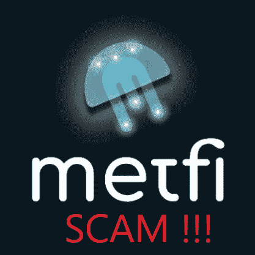
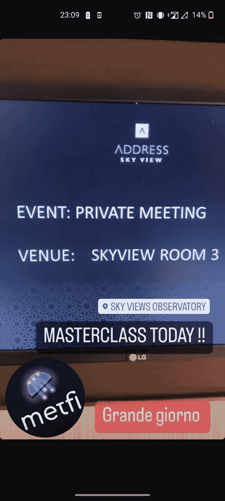
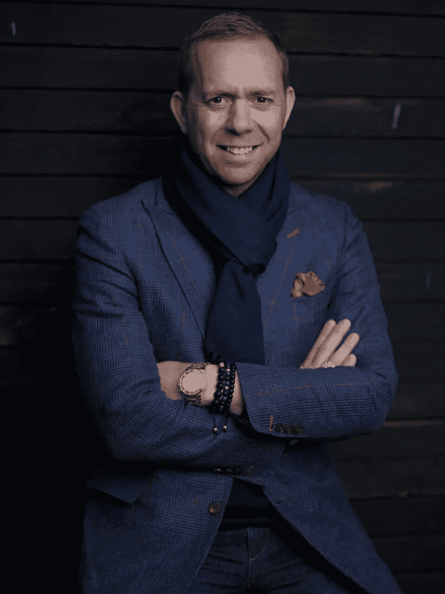
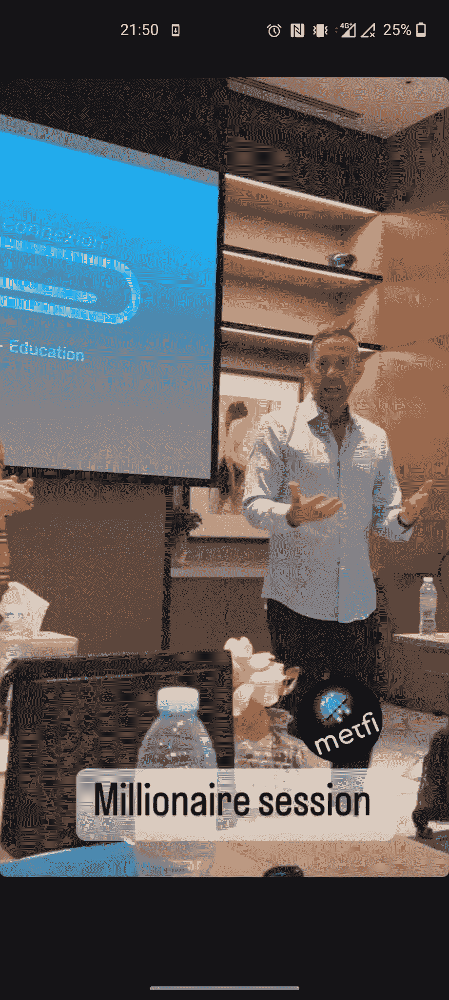
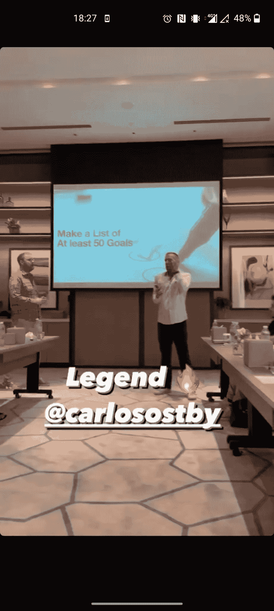
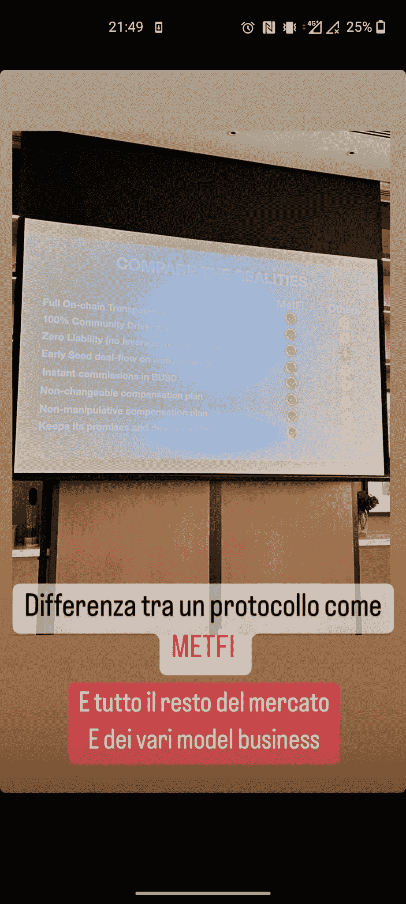
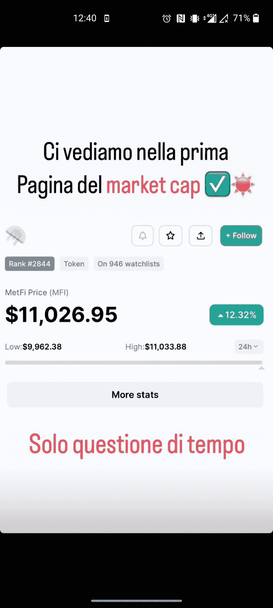
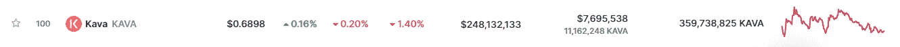

# MetFi:骗局必须继续

> 原文：<https://medium.com/coinmonks/metfi-scam-must-go-on-3c0d93fd2fcc?source=collection_archive---------4----------------------->

与麦特菲庞氏骗局有关的电视剧还在继续。我已经在两篇独立的文章中告诉过你这个骗局(你可以在这里阅读[这里阅读](https://www.newcoinpost.com/blog/metfi-the-last-bullst-has-arrived)和[这里阅读](https://www.newcoinpost.com/blog/when-binance-guides-you-on-how-to-buy-a-ponzi-scheme))，我决定在这篇文章中再次告诉你，这篇文章的标题让人想起 1991 年女王发布的著名歌曲“秀必须继续”。

MetFi is a scam

2022 年 12 月 19 日，MetFi 的私人会议在迪拜的 Address Sky View 酒店举行。

> 从顶级交易者那里复制交易机器人。免费试用。

The event held by MetFi

卡洛斯·奥斯比出席了这次活动，他是网络营销的知名人士，也是 Organo Gold 的前[黑钻石。他自称为“百万富翁蔻驰”。](https://www.youtube.com/watch?v=ECy9YCa086U)

Carlos Oestby

2016 年，他离开 Organo Gold 加入了 [Coinspace](https://www.youtube.com/watch?v=5h1Uj3bduxc) ，这是一个庞氏骗局，显然在几个月后崩溃，并导致那些相信这个骗局的人失去了他们的钱。根据他们的[网站](http://www.coinspace.eu/)仍然在线，他们的承诺(未实现)可以阅读:*“我们的激情是满足并超越客户的期望”*(然后我会添加小丑表情符号🤡后面)。

The dead and buried Coinspace

Coinspace 从事的是加密货币挖矿，但最有意思的收入是通过向被招募的人出售[各种套餐](https://www.youtube.com/watch?v=YJVeYV_pa-A&t=1306s)获得的。显然，Coinspace 在任何地方都是 100%滥用的，2017 年[马耳他](https://www.mfsa.mt/news-item/mfsa-warning-coinspace-ltd-http-www-coinspace-eu/)和[意大利](https://www.consob.it/web/area-pubblica/bollettino/documenti/hide/cautelari/soll/d19866.htm)金融当局警告投资者，Coinspace 没有任何授权在马耳他和意大利运营，并请他们警惕这一骗局。只要在谷歌上搜索“Carlos Oestby Coinspace”和这个恶棍谈论“公司愿景”、“难以置信的机会”和惯常滑稽动作的[视频](https://www.youtube.com/watch?v=nwBiq3Z9cNA)，仍然可以很容易地找到。下面你可以在私人会议期间看到他。

Carlos Oestby during the private meeting of MetFi

Carlos Oestby during the private meeting of MetFi

我在 Instagram 上看到一个参与者的故事，其中 Carlos Oestby 说了一些常见的网络营销行话，比如“你必须找到你的目的”或“你必须找到你的为什么”。这些小丑对加密货币一无所知，他们的业务建立在这种模糊和陈腐的说法上。我就不跟你说我见过的那些脏话了，包括:“全链透明”或者“信守承诺，按时交货”。

According to MetFi scammers these are the main differences between MetFi and others

翻译过来就是:“像 MetFi 这样的协议与市场上所有其他协议和各种商业模式之间的区别”。同样在 Instagram 上，这些[恶棍中的一个](https://www.newcoinpost.com/blog/stay-away-from-cryptogurus-on-instagram-and-all-social-media)几天后说:“市值第一页见。这只是时间问题”。

The Instagram story

我不知道什么“市值”，我知道 [CoinMarketCap](https://coinmarketcap.com/invite?ref=2D553MCT) 。我应该补充的是，今天当我写这篇文章时，在 CoinMarketCap 的第一页上排名第 100 位的是卡瓦，它的市值接近 2.5 亿美元，在过去 24 小时内的交易量为 760 万美元。

Kava (KAVA)

我怀疑 MetFi 公牛队能达到那个数量。这些 MetFi 骗子大多是意大利人，当你看到他们的 Instagram 档案中充满豪车和旅行时，问问自己他们从哪里得到这些钱。他们既不是企业家，也没有创建过公司。他们欺骗人们，让他们能够负担得起他们的生活方式。大部分位于阿联酋迪拜或者经常去那里。据 MLM 背后的[称，迪拜是世界 MLM 诈骗之都。在评估一个加密项目时，不要落入他们的陷阱，永远不要 DYOR。](https://behindmlm.com/mlm/theory/why-dubai-is-the-mlm-scam-capital-of-the-world/)

***免责声明*** *:我不知道所使用的图片有任何第三方权利。如有任何资料来源，我保证予以引用，如有要求，我将调整立场。*

***免责声明*** *:交易加密货币具有较高的风险，不一定适合所有投资者。在决定交易加密货币之前，你应该仔细考虑你的投资目标和你的经验水平。自己做研究。此处表达的所有观点归各自作者所有，不应被视为任何形式的财务建议。*

*关于作者*

[*CRYPTO _ ALBERT*](https://twitter.com/albertovischio?t=C3Xj9pTm9Q7EZqwjrGHQdA&s=09)

*主编* [*新币帖*](https://www.newcoinpost.com/) *。我帮助人们更好地理解加密货币领域及其目的。*

> 加入 Coinmonks [电报频道](https://t.me/coincodecap)和 [Youtube 频道](https://www.youtube.com/c/coinmonks/videos)了解加密交易和投资

# 另外，阅读

*   [有哪些交易信号？](https://coincodecap.com/trading-signal) | [Bitstamp vs 比特币基地](https://coincodecap.com/bitstamp-coinbase) | [买索拉纳](https://coincodecap.com/buy-solana)
*   [加密交易机器人](/coinmonks/crypto-trading-bot-c2ffce8acb2a) | [维护审查](https://coincodecap.com/uphold-review)
*   [如何给 MetaMask 钱包添加 Arbitrum？](https://coincodecap.com/how-to-add-arbitrum-to-metamask-wallet)
*   [KuCoin vs 北海巨妖 vs BitYard](https://coincodecap.com/kucoin-vs-kraken-vs-bityard)
*   [最适合加密交易的 VPN](https://coincodecap.com/best-vpns-for-crypto-trading)