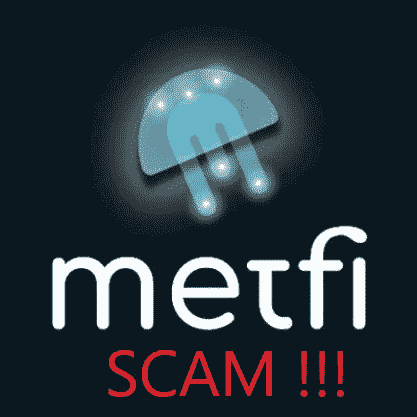
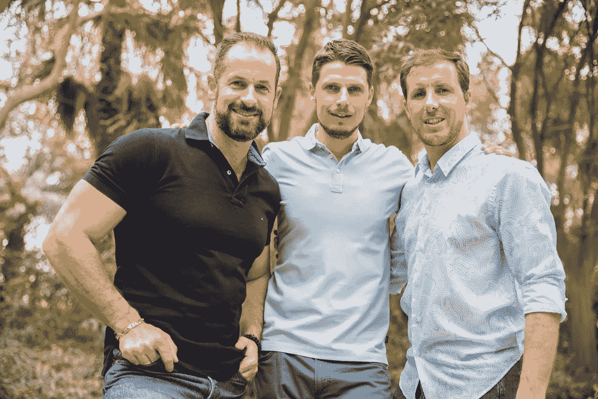
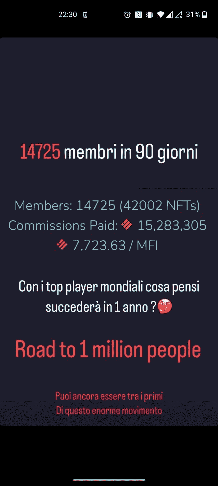
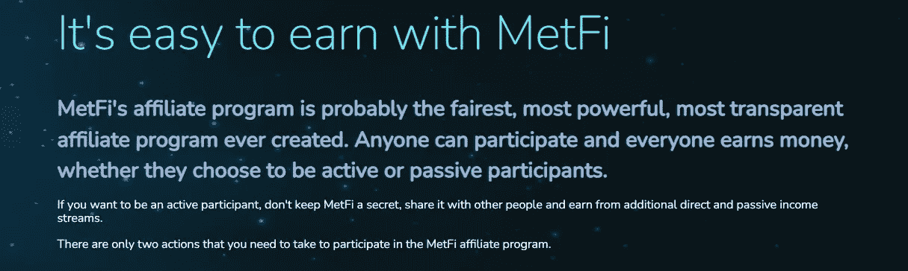
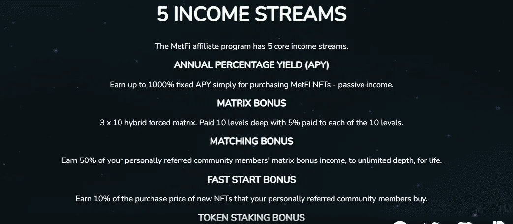
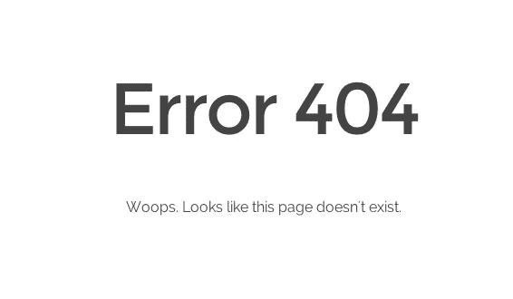

# 最后一只公牛已经到了

> 原文：<https://medium.com/coinmonks/metfi-the-last-bulls-t-has-arrived-2c6a793af838?source=collection_archive---------16----------------------->

昨天，我的一个熟人在 Whatsapp 上给我发了一条消息。他给我写信说有人给他提供了一种叫做 MetFi 的“加密货币”。由于他知道我对加密货币行业很了解，就问我以前有没有听说过，我觉得这是不是一种可靠的加密货币。我笑着回复表情符号🤣🤣告诉他别再想了。据 MLM 背后的[称，MetFi 是一个庞氏骗局。](https://behindmlm.com/mlm-reviews/metfi-review-1000-a-year-nft-cash-grab-ponzi-scheme/)

MetFi is a Ponzi scheme

它由前 [Onecoin](https://www.bbc.com/news/world-us-canada-62005066) 推广人斯塔凡·利巴克和斯蒂芬·斯坦凯勒推广。后者和他的两个兄弟因涉嫌金融犯罪正在意大利接受调查。意大利检察官指控斯坦凯勒兄弟和他们手下的发起人从意大利投资者那里窃取了超过 1000 万美元。

The Steinkeller brothers

通常所有这些平台在所有国家都是非法的，没有主管当局的授权。庞氏骗局的推动者广泛使用社交媒体来招募人员，他们利用典型的网络营销短语“做自己的老板”、“百万富翁的生活方式”或重要企业家的激励名言。在 Instagram 上的推广人简历中，写着“DM for info”。我在下面给你看一个我在 Instagram 上看到的故事，其中一个傻瓜正在这段时间在意大利招人。

An Instagram story used to recruit people

翻译:
*90 天 14725 会员
你觉得和世界顶级玩家在一起 1 年后会发生什么？你仍然可以成为这场巨大运动的第一批参与者。*

Metfi 设想的十个投资层级是:

*   *虾米* — 100 BUSD(获得价值 10 美元的小额信贷代币，以 100%年投资回报率的承诺进行投资)
*   *螃蟹* — 200 BUSD(获得价值 20 美元的 MFI 代币，以 200%的年投资回报率进行投资)
*   *Octopus* — 400 BUSD(获得价值 40 美元的 MFI 代币，投资于承诺的 300%年投资回报率)
*   *鱼* — 800 BUSD(获得价值 80 美元的小额信贷代币，投资承诺年投资回报率为 400%)
*   *海豚*——1600 BUSD(获得价值 160 美元的小额信贷代币，以 500%的年投资回报率进行投资)
*   *Shark* — 3200 BUSD(获得价值 320 美元的 MFI 代币，以 600%的年投资回报率进行投资)
*   Orca——6400 BUSD(获得价值 640 美元的 MFI 代币，以 700%的年投资回报率进行投资)
*   *Whale* — 12，800 BUSD(获得价值 1280 美元的 MFI 代币，以 800%的年投资回报率进行投资)
*   *鲸鲨*—25600 BUSD(获得价值 2560 美元的 MFI 代币，以 900%的年投资回报率进行投资)
*   *座头鲸* — 51，200 BUSD(获得价值 10，230 美元的 MFI 代币，投资承诺年投资回报率 1000%)

(我知道你已经在笑了。好像是电影*海底总动员*里的。OMG。我不相信有人会把钱投到这只牛身上。

在他们的[网站](https://metfi.io/)和[白皮书](https://app.metfi.io/docs/MetFi-whitepaper.pdf)上，没有关于创始人、团队和路线图的信息。然而，我们读到有一个[附属计划](https://metfi.io/earn-program)。

MetFi affiliate program

“MetFi 的加盟计划可能是有史以来最公平、最强大、最透明的加盟计划。任何人都可以参与，每个人都赚钱，无论他们选择成为主动还是被动的参与者。”(然后我会添加小丑表情符号🤡在后面)。在网上搜索，我还发现了西班牙语的补偿计划。通常这些庞氏骗局的补偿计划过于不平衡，从长期来看是不可持续的。然后指出 5 个收入流(年百分比收益率(APY)、矩阵奖金、匹配奖金、快速启动奖金、代币赌注奖金)。

5 income streams of MetFi

白皮书第 45 页的底部还写了一句相当隐晦的话:“MetFi 正在迅速发展，尽管我们将尽一切努力阻止坏演员获得正式角色，但一些坏演员可能会钻过缝隙欺骗你并窃取你的资产，所以要始终保持怀疑，并始终保持极度谨慎。”

The bottom of page 45 of the Whitepaper of MetFi

这一切都非常可疑。不要给这些傻瓜钱。如果有人已经招募了你，向相关部门举报。不用说，在泵和转储后，所有的顶级推动者将像往常一样消失。许多人会丢失他们的钱，当进入他们的后台办公室时，他们会看到消息:*错误 404 未找到*。

Error 404 not found: the end of MetFi

记住:远离这些[恶棍](https://www.newcoinpost.com/blog/stay-away-from-cryptogurus-on-instagram-and-all-social-media)，也远离在 Instagram 上提供财务建议的[有影响力的人](https://www.newcoinpost.com/blog/kim-kardashian-pays-over-1-million-to-sec-due-to-an-ethereummax-story-on-her-instagram)。当你必须评估一个加密项目时，使用我在这篇[文章](https://www.newcoinpost.com/blog/the-five-criteria-for-evaluating-a-cryptocurrency-or-a-crypto-project)中解释的 5 个标准，自己做研究。

不要被这些骗子骗了！！

请在下面留下评论，告诉我是否有人已经向你提供了梅特菲或其他类似的公牛队。把这个空间当成一个没有审查的谈话场所。

胜利者是永不放弃的梦想家。

***免责声明*** *:我不知道所使用的图片有任何第三方权利。如有任何资料来源，我保证予以引用，如有要求，我将调整立场。*

***免责声明*** *:交易加密货币具有较高的风险，不一定适合所有投资者。在决定交易加密货币之前，你应该仔细考虑你的投资目标和你的经验水平。自己做研究。此处表达的所有观点归各自作者所有，不应被视为任何形式的财务建议。*

*关于作者*

[*CRYPTO _ ALBERT*](https://twitter.com/albertovischio?t=C3Xj9pTm9Q7EZqwjrGHQdA&s=09)

*主编* [*新币帖*](https://www.newcoinpost.com/) *。我帮助人们更好地理解加密货币领域及其目的。*

> 交易新手？尝试[加密交易机器人](/coinmonks/crypto-trading-bot-c2ffce8acb2a)或[复制交易](/coinmonks/top-10-crypto-copy-trading-platforms-for-beginners-d0c37c7d698c)