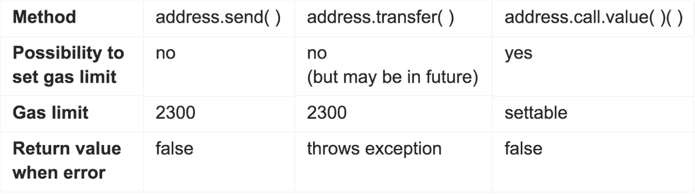

# 发送以太固体的方法

> 原文：<https://medium.com/coinmonks/methods-which-sends-ether-in-solidity-1f7072b0d266?source=collection_archive---------21----------------------->

嗨伙计们！我带来了一篇新文章。在过去的两个月里，我一直在学习可靠性和区块链。我探索了许多区块链和坚固的概念。我相信分享知识，所以我带来了关于可靠性的新文章。就我的技术背景而言，过去两年我一直在做 JavaScript，我做过一些最流行的库和框架，如 React、Vue、Express、LoopBack 等，我对深度学习有很深的了解，主要是 CNN(卷积神经网络),我还获得了 Udacity 的计算机视觉认证。现在转向区块链。我相信分享知识，所以我有了这篇新文章

所以你想在合同之间发送以太网，但你对方法感到困惑，找不到合适的方法。这篇文章向你详细介绍了固体的以太传输方法。Solidity 支持几种传输以太网的方法。

*   address.send(金额)
*   地址.转账(金额)
*   address.call.value(金额)()

# 1.`address.`传送`(amount)`

当我们谈论`address.transfer(amount)`时，你需要知道两件事。它消耗`2300 gas limit`来执行方法。然而，当这个特性还没有开发出来时，开发者社区决定提供一个重新定义气体限制的机会。他们引进`.gas()`一套气体限制。

其次，当 transfer 方法由于某种原因未能传输 ether 时，此方法会引发异常。以太坊钱包或元面具会通知你。这里有一个`.transfer()`方法的例子。

```
contract SendEther{ function sendViaTransfer(address payable _to) external payable{

     _to.transfer(123); }
}
```

# 2.address.send(金额)

与`.transfer()`方法不同，该方法没有设置气体极限的方法，但该方法拥有与上述方法相同的气体极限，即 2300 气体极限。另一件事是，这个方法不会抛出任何像上面那样的异常。而`.send()`返回布尔值，所以我们应该使用带有`.send()`的 require 语句

```
contract SendEther{ function sendViaSend(address payable _to) external payable{

    bool sent = _to.send(123);
    require(sent, "send failed")'
  }
}
```

> 交易新手？尝试[加密交易机器人](/coinmonks/crypto-trading-bot-c2ffce8acb2a)或[复制交易](/coinmonks/top-10-crypto-copy-trading-platforms-for-beginners-d0c37c7d698c)

# 3.address.call.value()

现在最后一个方法是`call.value()`，这个方法也返回一个布尔值，所以当你使用这个方法时，继续使用 require 方法。使用 ***调用*** ，也可以触发合同中定义的其他 ***功能*** 并发送固定量的气体来执行该功能。事务状态作为一个**布尔值**发送，返回值在数据变量中发送。

```
**(bool sent, bytes memory data) = _to.call{gas :10000, value: msg.value}("func_signature(uint256 args)");**
```

这是一个呼叫的例子

```
contract SendEther{function sendViaCall(address payable _to) external payable{

    (bool success, ) = _to.call{value: 123}("");
    require(sent, "send failed")'
  }
}
```

**总结**

这里是这篇文章的摘要，可以帮助你相应地选择你的方法



希望本文有助于理解**传递、发送**和**调用**的功能。
就是这样，乡亲们！希望对你来说是本好书。谢谢大家！✨

👉联系我:shahirzain100@gmail.com

👉关注我:[GitHub](https://github.com/ShahirZain)LinkedIn