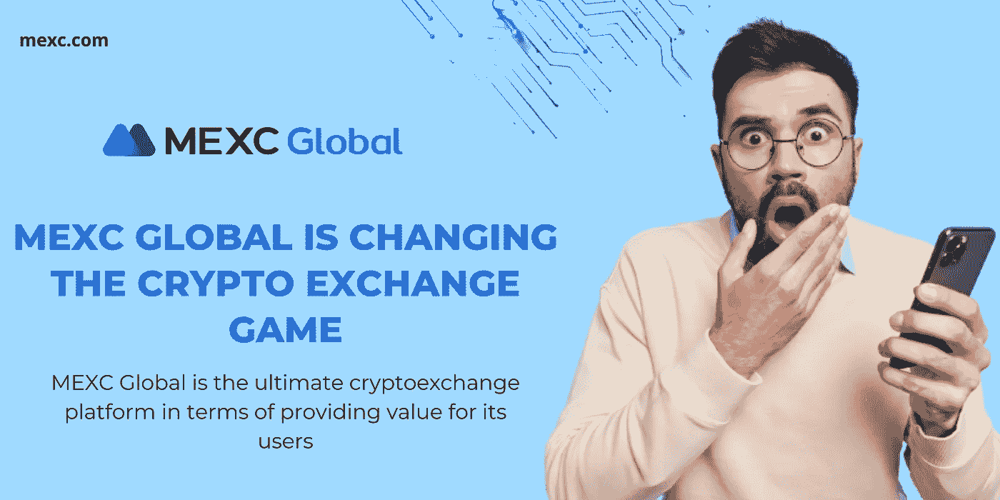
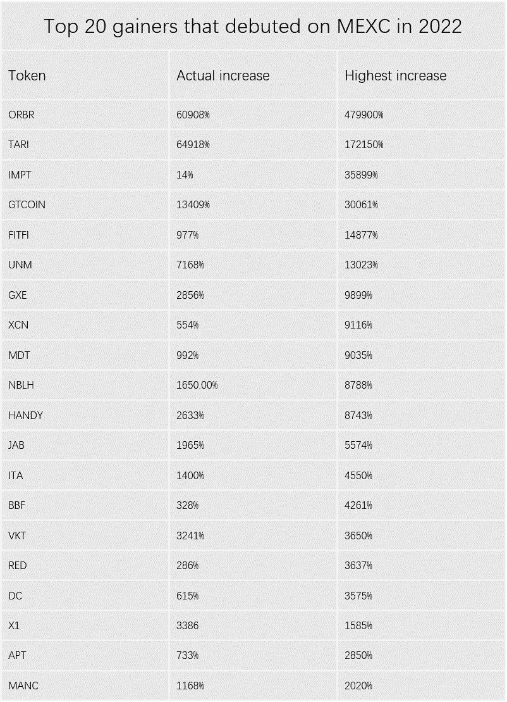
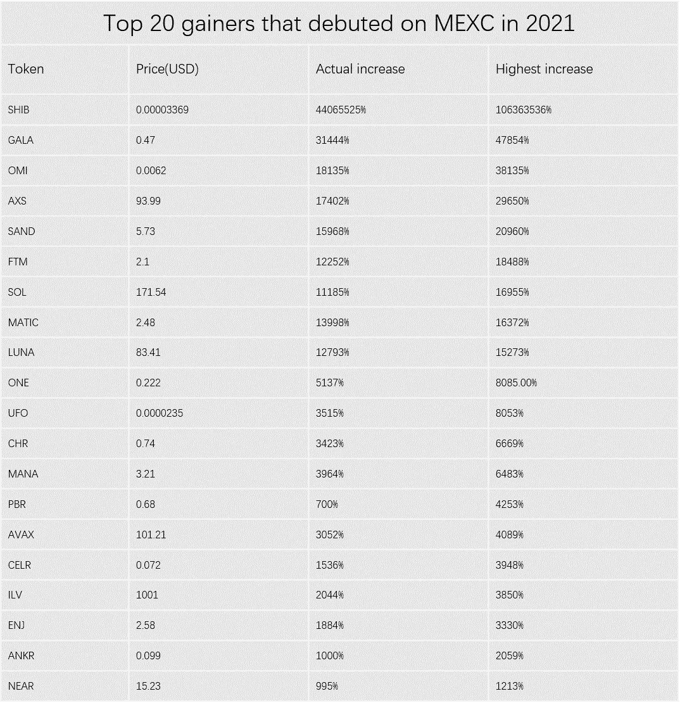
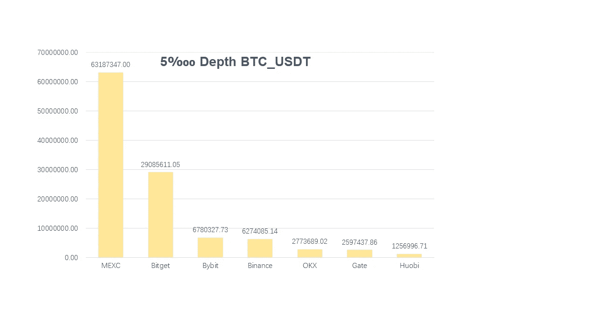
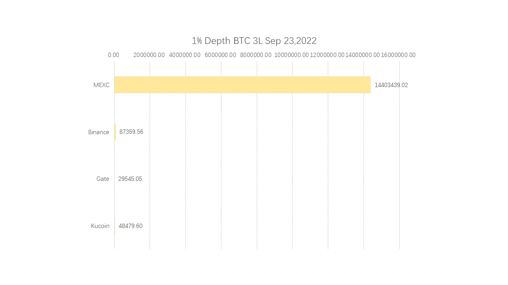
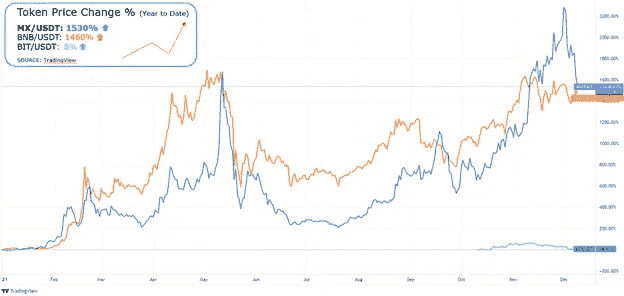
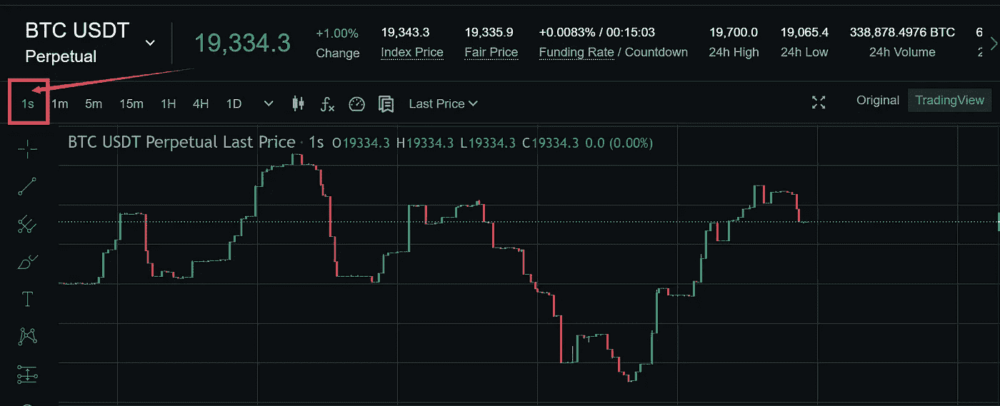

# MEXC Global 正在改变加密交易游戏

> 原文：<https://medium.com/coinmonks/mexc-global-is-changing-the-crypto-exchange-game-7f36d7e4a9fe?source=collection_archive---------7----------------------->

在加密领域的所有混乱和戏剧性事件中，可能有一线希望。

嗯，我一直在挖，而你一直在忙着追潮流和政治…哈哈！！*(开个玩笑！)*

你猜怎么着，我带着礼物来了，但现在还不是圣诞节。因为这就是 [MEXC Global](https://www.mexc.com/en-US/register?inviteCode=mexc-1WN8S) 交易的意义所在。

为了以防万一，你已经被其他加密交易交易所分散了注意力，对 [MEXC Global](https://www.mexc.com/en-US/register?inviteCode=mexc-1WN8S) 一无所知，我就让它顺其自然吧；但是你必须坚持到这篇文章的结尾。这是你能做的最起码的事。成交？

嗯，你不知道的是，这些 [MEXC](https://www.mexc.com/en-US/register?inviteCode=mexc-1WN8S) 的家伙从 2018 年就在这里了。

*我刚刚在 Coingecko 上查看了他们过去 24 小时的交易量(截至 2022 年 9 月 11 日)，信不信由你，这些家伙的交易量达到了惊人的 2711948603 美元。*

它们自称拥有约 1000 万用户，提供一站式服务，包括现货、保证金、杠杆 ETF、押注和衍生品交易。

请允许我给你一个惊喜。你知道 MEXC 早在币安和比特币基地上市之前就已经上市了 1652 项加密资产和 1770 个交易对吗？是啊！

甚至不要让我开始谈论交易所如何成功地发现了 Avalanche，Polkadot，Solana，Polygon，Aave，Uniswap，The Sandbox，Gala，Decentraland，Shib，Gala 和其他子轨道领先项目。再加上它每秒完成 140 万次交易的事实。

重点是 [MEXC Global](https://www.mexc.com/en-US/register?inviteCode=mexc-1WN8S) 一直“*在做*”，现在依然如此。甚至在 2021 年 10 月赢得了“*亚洲最佳加密货币交易所*”的称号。

如果你想进入 GameFi 和 NFT 的世界， [MEXC](https://www.mexc.com/en-US/register?inviteCode=mexc-1WN8S) 可能是你理想的平台。这是在交易所于 2022 年 10 月 31 日发布报告称其 NFT 和 GameFi 曲目是其今年表现最好的曲目之后。

报告显示，首次亮相的项目中，有 150 个项目涨幅超过 10%；65 个项目的增幅在 10%至 100%之间，86 个项目的增幅超过 100%。

哦，自 2021 年以来，他们一直处于上升趋势，人们可以很容易地看出 [MEXC](https://www.mexc.com/en-US/register?inviteCode=mexc-1WN8S) 肯定有一个美好的未来。

球迷代币正在成为一种东西，特别是随着世界杯的到来，只有几天了。墨西哥湾公司很快抓住了这个机会。

自 2022 年 8 月以来， [MEXC](https://www.mexc.com/en-US/register?inviteCode=mexc-1WN8S) 上市的拉齐奥球迷代币最高涨幅超过 814%。此外，SNFT(西班牙国家足球队球迷代币)增长了 2075%，ITA(意大利足球联合会球迷代币)创下 4550%的最高增幅。

仅供参考， [MEXC](https://www.mexc.com/en-US/register?inviteCode=mexc-1WN8S) 和币安是粉丝代币的“*之王*，在交易所中列出了最多的粉丝代币。

MEXC 是一个全方位的伟大的交易平台，然而，它的**流动性**在加密领域引起了人们的议论。

这就是所谓的“不可思议的”流动性。

*不相信我，看看这个图表……*

**Futures Liquidity**

**ETFs Liquidity**

我打赌我现在对你很热情…嗯？

## MX 令牌

币安有 BNB，库科恩有 KCS，MEXC Global 有 MX token。MX token 是 MEXC 生态系统中的一种股票凭证，持有人可以享受 10%的交易费用折扣。

它的总供应量为 4.5 亿 MX，主要是 40%的 [MEXC](https://www.mexc.com/en-US/register?inviteCode=mexc-1WN8S) 平台利润用于回购和销毁 MX 代币。

本质上，令牌持有者参与启动平台、投票、治理和赌注。

如果你还没有在你的投资组合中包括 MX 令牌，你可能会错过最终的加密宝石。

在 MX token 中观察到的增长潜力应该是您的主要关注点。2021 年，这个代币给了投资者 1152%的投资回报率。这是什么意思？

这意味着你在这些代币爆炸之前抓住它们还为时过早。现在是时候了。截至 2022 年 10 月 11 日，MX token 目前的交易价格为 0.878138 美元。

如果你觉得你错过了 BNB 的机会，MX token 可能是你的*【it】*项目。

*以下图表显示了 2021 年 MX token 对 BNB 的增长*

**您可以在以下场景中有效地使用您的 MX 令牌:**

*   **扣除现货交易费用** - MX 代币用于降低您的交易费用(九折)
*   **Launchpad** -在 Launchpad 上，MX 令牌持有者获得一个独家、低成本的项目早期投资机会。
*   **MX DeFi** - MX 代币持有者也可以下注 MX 代币并获得新的项目代币采矿奖励。

*这还不是全部，MX Token 2.0 可能会在任何时候登陆这些秘密街道，因为提案已经到位。*

为了支持 [MEXC](https://www.mexc.com/en-US/register?inviteCode=mexc-1WN8S) 生态系统和 MX 2.0 的发展，设计提案时主要参考了 MX 社区成员的建议。

**提案 A**

1.  墨西哥湾基金会储备:100，000，000 墨西哥湾令牌
2.  墨西哥实验室:2.5 亿墨西哥币
3.  MEXC 战略合作伙伴关系:1 亿 MX Token
4.  墨西哥湾基金会储备:100，000，000 墨西哥湾令牌

**提案 B:**

1.  墨西哥实验室:1.5 亿墨西哥币
2.  MEXC 战略合作伙伴关系:1 亿 MX Token
3.  立即燃烧:100，000，000 MX 代币

*这一切都是为了给 MX 令牌持有者提供最大的价值。*

## 项目在 MEXC 上首次亮相

不为你所知的是， [MEXC](https://www.mexc.com/en-US/register?inviteCode=mexc-1WN8S) 在 2021 年推出了 5 个项目，位列前 10 的项目名单。在 MEXC 上上线的这些项目包括:

1.  2021 年 4 月 16 日 SHIB
2.  2021 年 7 月 6 日的晚会
3.  FTM 于 2019 年 10 月 6 日
4.  2020 年 8 月 7 日解决
5.  2020 年 5 月 2 日法力值

SHIB、加拉、AXS、桑德、马蒂奇、FTM、索尔、ONE 和马纳都是在整个加密市场取得最高投资回报率的项目。而且都是在 MEXC 上出道的。

*后续 ROI 如下所示:*

*   SHIB- 106363536%
*   加拉- 47854%
*   AXS- 29650%
*   SAND、MATIC、LUNA、FTM 和 SOL-投资回报率超过 16，000%

## MEXC 产品优势

1.  **现货** -接入多种交易币种，也是最快的上线流程平台。它还支持超过 1200 个加密交易。此外， [MEXC](https://www.mexc.com/en-US/register?inviteCode=mexc-1WN8S) 自诩为优质项目推出的第一站。
2.  **未来优势** - [截至 2022 年 10 月 25 日，MEXC](https://www.mexc.com/en-US/register?inviteCode=mexc-1WN8S) 期货刚刚成为第一个支持 BTC 和 ETH USDT-M 期货 1 秒区间图的加密平台。用户可以通过网络和手机访问该功能。

我不知道你怎么想，但我绝对会把这定义为胜利。

你猜对了，墨西哥期货交易所的流动性是世界第一，有很大的深度和最多的可交易货币。它有超过 120 个交易对。

**3** 。**杠杆 ETF**——目前 [MEXC](https://www.mexc.com/en-US/register?inviteCode=mexc-1WN8S) 杠杆 ETF 交易量排名第一，有 300 多种可交易货币。

## 服务优势

1.  24/7 客户支持——我们都知道币安等交易所在客户支持方面的竞争。嗯，有了 MEXC[的帮助，您可以放心地获得友好的客户服务，以满足其用户的需求。](https://www.mexc.com/en-US/register?inviteCode=mexc-1WN8S)
2.  **社区天使和工作人员** - [MEXC](https://www.mexc.com/en-US/register?inviteCode=mexc-1WN8S) 采用社区方式，其社区天使和工作人员分布在 20 多个国家和地区。这是为了有一个更个性化的方法来解决用户遇到的交易问题。

## 结论

目前在加密领域非常热门。然而，从长远来看，你需要一个安全可靠的加密交换。这就是 MEXC 的用武之地。

MEXC 拥有任何密码爱好者/交易者需要的所有元素。有了这种疯狂的流动性，你还会寻找什么？

这种交换完全是为了你的成功而设计的。这就是你所需要的。

如果你读到了这篇文章的结尾，那么恭喜你，因为你中了头彩。

*您现在可以开立一个*[***MEXC***](https://www.mexc.com/en-US/register?inviteCode=mexc-1WN8S)*账户，并通过* [***此链接***](https://www.mexc.com/en-US/register?inviteCode=mexc-1WN8S) *获得价值 1000 美元的 USDT 奖金。*

是的，欢迎你！

**免责声明**:本文仅用于教育目的，不应理解为投资建议。

***关联披露:*** *本帖可能包含关联链接* s

> 交易新手？尝试[加密交易机器人](/coinmonks/crypto-trading-bot-c2ffce8acb2a)或[复制交易](/coinmonks/top-10-crypto-copy-trading-platforms-for-beginners-d0c37c7d698c)