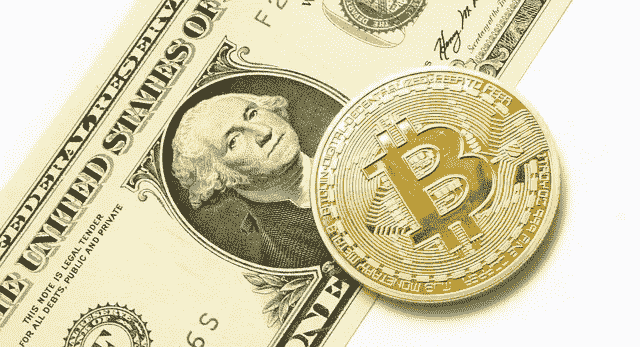

# 迈克尔·塞勒卸任 MicroStrategy 首席执行官；下一步是什么？

> 原文：<https://medium.com/coinmonks/michael-saylor-steps-down-as-miscrostrategys-ceo-what-s-next-c250910b7657?source=collection_archive---------22----------------------->

几乎每次讨论比特币的时候都会提到塞勒先生。他是个极端主义者！当然，也是最突出的一个。是啊；离 Satoshi 很远，但是如果你想知道谁买了你扔掉的比特币，那是你最好的选择。在他的指导下，MicroStrategy 已经积累了超过 129，000 个比特币。塞勒先生自己联合创办的美国商业解决方案公司更受欢迎的是他们的比特币购买，而不是他们的实际业务。他们已经建立了平均 30，000 美元的比特币储备，这种特殊的投资并不真的很好…就目前而言。

但是，是的，你可能想了解一下迈克尔最喜欢的算术。如果你读了这篇文章，那么你可以放心，当你下一次按下卖出比特币的按钮时，这个人仍然会密切关注你。嗯，不确定这还像以前一样管用。在掌管公司 33 年后，迈克尔·塞勒决定将他作为 MicroStrategy 公司首席执行官的职位让给他的副手 Phong Le，肯定会有一些变化。和比特币有什么关系？当然是你最关心的。在撰写本文时，比特币的交易价格低于 24，000 美元，MicroStrategy 托管的每枚比特币(至少)亏损 5，000 美元。几份报告证实，塞勒并没有因此下台。但有一点是肯定的；他的决定和比特币有联系…

自从大约两年前遇到比特币和他的 MicroStrategy 的第一笔比特币购买以来，迈克尔·塞勒(Michael Saylor)加强了他的比特币收购和布道练习。他对电子支付解决方案的坚定承诺丝毫没有减弱。卸任首席执行官后，他开始担任公司的执行主席。作为董事长，Saylor 将专注于公司的比特币收购项目以及其他新任务。

即使你不喜欢 Saylor 的最大化主义和破坏其他加密货币的频率。这位亿万富翁商人可能没有在你最喜欢的替代硬币上投入一些资金，但他节省了几次加密空间。在我看来，爱这个男人就足够了。如果在一枚比特币价值 100 万美元时，MicroStrategy 仍然持有比特币，那么它可能会成为地球上最富有的公司之一。虽然这肯定会是一个漫长的等待，但可能性是存在的。无论如何，迈克尔自 2020 年以来以每种价格购买比特币的决定目前并没有得到回报。1 比特币= 1 比特币虽然。当你的损失以亿计时，这是完全错误的。

几乎不可能预测塞勒的意图，比特币通常很难预测。如果他回忆起自己购买比特币的决定，觉得有些举动是“冲动的”，那么他是对的。如果他下台来解决这个问题，MicroStrategy 的比特币交易将会发生切实的变化。

MicroStrategy 在 20222 年 6 月以 1000 万美元购买了 480 个比特币；这是他们自 2021 年 5 月以同样的金额购买 229 个比特币以来最小的单笔购买。相对来说，这是他们在购买前等待的最长时间。没有足够的数据。做出一个明确的断言，但如果这意味着什么，它只是正常收购模式中的一个有形的变化。流行的谣言表明，该公司已经出售了他们保管的 8000 枚比特币。不管怎么说，这没有任何可靠的依据。

改变策略，停止购买？Saylor 不太可能停止搜刮比特币，但有可能进行调整，包括更慢、更仔细计划的购买。当你读到这封信的时候，迈克可能正在杀死他的 FOMO。这名男子此前曾表示，他“不”出售比特币，但一些交易活动可能是他新策略的一部分。在高峰时获利，在低谷时回购。可能行得通，但会带来新的风险。

下一步是什么？MicroStrategy 的比特币储备是单一实体的最大所有权之一，该公司本身是比特币的最大客户之一。它们引发的价格波动可能不那么明显，但却是实实在在的。迈克尔想出的策略可以改变这个空间。最重要的是，我希望它能拯救他们的钱包…

[跟进加密货币脚本](https://linktr.ee/cryptoscripts)通过全面的文章和重要提示了解加密领域的最新动态。
[雇佣自由撰稿人](https://www.upwork.com/services/product/comprehensive-seo-optimized-contents-for-your-project-1514476886622093312?ref=project_share&tier=0)

> 加入 Coinmonks [电报频道](https://t.me/coincodecap)和 [Youtube 频道](https://www.youtube.com/c/coinmonks/videos)了解加密交易和投资

# 另外，阅读

*   [Bookmap 评论](https://coincodecap.com/bookmap-review-2021-best-trading-software) | [美国 5 大最佳加密交易所](https://coincodecap.com/crypto-exchange-usa)
*   [加密交易机器人](/coinmonks/crypto-trading-bot-c2ffce8acb2a) | [造币评论](https://coincodecap.com/coingate-review)
*   最佳加密[硬件钱包](/coinmonks/hardware-wallets-dfa1211730c6) | [Bitbns 评论](/coinmonks/bitbns-review-38256a07e161)
*   [新加坡十大最佳密码交易所](https://coincodecap.com/crypto-exchange-in-singapore) | [收购 AXS](https://coincodecap.com/buy-axs-token)
*   [红狗赌场评论](https://coincodecap.com/red-dog-casino-review) | [Swyftx 评论](https://coincodecap.com/swyftx-review)