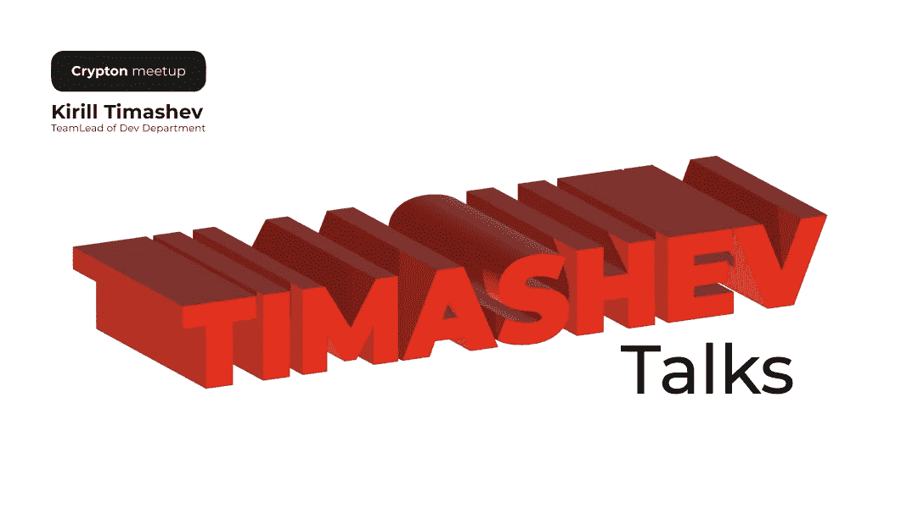
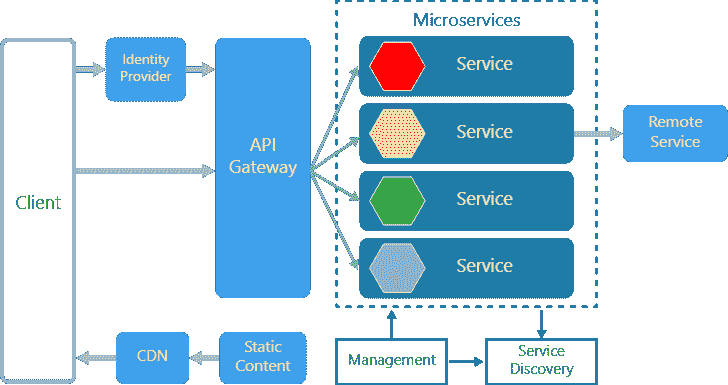

# 微服务架构

> 原文：<https://medium.com/coinmonks/microservice-architecture-2bb7b2613fea?source=collection_archive---------37----------------------->

我们继续为员工举办教育聚会。

基里尔， ***团队的领头人*** [***Crypton 工作室***](https://crypton.studio) ，决定举办一系列致力于发展的见面会。

我们与您分享[微服务架构会议](https://crypton.studio/blog/Microservice-Architecture-meetup-)的简短摘要。

在开始的时候，演讲者警告说，这个讲座的重点是那些与编程和开发无关，但希望了解更多一点的员工。

## 会议的主题是:

–整体解决方案和微服务解决方案之间的差异

–微服务的利弊

–我们需要微服务吗？

–微服务系统架构

–部署和技术

# 让我们从整体架构开始。

整体架构基于这样一个事实，即服务自己处理业务逻辑。客户端交互有一个输入和一个业务逻辑。

这个整体中的数据都在一个地方——在用户流量增长之前不会出现任何问题。

这些数据并不相互关联，但在某些时候，你需要获得:支付数据、我的购买和其他数据。这增加了配置数据的复杂性。你必须考虑如何为客户布置数据。这些服务是仅在内部相互通信，还是作为外部 API 应用程序提供？

在单一解决方案中，通信没有问题，因为所有内容都写在一个代码中。

但是，当非常重要的松散应用程序处于不同的物理位置时，测试它们是很困难的。因为服务在测试期间是开启的，所以通信已经完成，等等。如果这么复杂，为什么要这么做？

# 那么我们为什么需要微服务呢？

微服务架构并不是在所有情况下都使用，因为并不是所有的应用都需要这样的复杂性。

## 服务必须:

*   保持足够小
*   与其他服务松散连接
*   遵守单一责任原则(SRP)原则

## 微服务架构如示意图所示:

## 微服务解决方案的优势:

*   可靠性和容错性
*   灵活性和可扩展性
*   安全性
*   变化率和 CI/CD
*   足够的拥有成本

微服务通过网络在服务之间进行通信。架构师考虑获得响应所需的时间，以使应用程序更加容错。

## 微服务解决方案中服务之间的通信方式:

*   同步呼叫
*   远程过程调用
*   表征状态转移(REST)
*   异步消息
*   消息代理
*   Webhook

> 交易新手？试试[加密交易机器人](/coinmonks/crypto-trading-bot-c2ffce8acb2a)或者[复制交易](/coinmonks/top-10-crypto-copy-trading-platforms-for-beginners-d0c37c7d698c)

## 微服务更难维持。有必要执行以下操作:

*   应用基础设施
*   发展。由于这些服务只与数据库相关联，而不是相互关联——维持这项工作既困难又昂贵。
*   部署和执行。
*   CI/CD(持续集成和交付)
*   应用架构

通过使用微服务架构，我们解决了应用程序的负载、性能和客户端流量问题:

*   服务的定义
*   配置方法
*   服务之间的通信
*   数据
*   外部应用程序 API
*   记录和监控。系统实时监控性能:它们监控服务器负载和 RAM，日志中不能有错误。如果有错误，他们会通知并发出警报。

—应用程序指标

—检测问题

预防性的

—实际

—审计易于让开发人员参与项目

—表演

—跟踪

*   测试

—单元测试

—测试服务

—基于消费者的期望

—在消费者方面

—集成测试

更多的资源花在微服务上，这并不总是有利的。由于该项目可能无法通过长距离接触到大量用户，因此设计该系统毫无意义。

[在我们的大多数项目](https://crypton.studio/portfolio)中，我们使用整体解决方案和微服务架构的组合。

再举一个例子，我们在一个整体解决方案上使用智能合约进行了一次分散式交换。

以前，对于一个集中的 [BitTeam exchange](https://crypton.studio/portfolio) ，我们使用了一个单一的解决方案，但是后端过载了，所以有必要重新设计服务。这既困难又痛苦，但现在有了微服务架构，交换变得稳定且易于维持。

基里尔将这种做法比作 ***破窗理论。***

> 在犯罪学中，破窗理论指出，犯罪、反社会行为和社会混乱的明显迹象创造了一个鼓励进一步犯罪和混乱的城市环境，包括严重犯罪。

Kirill 建议开发者:如果你明白自己做得不好——花时间做得更好，不要留下碎玻璃。

# 结果是:

微服务或单片都有它们的位置。建筑师会考虑项目的所有特征，只有这样他们才会做出决定。

刚开始，微服务比单片贵。但是从长远来看，支持单一解决方案的成本会更高。

此外，在会议结束后，员工根据自己的经历提出问题并进行咨询。

Kirill 的 meetup 对每个人都有用，从实践开发者到 HR 部门的员工。我们在等待下一次聚会！

与我们分享，你感兴趣吗？我们应该继续与您分享这些信息吗？

联系我们，让我们一起开始你的项目！ [https://crypton.studio](https://crypton.studio)

> 加入 Coinmonks [电报频道](https://t.me/coincodecap)和 [Youtube 频道](https://www.youtube.com/c/coinmonks/videos)了解加密交易和投资

# 另外，阅读

*   [CoinDCX 评论](/coinmonks/coindcx-review-8444db3621a2) | [加密保证金交易交易所](https://coincodecap.com/crypto-margin-trading-exchanges)
*   [红狗赌场评论](https://coincodecap.com/red-dog-casino-review) | [Swyftx 评论](https://coincodecap.com/swyftx-review) | [CoinGate 评论](https://coincodecap.com/coingate-review)
*   [Bookmap 评论](https://coincodecap.com/bookmap-review-2021-best-trading-software) | [美国 5 大最佳加密交易所](https://coincodecap.com/crypto-exchange-usa)
*   [如何在 FTX 交易所交易期货](https://coincodecap.com/ftx-futures-trading) | [OKEx vs 币安](https://coincodecap.com/okex-vs-binance)
*   [CoinLoan 评论](https://coincodecap.com/coinloan-review) | [YouHodler 评论](/coinmonks/youhodler-4-easy-ways-to-make-money-98969b9689f2) | [BlockFi 评论](https://coincodecap.com/blockfi-review)