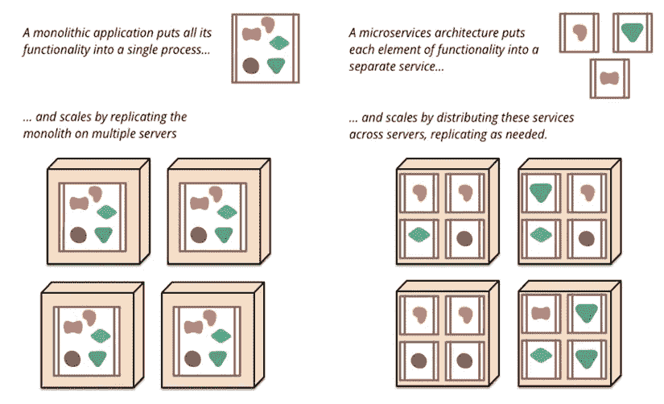
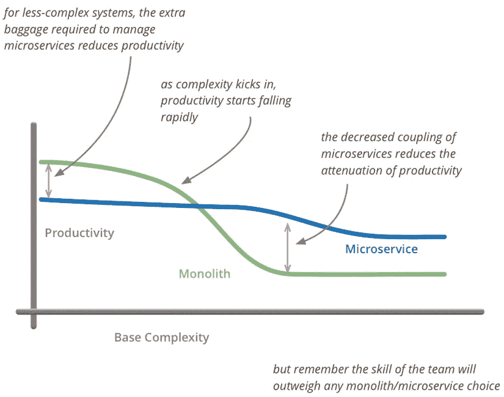

# 面向新技术的微服务架构

> 原文：<https://medium.com/coinmonks/microservice-architecture-for-new-technologies-d0e37cfccdfa?source=collection_archive---------9----------------------->

第二部分第三章**IT 领域的容器结构**

***TL；博士***

*   *微服务的优点:独立部署，高可扩展性，开发维护简单。*
*   *微服务的缺点:测试和部署复杂，自动化程度高。*

**

*Mmicroservice 架构指的是一种架构风格，主张将单一的应用程序分解成小的、协调的服务，为用户提供终端价值。每个服务运行一个专门的进程。服务通过轻量级通信机制(通常是基于 HTTP 的 Restful API)进行通信。它们是为企业量身定制的，并使用自动化部署工具独立发布。最低限度的集中管理运行架构；多种语言编写服务；不同的数据存储保存数据。*

> *交易新手？尝试[加密交易机器人](/coinmonks/crypto-trading-bot-c2ffce8acb2a)或[复制交易](/coinmonks/top-10-crypto-copy-trading-platforms-for-beginners-d0c37c7d698c)*

*微服务根据业务领域将一个整体分解成高内聚、低耦合的小服务。独立服务的独特流程由独立团队开发和维护。服务通过轻量级通信机制进行通信，比如 HTTP RESTful API。它们用多种语言编写，独立自动部署，并单独存储。微服务体现了去中心化、分布式的本质。该架构被誉为嵌入 IT 系统的中间平台的技术框架，有助于快速业务增长和创新，适应低灵活性和可扩展性、快速迭代和技术驱动的创新。*

**

> ***微服务架构的优势***

*a.易于开发和维护:服务相对较小，易于理解。*

*b.独立部署:一个服务中的修改不需要其他服务的协调。*

*c.高可伸缩性:每个服务都可以根据硬件资源的需要独立地伸缩。*

*d.与组织结构匹配:架构更符合团队结构；孤立的团队专注于他们自己的优先事项以获得更高的生产力。*

*e.技术异构性:为每项服务确定最理想的技术；削减新技术试验的成本。*

*f.不同的企业需求:分权与集中控制或治理之间的平衡；分布式数据库和企业闭环数据模型之间的权衡。*

> ***微服务架构的缺点***

*a.微服务具有分布式系统的所有相关复杂性。必须在基于消息传递或 RPC 的进程间通信机制之间做出选择。代码是为分布式计算的错误和谬误编写的。*

*b.创建单独的数据库。事务必须更新多个服务拥有的数据。开发者面临的挑战越来越大。*

*c.与整体相比，测试更加复杂。类似的测试迫使服务本身及其依赖项启动(或者至少为它们配置存根)。*

*d.跨军种变革遇到越来越多的障碍。即使是很小的改动也需要精心的计划和协调。*

*e.部署分多个步骤展开。微服务应用通常由许多服务组成，每个服务都有多个运行时实例。每个实例都要经历配置、部署、扩展和监控，其中部署是在高度自动化的环境中进行的。*

*整体服务和微服务的亮点和挫折不是绝对的，因为场景或需求可能会发生变化。对小服务和粒度的偏好与经验和实际情况相关。*

**

*image from MicroservicePremium*

*上图摘自 Martin Fowler 的一篇名为 *Microservice Premium* 的文章，揭示了生产力和复杂性之间的关系。在低复杂性下，monolith 产生更高的生产率。随着复杂性的出现，生产率开始急剧下降。那时候只有微服务的解耦拯救掉曲线。*

> *设计系统的组织被限制生产这些组织的通信结构的复制品——Melvyn Conway，1967*

*简单的词语无法体现康威定律，该定律被浓缩为四条:*

*第一定律:沟通决定设计*

*第二定律:永远没有足够的时间把事情做好，但总有足够的时间重新做一遍。*

*第三定律:系统的线性图到其设计组织的线性图存在同态。*

*第四定律:大系统的结构在开发过程中倾向于分解，比小系统更具定性。*

*该定律被誉为软件架构设计的第一定律，是商业世界中的一系列定律。康威定律被一个主要的 IT 出版物总结，然后被 IT 领域的圣经 ***神话人月*** 引用。因此，这条法律第一次得到了它的名字，并从那时起迅速传播开来。*

```
****The Writer Says...*** *NetX aims at building the Web 3 organism. We try to figure out solutions confronted by the present IT industry. To do that, we will look into every module of it to find out setbacks. Then we’ll focus on finding solutions through experiments. It’s a dynamic evolving process. To get the best solution, we have to be clear about the problems and this will be the main idea of Chapter Three. It makes me feel excited when thinking about sharing my thoughts and I do invite you to join me in this exploration and contribute to the evolvement of NetX.**
```

# *📚必读*

*[NetX 系列 1.1](/triaslab/rethinking-the-it-industry-d101384e801) | [NetX 系列 1.2](/coinmonks/a-letter-from-satoshi-nakamoto-345a45d012bb) | [NetX 系列 1.3](/coinmonks/out-of-control-the-post-it-evolution-dd64e05ff5bc) | [NetX 系列 2.1](/coinmonks/life-emerges-9ebf26304cd4) | [NetX 系列 2.2](/coinmonks/life-is-out-of-control-9f8e5b7b4b99) | [NetX 系列 2.3](/coinmonks/the-kite-flies-up-and-i-become-the-kite-40678b9dabda) | [NetX 系列 3.1](/coinmonks/the-container-in-the-it-field-21250e3e8b5)*

****NetX，面向数字生活的可信可靠的智能自治系统链原生互联网(***[***Trias***](https://www.trias.one/)***)****

*[***铁人三项***](https://www.triathon.space/#/)***|***[***Ethanim***](https://www.ethanim.network/)***|***[***Tusima***](https://www.tusima.network/#/)***| behemo tum | Octavius | leviam | Divina****