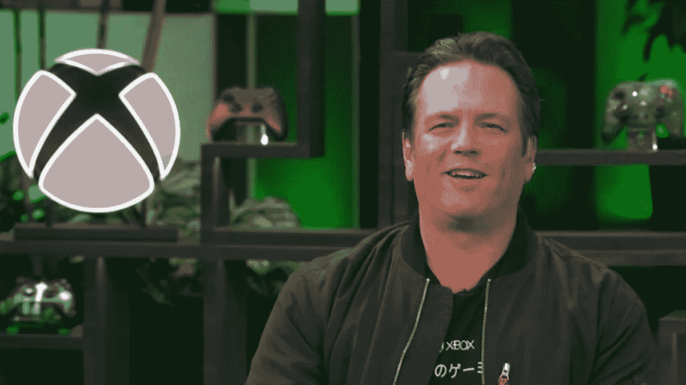

# 微软游戏 CEO 理解游戏玩家对元宇宙和 NFTs 的批评

> 原文：<https://medium.com/coinmonks/microsoft-gaming-ceo-understands-gamers-criticism-of-metaverse-and-nfts-adcbacc8dae?source=collection_archive---------4----------------------->

不管你是不是它的粉丝，想必你听说过“元宇宙”。这也许是今年最有争议的话题之一。这个概念有可能让世界完全颠倒过来，但接下来必须正确地去做。微软游戏公司的首席执行官菲尔·斯潘塞理解为什么许多游戏玩家不喜欢它。

